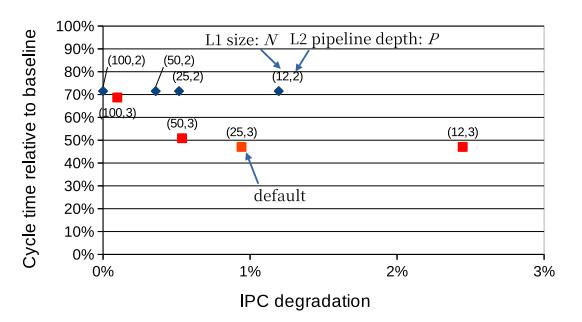
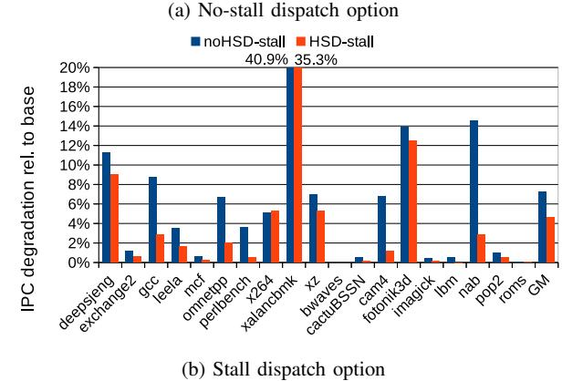
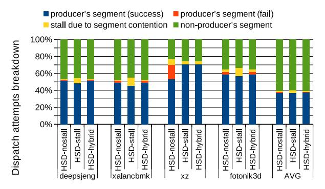
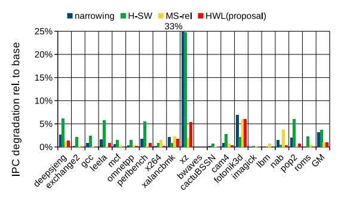

# *C. Cycle Time vs. IPC Degradation*

We evaluated the average IPC degradation relative to the baseline when varying the L1 size. The dispatch scheme is HSD with hybrid mode. Fig. 11 shows the relationship

Fig. 10: Delays of the select logic and wakeup matrix with varied sizes.

Fig. 11: Relative cycle time vs. IPC degradation.

between the cycle time relative to the baseline and average IPC degradation. The label (N, P) attached to dots represents the configuration where the L1 size is N and the L2 pipeline is depth P. The blue and red dots represent the cases of P = 2 and 3, respectively. We evaluated the cycle time relative to the baseline in Section V-B.

As shown in the figure, IPC degrades more as N decreases. However, it is very small in the range of evaluated Ns. We assumed that only negligible performance degradation (less than 1%) is acceptable, given the performance sensitivity of the high-end processor market. We determined the default configuration as (N, P) = (25, 3) because IPC degradation is only 0.9% and the cycle time is the lowest. See Fig. 15 regarding the IPC evaluation results for each program in this configuration.

We also measured the prediction accuracy of the LRP, since incorrect predictions may degrade IPC in HWL. LRP is invoked only when an instruction has two unready source operands at dispatch. For such instructions, the average prediction accuracy across all benchmarks is 89%.

To assess the practical impact on HWL performance, we also measured accuracy over all instructions that have at least one unready source operand at dispatch, as these cases directly affect HWL performance. Under this broader condition, the average accuracy is 97%; seventeen out of 19 benchmarks exceed 95%. These results indicate that mispredictions are infrequent in practice and have limited impact on IPC.

#### *D. Microarchitectural Scaling Enabled by HWL*

The purpose of this section is to examine whether reducing the IQ delay enables microarchitectural scaling toward higher IPC. In wide out-of-order cores, the wakeup–select loop of the IQ is one of the dominant cycle-time bottlenecks. Enlarging the IQ further increases this delay and makes timing closure increasingly difficult, effectively constraining scalable configurations. Scaling frontend and backend resources also lengthens the IQ critical path, even when the IQ size is unchanged.

To evaluate the architectural implications of alleviating this bottleneck, we consider a balanced 1.5x scaling configuration. Starting from the baseline in Table I, we increase the IQ size to 300 entries (1.5x the baseline) and proportionally scale both backend and frontend resources by 1.5x. Backend scaling increases the issue width, commit width, number of function units, ROB size, physical register file entries, and LSQ size. Frontend scaling increases the fetch, decode, rename, and dispatch widths. We added one frontend pipeline stage to handle the increased complexity of the segment allocation circuit, increasing the branch misprediction penalty by one cycle. For this 300-entry IQ configuration, HWL still reduces the IQ delay to 88% of that of the conventional 200-entry baseline design. This reduction prevents the enlarged IQ from becoming a more severe timing bottleneck and allows the balanced 1.5x configuration to be sustained without additional cycle-time degradation.

Fig. 12 shows the IPC results of the 1.5x configuration with HWL, relative to that of the baseline. The balanced design improves the average IPC by 17.2%, with a maximum improvement of 43.1% across benchmarks. These results indicate that removing the IQ delay bottleneck enables tangible IPC improvements when the microarchitecture is scaled in a coordinated manner.

For reference, we also evaluated more aggressive 2x scaling scenarios to clarify the interaction among resources. The 400-entry IQ with HWL exceeds the delay of the 200 entry baseline design, making it difficult to sustain under the original timing constraint. Increasing only the IQ size to 400 entries with HWL changes the average IPC by -0.7%. Scaling the IQ and frontend resources by 2x (while keeping the backend unchanged) improves the average IPC by 3.1%. Scaling the IQ and backend resources by 2x (while keeping the frontend unchanged) improves the average IPC by 6.2%. These results indicate that performance does not scale unless the IQ expansion is accompanied by coordinated scaling of other pipeline resources. Reducing the IQ delay is therefore a necessary condition for enabling such coordinated higher-IPC configurations, although it is not sufficient by itself.

We emphasize that the 1.5x configuration increases hardware resources and therefore increases power consumption. In addition, scaling backend function units increases bypassnetwork complexity and potentially affect cycle time. A detailed physical timing analysis of such effects is beyond the scope of this work. Our objective here is to demonstrate that reducing the IQ wakeup delay is a necessary condition for

Fig. 12: IPC improvement of balanced 1.5x configuration with HWL relative to the baseline.

enabling such coordinated microarchitectural scaling, although it is not sufficient by itself.

#### *E. HSD Effectiveness*

In this section, we evaluate the effectiveness of HSD. Fig. 13 compares IPC with HSD with and without using HSD (noHSD), when using (a) no-stalling and (b) stalling dispatch options. The differences between noHSD and HSD when determining which chunk a dispatch instruction belongs to by its unready source register are as follows: 1) noHSD does not use LRP, but randomly selects an unready source register, and 2) noHSD does not consider whether the latency of the parent instruction is greater than the additional pipeline cycles of the L2.

Comparing the IPC degradation of HSD with that of noHSD for each no-stalling and stalling option, the degradation in HSD is lower in many programs. Improvements are significant in several programs (e.g., *fotonik3d* for the no-stalling option and *nab* for the stalling option). These results arise from the fact that the frequency by which instructions in a chunk failed to be dispatched to the producer's segment is low in HSD compared with noHSD, as shown in Fig. 14, which represents the failure rate of dispatch to the producer's segment to the total number of dispatches for the no-stalling option (for the stalling option, the instructions that failed to dispatch for the no-stalling option are stalled instead). HSD breaks DFG into smaller chunks and thus results in a low frequency of DFR.

#### *F. Effectiveness of the Hybrid Dispatch Scheme*

In this section, we demonstrate the effectiveness of the hybrid dispatch scheme by evaluating IPC for HSD with the various dispatch options (no-stall, stall, and hybrid). Fig. 15 shows the results, where the Y -axis represents IPC degradation compared with the baseline.

As shown in the figure, the average degradations for "HSDnostall" and "HSD-stall" does not satisfy (1.7% and 4.6%, respectively) our goal (less than 1.0%), but "HSD-hybrid" achieves sufficient degradation (0.9%). Given the degradation for an individual program in "HSD-hybrid", *deepsjeng*, *xalancbmk*, *xz*, and *fotonik3d* (hereafter, we call them *difficult*

Fig. 13: IPC degradation relative to the baseline when HSD is used or not used.

Fig. 14: Failure rate of dispatch to the producer's segment in the "noHSD-nostall" and "HSD-nostall" models.

*programs*) cause larger degradation than our goal (more than 1.0%) because chunks are not small compared with the other programs, as shown in Fig. 8 in Section IV-A.

We focus on the difficult programs in the following discussion. Given the space limitation, Fig. 16 presents the analysis results for the difficult programs as well as the average of all programs, showing a breakdown of dispatch attempts normalized by the total number of dispatch attempts. Each bar is divided into the following categories: 1) successful dispatches

Fig. 15: IPC degradation of the HWL relative to the baseline for various dispatch options.

to the producer's segment, where the attempted dispatch was the result of intra-chunk dependencies ("producer's segment (success)"); 2) failed dispatches to the producer's segment that were redirected to the non-producer's segment ("producer's segment (fail)"); 3) dispatches that stalled because of segment contention; and 4) dispatches to the non-producer's segment because of non-intra-chunk dependencies ("non-producer's segment").

HWL degrades IPC for two main reasons: producer-segment failures and segment contention. In the "HSD-nostall" model, *xz* suffers significant IPC degradation because its chunk size is quite large (as shown in Fig. 8). This leads to frequent producer-segment failures (see the large red portion in Fig. 16), which generate additional issue delays. By contrast, the "HSDstall" model alleviates this problem for *xz*. In *deepsjeng*, *xalancbmk*, and *fotonik3d*, however, IPC is significantly degraded in the "HSD-stall" model because of segment contention (see the yellow portion in the figure), whereas the "HSD-nostall" model alleviates the degradation.

From the discussion above, simply using either the stalling or non-stalling policy cannot satisfy all programs. Therefore, adapting to phase/program characteristics is required. As shown in Fig. 15, the "HSD-hybrid" model successfully adapts to phase/program characteristics by choosing a better policy. However, noticeable IPC degradation (5%–6%) persists in *xz* and *fotonik3d*. In the former case, this is mainly because of the very large chunk size in *xz*, which often causes the producer's segment to become full. In *fotonik3d*, the degradation is caused by segmentation, which frequently becomes problematic because the IQ often approaches full capacity.

#### *G. Comparison with Prior Schemes*

In this section, we compare the HWL with prior hierarchical schemes, i.e., *narrowing* [3] and *hierarchical scheduling window* (H-SW) [11], in terms of IPC under a similar cycle time to that of the HWL. Additionally, we compare the HWL with an prior IQ scalable scheme, *matrix scheduler reloaded* (MS-rel) [9], in terms of the cycle time under the similar IPC.

*1) Comparison with Prior Hierarchical Schemes:* We briefly remark on how we implemented the prior hierarchical

Fig. 16: Dispatch attempts breakdown.

schemes. Regarding narrowing, it was presented assuming a circular IQ [3]. However, the performance of the circular IQ is significantly lower than that of the current random IQ with an age matrix [6] because of its capacity inefficiency, as described in Section II-C. Therefore, we adapted narrowing to the random IQ. The important point in narrowing that differs from the HWL is that an instruction is *unconditionally* dispatched to an entry near the producer's entry. There is no dispatch control to efficiently use L1. Therefore, we implemented a simulator for narrowing as follows: We divide the conventional IQ into segments and each segment has an L1 as in the HWL. Instructions are dispatched segment-by-segment. This means that instructions are continuously dispatched until the current segment becomes full. If it becomes full, we randomly choose one of the non-full segments and start to dispatch instructions to this segment. If an instruction and its producer are in the same segment, we use L1 for wakeup; otherwise, we use L2 with extra cycles. We set the segment size to 25 entries to make the cycle time identical to that of the HWL.

Regarding the H-SW, it was also presented assuming a circular IQ [11]. The authors of [11] assumed that instructions in the slow IQ moved to the fast and small IQ by searching from the bottom (oldest) eight entries in the slow and large IQ. However, this search is quite complex in the random IQ. Therefore, we simply idealized this search, where the oldest eight entries can be identified with zero-cycle cost. We set the small and large IQ sizes to be 25 and 200 entries, respectively, to make the cycle time identical to that of the HWL with the default setting. Note that the total IQ size was 225, which is larger than our default size (200).

Fig. 17 shows the comparison results (the figure includes the MS-rel results, but we do not discuss them in this section; we discuss them in Section V-G2). The Y -axis represents IPC degradation compared with the baseline. As shown in the figure, narrowing and the H-SW exhibit a significant slowdown. On average, IPC degradation is 3.2% and 3.6%, respectively (0.9% in the HWL). Additionally, we found a significant slowdown in both schemes in *xz*, which are composed of large DFGs. This is because there is no (unconditionally dispatch

Fig. 17: IPC degradation comparison of the HWL with prior work.

Fig. 18: IQ cycle time of MS-reloaded and the HWL.

to the producer's segment in narrowing) or insufficient control (only considering age in H-SW) to efficiently use L1.

*2) Comparison with the Prior IQ Scalable Scheme:* We evaluated the IPC of MS-rel by varying the number of columns of the wakeup matrix to find the minimum number of columns of the wakeup matrix that achieved a similar IPC to the HWL. The number of columns we found was 110. For this number of columns, the average IPC degradation of MS-rel is 1.0% (0.9% in the HWL). Fig. 17 confirms this.

Fig. 18 shows the evaluated IQ cycle time relative to the baseline using the HSPICE circuit simulation. Each bar is divided into the delays of the wakeup and select logic. As shown in the figure, cycle time reduction using MS-rel is limited; it is only 18%, whereas reduction using the HWL is 53%. The reasons that reduction is limited in MS-rel are as follows: 1) MS-rel can reduce the width of the matrix, but cannot reduce the height. 2) The reduction of the columns is not so significant.

To support reason 2), we evaluated a distribution of tag broadcasts of the following three categories in CAM-based wakeup logic [9]: The first category is *broadcast heard*, which means an instruction generates a broadcast and at least one consumer exists in the IQ. The second category is *broadcast wasted*, which means an instruction generates a broadcast but there is no consumer in the IQ. The last category is *no broadcast*, which means an instruction does not generate a broadcast because no destination register exists (e.g., branches and stores). The columns of the wakeup matrix do not need to be allocated in the cases of *broadcast wasted* and *no broadcast* logically.

According to our evaluation, the *broadcast heard* rate is high (59% on average). This observation is consistent with our finding that the required number of columns is 110 out of 200 (55%).

#### VI. CONCLUSIONS

Pipelining circuits with a long delay is a general solution to reduce the cycle time for high clock frequency. However, it is difficult for the IQ to use this approach because pipelining wakeup–select prevents dependent instructions from being issued back-to-back, which degrades IPC significantly. In this study, we proposed a new structure of the hierarchical wakeup logic (HWL) with multiple non-pipelined small L1s and a pipelined full-size L2. Because of the capacity limit of L1, only a subset of waking-ups is handled in L1; The other wakeups are performed using L2. This degrades IPC. To mitigate IPC degradation, we proposed a dispatch scheme called HWL-structure-aware dispatching, which uses L1 efficiently. We enhance the scheme using a hybrid dispatch scheme that chooses dispatch behavior adaptively on the degree of L1 contentions. Through evaluation using SPEC2017 benchmark programs, we found that the HWL shortens the IQ cycle time by 53%, while incurring only 0.9% degradation in IPC. These findings suggest that mitigating the IQ wakeup delay is an essential step toward enabling more scalable high-IPC processor designs.

#### ACKNOWLEDGMENT

The authors thank Jun Matsuura and Yuki Kondo for enhancing the performance simulator, and Riku Kurokawa for evaluating part of the circuit delays. This work was supported through the activities of VDEC, d. lab, The University of Tokyo, in collaboration with NIHON SYNOPSYS G.K.

