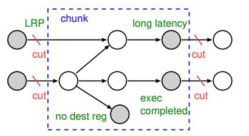

# *C. Evolution of IQ Organization*

As background for this paper, we now describe the evolution of IQ organization. Specifically, the IQ evolved [6] from a *shifting queue* [7] to a *circular queue* before reaching the current *random queue with an age matrix* [8], [9]. The difference between these organization structures lies in the age of the instruction order stored in the IQ.

Early processors used a shifting queue, where the IQ consists of a FIFO buffer. In this queue, a shifting operation is used to fill the gaps created by instruction issues, which maintains the age order. Although this organization achieves high IPC, the shifting operation has complex logic and consumes considerable power.

The circular queue eliminates the shifting operation, thereby reducing the complexity and power requirements. However, to maintain the age order, instructions cannot be inserted into the gaps created by instruction issues, thereby reducing the IQ capacity efficiency and consequently degrading IPC.

In the current random queue, instructions are no longer ordered by age, but are simply inserted into the gaps created by issues. This unordered organization significantly degrades IPC [6]. To address this, many designs [4], [5], [8] add an age matrix [8], [9] that identifies the oldest ready instruction, which is issued with the highest priority. Although only the oldest instruction is prioritized in issues, with the other instructions selected randomly in order of age, the age matrix dramatically improves IPC [6].

#### III. RELATED WORK

IQ architectures were actively explored in the early 2000s, with a notable survey by Abella et al. [10] summarizing key approaches. In this section, we describe related work by categorizing it into the hierarchical wakeup logic (Section III-A), pipelining the IQ (Section III-B), complexity reduction of the IQ (Section III-C), and an organizational approach to reducing IQ delay (Section III-D).

#### *A. Hierarchical Wakeup Logic*

Brekelbaum et al. proposed a hierarchical IQ called the *hierarchical scheduling window* (H-SW), where a pipelined large and slow IQ with a non-pipelined small and fast IQ are serially connected [11]. The cycle time of the IQ is determined by the delay of the fast IQ and is thus reduced. All the instructions are dispatched to the slow IQ, but multiple oldest unready instructions are moved to the fast IQ every cycle. This movement attempts to issue critical instructions to avoid degrading IPC by issuing them back-to-back, which would require multiple cycles if they were issued using the slow IQ. A difference between our HWL and the H-SW is that our IQ with the HWL is much simpler than the H-SW because identifying and moving multiple oldest unready instructions in the H-SW is quite complex in the modern random IQ, where instructions are not ordered by age (i.e., randomly ordered). By contrast, our HWL does not require instruction movements and uses a simple dispatch scheme for L1 capacity efficiently. Another difference is that, more importantly, although H-SW considers instruction criticality to use L1, it does not consider using L1 capacity efficiently. This causes significant IPC degradation. We quantitatively evaluate IPC to compare the HWL and H-SW in Section V-G1, putting the complexity of H-SW aside.

Goshima et al. proposed a scheme called the *narrowing* of the wakeup matrix [3]. The scheme reduces the width of the matrix by leaving only a small number of cells of D near the diagonal of the wakeup matrix and eliminating the other cells. Chen et al. presented a similar structure [12]. Narrowing is based on their observation that the dependence distance (the number of dynamic instructions between a consumer and its producer) is generally short. They used this narrowed wakeup matrix as an L1, which performs waking up instructions with the dependence distance less than or equal to D, whereas they used a full-sized L2 for the wakeup of instructions with the dependence distance of more than D. One downside of narrowing is that it is difficult to apply to the current random IQ; Goshima et al. assumed a circular IQ, and thus removed cells except those near the diagonal. More importantly, the other downside is the lack of a scheme to use L1 capacity efficiently, which wastes L1 capacity. We compare the IPC of the HWL with that of narrowing in Section V-G1 by adapting narrowing to the random IQ.

Lebeck et al. proposed the preparation of a buffer called the *waiting instruction buffer* (WIB) for holding cache-miss waiting instructions instead of waiting in the IQ [13]. The IQ size can be small because such instructions are moved to the WIB. The WIB is effective for memory-intensive programs. However, the IQ must be large to fully exploit instructionlevel parallelism (ILP) for compute-intensive programs.

#### *B. Pipelined IQ*

The wakeup–select loop can be divided into different pipeline stages if speculation is introduced with regard to these operations. Stark et al. proposed waking up an instruction when its producer's producer is issued [14]. As this wakeup does not necessarily cause the grandchildren instruction issue because of resource constraints, it is speculative. Similarly, Brown et al. proposed issuing instructions without select [15]. Because select is confirmed later, this issue is speculative. The common downside of these speculative issue schemes is that misspeculation that causes a reissue occurs frequently. This makes the issue logic complex and significantly increases power consumption.

Kora et al. proposed resizing the IQ, depending on the memory-intensity of program execution phases [16]. The scheme enlarges the IQ with pipelining if the program phase is memory-intensive; otherwise, it reduces the IQ and makes it unpipelined. Pipelining does not affect IPC because memorylevel parallelism is the primary source for high performance in memory-intensive phases and holding many loads in the IQ is important rather than back-to-back issues. The drawback is that, in compute-intensive phases with a large amount of ILP, the IQ needs to be sufficiently large to fully exploit ILP for high performance; thus, the reduction of the cycle time of the IQ is limited.

#### *C. Complexity Reduction*

Options exist for configuring the IQ in a monolithic manner or partitioning it. Partitioning reduces IPC because the partitioned IQ can issue instructions to a subset of function units that are connected to the IQ, and load balancing among partitioned IQs is difficult. However, the advantage is that partitioning can reduce the select logic delay. Note that the wakeup logic delay is not reduced because the grant signals must broadcast to all partitioned IQs. Although we explain the HWL in this study assuming a monolithic IQ, it can be applied to the partitioned IQ and thus further reduce the cycle time of the IQ.

Michaud et al. created dependency- and latency-based prescheduling instructions that are placed into a simple FIFO buffer [17]. To handle variable-latency operations, a small conventional IQ is added after the FIFO buffer. This design reduces IQ delay by simplifying the queue structure, but may induce stalling when the small IQ is filled with instructions waiting on long-latency events such as cache misses. Canal et al. and Ernst et al. presented similar prescheduling schemes [18], [19].

Palacharla et al. proposed an IQ organization composed of multiple FIFO buffers instead of a CAM, where instructions are steered into buffers based on dependency relationships [1]. Because dependent instructions are ordered within each buffer, only the entries at the heads of the FIFOs need to be examined to determine issue readiness. However, when a longlatency instruction remains at the head of a FIFO, dependent instructions accumulate until the buffer becomes full, and the limited number of FIFOs further restricts the number of active dependency chains, which can stall dispatch. To alleviate this FIFO blocking problem, Jeong et al. proposed allowing multiple dependency chains to share a FIFO [20]. Nevertheless, their approach still relies on a large number of FIFOs, which increases circuit complexity.

Canal et al. proposed a scheme that uses a table called the *first-use table* to schedule only instructions that use a physical register first [18]. Instructions are woken up by accessing the first-use table using produced physical register numbers. A large portion of the IQ can be implemented by SRAM because many physical registers are used only once according to their observation. The drawback of this scheme is that the first-use table, which is the same number of entries as the physical register file, is large in modern processors; thus, it is difficult to access the table in a single cycle. Multiple-cycle access, as in the register file of modern processors, makes the back-toback issue of dependent instructions impossible.

Goshima et al. proposed the matrix scheduler [3]. The wakeup logic is SRAM-based and thus scalable compared with CAM-based wakeup logic. The downside is that the size of the matrix grows rapidly according to the IQ size because of the square matrix of order IQ size. Therefore, the advantage over CAM-based wakeup logic is substantially decreased in modern processors with a large IQ.

Sassone et al. presented *matrix scheduler reloaded* (MSrel), which improves the scalability of the wakeup matrix by reducing the number of wakeup matrix columns [9]. They observed that a large number of instructions in the IQ have no destination register or no consumers exist in the IQ. Therefore, the columns of the wakeup matrix are unnecessary for these instructions logically. Sassone et al. reduced the number of columns and dynamically allocated them to instructions that require columns. One drawback of the MS-rel is that the number of matrix rows is not reduced; thus, delay reduction is limited. Another drawback is that the rate of instructions that do not need columns are not significant according to our evaluation (see Section V-G2); thus, the reduction of the number of columns is limited. We evaluate MS-rel in IPC and circuit delay in Section V-G2.

Kim et al. proposed a *sequential wakeup* in the CAM wakeup logic, where tags are broadcast to the left and then right side of the wakeup logic sequentially [21]. In this scheme, fanouts of the broadcast bus are halved; thus, the wakeup delay is reduced. Although instructions generally have two source operands, the last ready operand eventually wakes up the instruction. Therefore, if the first operand wakeup occurs later than the second operand wakeup, the sequential wakeup does not degrade IPC; otherwise, it degrades IPC. To increase the advantageous cases, the scheme predicts which operand of an instruction becomes ready last at the fron-

Fig. 3: Overview of the HWL structure (Example configuration where the IQ is logically partitioned into eight segments. Only L1 wakeup matrices are physically replicated per segment; L2 remains monolithic).

tend [22] and the predicted last-ready operand tag is placed on the left side of the wakeup logic. Our HWL also uses the last-ready operand prediction, but for a different purpose. The drawback of this scheme is that the reduction of the wakeup logic delay is limited because 1) although fanouts of the broadcast bus are reduced, its wire capacitance is not reduced and remains significant; and 2) the comparators delay, which is also significant, is not reduced.

#### *D. Organizational Approaches*

Beyond circuit-level optimization, architectural approaches have been used to ease IQ demands by delaying, filtering, or bypassing instruction insertion [23]–[25]. Although these techniques reduce IQ size, the IQ itself remains necessary. HWL can further cut the IQ cycle time with fewer changes to the processor architecture.

#### IV. HIERARCHICAL WAKEUP LOGIC

In this section, we propose a *hierarchical wakeup logic* (HWL) with dispatch schemes that use it effectively. In Section IV-A, we propose the structure of the HWL and explain the wakeup–select timing. Then we explain a dispatch scheme called the *HWL-structure-aware scheme* in Section IV-B. Next, we describe an additional dispatch scheme that mitigates IPC degradation, which is caused by high segment contentions in Section IV-C. Then we describe the segment allocation circuit details, and finally we describe other hardware overhead in HWL, in Sections IV-D and IV-E, respectively.

#### *A. Structure, Timing, and Fundamental Operation*

Fig. 3 shows an overview of the HWL structure. Fig. 4 illustrates the wakeup–select timing of the L1 and L2 access cases. In the L2 access case, the L2 operation is pipelined using three stages (the default in our evaluation in Section V).

We divide the IQ into several segments logically, and each segment has a physically independent L1 wakeup matrix. The L2 wakeup matrix is a full-sized matrix placed after the L1 wakeup matrices. It has the same logical structure as a conventional monolithic wakeup matrix, but is pipelined.

Fig. 4: Wakeup and select timing.

*1) Fundamental Wakeup Logic Operation (Dispatchagnostic):* In HWL, the wakeup matrix used for a source operand depends solely on the relative locations of the producer and consumer, independent of how they were dispatched.

If a consumer instruction resides in the same segment as its producer, the source operand is woken up using the L1 matrix associated with that segment. The wakeup–select loop is completed in a single cycle (see ⃝1 in Fig. 4). Otherwise, if the producer and consumer reside in different segments, the source operand is woken up using the L2 matrix. As shown in Fig. 4 (mark ⃝2 ), the L2 operation is pipelined. In the case of three-cycle pipelining, wakeup is performed in the first two cycles and select is performed in the third cycle. Therefore, two extra cycles are consumed for issue compared with the conventional IQ.

The cycle time is determined by the longer delay between the L1 wakeup–select and the longest pipeline stage of the L2 operation. Because L1 is smaller than the conventional wakeup matrix, and the L2 operation is pipelined, the cycle time of wakeup–select is reduced.

*2) Dispatch Policy to Increase L1 Wakeups:* Given the above wakeup logic, performance depends on how often dependent instructions are placed in the same segment. Therefore, we design a dispatch algorithm (described in Section IV-B) to increase the probability that a consumer is dispatched to the same segment as its producer.

The dispatch algorithm determines, for a single unready source operand, whether to dispatch the instruction to the same segment as its producer. Hereafter, we call this segment the *target segment*. To identify the producer segment, we extend the RMT by adding a field that holds the segment number to which the instruction producing the associated logical register was dispatched.

When an instruction is renamed, it obtains the segment number for each source register from the RMT. If an instruction has two unready source registers, the dispatch scheme predicts which source register becomes ready last using the *last-ready predictor* (LRP) [22] (described below). The segment number associated with the predicted last-ready register is used as the target segment, because that operand determines when the instruction becomes ready eventually and thus dominates the wakeup latency.

*3) Matrix Cell Setup:* If the dispatch scheme determines to dispatch the instruction to the target segment, an attempt is

Fig. 5: Correspondence between the columns of the L1 matrix and the segment offset.

Fig. 6: Single row of wakeup matrices that generates a request signal in the HWL.

made to dispatch it to the producer's segment obtained from the RMT. In this case, for the source operand whose producer resides in the same segment, a cell in the corresponding L1 matrix is set to represent the dependency, and no cell in the L2 matrix is set for that operand.

For the other source operand (if any), if its producer also resides in the same segment, a cell in L1 is set similarly. Otherwise, if its producer resides in a different segment, a cell in L2 is set for that operand, and no cell in L1 is set.

The column of L1 corresponds to the segment offset number, which is the row and column index within a segment (ranging from 0 to S–1), where S is the segment size. Fig. 5 shows an example where instruction i1 is stored in row 9 in the IQ or row 1 in the segment, and an attempt is made to store i2 in row 10 in the IQ or row 2 in the segment. If i1 is the producer of i2, cell (2, 1) in L1 is set, where the column number is the segment offset number of i1. To set cells in L1, we extend the RMT by adding a field that holds the segment offset number, similarly to conventionally holding the row number of the entire IQ.

By contrast, if the dispatch scheme determines not to dispatch to the target segment, the instruction is dispatched to a segment selected randomly. In this case, a cell in L2 is set for each source operand whose producer resides in a different segment, and no cell in L1 is set for those operands. The ready signal of an operand is generated by ORing the ready signal from L1 with that from L2, with regard to the matrices associated with the operand, as shown in Fig. 6.

Note that when dispatching to a non-target segment, the random selection of the segment is speculatively performed at least *one cycle before* the dispatch stage to avoid adding complexity to the dispatch circuit. Random selection is performed for all instructions, and the selection result is used only if

Fig. 7: Example of a chunk. Gray nodes are the leaves of the chunk. LRP represents the last-ready prediction.

the dispatch algorithm determines not to dispatch to the target segment.

*4) Last-ready Predictor (LRP):* LRP [22] hardware is similar to the gshare branch predictor [26]. The pattern history table (PHT) is indexed by a hashed value of the PC and global branch history, and each entry has a two-bit saturating counter. The counter is decreased if the first source operand becomes ready last and increased if the second source operand becomes ready last. At prediction time, the PHT is accessed using the hashed index. If the upper bit of the counter is 0, the first source operand is predicted to become ready last; otherwise, the second source operand is predicted to become ready last.

#### *B. HWL-structure-aware Dispatch Scheme*

If all dependent instructions were dispatched to the target segment with the last-ready operand perfectly predicted so that L1 could always be used for wakeup–select, IPC would not be degraded. However, this is difficult because of the L1 size limit. If there is no available entry in the target segment, two options exist: stalling dispatch until an available entry appears or dispatching to a different segment without stalling and waking up using the L2. Either option can degrade IPC. To reduce this undesirable scenario, we propose a dispatch scheme, which we call an *HWL-structure-aware dispatch* (HSD) scheme. In the following, we first explain the scheme from the viewpoint of the DFG and then explain it from the viewpoint of hardware.

We divide the DFG into small subgraphs, which we call *chunks*, where, in terms of performance, it is desirable to dispatch all the nodes in a chunk to the same segment. The chunk is formed by cutting the following edges (see Fig. 7).

- 1) If there are two incoming edges to a node, we cut the one edge from the first-ready node and leave the remaining edge from the last-ready node using LRP.
- 2) If the execution of a node has already been completed at the dispatch time, we cut the edge from the node because the producer node does not wake up the consumer node in the IQ. The node becomes a leaf of a chunk.
- 3) If the execution latency of a node is greater than the extra pipeline depth of the L2 operation, we cut the edge from the node because the L2 operation latency is hidden by the execution latency. The node becomes a leaf of a chunk.

Note that the node that has no destination register is clearly a leaf of a chunk.

Fig. 8: Distribution of the chunks weighted by chunk size.

We implement the HSD scheme in hardware as follows: We extend the RMT by adding a flag to an entry, which indicates whether the execution latency of the instruction that produces the corresponding register is greater than the extra pipeline depth of the L2 operation. At the rename time, the scheme obtains this flag from the RMT using the lastready source register that LRP predicts. As per normal, the flag that indicates whether the execution of the producer has been completed is obtained from the busy-bit table using the physical register number. If both flags are false, this instruction belongs to the chunk of its producer. Then an attempt is made to dispatch the instruction to the producer's segment. If there is no available entry in the segment, two options exist: the dispatch is stalled or the instruction is dispatched to a segment other than the producer's segment. Both degrade performance. We describe the dispatch scheme in this case further in Section IV-C.

An interesting question is whether most chunks are accommodated in a small segment. If not, the performancedegrading case described above occurs frequently. Fig. 8 shows the distribution of the chunks weighted by the chunk size in the program that we evaluated, which means the percentage of instructions that belong to a particular size of a chunk (we describe the evaluation environment in Section V-A). As shown in the figure, on average, 91% of dynamic instructions belong to chunks with a size of less than or equal to 16. From this fact, we can make the segment size sufficiently small with little fundamental degradation to IPC. However, while most programs have small chunk sizes, there are exceptions (*deepsjeng*, *xalankbmk*, *xz*, and *fotonik3d*) in which fewer than 85% of dynamic instructions belong to chunks with a size of less than 16. This indicates that we need a scheme in addition to the HSD.

#### *C. Hybrid Dispatch Mode with Stalling and No-stalling*

As we have described thus far, the following two options exist when target segment contention occurs: 1) *No-stalling policy*: the instruction is dispatched to an entry in a randomly selected segment. 2) *Stalling policy*: the instruction waits until an available entry is produced in the target segment. In the no-stalling policy, IQ capacity can be used efficiently, but the penalty imposed by using L2 degrades IPC. By contrast, in the stalling policy, instructions can be issued without additional penalty, but IQ capacity efficiency is reduced.

Given these tradeoffs, we introduce a hybrid mode, where switching occurs between stalling and no-stalling policies at run-time, depending on the frequency of segment contention. Switching is dictated by the *dispatch failure rate* (DFR). This is the number of instructions that failed to be dispatched to the target segment because of its contention, per dispatched instructions while in the no-stalling mode. We measure DFR periodically (10k cycles in the evaluations in Section V). If the DFR becomes higher than a predetermined threshold (*DFR threshold*) in the no-stalling mode, the mode transits to the stalling mode. To check the value of the no-stalling mode while in the stalling mode, the scheme sometimes (predetermined every period of *max stall periods*, which is 200 intervals in the evaluations in Section V) transits to the no-stalling mode and checks the DFR. We evaluate the hybrid mode in Section V-F.

#### *D. Segment Allocation Circuit Details*

We have described how the producer's segment, read from the RMT, is considered when determining the target segment of an instruction. However, to rename multiple instructions in parallel (hereafter referred to as a *bundle*), the producer's segment numbers must be obtained from within the same bundle when intra-bundle dependencies exist. To handle this, a logic circuit that sequentially determines the target segments is required. This sequential nature may induce a delay. In this section, we present the circuit and evaluate the delay by comparing it with that in the execution stage.

We assume that two stages are allocated to the rename process. Although the detailed pipeline stage breakdowns for modern processors have not been disclosed, the Intel Pentium 4 [27], which has a pipeline depth comparable to modern processors, employs a two-cycle rename stage. We assume that the RMT is read in the first cycle and written in the second.

The circuit for target segment allocation within a bundle consists of the following: 1) Dependency Check Logic (DCL): This identifies the producer instruction for each instruction in the bundle. It is composed of register number comparators and a priority encoder. 2) LBMUX: This selects the "is long latency"1 and "register busy" signals from either the older instructions in the bundle or the RMT, depending on the DCL output. 3) SMUX: This determines the target segment by selecting from among the target segments of older instructions in the bundle or from the RMT. There are two SMUX units: SMUX1 selects the segment of the producer (for the first and second source registers). SMUX2 selects the final target segment depending on the SMCL (described below) output. 4) SMCL: This generates the select signals for SMUX2 using

1A signal that indicates whether the producer's latency exceeds the extra L2 wakeup–select latency or not.

Fig. 9: Segment allocation circuit in a bundle. "s*n*" and "ts*n*" (for insn*n*) denote (i) the segment number read from the RMT, and (ii) the target segment number, respectively.

the "is long latency" signal, the "register busy" signal, and the PHT value from the LRP.

Fig. 9 shows the circuit. The critical path is highlighted in orange. In the first stage, the DCL operates in parallel with (and completes earlier than [1], [2]) the RMT read. To prevent the DCL output from being included in the critical path, we assume that it is driven to pipeline latches located near the MUX control pins in the second stage.

We evaluate the delay of this circuit for a bundle of six instructions (the default assumption described in Section V) and the subsequent RMT write using HSPICE simulations (the evaluation environment is described in Section V-A). We compare this delay with that in the execution stage, which consists of the bypass logic and ALU delay. The ALU delay is approximately that of an internal adder. We assume the sparse-tree adder (STA) proposed by Intel [28], as in McPAT's ALU energy model [29]. The comparison indicates that the rename second stage delay is 88% of that of STA. Considering that the bypass logic (which has a large delay [1], [2]) is not included, the delay of the second rename stage, which includes the segment allocation circuit, is much shorter than the delay of the execution stage.

The bundle width is a design parameter. We measured the delay of the 10-wide segment-allocation circuit using HSPICE and found that the delay becomes 1.59x that of the STA. This suggests that, in wider frontends such as 10-wide, the rename stage can become frequency-limiting. In such a case, the rename second stage can be further pipelined to maintain clock frequency. This increases the branch misprediction penalty by one cycle. We evaluated the IPC impact of this additional pipeline stage and observed a 0.6 percentagepoint degradation. This indicates that even if rename must be further pipelined in wider designs, the incremental IPC impact remains modest.

#### *E. Hardware Overhead*

The additional hardware cost of HWL consists of 1) the L1 wakeup matrices, 2) the LRP, and 3) minor control logic extensions. The L1 matrices add 0.6KB in our default configuration (8 segments in a 200-entry IQ). The LRP requires 2.0KB of storage. The RMT is extended with segment identifiers, adding a small number of metadata bits per entry.

The primary contributor to logic complexity is the segment allocation circuit (Section IV-D). Beyond this component, the wakeup structure remains identical to a conventional matrix scheduler, except for the physical partitioning of L1 matrices and a simple OR gate that combines ready signals from L1 and L2. Overall, the hardware overhead of HWL is modest.

#### V. EVALUATION RESULTS

First, we describe the evaluation methodology in Section V-A. Then we evaluate the cycle time of the IQ for various segment sizes when using the HWL in Section V-B. In Section V-C, we present the relationship between the cycle time and IPC degradation for various configurations. In Section V-D, we evaluate IPC improvements enabled by microarchitectural scaling with HWL. In Section V-E, we evaluate HSD effectiveness. In Section V-F, we evaluate the hybrid dispatch scheme. Finally, in Section V-G, we compare the HWL with prior schemes.

### *A. Methodology*

Table I outlines the configuration of the baseline processor model used in our experiments. We selected the window size and issue width based on modern commercial processors such as the Apple M1 and Intel Alder Lake (P-core) [30]–[32]. Table II lists the default HWL-specific parameters.

To simulate performance, we built a simulator based upon the SimpleScalar Tool Set version 3.0a [33], extending it to reflect the architecture of modern processors. The following modifications were made: 1) Removal of the original Register Update Unit [34], and the incorporation of a reorder buffer, physical register file, IQ (random queue with an age matrix), and RMT. 2) Addition of advanced branch prediction and memory hierarchy features, including a TAGE predictor [35], L3 cache, and stream prefetcher. 3) Integration of DRAM timing code adapted from the Champsim simulator [36].

We used the Alpha ISA for evaluation. The workload set comprises all benchmarks from SPEC2017, excluding *gcc* and *wrf*, which do not currently run correctly on our simulator. Instead, we used *gcc* from SPEC2006. Each benchmark was executed for a single representative 100-million-instruction region selected using the SimPoint [37] with reference inputs.

To evaluate the IQ delay, we used HSPICE with the 22nm predictive technology model provided by Arizona State University [38]. The wire delay parameters (capacitance and resistance per unit length) were based on projections from the ITRS roadmap [39]. Layouts were manually drawn at

TABLE I: Base processor configuration.

| Pipeline width     | frontend 6, back-end 12                     |
|--------------------|---------------------------------------------|
| Reorder buffer     | 512 entries                                 |
| IQ                 | 12-issue, 200 × 200 matrix scheduler        |
| Load/store queue   | 200 entries                                 |
| Physical registers | 512(int) + 512(fp)                          |
| Branch prediction  | TAGE 64KB cost, 2K-set 4-way BTB,           |
|                    | 15-cycle misprediction penalty              |
| Function unit      | 6 iALU, 1 iMULT/DIV, 3 AGU, 4 FPU           |
| L1 I-cache         | 32KB, 8-way, 64B line                       |
| L1 D-cache         | 32KB, 8-way, 64B line, 3 ports              |
|                    | 4-cycle hit latency, non-blocking           |
| L2 cache           | 1MB, 16-way, 64B line, 14-cycle hit latency |
| L3 cache           | 4MB, 16-way, 64B line, 40-cycle hit latency |
| Main memory        | 3200MT/s                                    |
| Data prefetch      | stream-based                                |

TABLE II: Default parameters for the HWL.

L2 wakeup matrix pipeline depth: 3 Number of segments: 8 (L1 size: 25) LRP [22]: 8K-entry, 4-branch history PHT DFR measure interval: 10k cycles max stall periods: 200 intervals DFR threshold: 10.0%

the transistor level under the MOSIS λ-based scalable design rules [40] to enable accurate HSPICE simulation.

#### *B. IQ Cycle Time*

To obtain the cycle time of the IQ with the HWL, we evaluated the delays of the wakeup matrix and select logic, where we varied only the size of the wakeup matrix. Fig. 10 shows the results. The Y -axis represents the delay relative to the total delay of the wakeup matrix and select logic for 200-entry IQ (baseline configuration), whereas the X-axis represents the sizes of the conventional wakeup matrix or L1 matrix. The two dashed lines represent the lower bounds of the cycle time of the HWL IQ, which were determined by the L2 operation (not L1 delay), when the L2 was pipelined with two and three stages, respectively (see the timing chart in Fig. 4). In the case of the two-stage pipeline, we inserted the pipeline latches between the L2 wakeup matrix and select logic, whereas in the case of the three-stage pipeline, we further inserted the pipeline latches between the wordlines and cells.

As shown in the figure, the cycle time is bounded by the delays of the L2 operation in the case of two-stage pipelined L2 for all L1 sizes. By contrast, for the case of three-stage pipelined L2, it is bounded by the delays of the L2 operation when the L1 sizes are 25 and 12, whereas it is bounded by the delays of L1 plus select logic when the L1 sizes are 100 and 50.

