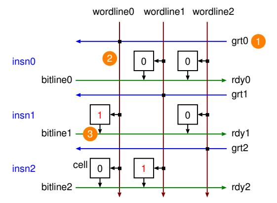

# Hideki Ando

*Information Technology Center Nagoya University* Nagoya, Japan hidekiando@acm.org

Hajime Shimada *Information Technology Center Nagoya University* Nagoya, Japan shimada@itc.nagoya-u.ac.jp

*Abstract*—The reduction of the critical-path delay of processor circuits is essential not only for sustaining high clock frequency but also for enabling microarchitectural scaling toward higher IPC. A general approach to reducing cycle time is pipelining long-delay circuits. However, applying pipelining to the issue queue (IQ) is inappropriate because pipelining the wakeup–select loop, one of the processor's critical paths, prevents dependent instructions from being issued back-to-back, thereby degrading IPC. As modern processors pursue higher IPC through wider issue and larger instruction windows, the IQ size must scale accordingly. However, enlarging the IQ significantly increases the delay of the wakeup logic, making such scaling difficult under practical timing constraints.

In this paper, we propose a *hierarchical wakeup logic* (HWL), where the IQ is logically segmented, each segment has a small non-pipelined level-1 (L1) wakeup logic, and full-size pipelined level-2 (L2) wakeup logic is placed behind the L1s. Wakeup is performed using L1, if possible, and L2 otherwise. The cycle time is reduced because the L1 size is small and L2 is pipelined. A fundamental attempt is made to dispatch an instruction (written to the IQ) to its producer's segment to complete wakeup–select in a single cycle, but it is not always possible because of the L1 size limit. This causes IPC degradation. To mitigate IPC degradation, we propose a dispatch scheme, which we call the *HWL-structureaware dispatch* (HSD) scheme, that uses the L1s efficiently. We enhance the HSD scheme using a scheme to adaptively choose dispatch behavior, depending on the degree of L1 contentions.

Through evaluation using SPEC2017 benchmark programs, we found that the HWL shortens the IQ cycle time by 53%, while incurring only 0.9% degradation in IPC. These results indicate that reducing IQ wakeup delay can alleviate a key timing bottleneck and enable more scalable microarchitectural configurations.

*Index Terms*—superscalar processor, issue queue, instruction scheduler, wakeup logic.

#### I. INTRODUCTION

It is important to reduce the delay of the circuits of a microprocessor to achieve high clock frequency. A circuit that is particularly difficult to optimize in this respect is the issue queue (IQ). The IQ critical path, that is, the wakeup–select loop, is one of the critical paths in a processor [1], [2]; thus, its delay must be carefully managed.

As processor generations have evolved, the size of the IQ has been increased to sustain higher IPC. However, enlarging the IQ significantly increases the complexity of the wakeup

This work was supported by JSPS KAKENHI Grant Number 26K14757.

logic, making delay reduction increasingly difficult. Although the achievable IPC depends on many microarchitectural factors, our evaluation indicates that there remains performance headroom: IPC increases by 36% over our baseline processor (see Table I) when major resources, including the IQ size and pipeline width, are doubled while the branch predictor and caches remain unchanged. These results suggest that further performance improvement requires scaling key microarchitectural resources, including the IQ. Because increasing the IQ size exacerbates wakeup–select delay, reducing the IQ delay becomes increasingly important for enabling such performance scaling without constraining overall microarchitectural scalability.

A general and widely applied solution to reduce the cycle time of circuits while the entire operation delay remains unchanged is pipelining, where the cycle time is the initiation time interval of the circuit operation. However, pipelining wakeup–select has a significant adverse effect on IPC because it prevents dependent instructions from being issued backto-back. Therefore, pipelining wakeup–select is not generally used.

A possible approach to reduce the cycle time of the IQ is to adopt a hierarchical structure approach, which resembles the caches. In this study, we propose a new structure of hierarchical wakeup logic (HWL). In the HWL, the IQ is logically segmented and each segment has small, fast, nonpipelined level-1 (L1) wakeup logic, which is responsible for marking an operand as ready in the same segment that holds its producer. By contrast, the level-2 (L2) wakeup logic is fullsized and placed behind the L1s. L2 is responsible for marking an operand as ready in the case in which the producer of the operand resides in a different segment. L2 is a large and slow circuit, similar to conventional wakeup logic, but is pipelined. Because L1 is fast and L2 is pipelined, the cycle time can be reduced.

Unfortunately, it is impossible to accommodate all instructions that have a dependency relationship in the same segment because the L1 size is limited, which degrades IPC. Therefore, we smartly select instructions to be dispatched to their producer's segment to minimize IPC degradation. Our dispatch scheme is called *HWL-structure-aware dispatch* (HSD). In the following, we explain it from the viewpoint of the dataflow graph (DFG) to simplify the explanation.

As described previously, it is desirable for all nodes (i.e., instructions) connected with edges in the DFG to be dispatched to the same segment to enable wakeup using L1. However, this is difficult in terms of L1 capacity. We relax this condition. We cut several edges and divide the DFG connected with edges into small subgraphs, which we call *chunks*. For example, we predict which parent node will be ready last and cut the edge from the parent node that becomes ready first, leaving the remaining edge because the node eventually becomes ready with the last-ready parent node. Another example is cutting an edge if the connected parent node's latency exceeds the L2 wakeup–select latency because the parent node's execution latency hides the wakeup–select latency of the child node, even though waking up is performed using L2, and it thus does not degrade IPC. An attempt is made to dispatch the nodes in a single chunk to the same segments to avoid degrading IPC, whereas the inter-chunk nodes are dispatched to different segments to use L1 efficiently. Our observation is that the chunk size (number of instructions in a chunk) is generally sufficiently small to make the L1 size sufficiently small.

Although HSD works well for many of the programs we evaluated, for several programs where HSD alone does not work well, this is because the chunk sizes are large. We solve this problem by introducing an additional adaptive dispatch scheme, which chooses to dispatch instructions to the non-producer's segment or to stall dispatch until a vacancy is produced in the producer's segment when producer segment contention occurs, by considering the frequency of contentions.

We summarize the contributions of our study as follows:

- We propose a new hierarchical structure of wakeup logic called the HWL to reduce the cycle time of the IQ.
- We propose a dispatch scheme called HSD to increase the effectiveness of the HWL structure using small L1s efficiently.
- We propose an additional hybrid dispatch scheme that adaptively chooses a dispatch behavior to mitigate negative effects on performance caused by L1 contentions.
- We succeeded in reducing the cycle time of the IQ by 53%, with only 0.9% IPC degradation for SPEC2017 benchmark programs.

The remainder of this paper is structured as follows: In Section II, we explain the organization of conventional IQs as background for this study. In Section III, we describe related work. We propose the HWL and HSD, along with the additional hybrid dispatch scheme, in Section IV. Then we present the evaluation results in Section V. Finally, we present our conclusions in Section VI.

#### II. CONVENTIONAL IQ ORGANIZATION

In Section II-A, we describe the fundamental organization of the IQ. Then we explain the circuit of the wakeup matrix as the wakeup logic in Section II-B. Finally, Section II-C discusses

Fig. 1: Basic organization of the IQ [6]

the evolution of IQ organizations, focusing on how instructions are ordered within the IQ.

#### *A. Overview*

IQs are typically implemented with one of two wakeup mechanisms: CAM-based or RAM-based logic [3]. Both approaches are deployed in commercial processors [4], [5]. This work considers the RAM-based IQ, although the CAM-based IQ can also accommodate our approach with minimal changes. The RAM-based wakeup logic is often referred to as a *wakeup matrix* because it employs RAM-like circuits to represent data dependencies among instructions. We adopt this terminology throughout the paper.

Fig. 1 illustrates the organization of the IQ. The structure includes two wakeup matrices (one per source operand), select logic, and payload RAM. Each wakeup matrix is organized as a two-dimensional array, with rows and columns that correspond to instructions in the IQ, and tracks the instruction dependencies. When a source operand becomes ready, the corresponding matrix row (the bitline) is asserted. Once both source operands are ready, the instruction sends an issue request to the select logic.

The select logic is triggered after wakeup completion (i.e., wakeup and select operate sequentially). The select logic arbitrates among the ready instructions based on resource availability. Once an instruction is selected, a grant signal is output, whereby an instruction is issued from the payload RAM to the function unit. Simultaneously, the grant signal is fed back into the wakeup matrices using their wordlines (note: address decoders are not used for this feedback), triggering readiness updates for dependent operands.

These operations span two pipeline stages: 1) wakeup– select and 2) payload RAM read. Wakeup–select must operate in a single cycle for high IPC (pipelining these operations can hinder the back-to-back issue of dependent instructions, reducing IPC). Hence, this is one of the critical timing paths in the processor [1], [2].

#### *B. Wakeup Matrix*

As described in Section II-A, the wakeup matrix represents dependency. Each row and column of the matrix corresponds to an instruction in the IQ. A cell (i, j) holds 1 if instruction i depends on instruction j; otherwise, it holds 0. Using the example shown in Fig. 2, we explain how wakeup operates. In the example, instruction insn1 depends on insn0 and insn2 depends on insn1. In this dependency relationship, cells (1, 0) and (2, 1) hold 1 and the other cells hold zero.

Fig. 2: Wakeup matrix structure and example operation (diagonal cells are not depicted because they are unnecessary).

Cell values are written when an instruction is dispatched (i.e., written) to a row. The IQ entry number of an instruction that generates a logical register is held in the rename map table (RMT). At rename time, an instruction obtains the IQ entry number of its producer and sets the cell of the producer's column for the allocated row.

Now, suppose that the grant signal grt0 of insn0 becomes true (⃝1 ). Grt0, which is connected to wordline0 in the column, is broadcast to column (⃝2 ). Because cell (1, 0) holds 1, ready signal (rdy1) of insn1 becomes true by reading the cell via bitline1 (⃝3 ).

