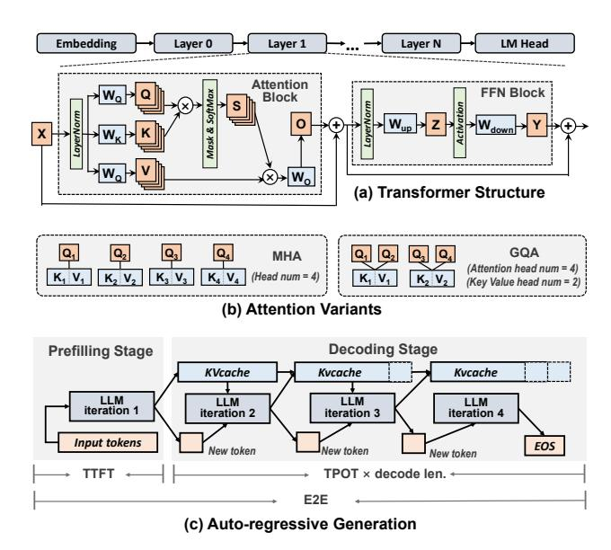
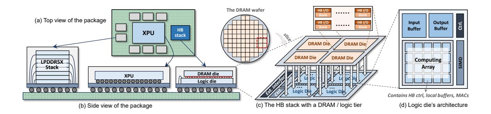
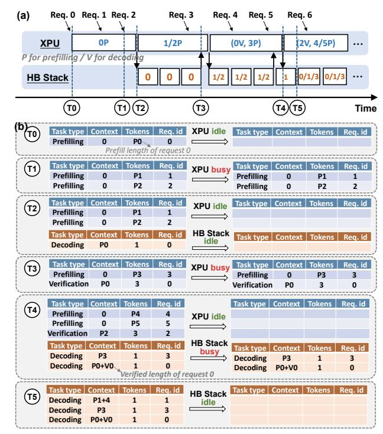
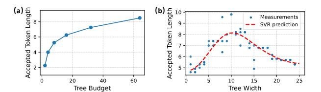

# *A. 3D Stacking and Hybrid Bonding Technology*

The demand for higher-density and more energy-efficient connections has driven a packaging transition from 2D to 3D. By vertically stacking multiple dies, 3D packaging reduces area and shortens interconnect length, delivering lower latency and power consumption under signal integrity constraints [26]. The evolution of 3D packaging, driven by the pursuit of higher interconnect density (Gbps/mm), is as follows:

- (1) Wire Bonding: Direct die stacking with peripheral connections [13], [72] using metal wires (20-600 µm pitches [9]), shown in Fig. 1(a). Wire bonding is cheap, but bonding pads are limited to the chip perimeter.
- (2) Microbump + TSV (Through-Silicon Via): Utilizes chip surfaces for electrical contacts. *Face-to-face stacking* [18], [50](Fig. 1(b)) support only dual-tier integration, using precisely aligned microbumps as connection. Multi-tier integration needs *face-to-back stacking* [32], [51], [53] (Fig. 1(c)), using TSVs for cross-tier transmission. TSV, along with keepout zones, typically occupy ∼10µm pitches [19], [25], [66], and is expensive due to the high aspect ratio via etching [8], [44] across the die. HBM exemplifies this approach.
- (3) Hybrid Bonding (HB): HB replaces conventional microbumps with direct dielectric-to-dielectric and metal-tometal bonds, achieving superior interconnect density with 2–3 µm pitches [17], [69]. Recent HB-based processing-nearmemory architectures [35], [50], [76] integrate computing units into the logic die to exploit the high bandwidth enabled by HB. In practice, single DRAM stacks with *face-to-face* integration are relatively mature and widely used [17], [35], [50], [76], while deeper stacking with *face-to-back* integration requires expensive mini-TSVs [26], [69] to match the finepitch HB connections, as shown in Fig. 1(d).

Fig. 2. LLM model structure and its processing stages. (a) Transformer structure. (b) Attention variants of MHA and GQA. (c) Auto-regressive generation process and latency metrics.

#### B. LLM Structure and Generative Inference Phases

Modern LLMs are built upon the Transformer architecture, which stacks multiple layers containing attention and feedforward (FFN) blocks, as shown in Fig. 2(a). FFN blocks apply simple linear and non-linear transformations, while attention blocks capture token dependencies through query/key/value (Q/K/V) mechanism and scaled dot-product attention. Variants such as Multi-Head Attention (MHA) [67] and Grouped Query Attention (GQA) [2] differ in how attention heads share key and value vectors, as illustrated in Fig. 2(b).

LLM inference consists of two stages: prefill and decode. Prefill processes the entire input in a single forward pass and stores the resulting K/V tensors as the KV cache. Decode then iteratively generates tokens. At each step, it computes only the representation of the newly generated token by reusing the cached K/V from previous steps, and appends the corresponding K/V tensors to the KV cache until the response is complete. The overall process is illustrated in Fig. 2(c).

In LLM serving, requests arrive dynamically, with performance evaluated under service-level objectives (SLOs) [41]: *Time-To-First-Token (TTFT)*, which measures prefilling latency and indicates how quickly users see the initial response; *Time-Per-Output-Token (TPOT)*, which captures decoding latency and reflects the speed of response generation; and *end-to-end (E2E)* latency, which represents the total time from request receipt to completion.

## C. Speculative Decoding

Speculative decoding (SD) introduces a lightweight draft model to assist the target model during decoding [6], [33]. As shown in Fig. 3(a), it reformulates decoding into *draft* and *verification* phases: the draft model predicts several tokens (the

Fig. 3. Speculative decoding (SD) and its variants. (a) The execution flow of chain-like SD. (b) The illustration of the speculation tree and its corresponding context mask used during verification. (c) The hidden-state-based SD methods.

draft budget), and the target model validates all candidates in a single forward pass under rejection sampling. SD guarantees distributional equivalence with standard decoding, ensuring lossless output [6], [33], [48].

Beyond basic chain-like speculation, recent advances extend SD to more expressive forms and tighter model integration. Tree-based variants [3], [38], [48], [64] allow the draft model to propose multiple candidates per step, improving acceptance probability while maintaining verification efficiency via masked attention, as shown in Fig. 3(b). Hidden-state-based SD [3], [12], [37]–[39] embeds a lightweight speculation head into the target model, which predicts the next token using both the last generated token and its last-layer representations.

Recent SD implementations achieve draft-token acceptance rates up to  $\sim 80\%$  [39]. Owing to its model-agnostic and lossless nature, SD has been widely adopted in frameworks such as vLLM, SGLang, and llama.cpp, underscoring its generality as a unified paradigm for autoregressive LLM decoding.

## III. CHALLENGES AND MOTIVATION

#### A. Hardware: Memory's Bandwidth-Capacity Tradeoff

Hybrid bonding achieves high DRAM bandwidth through dense interconnects with 2–3  $\mu$ m via pitches [69], with a single DRAM die providing approximately 20 GB within the reticle area [17], [35]. Increasing capacity through multilayer stacking necessitates extra efforts. First, stacking more layers worsens thermal dissipation, as inner dies have limited heat escape paths. Second, multi-layer designs require *face-to-back* (rather than face-to-face) integration with *mini-TSVs to penetrate* intermediate DRAM dies. To preserve HB's bandwidth advantage, mini-TSV pitches need to match the fine HB via pitches, entailing high aspect ratios and tight alignment tolerances, which increase manufacturing difficulty. Even HBM, with its relatively larger TSV pitches ( $\sim$ 10  $\mu$ m), took over a decade to reach 12-layer stacking [32].

Meanwhile, LLM serving demands both large capacity and high bandwidth. Model sizes have grown rapidly to hundreds of billions of parameters, and inference additionally stores KV caches that grow with request count and sequence length. For example, serving Llama2-13B with 50 concurrent 512-token requests requires approximately 20 GB for KV cache alone (FP16). KV cache footprint directly bounds concurrency; when no memory remains to accommodate additional KV caches, new requests must stall until memory is freed. At

Fig. 4. Throughput versus token count for different model sizes (left) and types (right). Low token counts cause memory bottlenecks, preventing full GPU utilization regardless of model architecture. Tested on A800.

the same time, autoregressive decoding remains predominantly memory-bound [55], [75], requiring high bandwidth to reduce per-token latency.

This reflects *a fundamental trade-off inherent in memory systems*: At a given level of packaging capability and cost, high capacity and bandwidth cannot be achieved simultaneously. Relying solely on packaging advances to accommodate model scaling is insufficient given current trends.

#### B. Software: Heterogeneity in Speculative Decoding

Although speculative decoding alone can already accelerate LLM inference, current homogeneous deployment limits further potential speedup due to two inefficiencies:

(1) Mismatched arithmetic intensity causes resource underutilization. Hardware utilization depends on the balance between arithmetic intensity (the ratio of computation to memory access) and the hardware's compute-to-memory bandwidth ratio. When the arithmetic intensity falls below this ratio, the system is memory-bound with underutilized compute units; otherwise, it becomes compute-bound. For LLM inference, arithmetic intensity scales with the number of tokens processed per forward pass [5], [31], [81]. Given that modern GPUs exhibit compute-to-memory ratios of 100–300 [10], [11], achieving full compute utilization requires processing on the order of hundreds of tokens per pass. Fig. 4 empirically confirms this behavior: throughput increases with token count and eventually plateaus at the compute-bound regime regardless of model size and series.

SD creates a divergence in arithmetic intensity between models. The target model verifies tokens *accumulated* over *multiple* draft rounds in a single pass, thus having higher arithmetic intensity. Therefore, implementing both on homogeneous hardware will suffer from underutilization inherently.

(2) Heterogeneous models disrupt scheduling efficiency. Modern serving systems rely on continuous batching [73] to interleave requests and maintain throughput. This assumes identical model structures across stages, which SD violates: prefill and verification run on the target model, while decoding runs on the draft model. Such heterogeneity prevents unified batching and incurs bubbles, as shown in Fig. 5. Even if requests are delayed to synchronize draft and verification phases, differences in draft budgets across requests [45], [56], [71]

Fig. 5. Batching overview. Numbers annotated on the figure refer to different requests. (a) The continuous batching in normal auto-regressive decoding. (b) The ragged batching caused by model heterogeneity in speculative decoding.

introduce stragglers that block faster ones, thereby creating bubbles and degrading efficiency.

#### C. Synergy: Heterogeneous Architecture as Mutual Solution

HB-based heterogeneous architecture and SD can complement each other. For HB stacks, SD provides a new form of *compression* by introducing a lightweight surrogate. Besides, SD leaves operations with higher arithmetic intensity for the target model, thereby relaxing bandwidth pressure and enabling higher capacity provisioning. *Capacity is critical*, as it stores KV caches and thus sets concurrency limits. For SD, the HB part provides high bandwidth suited to the memory-bound draft decoding phase, while the heterogeneous architecture naturally accommodates mixed computational characteristics without scheduling conflicts.

We then justify why high-performance XPUs (GPUs/TPUs) combined with hybrid-bonding stacks represent a particularly suitable choice to realize this synergy. Other common heterogeneous platforms are considered:

- (1) XPU with CPU: This configuration has been used in recent works like [28], [29], where the CPU also serves as the processor with a low compute-to-memory ratio. However, since the *absolute* memory bandwidth determines the absolute decoding speed, the relatively low CPU memory bandwidth ( $\sim$ 300GB/s) still creates bottlenecks in decoding.
- (2) XPU with different compute-to-memory ratio: This configuration has been used in [55], [79], where different generations of XPU usually differ in compute capacity and memory bandwidth. However, such differences are typically 2-3×, while the gaps in arithmetic intensity and capacity between the draft and target models reach an order of magnitude. This mismatch means that XPUs assigned to draft models still waste considerable computing power and capacity.
- (3) XPU with PIM: Unlike HB, PIM fabricates logic within the DRAM process rather than a separate logic process. This makes its compute units area-inefficient, resulting in a more severe capacity-bandwidth tradeoff. This fabrication distinction also leads to differences in mapping and integration efficiency. We provide a dedicated comparison with PIM-based heterogeneous systems in Sec. VII-A.

Fundamentally, SD *polarizes* arithmetic intensity and footprint across models, enabling *separate optimization* for bandwidth and capacity. This approach is more practical than simultaneously optimizing both bandwidth and capacity.

Fig. 6. Package and architecture overview. (a)/(b) The top/side view of HybridSpec's package. (c) The HB stack contains a DRAM and a logic tier. Two tiers are stacked face-to-face by hybrid bonding vias. Adjacent logic blocks are interconnected on the logic tier. (d) The architecture of logic dies.

#### IV. HYBRIDSPEC ARCHITECTURE

In this section, we introduce HybridSpec, a heterogeneous platform that contains an HB stack and an XPU with corresponding memory, as shown in Fig. 6. We first present architectural designs, then demonstrate the execution flow.

## A. The Hybrid-bonding Stack Processing Unit

Fig. 6(c) illustrates the architecture of the HB stack. Considering the integration issues analyzed in Sec. III-A, we adopt the mature face-to-face stacking comprising one DRAM tier and one logic tier, interconnected through hybrid bonding vias.

The DRAM tier is diced from a wafer of DRAM dies along lithographic scribe lines, as shown in Fig. 6(c). Each DRAM die contains multiple banks that operate independently. Each bank is associated with a set of HB I/Os that interface with the underlying logic die. Accordingly, the logic die is arranged to *align with* individual DRAM-die footprints to facilitate subsequent assembly. Since a DRAM die's area determines how many banks and HB I/O sites it contains, both aggregate bandwidth and capacity scale with die area.

The logic tier contains logic blocks that interface with the DRAM dies for data access and perform computation. Each logic block encompasses input/output activation buffers, controllers, and a distributed computing array. Each array element performs multiply-accumulate operations, holding small local buffers and HB controllers for communication with DRAM banks above, as shown in Fig. 6(d). Adjacent interconnects between logic blocks facilitate inter-block communication. The logic tier also comprises global controllers, instruction/address/task buffers, and external interface implementations.

We now discuss the packaging for *the logic die to the sub-strate*, which limits the XPU-HB transfer bandwidth. Existing HBM systems typically employ TSVs in the logic tier for this connection [18], [32], [53], providing high bandwidth but at high cost. In HybridSpec, however, SD significantly reduces data movement between the HB stack and XPU. The primary transfers consist of draft model KV caches and token lists, rather than target model KV caches or per-layer intermediates. Therefore, we adopt cost-effective wire bonding [63] for the logic die to substrate connection. As experiment VI-G shows,

data transfer overhead accounts for less than 1% of total execution time, validating that wire bonding provides sufficient bandwidth for our system.

## B. The XPU Processing Unit

The XPU component comprises both compute and memory. Leading GPUs such as A100/H100 employ a silicon interposer to connect HBM to the compute die. While this design provides high memory bandwidth, it incurs high cost and limited capacity, failing to fully exploit the benefits of *heterogeneous architecture* and the relaxed bandwidth requirements enabled by SD for the target model.

Therefore, we adopt the stacked LPDDR5X with wire bonding package as specified in [54]. Although LPDDR was originally developed for edge devices, LPDDR5X has gained widespread adoption owing to its balanced capacity, bandwidth, and power characteristics. Each package incorporates 8 stacked layers, with each layer containing 4×16Gb LPDDR5X dies, delivering a total capacity of 64GB. Each package provides 128 DQ pins at 8.5 Gb/s/pin, yielding an aggregate bandwidth of 136GB/s. By equipping the XPU with eight such packages as shown in Fig. 6(a), a total capacity of 512GB and a bandwidth of 1.1TB/s are achieved. The feasibility of trace routing between LPDDR5X and the XPU within PCIe card form factors has been validated [54]. In HybridSpec, the reduced bandwidth has modest impacts (as SD lifts the arithmetic intensity of the target models), while the increased memory capacity provides significant advantages (as it accommodates larger KV caches and enables higher concurrency). Experiments in Sec. VI-F further validate this by comparing performance when adopting different memory types for the XPU.

Together, the HybridSpec PCB accommodates three primary package types: the XPU, the HB stack, and LPDDR5X, as illustrated in Fig. 6(b).

#### C. Execution Flow

This subsection outlines the *per-request* execution flow (*batching* is discussed in Sec. V). Upon receiving a request, the system performs prefill for both the target and draft models on the XPU, then transfers the request to the HB stack for iterative

Fig. 7. Comparison of basic implementation of TP (subfigure (a)) and our fine-grained method (subfigure (b)). Subfigure (c) compares their timelines.

decoding. Once the draft budget is reached, the draft tokens are transferred back to the XPU for verification. The XPU then returns the accepted tokens to the HB stack, which clears the KV cache of mis-speculated tokens and resumes draft decoding from the accepted token sequence. This draft-verification cycle repeats until an EOS token appears. Regarding memory, the HB stack stores the draft model and its KV cache, while XPU holds both target and draft models and the target KV cache.

Hidden-state-based SD follows a similar flow, except that whenever the XPU transfers data to the HB stack (prefill or verification), it also sends the *last-layer hidden states*, as shown in Fig. 3(c). Regarding memory, in addition to the data storage in the standalone draft case, both the XPU and HB stack buffer temporary hidden state for the next iteration.

The dataflow on the HB stack includes two hierarchies:

- 1) Inter-logic block level: We enhance the tensor parallelism (TP) with fine-grained computation-communication overlap to achieve latency hiding. We follow the conventional TP matrix partitioning approach [62], where weights are partitioned along output and input channels alternately. Our approach differs in execution: rather than completing all computation before initiating collective communication as shown in Fig. 7(a), we decompose computation into tiles and pipeline each with ring-based communication as shown in Fig. 7(b). This fine-grained execution effectively masks the majority of communication latency, as shown in Fig. 7(c).
- 2) Intra-logic block level: Due to the relatively small sizes of input/output activations in decoding, we adopt weight-stationary for GEMM (and KV cache stationary for attention), to maximize weight (KV cache) reuse. Formally, HybridSpec adopts  $Opr1 \times Opr2 = Res$  pattern with Opr2 stationary. Opr2 is directly mapped from HB DRAM onto the compute array, while Opr1 is read from activations and broadcast across array elements. Individual elements utilize their adder trees to compute partial sums, which are subsequently aggregated in block-level buffers. The dataflow follows well-established designs proposed by previous accelerators [7], [36], [52], [61].

#### V. SCHEDULING OPTIMIZATION

In this section, we present the scheduling optimizations for HybridSpec to further reduce inference latency and enhance utilization. While prior studies focus on design-space exploration (DSE) for *static offline inference*, such design-time

Fig. 8. Asynchronous batching flow of XPU and HB stack. (a) Timeline of batch execution with annotated request arrivals and task transfers. (b) Task pool states at representative time points from (a), showing XPU (blue) and HB stack (brown) transitions during scheduling.

decisions are immutable after fabrication. In the context of *dynamic online serving*, runtime scheduling therefore becomes the primary lever to accommodate fluctuating request patterns.

#### A. Asynchronous Batching

During serving, requests arrive at arbitrary intervals, requiring efficient batching to *improve throughput* and *minimize queuing latency*. Following the principle of continuous batching [73], we design an asynchronous batching strategy optimized for heterogeneous architectures.

Each request is decomposed into discrete tasks of three types: prefill, decode, and verification, as mentioned in Sec. IV-C. Each processing unit (XPU or HB stack) maintains a task pool storing the metadata of pending tasks (type, context state, token count, etc.). As shown in Fig. 8, an idle unit immediately forms a batch from available tasks in the pool for execution, while a busy unit defers batching until the current iteration completes.

Each task corresponds to a single forward pass of either the target or draft model. For the XPU, tasks may originate from newly injected external requests (T0, T1 in Fig. 8), or from the HB stack when verification of decoded results is required (T3 in Fig. 8). For the HB stack, tasks may come from the XPU when a new round of speculation is needed after verification (T2, T4 in Fig. 8), or internally from ongoing decoding processes when the number of generated tokens has

Fig. 9. Under the same workload, memory occupation over time with / without the watermark mechanism.

not reached the draft budget (T5 in Fig. 8). The memory and computation considerations in batching are as follows.

- 1) Memory: Memory constraints mainly stem from the KV cache. As requests progress, the cache expands until completion, and under high request rates or long sequences, it can exceed available memory even when model parameters fit. We mitigate this issue with a watermark-based strategy: when memory utilization exceeds a preset threshold, prefilling tasks are temporarily suspended to limit KV cache growth. Fig. 9 demonstrates that this mechanism effectively stabilizes memory usage. Fig. 9 also indicates that a larger memory can reduce processing time.
- 2) Computation: On the HB stack, decoding tasks of different requests are batched jointly, with shared parameters except for attention KV caches as handled by previous works [1], [23], [73]. The XPU performs prefilling and verification. Draft prefills are executed individually due to different parameters, incurring negligible overhead given the lightweight draft model. Target prefills and verification are batched jointly, with possible contention handled in Sec. V-C.

Compared to offline batched inference, our batching is characterized by two key features: (1) *Asynchronous execution:* iterations across different processing units do not have strictly aligned start and end times. (2) *Dynamic batch composition:* the set of requests in each batch changes across iterations, unlike the static composition in offline batching.

## B. The Utilization-aware Speculation Scheme

To further bridge the gap between dynamic workloads and fixed hardware, we introduce runtime adaptability through speculation-based scheduling. As analyzed in Sec. III-B, arithmetic intensity is affected by per-iteration token count. By tuning draft budgets and tree shapes, we can therefore modulate the arithmetic intensity of tasks across heterogeneous units, better utilizing idle compute or memory resources. Chain speculation is treated as a special case of tree speculation with width one in the following analysis.

While improving resource utilization, the strategy must still preserve speculation effectiveness. We establish the following principles based on algorithm experiments.

- (1) Increasing the draft budget extends the accepted token length but exhibits diminishing gains beyond a threshold (Fig. 10(a)). To avoid redundant computation on rejected drafts, we set B as the upper bound of the draft budget.
- (2) Under a fixed total budget, the accepted draft length first increases and then decreases with tree width (Fig. 10(b)), reflecting a trade-off between exploration and depth. Wider

Fig. 10. Accepted token length trends for different speculation configurations. Measurements from the open-source implementation of [64]. (a) Effect of draft tree budget. (b) Impact of tree width on accepted token length under a fixed budget. The red curve denotes the Support Vector Regression (SVR) fitting.

