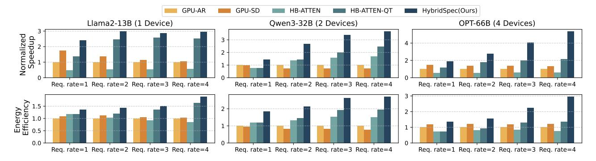
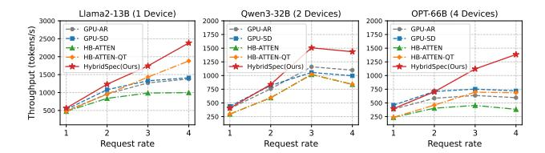

# Algorithm 1 The utilization-aware speculation

**Input**: draft budget bound *B*, speculation lookup table *T*, initialized *draft\_budget* and *tree\_width*.

```
while (after prefilling) and (no EOS) do
   # Decoding stage starts.
   current draft tree size = 0
   p = T[draft\_budget]
                           \triangleright Get optimal tree width p (the tree width
that achieves the best accepted token length given the draft_budget).
   while (current\_draft\_tree\_size \le draft\_budget) do
       AI_{\rm HB} = HB\_stack.process()

       if AI_{HB} < HB\_stack.roofline then
           tree\_width = min(p, tree\_width + 1)
           tree\_width = \max(1, tree\_width - 1)
       HB_stack.add_task(DecodeTask(tree_width))
       current_draft_tree_size += tree_width
   end while
   # Verification stage starts.
   XPU.add_task (VerifyTask(draft_budget))
   AI_{XPU} = XPU.process()
   if AI_{XPU} < XPU.roofline then
       draft\_budget = min(B, 2 \times draft\_budget)
       draft\_budget = \max(1, draft\_budget/2)
   end if
end while
```

trees cover more candidates but shorten per-branch length. We maintain a lookup table T to record the optimal width transition point p for each given draft budget.

The utilization-aware speculation strategy is summarized in Alg. 1. Starting with an initialized draft tree budget and tree width, the optimal width p is retrieved from table T. During draft decoding, the HB stack estimates arithmetic intensity using the number of processed tokens per iteration. The  $tree\_width$  is adjusted to make the arithmetic intensity of HB's tasks approach the turning point of the HB roofline model within the range [1,p], thus achieving higher resource utilization while avoiding wasting computation on discarded drafts. Similarly, during verification, the XPU adjusts the  $draft\_budget$  for the next round within [1,B].


Fig. 11. Comparison of utilization across different schemes, with each point representing one iteration. The average utilization progressively improves across FIFO (55.63%), PFS (62.43%), and chunked schemes (66.17%).

#### C. Prefill-Verification Arbitration

With SD deployed, the XPU executes both prefill and verification tasks. A naive FIFO (First-in-First-out) scheduler processes requests in arrival order, but fails to *exploit batching opportunities under high request rates*. Under FIFO, verification tasks of earlier requests can delay subsequent prefills. Since completing a prefill effectively materializes a request into schedulable downstream work, such blocking reduces the number of active requests available for batching, thereby limiting concurrency and utilization. To address this, we adopt a PFS (Prefill-First Scheduling) policy that *prioritizes prefill tasks* over verification tasks when memory permits, increasing the pool of schedulable requests.

Prefill lengths also vary widely (from tens to thousands of tokens), introducing temporal imbalance in compute utilization. Short prefills complete quickly and underutilize the XPU, while long prefills occupy it for extended periods, delaying subsequent scheduling decisions. Building upon PFS and inspired by [1], we develop CHK, which increases scheduling flexibility by partitioning long prefills along the sequence dimension. This facilitates packing batches that better match the XPU's compute—memory ratio, thereby improving utilization. Chunking requires corresponding adjustments to attention masks to preserve sequence alignment.

Fig. 11 compares the utilization of FIFO, PFS, and CHK scheduling, showing progressively higher utilization as more iterations reach full XPU occupancy.

In summary, batches on the XPU fall into three categories: (1) Verification-only: occurs when no prefill tasks are pending or when memory reaches the watermark. (2) Prefill-only: occurs when no verification tasks are pending or when chunked long prefills alone saturate the compute resources. (3) Mixed prefill-verification: occurs when short prefills are combined with verification to fully utilize compute power.

### VI. EXPERIMENTS

## A. Experiment Settings

**Benchmarks:** We use three typical SD pairs of target/draft models with varying parameter counts: Llama2-13B [47] / TinyLlama1.1B [65], Qwen3-32B [59] / Qwen3-1.7B [58], and OPT-66B [16] / OPT-2.7B [15]. All models operate with FP16/BF16 precision. We use ShareGPT as our dataset, generating workloads following vLLM's *benchmark\_serving.py* [68]. System load is controlled by adjusting the *request* 

rate rather than fixed batch sizes. In online serving, batch sizes fluctuate dynamically based on both request arrival rate and sequence lengths, making request rate a more realistic load indicator. Tab. II reports typical steady-state batch size statistics and throughput for varying request rates. We primarily evaluate request rates up to 4 per device, which already constitutes a relatively high per-device load. Beyond this point, SLO degrades rapidly on GPUs, as observed by previous works [55], [73], [79]. Request rates in the hundreds are collectively served by cluster-scale resources. Under the utilization-aware scheme in Sec. V-B, the upper bound of tree budget B is set to 32 to mitigate compute waste on unaccepted tokens. The average draft\_budget and tree\_width decrease at higher request rates: (30.74, 3.72), (22.78, 3.10), (15.51, 2.31), and (9.25, 1.58) at rates 1,2,3,4, respectively.

TABLE II

BATCH SIZE AND TOTAL THROUGHPUT (INCLUDING PREFILL AND DECODING) STATISTICS ON REQUEST RATES ON GPU.

| Req. rate | Mean  | Median | Variance | Min   | Max   |
|-----------|-------|--------|----------|-------|-------|
| 1         | 4.83  | 5.00   | 3.77     | 2.00  | 8.00  |
| 2         | 13.40 | 13.00  | 10.30    | 10.00 | 18.00 |
| 3         | 27.00 | 27.00  | 13.60    | 21.00 | 32.00 |
| 4         | 37.86 | 37.00  | 9.14     | 34.00 | 43.00 |

**Baselines:** We compare HybridSpec against four baselines: two GPU-based approaches (a, b) and two HB-based heterogeneous approaches (c, d). The three model pairs of increasing sizes are deployed on 1, 2, and 4 devices, respectively.

- (a) <u>GPU-AR</u>: Autoregressive inference executed on A800-80GB-PCIe GPUs with vLLM [30].
- (b) <u>GPU-SD</u>: Speculative decoding performed on A800-80GB-PCIe GPUs with vLLM.
- (c) <u>HB-ATTEN</u>: Autoregressive inference performed on our HB-based hybrid platform, with part of the model (attention) allocated to the HB stack. The rationale of this approach is to map operators with lower arithmetic intensity in batched LLM inference onto high-bandwidth memory devices, as adopted in prior heterogeneous works [23], [36], [60].
- (d) <u>HB-ATTEN-QT</u>: HB-ATTEN with 4-bit quantization [21] for KV cache to relieve the hybrid-bonding DRAM's capacity burden. However, quantization inevitably introduces performance degradation.

Hardware Configuration: Our prototype adopts a face-to-face hybrid bonding stack (Fig. 6(c)), occupying 408 mm² (24.7×16.47 mm) and operating at 400 MHz. The memory tier integrates four 2.5 GB DRAM dies (11.75×7.96 mm each), each featuring 80 I/O groups with 256-bit width, delivering 10 GB total capacity and 4 TB/s aggregate bandwidth. DRAM energy is 0.88 pJ/bit, following the characterization in [17]. The logic tier comprises four blocks, each equipped with 140 KB activation SRAM, 512 KB distributed weight SRAM, and 80×64 FP16/BF16 MAC units. Fig. 13 shows the silicon details for the HB stack. The XPU adopts GA100 GPU core, and its LPDDR5X memory follows specifications in [54].



Fig. 12. Overall comparison of latency and energy between HybridSpec and other baselines. HybridSpec shows consistent advantages in both latency and energy consumption under various request rates. All results are normalized to GPU-AR.


Fig. 13. (a) Floorplan of the logic block prototype. (b) Zoomed-in layout of HB vias. (c) Transmission electron microscope (TEM) photo of HB vias.

We further extended SplitwiseSim [55] to develop an event-based simulator to explore performance across diverse work-loads, as shown in Fig. 14. The HB stack simulation uses the hardware parameters above. For XPU, we build a piece-wise linear performance model by fitting profiling results of GPUs across different parallelism, sequence lengths, and batch sizes, as previous works [46], [55] have performed.


Fig. 14. Simulation Pipeline. HBstack parameters are silicon-derived.

**Metrics:** We evaluate different systems primarily using the following metrics: (1) Latency: End-to-end latency for all requests in the given trace. For straightforward understanding, we report speedup in experiments, which is inversely proportional to latency. (2) Energy: Total energy consumption required to complete all requests in the workload. We present this as energy efficiency, which is inversely proportional to energy. (3) TTFT/TPOT: Time-to-first-token and time-peroutput-token respectively, as introduced in the Background section. We report mean, median, and P99 values for both metrics across all requests to capture the distribution characteristics. (4) Throughput: Total processed token counts divided by total processing time.

Experiments are designed to answer the following aspects:

- (1) How does HybridSpec perform compared to baselines in terms of latency, energy consumption, throughput, and SLO attainment? (Sec. VI-B, VI-C)
- (2) How effective is the scheduling policy adopted in Hybrid-Spec, and what tradeoffs does it introduce? (Sec. VI-D, VI-E)
- (3) How do different hardware configurations affect the overall system performance of HybridSpec? (Sec. VI-F, VI-G)
- (4) The generalization of HybridSpec, including sensitivity to speculation accuracy and cost analysis. (Sec. VI-H, VI-I)

#### B. Overall Comparison

Fig. 12 compares the end-to-end speedup and energy efficiency of HybridSpec against other baselines. HybridSpec outperforms both GPU-based and hybrid-bonding-based solutions, achieving an average speedup of 3.02x and energy efficiency improvement of 1.96x.

Latency: HybridSpec delivers consistent speedups across request rates, with gains increasing under heavier loads. The improvement arises as baselines experience severe degradation at high concurrency (detailed in Sec. VI-C). HybridSpec sustains performance by fully exploiting heterogeneous compute and memory resources enabled by advanced HB integration. Speedup also scales with model size. For larger models, limited HBM capacity in baselines necessitates tensor parallelism across devices, introducing additional all-reduce communication. In contrast, HybridSpec provides sufficient on-stack memory to store both weights and KV caches, enabling data parallelism where each device independently serves complete requests, eliminating inter-device communication.

Notably, pairing HB memory with low arithmetic intensity operators does not guarantee acceleration. HB-ATTEN sometimes even underperforms conventional setups, as its limited HB DRAM can store only few KV caches, restricting concurrency and causing request suspension delays. The quantized variant, HB-ATTEN-QT, mitigates this bottleneck and ranks second after HybridSpec, albeit with quality loss.

**Energy:** HybridSpec also achieves energy savings over the baselines, though to a lesser extent than latency improvements.



Fig. 15. Throughput comparison. Throughput is computed as total tokens processed (prefill and decoding) divided by total processing time.

This gap arises from two factors. First, energy accumulates over the device's entire active period and thus correlates with total execution time rather than per-request latency. Because the workload is injected within a one-minute interval for all baselines, performance differences primarily affect the post-injection drain phase, resulting in limited variation in makespan. Second, HybridSpec integrates an additional HB stack that inevitably adds some power draw. Nevertheless, due to the energy-efficient hybrid bonding and modest compute load, the XPU remains the dominant contributor to overall energy consumption.

**Throughput**: Fig. 15 compares throughput across different request rates and models. HybridSpec's throughput gains over baselines are correlated with request rate, ranging from 1.15x at 1 req/s to 1.94x at 4 req/s. At low rates, requests arrive sparsely, so prior requests have little effect on total processing time. As the rate increases, temporally close requests induce queuing and delay propagation, making performance gaps between HybridSpec and baselines more obvious. Rather than sacrificing throughput for latency, HybridSpec simultaneously achieves better throughput and lower latency by leveraging advances in packaging, algorithms, and scheduling.

#### C. SLO Comparison

Fig. 16 compares the TTFT and TPOT of different solutions. We categorized the ShareGPT requests by sequence length bins as annotated in subtitles. Fig. 16 is evaluated on Llama2-13B to eliminate the impacts of cross-GPU communication.

All solutions show relatively stable latency initially, but exhibit *sharp rise* beyond saturation points. Additionally, saturation happens at lower request rates for longer sequences, as they require more iterations and impose heavier per-request load. Across all cases, HybridSpec consistently achieves lower TTFT and TPOT than other solutions while sustaining higher request rates before saturation. Under identical TTFT/TPOT requirements, HybridSpec can sustain 2.97× higher request rates than GPU baselines on average.

Among the baselines, HB-ATTEN degrades most rapidly despite employing a heterogeneous HB-based platform similar to HybridSpec and mapping operators by arithmetic intensity. The root cause is the *limited capacity*: mapping attention to the HB stack requires storing KV caches that grow with both request rate and sequence length. Once capacity is exhausted, incoming requests must be suspended, sharply inflating TTFT. HB-ATTEN-QT substantially alleviates this issue through KV cache quantization.


Fig. 16. TTFT and TPOT comparison between HybridSpec and baselines under different sequence length and request rates. HybridSpec's TTFT and TPOT grow slower than baselines and can serve higher request rates.

In contrast, HybridSpec remains robust under long-context workloads. In HybridSpec, the target model's KV cache resides *entirely* in the large-capacity LPDDR, avoiding the capacity-induced stalls observed in baselines. The HB stack only stores the draft model's KV cache, which is significantly smaller, while still providing the high bandwidth needed to accelerate memory-bound draft decoding. These results confirm that HybridSpec's advantage at high request rates stems from the heterogeneous memory scheme, and becomes more pronounced as sequence length increases.

### D. Ablation Study of Scheduling Optimizations

**Dynamic Speculation:** Fig. 17 (a) presents the speedup of the dynamic utilization-aware speculation scheme over fixed-budget speculation, achieving an average improvement of  $1.81 \times$ . The results are averaged across models, considering

that HybridSpec does not require tensor parallelism and performance is similar across models. As shown in Fig. 17(a), the speedup declines with increasing request rate. This is because higher request rates intensify the workload and raise overall system utilization, leaving fewer idle resources for dynamic speculation to exploit. Moreover, longer sequences are more sensitive to dynamic speculation, since they involve more rounds of drafting and verification.


Fig. 17. The speedup of scheduling optimizations, including (a) dynamic speculation, and (b) batching strategies.

**Batching Strategies:** Fig. 17 (b) shows the speedups achieved by preemption and chunking optimizations demonstrated in Sec. V-C. Results are also averaged across models as above. Prioritizing prefill over verification tasks yields an average speedup of 1.10×, while combining request chunking with prefill preemption achieves an average speedup of 1.29×. The speedups of scheduling optimizations grow with request rates. This is because higher request rates intensify system load, and with limited computational resources, effective scheduling strategies become critical for mitigating resource contention and maintaining performance.

