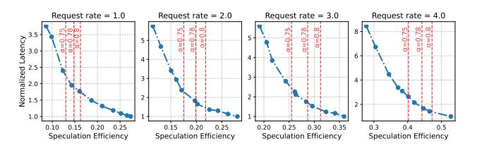
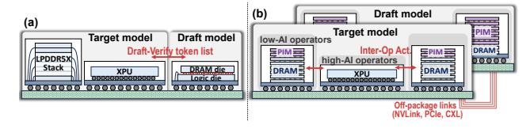

# E. SLO Tradeoff of Arbitration

As described in Sec. V-C, HybridSpec adopts a prefill-first scheduling (PFS) policy that prioritizes incoming prefill tasks over pending verification tasks. Fig. 18 further quantifies how this arbitration decision affects the TTFT-TPOT trade-off.

Fig. 18. TTFT and TPOT comparison between FIFO (w/o arbitration) and PFS (w/ arbitration) under varying request rates.

When arbitration is disabled (i.e., all tasks are processed in FIFO order), the system exhibits slightly better TPOT but notably worse TTFT. Under FIFO, verification tasks are not preempted by new prefills, so the draft-verify cycle proceeds with shorter turnaround and faster token generation. However,

incoming requests must queue behind pending verifications before prefill can begin, increasing TTFT.

As request rates increase, the TPOT advantage of FIFO diminishes. Under heavy load, FIFO stalls new requests behind verifications, delaying their entry into the decoding pipeline. Then, fewer requests are available for batching. PFS instead completes prefills promptly, feeding more requests into the pipeline sooner and improving overall utilization, which in turn benefits TPOT.

## F. The Impact of Different XPU Memory

Fig. 19 compares the latency when replacing the 512GB 1.1TB/s LPDDR memory with 40GB 1555GB/s HBM2 or 80GB 1935GB/s HBM2e, both offered as A100 options. Evaluations are conducted on Llama-13B, as the 40 GB HBM2 cannot accommodate larger models. At a low request rate of 1 req/s, high-bandwidth memories deliver substantial speedups over LPDDR. However, as the request rate increases, their advantage diminishes, and the 40 GB configuration even performs worse than the LPDDR. At low request rates, memory can accommodate both model weights and KV caches. As request rates rise, the expanding KV cache makes memory capacity the bottleneck, limiting batch size. Consequently, new requests must wait for memory to be freed, increasing latency. In HybridSpec, LPDDR5X provides sufficient capacity to avoid this issue. Since the HB stack handles most memorybound operations, the lower bandwidth has reduced impacts on overall performance.

Fig. 19. Comparison when XPU is equipped with different memories.

While HBM provides substantial speedup at low request rates, this advantage is less crucial since SLOs are already satisfied in these cases. Moreover, larger XPU memory can offer greater benefits for larger models and longer sequences by enabling higher concurrency and reducing distributed communication.

## G. The Impact of Data Movement between XPU and HB Stack

Fig. 20 shows the data movement overhead between XPU and HB Stack. We sweep bandwidth density from 2 to 8 GB/s/mm (total bandwidth = density  $\times$  die side length) and link latency from 1 to  $16\mu$ s, sourced from [34].

Data movement overhead is negligible, taking only several milliseconds and contributing less than 1% of total processing time in most cases. Link latency dominates over bandwidth because transfers in HybridSpec consist mainly of small packets. The largest transfer is the draft model's KV cache, approximately several MB for  $1\sim3$ B drafters. Verified and

Fig. 20. Data movement overheads under different bandwidth and latency.

candidate token lists amount to merely hundreds of bytes. Even for hidden-state-based speculative decoding methods that require additional feature transfers, the data volume reaches only tens of KB. Given the aggregate transfer bandwidth of tens of GB/s, all of the aforementioned transfer costs are minimal. In contrast, link latency is constant regardless of data volume, and the frequent communication required between XPU and HB stacks makes it the dominant source of overhead.

It is worth noting that operator-level mapping, such as HB-Attention, would incur substantially greater transfer overhead. This is because data movement in such designs is no longer confined to the verification-draft boundary, but occurs at every forward pass. Moreover, the transferred content is no longer limited to the verified token list; it encompasses the activations preceding and following attention for all Transformer layers. As a result, the total transfer volume increases by several orders of magnitude compared to the baseline approach, imposing stringent bandwidth requirements.

#### H. Sensitivity to Draft Model Accuracy

We sweep *speculation efficiency*, defined as the ratio of accepted tokens to the total draft budget, as the controlled variable to represent different levels of draft model accuracy. We did not use acceptance rate, as acceptance rate is measured under *chain-based* Markov assumptions [37]–[39] and cannot directly apply to tree-based SD.

As shown in Fig. 21, latency decreases with speculation efficiency. The sensitivity moderates as efficiency increases. This indicates that once the draft model accuracy reaches a certain level, its impact on latency becomes limited.

To relate these results to common SD methods, we use red vertical lines to mark the speculation efficiency achievable under chain-based speculation at typical acceptance rates [6], [38], [48], [64]. Speculation efficiency is computed as  $(1 - \alpha^{draft\_budget})/((1 - \alpha) \cdot draft\_budget)$  following [6], [33]. Since tree-based methods outperform chain-based approaches under the same draft budgets, they operate in the regime to the right of these reference lines.

#### I. Cost Analysis

A100 and HybridSpec employ identical main computing chips but differ in memory and packaging. A100 integrates 80 GB HBM2e with interposer packaging, whereas HybridSpec combines an HB stack with eight 64 GB LPDDR5X modules using wire bonding. HBM is estimated to account for over 50% of A100's cost (~\$8,000) [40], [49]. For HybridSpec, the LPDDR5X modules (~\$400 each) and 400

Fig. 21. Latency under varying speculation efficiency. The red vertical line denotes the reference speculation efficiency of a chain-based method with corresponding acceptance rates.

mm² hybrid bonding ( $\sim$ \$400 [14], [42]) together total about  $\sim$ \$3,600. Moreover, A100's TSV-based interposer packaging incurs higher assembly cost than HybridSpec's wire-bonding design. Therefore, HybridSpec is estimated to be more cost-effective, primarily owing to its significantly lower memory and packaging cost.

#### VII. DISCUSSION

## A. Comparison with PIM-Based Heterogeneous Systems

The use of high-bandwidth memory and arithmetic-intensity matching in HybridSpec naturally invites comparison with previous PIM-based heterogeneous designs [20], [22], [36]. We identify two key differences between them.

- (1) Fabrication. PIM embeds logic within the DRAM process, whose characteristics (e.g., limited drive current, high-capacitance cell etching) make it ill-suited for efficient logic fabrication, typically sacrificing  $\sim$ 50% capacity for simple MAC arrays. In contrast, HybridSpec fabricates logic and DRAM on separate processes and integrates them via hybrid bonding, where fine-pitch  $(2-3\mu m)$  bonding vias occupy less than 3% of DRAM die area. Therefore, HB-based integration has a more favorable capacity–bandwidth tradeoff than PIM-based architecture.
- (2) Mapping Strategy. Due to limited fabrication capability, PIM can only integrate simple MAC units and thus requires a companion XPU to handle non-linear operators and data movement, enforcing *operator-level* partitioning across XPU and PIM stacks. In contrast, HybridSpec's hybrid-bonded stack integrates a complete logic die, thus enabling *model-level* partitioning across XPU and HB stack, which naturally matches SD's draft-verification boundary with low communication. As shown in Fig. 22, HybridSpec significantly reduces data movements while achieving higher hardware integration density for the same serving workload.

Fig. 22. Comparison between (a) HybridSpec and (b) typical PIM-based heterogeneous architecture [36], which requires two separate XPUs for the draft and target models.

More broadly, this work reveals an overlooked insight in heterogeneous systems: *arithmetic intensity alone is insufficient as a mapping criterion.* In online serving with continuously growing KV caches, mapping low-intensity operators onto high-bandwidth memory without accounting for capacity constraints restricts request concurrency and increases latency (see HB-ATTEN baseline, Fig. 16). Instead, HybridSpec exploits algorithmic opportunities to relax the trade-off between memory and bandwidth.

## *B. Scalability Analysis*

Horizontal Scaling. A single HybridSpec device comprises an HB stack, XPU, and LPDDR5X modules. Scaling to multiple devices follows two strategies, depending on model size. For models ∼100B parameters, *data parallelism* distributes requests across devices, as demonstrated in Sec. VI-B, where Qwen3-32B and OPT-66B are deployed on 2 and 4 devices, respectively. A global controller (e.g., a host CPU) balances the load, and no extra inter-device communication is required between DP ranks. Even larger models (e.g., LLaMA-405B) need *tensor parallelism* to partition model weights across devices. TP ranks execute synchronously, so the only additional overhead is all-reduce communication between devices. Since HybridSpec has a larger per-device capacity (512GB LPDDR5X) than GPU (80GB HBM), fewer TP ranks are needed to avoid out-of-memory, thus reducing communication overhead and improving scalability.

Vertical Scaling. Vertical scaling refers to stacking more DRAM layers beyond the single-layer integration adopted in this work. A heterogeneous architecture is still necessitated, as the HB stack alone cannot provide sufficient compute for prefill and large-batch processing. For HybridSpec, larger stacking supports a bigger draft model, improving speculation accuracy and overall speedup; for HB-ATTEN, it supports more KV caches, increasing request concurrency and mitigating high TTFT under heavy load (Fig. 16). Even so, HybridSpec still benefits from less XPU-HB data movement and lower pressure on high-bandwidth memory than HB-ATTEN. Deeper stacking, however, raises thermal and manufacturing costs as mentioned Sec. III-A, and advances in packaging alone are insufficient to keep pace with model scaling.

