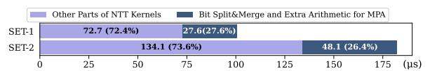
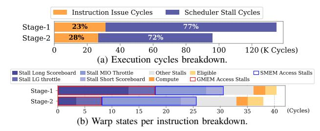

# *A. Inefficiency within the Tensor-Core-Based NTT-Inner-Part*

First, we analyze the existing TCU-based NTT acceleration schemes for FHE and find that these approaches still suffer from various efficiency issues.

On one hand, TensorFHE [16] and WarpDrive [14] use the INT8 data type. Since TCUs lack native support for the

Fig. 3: INT8-TCU-NTT (N = 2 16) latency (µs) breakdown. (The number of sets is 1 and 2, each comprising 36 limbs.)

Fig. 4: FP64-TCU-NTT (N = 216 , #limbs = 36) execution cycles and warp states proportion breakdown.

wide integer multiplications (e.g., 32×32-bit) required by NTT, these methods must rely on a costly multi-precision arithmetic (MPA) pipeline, including bit-splitting, an increased number of arithmetic operations, and bit-merging. Our analysis quantifies this inefficiency, showing that the MPA pipeline overhead is 26% ∼ 28% of the total computation time (Fig. 3).

On the other hand, Neo [21] utilizes FP64 TCUs to largely reduce MPA pipeline overhead. However, current FP64-TCU-NTT solutions still face severe SMEM access bottlenecks. Our profiling of the 32-bit wordsize, FP64-based NTT implementation (Fig. 4) reveals substantial inefficiencies. A mismatch between current NTT acceleration methods and hardware architecture leads to frequent data movement to and from SMEM during *Inner-NTT* (detailed in §IV-B), resulting in a high fraction of stall cycles due to SMEM access. Specifically, the proportion of stalled cycles reaches 77% and 72% in NTT stage-1 and stage-2, respectively, while stalls attributable to shared memory contribute 32% and 48% of these stalls.

