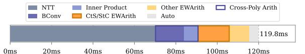
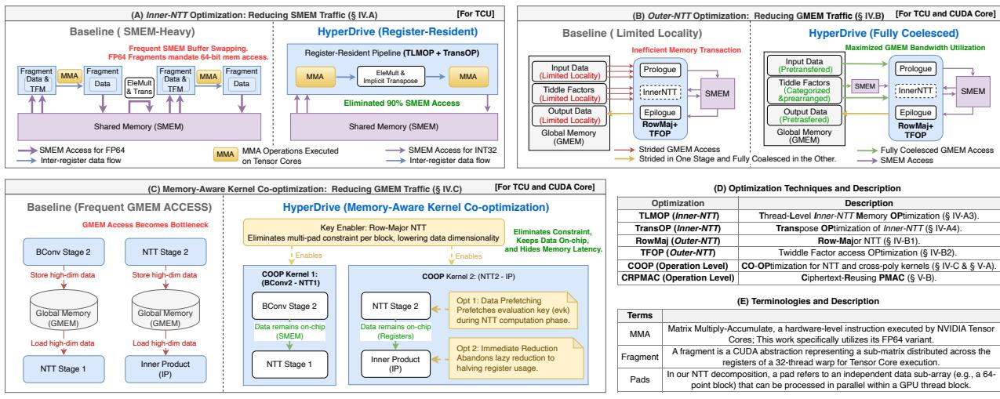
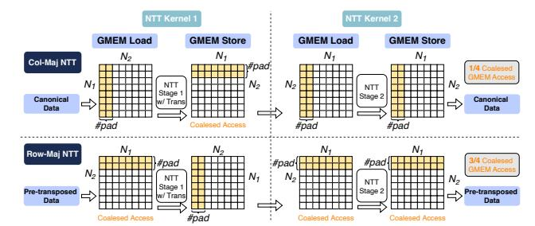
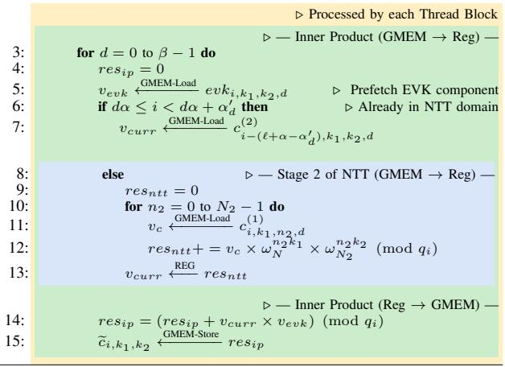

# *B. Bottlenecks in NTT-Outer-Part*

In GPU kernels, a single uncached GMEM access incurs several hundred clock cycles of latency [35]. Therefore, reducing the GMEM access frequency via coalescing is a crucial optimization. However, two main issues limit the effectiveness of coalesced accesses in the NTT context.

One issue is that, due to algorithmic constraints, the 4-step NTT requires processing the column-wise inner NTTs before the row-wise ones, resulting in inherently non-contiguous data access. To enable coalesced GMEM accesses, it is common to process multiple sets (pads) of inner NTTs within a single thread block [13], [14]. Nevertheless, to balance per-block workload and maximize parallelism, the number of innerlayer NTTs (pads) processed within one block is restricted, preventing full utilization of the coalesced GMEM access.

Another challenge is that NTT requires recurrent accesses to distinct twiddle factors across various stages, including negacyclic convolution [32], Hadamard products, and *Inner-NTTs*. Previous approaches generally lacked detailed designs for the memory access patterns associated with these operations.


Fig. 5: Typical cross-poly kernels ( $N=2^{16}, L=28, \beta=2$ ) execution cycles and warp states proportion breakdown.

As shown in Fig. 4, the baseline NTT implementation is significantly bottlenecked by GMEM-related stalls, comprising 45.9% and 22.6% of warp cycles in stages 1 and 2, respectively. The higher stall rate in stage 1 is primarily attributed to the outer-layer Hadamard product. This inefficiency is compounded by the hardware requirement of 128-byte transactions (32 words) to achieve full bandwidth utilization.

#### C. Constraints in Operation Level Fusion

To analyze the operation-level bottleneck, we performed an execution time breakdown of the bootstrapping process (Fig. 6). Apart from NTT, cross-poly and PMAC-related kernels also represent performance bottlenecks in FHE workloads. These issues can become even more pronounced after NTT optimization. Our CKKS bootstrapping implementation (Fig. 6) employs the intra- and inter-operation fusion techniques from [22]. Although kernel fusion is a well-established strategy to mitigate the overhead of sequential execution in FHE workloads, current methods still possess significant limitations.

For **cross-poly kernels**, we consider this aspect to be the main challenge in kernel fusion optimization. Cross-poly kernels cannot be directly fused with the NTT kernel because NTT requires processing multiple *pads* of a single polynomial within one block, while cross-poly kernels need to handle multiple polynomials simultaneously. This leads to a significant increase in per-block data dimensions, causing resource constraints and reduced parallelism. Therefore, it is challenging to co-optimize these kernels with the NTT.

However, the cross-poly kernels have large input and output dimensions, as shown in Fig. 2. We analyze the stall behavior of the BConv (in ModUp) and IP kernels. As shown in Fig. 5, the proportion of stalls attributed to the "stall long scoreboard" (caused by off-chip memory accesses) reached 60.6% for BConv and 74.6% for the IP kernel, respectively.

For **PMAC-related kernels**, prior work [22] identifies them as bottlenecks in CtS/StC stages of bootstrapping. To address this, a batched PMAC design was proposed for BSGS PCMM, as shown in Fig. 7, which reduces GMEM traffic for intermediate results. However, their kernel fusion approach still repeatedly loads the same baby-step ciphertext in each PMAC stage, introducing redundant GMEM reads.

#### D. Opportunities and Challenges

**Root Causes of Performance Inefficiencies.** These performance bottlenecks are multifaceted. (i) For *Inner-NTT*,



Fig. 6: CKKS bootstrapping execution time breakdown on A100 GPU  $(N=2^{16},L=48,\beta=3)$ .


Fig. 7: Batched PMAC for BSGS PCMM from [22] (BS phase omitted). Here, the number of non-zero diagonals is  $bs \times gs$ . Ciphertexts  $ct_i$  are outputs from BS-Rots, ciphertexts  $ct'_j$  are inputs to giant-step Rots (GS-Rots), and plaintexts  $pt_{i,j}$  are encoded diagonals for  $i = 1, \ldots, bs$  and  $j = 1, \ldots, gs$ .

inefficiencies arise primarily from suboptimal implementation patterns that fail to fully exploit the underlying register-level potential of Tensor Cores. (ii) For *Outer-NTT*, the performance bottlenecks result from a structural conflict between the algorithmic logic and the requirements for coalesced memory access, alongside simplistic handling of twiddle factors. (iii) At the operation level, these critical constraints on kernel fusion originate from a fundamental dimension conflict between NTT and cross-polynomial arithmetic in FHE, primarily due to a suboptimal computation order that fails to exploit the temporal locality of baby-step ciphertexts across giant-step outputs.

Hierarchical Optimization Opportunities. The preceding analysis illuminates three hierarchical opportunities for a comprehensive solution. (i) For *Inner-NTT*, there is a clear opportunity to leverage FP64 TCUs to eliminate multi-precision arithmetic (MPA) pipeline overhead and minimize shared memory (SMEM) access. (ii) For *Outer-NTT*, we identify an opportunity for a memory-friendly design with row-major access patterns to maximize global memory (GMEM) bandwidth. (iii) At the operation level, the primary opportunity lies in breaking down the barriers to co-optimizing memory-bound cross-poly kernels and enabling ciphertext reuse in PMAC by reordering the Baby-Step/Giant-Step (BSGS) workflow.

Underlying Technical Challenges. Realizing these opportunities requires overcoming significant hurdles. (i) Moving beyond textbook GEMM methods requires reverse-engineering the thread-mapping of TCU fragments to execute the entire Inner-NTT, including transpositions, strictly within registers. (ii) Transitioning to a row-major NTT faces a structural conflict between NTT logic and the hardware's coalesced memory constraints, further complicated by the divergent indexing logic of various twiddle factors and the system-level consistency challenges introduced by transposed storage. (iii) At the operation level, a fundamental dimensional mismatch exists: NTT kernels are designed for "intra-polynomial" processing, whereas BConv and IP kernels operate "interpolynomial." This structural discrepancy, coupled with severe resource constraints, means that direct kernel fusion risks



Fig. 8: The hierarchical memory optimization framework of HyperDrive, including glossaries of optimizations and terminologies.

exhausting hardware resources and reducing GPU occupancy.

To systematically address these hierarchical bottlenecks and architectural and algorithmic challenges, we propose a holistic solution, **HyperDrive**, which integrates the aforementioned optimizations to maximize GPU efficiency for FHE. Details of this solution are provided in the following section.

#### IV. HYPERDRIVE CORE DESIGN

#### A. Design Overview

To systematically dismantle multi-level memory bottlenecks in GPU-based FHE, we propose HyperDrive, a hierarchical memory optimization strategy. As illustrated in Fig. 8, our core design targets inefficiencies across three levels, comprising both hardware-specific and generally applicable techniques. (i) First, specifically tailored for TCU-based execution, the Inner-NTT optimization (Fig. 8A) mitigates frequent SMEM buffer swapping by introducing a register-resident pipeline that combines Thread-Level Memory Optimization (TLMOP) and Transpose Optimization (TransOP). In contrast, the subsequent optimizations are generalizable to both TCU and **CUDA Core.** (ii) For the *Outer-NTT* (Fig. 8B), we propose a structured coalescing design leveraging a Row-Major NTT scheme (RowMaj) and Twiddle Factor access Optimization (TFOP) to transform strided memory transactions into fully coalesced GMEM accesses. (iii) Finally, at the operation level (Fig. 8C), the Row-Major layout fundamentally enables Memory-Aware Kernel Co-optimization (COOP). By fusing cross-polynomial operations with the NTT, COOP keeps highdimensional intermediate data resident on-chip, effectively hiding memory latency and avoiding off-chip data transfers. Compared to state-of-the-art designs such as WarpDrive [14], HyperDrive offers a more comprehensive hierarchical solution that bridges the gap between hardware arithmetic and memory efficiency, with key distinctions summarized in Table III. Guided by this framework, the following sections provide a deep dive into our core contributions.

TABLE III: Design Comparison: WarpDrive [14] vs. HyperDrive.

| Feature                                                                        | WarpDrive [14]                                                                                               | HyperDrive (Ours)                                                                                       |
|--------------------------------------------------------------------------------|--------------------------------------------------------------------------------------------------------------|---------------------------------------------------------------------------------------------------------|
| TCU Precision Inner Transpose Outer NTT Access Fusion Scope Optimization Scope | INT8 (High MPA overhead)<br>Explicit<br>Column-Major (Strided)<br>Element-wise Only<br>Exclude Bootstrapping | FP64 (Low MPA cost)<br>Implicit<br>Row-Major (Coalesced)<br>Include Cross-poly<br>Include Bootstrapping |

#### B. A Register-Based Data Access Method for Inner-NTT

To facilitate targeted optimization, we partition the NTT computation into the inner part (*Inner-NTT*) and the outer part (*Outer-NTT*), as illustrated in Alg. 1. The *Inner-NTT* not only carries the main computational load but also requires frequent data synchronization, resulting in intensive SMEM access. This subsection introduces an FP64-TCU-based *Inner-NTT* scheme designed to minimize this SMEM overhead.

1) NTT Decomposition for TCUs: We compute the NTT by iteratively applying the 4-step NTT algorithm, recasting the innermost small-dimension NTTs as MMA operations. For commonly used N values in CKKS ( $2^{13}$  to  $2^{16}$ ), computing a single stage within an individual block is impractical due to parallelism requirements and limited on-chip resources. We decompose each NTT into two stages and distribute the computation across multiple blocks. To balance the workload between stages, we ensure  $N_1$  and  $N_2$  are as close as possible. To further refine the decomposition granularity, FP64 MMA operates on matrices of dimension 848. For NTTs from  $2^{13}$ to  $2^{16}$ , decomposition follows the form:  $N_1 = 88N_{13}, N_2 =$  $88N_{23}$ , where the pairs  $(N_{13}, N_{23})$  are (2, 1), (4, 1), (2, 4),and (4,4) for  $N=2^{13},2^{14},2^{15}$ , and  $2^{16}$ , respectively. The radix-64 (88) component is designated the *Inner-NTT* and processed using Tensor Cores.

This approach leverages high-throughput TCUs while maintaining  $O(N \log N)$  complexity. By iterating the 4-step decomposition t times until reaching a constant base size k ( $N = k^{t+1}$ ), the complexity of Inner-NTTs ( $C_{NTT} = Nk(t+1)$ ) and Hadamard product ( $C_{HP} = t \cdot O(N)$ ) both scale as  $O(N \log N)$ . Consequently, this recursive decomposition en-


Fig. 9: Execution flow of an MMA-based Inner-NTT with lane ID to matrix element mapping (numbers in matrices indicate lane IDs).

sures that the overall computational cost remains  $O(N \log N)$ .

Processing the 32-bit word size on FP64-TCU also requires an MPA scheme. FP64 supports up to 53 bits of precision. For a 32-bit multiplication, we need to split one multiplicand into two parts (each 16-bit), multiply each by the other multiplicand (32-bit), and finally perform bit merging on the results. This produces intermediate products that do not exceed 48 bits. Because an FP64 Tensor Core processes a single  $8 \times 4 \times 8$  MMA operation per instruction, each resulting value is an accumulation of 8 products. After accumulation, the results remain within FP64's precision range, and the final bit merging can be accomplished using the INT64 type. Thus, a single 32-bit multiplication requires only two FP64 multiplications, significantly reducing MPA overhead compared to implementations using the INT8 type (16 multiplications) [14], [16].

- 2) Limitation of Warp-Level Data Access: Relying on warp-level data loads and stores to match the warp-wide execution of Tensor Core MMA operations, prior work [21] suffers from excessive shared memory accesses (§III-A). Since Inner-NTT involves processing two inner stages of radix-8 NTT computations along with MPA operations, the intermediate processing steps become quite intensive. We present an overview of Inner-NTT in Fig. 8(A). When using auto-filled fragments, a single Inner-NTT (for N=65,536) generates 6.13 MB of shared memory traffic. The total shared memory access for a single KeySwitch can reach several gigabytes.
- *3) Thread-Level Memory Optimization (TLMOP)*: To improve the performance of NTT, we design a **thread-level** *Inner-NTT* acceleration scheme that minimizes memory access by analyzing and leveraging the data layout of FP64 fragments.

**Data Layout Analysis.** In HyperDrive, we conduct the analysis of the data layout for FP64 tensor fragments. To minimize memory access, it is necessary to replace the automatic, SMEM-based fragment filling with a fine-grained, register-based one. Our analysis of the matrix data of MMA operations reveals how data for a single MMA computation is distributed across 32 threads. With FP64 precision, the supported matrix dimension for the MMA operation is 848, and the data distributions for its inputs and outputs are shown in Fig. 9. Each thread is assigned one data item from Fragment

A and Fragment B, and two data items from Fragment C. The computation results in Fragment D are also evenly distributed among all threads.

**Computation Flow.** Based on the analyzed data layout, we design the computational flow and lane IDs mapping for the radix-64 Inner-NTT, as illustrated in Fig. 9. In this scheme, each 64-point Inner-NTT computation is executed by a single warp. The warp first performs two MMA computations (MMA 1 and 2), multiplying the data matrix with the high and low 16-bit components of the twiddle factor matrix (TFM), respectively. This process effectively completes eight radix-8 NTT computations. Subsequently, bit-merging (Bit-Merge), modular reduction (ModRed), and element-wise multiplication (EWMult) are executed sequentially. The results then undergo two additional MMA computations (MMA 3 and 4). Finally, Bit-Merge and ModRed operations complete one radix-64 NTT computation. Fig. 9 depicts the data distribution across each warp during the entire process. The data distribution for MMA 2 is the same as that for MMA 1, and the distribution for MMA 4 is the same as for MMA 3. As shown in Fig. 8(A), SMEM is accessed only when reading the global input and writing the final result, with no intermediate SMEM operations required throughout the computation.

**Data Movement.** NTT operations exhibit strong data dependencies, necessitating cross-thread data exchange even within the *Inner-NTT*. In our TCU-based approach, the MMA operations involve transfers of data from Fragments A and B to Fragment D across threads. Leveraging TCU-specific cross-thread exchange mechanisms instead of SMEM-based transfers enables a completely SMEM-access-free *Inner-NTT*.

**Multi-Inner-NTT Processing.** Within a full NTT computation, multiple *Inner-NTT* operations execute concurrently within a single GPU block. To balance parallelism with onchip resource utilization, we employ a hybrid strategy that combines parallel execution across multiple warps and blocks and serial looping within each warp.

4) Transpose Optimization in Inner-NTT (TransOP): The Inner-NTT also employs the 4-step NTT algorithm, which includes a transpose operation. Conventionally, the transpose is a memory-bound operation, requiring a full read-write cycle



Fig. 10: Comparison of column-major and row-major NTT, with data for one thread block (e.g., the first) highlighted in yellow.

on SMEM. Our design utilizes an implicit transpose, avoiding extra memory access. We leverage the distinct distributions of Fragments A, B, D across threads to implement the transpose using MMA operations. Specifically, we treat the data matrix as Fragment B during MMA 1/2, and as Fragment A during MMA 3/4. Furthermore, within MMA 3a/4a we select columns 1, 3, 5, 7 for Fragment A, while in MMA 3b/4b we select columns 2, 4, 6, 8 (Fig. 9). This approach allows us to proceed directly from the results of MMA 1/2 to MMA 3/4 without exchanging data with other threads. Only intermediate operations like Bit-Merge on thread-local data are required.

While an explicit transpose in a basic scheme (which already necessitates multiple transposes) doesn't increase SMEM accesses, using SMEM for an explicit transpose in our memory-minimizing *Inner-NTT* scheme would double SMEM traffic, making the implicit transpose critically important.

#### C. A Structured Coalescing Design for Outer-NTT

1) Row-Major NTT (RowMaj): In the 4-step NTT, the polynomial is viewed as a 2D array, and the inner operations are first performed column-wise. This approach dictates a column-major memory access pattern for 3/4 of GMEM operations, which is highly inefficient because it prevents memory coalescing, causing severe bandwidth underutilization and pipeline stalls. To address this, we introduce a data layout transformation that enables an efficient computational scheme.

Pre-transposed Format and Its System-wide Impact. To enable our solution, relevant data—including ciphertexts, keys, and plaintexts—are converted to and maintained in a pre-transposed format throughout their lifecycle on the GPU. This format only modifies the data's memory layout, not its numerical values. Throughout NTT/INTT operations, the pre-transposed format is maintained for both input and output data. The Auto kernel, which performs index permutations, maintains fully coalesced input reads, while its correspondingly adjusted output benefits from improved spatial locality, providing a modest performance improvement. Other kernels that perform element-wise operations are unaffected, as their logic is independent of the data's two-dimensional layout.

**Preprocessing and Postprocessing.** The overhead introduced by converting data to and from the pre-transposed format is negligible for two key reasons. First, the process is achieved at zero cost by simply adjusting the output layout during polynomial operations, rather than executing a separate transpose kernel. Second, and critically, this operation

is performed during encoding and decoding on single-limb data (specifically, before RNS decomposition and after RNS reconstruction). This avoids the high cost of transposing the full, multi-limb RNS representation.

The Row-Major NTT Scheme. This scheme directly addresses the memory access bottleneck by changing the data access to match the pre-transposed data layout. By pre-transposing the polynomial, what were originally columns can now be accessed as rows. This allows the 3/4 of GMEM accesses to become row-major, enabling fully coalesced memory access and resolving the critical performance bottleneck. As illustrated in Fig. 10, the required transpose step is strategically integrated into the write-back stage of Kernel 1, thereby avoiding the overhead of a standalone kernel launch and ensuring that data fetching remains consistently row-major.

2) Twiddle Factor Access Optimization (TFOP): NTT uses distinct twiddle factors for operations like negacyclic convolution and the Hadamard product. Because these factors depend on application-specific moduli, they cannot be statically hard-coded. Instead, they must be generated during initialization and loaded from off-chip memory at runtime, necessitating specialized access strategies for different twiddle factor types.

**Negacyclic Convolution.** Negacyclic convolution involves an element-wise multiplication with twiddle factors before the NTT and after the INTT. The twiddle factors needed for this step correspond to the indices of the NTT input/INTT output. In row-major NTT, these factors are read sequentially to ensure coalesced memory access. For the INTT, we eliminate a modular multiplication by pre-computing the product of the twiddle factors and the scaling term  $(N^{-1} \mod q_i)$ .

Hadamard Product (Outer-Layer). The iterative 4-step NTT involves multiple Hadamard products (EWMult). The outermost Hadamard product occurs between Kernel 1 and Kernel 2. Since the twiddle factor indices for this stage deviate from the data indices, we pre-order these factors (designated TF-XY) to facilitate coalesced memory access. Depending on the layout, this EWMult is fused into either the end of Kernel 1 (Col-Major NTT) or the start of Kernel 2 (Row-Major NTT) to ensure alignment with row-wise access patterns.

**Hadamard Product (Inner-Layer).** For multiple inner pads processed within a single block, the inner Hadamard product involves identical operations where the twiddle factors can be reused. Given that  $N_1$  and  $N_2$  are allocated to similar magnitudes, each block stores at most 256 data elements for this operation when  $N \leq 2^{16}$ . These elements, named TF256, are stored in SMEM to facilitate reuse across threads.

**Twiddle Factor Matrix (TFM).** In the *Inner-NTT*, the radix-8 NTT is performed using matrix multiplication, which requires an  $8 \times 8$  matrix of twiddle factors. This matrix is reusable across warps and shared between the first and second radix-8 NTTs. Therefore, we also store this matrix in SMEM.

**Residual NTT.** Twiddle factors are also from TF256.

Overall, the basic NTT kernels suffer from inefficient memory access, featuring 7 sparse and 4 limited-locality GMEM accesses, versus only 1 coalesced GMEM access. In contrast, after adopting row-major NTT and our memory-


Fig. 11: Computation flow and data layout across key steps (co-optimized BConv, NTT, and IP) in KeySwitch.

friendly twiddle factor access strategy, a single NTT features just 1 limited-locality access, while the remaining 9 are fully coalesced. The current twiddle factor access strategy requires storing, per modulus: 2N factors for negacyclic convolution (NTT/INTT), N for the Hadamard product (outer layer), and 256 each for TF256 and TFM. This results in a total GMEM consumption of only 27MB across 36 layers, with each thread block occupying 2KB of SMEM during computation.

- D. Memory-Aware Kernel Co-optimization Strategies (COOP)
  In this section, we present the co-optimization strategies applied to cross-poly operations and the NTT.
- 1) Bridging Cross-Poly Operations and NTT: As shown in Fig. 2, both BConv and IP are cross-poly operations. Driven by the high dimensionality of the data, these kernels exhibit significantly higher memory access demands than others.

In previous works [14], [22], [47], cross-poly operations and NTT kernels are typically separate kernels instead of being fused, as such fusion limits parallelism and significantly increases per-block computation and data loading. The core issue is conflicting data access patterns. A conventional columnmajor NTT accesses multiple data segments (pads) within a single polynomial. In contrast, cross-polynomial operations require data exchange across multiple polynomials, expanding the access footprint from a 2D space  $(N_1 \times \#pad)$  to a 3D one  $(N_1 \times \#pad \times \#poly)$ . This 3D access pattern creates a significant bottleneck: it severely constrains kernel launch configurations (grid/block sizes) and can cause a block's register and shared memory requirements to exceed SM capacity. Consequently, these resource and configuration constraints render kernel fusion impractical.

By eliminating the multi-pad constraint, a row-major NTT reduces per-block data dimensionality, thereby enabling kernel fusion. Leveraging this, we fuse ( $\texttt{BConv}_2 - \texttt{NTT}_1$ ) and ( $\texttt{NTT}_2 - \texttt{IP}$ ) into co-optimized kernels (Alg. 2 and 3). This strategy, illustrated in the dataflow diagram (Fig. 11), keeps intermediate results resident on-chip, eliminating the costly overhead of moving high-dimensional data between stages.

As shown in Alg. 2, the BConv reduction occurs over the  $\alpha'$  dimension (Line 6). By assigning each thread block to a single limb i, the intermediate coefficients are stored in SMEM and then processed by NTT Stage-1. This design avoids materializing the  $L+\alpha-\alpha'$  dimension in global memory, enabling a seamless on-chip pipeline. Similarly, Alg. 3 maintains intermediate NTT results in registers for immediate IP accumulation to further minimize off-chip data movement.

Additionally,  $BConv_1$  is fused with the preceding  $INTT_2$  (INTT<sub>2</sub>-BConv<sub>1</sub>). Fusing  $BConv_1$  and  $BConv_2$  is impractical because  $BConv_2$ 's matrix multiplication structure would cause

```
Algorithm 2 Co-optimized BConv Stage 2 and NTT Stage 1
```

```
Input: Decomposed Source Limbs: \mathbf{c}=\{c_{d,j,n_2,n_1}\in\mathbb{Z}_q\mid 0\leq d<\beta,0\leq d
                    j < \alpha'_d, 0 \le n_2 < N_2, 0 \le n_1 < N_1\},
\mathbf{BConv \ Matrix \ Elements: } \mathbf{b} = \{(b_{d,j,i} = \hat{q}_k \bmod q_i) \in \mathbb{Z}_{q_i} \mid 0 \le j < \alpha'_d, 0 \le i < \ell + \alpha - \alpha'_d), \text{ where } \alpha'_d \text{ is limb count of current digit } d.
Output: \tilde{\mathbf{c}} = \{\tilde{c}_{d,i,n_2,k_1} \in \mathbb{Z}_{q_i} \mid 0 \leq d < \beta, 0 \leq i < \ell + \alpha - \alpha_d, 0 \leq n_2 < N_2, 0 \leq k_1 < N_1 \}.
       1.
                   for d=0 to \beta-1 do
       2:
                                  for i=0 to (\ell+\alpha-\alpha')-1 do
      3:
                                                for n_2 = 0 to N_2 - 1 do
                                                                                                                                                                                                > Processed by each Thread Block
                                                                                                             \triangleright — Stage 2 of BConv (GMEM \rightarrow Reg \rightarrow SMEM) –
         4:
5:
                                                                 for n_1 = 0 to N_1 - 1 do
                                                                              for j=0 to \alpha'-1 do
         6:
                                                                                            v_c \xleftarrow{\text{GMEM-Load}} c_{djn_2n_1}
         7:

                                                                                             v_b \xleftarrow{\text{GMEM-Load}} b_{dji}
         8:
                                                                              9:
      10:

    Store for reuse
    Store for reuse
    Store for reuse
    Store for reuse
    Store for reuse
    Store for reuse
    Store for reuse
    Store for reuse
    Store for reuse
    Store for reuse
    Store for reuse
    Store for reuse
    Store for reuse
    Store for reuse
    Store for reuse
    Store for reuse
    Store for reuse
    Store for reuse
    Store for reuse
    Store for reuse
    Store for reuse
    Store for reuse
    Store for reuse
    Store for reuse
    Store for reuse
    Store for reuse
    Store for reuse
    Store for reuse
    Store for reuse
    Store for reuse
    Store for reuse
    Store for reuse
    Store for reuse
    Store for reuse
    Store for reuse
    Store for reuse
    Store for reuse
    Store for reuse
    Store for reuse
    Store for reuse
    Store for reuse
    Store for reuse
    Store for reuse
    Store for reuse
    Store for reuse
    Store for reuse
    Store for reuse
    Store for reuse
    Store for reuse
    Store for reuse
    Store for reuse
    Store for reuse
    Store for reuse
    Store for reuse
    Store for reuse
    Store for reuse
    Store for reuse
    Store for reuse
    Store for reuse
    Store for reuse
    Store for reuse
    Store for reuse
    Store for reuse
    Store for reuse
    Store for reuse
    Store for reuse
    Store for reuse
    Store for reuse
    Store for reuse
    Store for reuse
    Store for reuse
    Store for reuse
    Store for reuse
    Store for reuse
    Store for reuse
    Store for reuse
    Store for reuse
    Store for reuse
    Store for reuse
    Store for reuse
    Store for reuse
    Store for reuse
    Store for reuse
    Store for reuse
    Store for reuse
    Store for reuse
    Store for reuse
    Store for reuse
    Store for reuse
    Store for reuse
    Store for reuse
    Store for reuse
    Store for reuse
    Store for reuse
    Store for reuse
    Store for reuse
    Store for reuse
    Store for reuse
    Store for reuse
    Store for reuse
    Store for reuse
    Store for reuse

                                                                                                                    \triangleright — Stage 1 of NTT (SMEM \rightarrow Reg \rightarrow GMEM) –
                                                                 for k_1 = 0 to N_1 - 1 do
     11
     12:
                                                                               res = 0
                                                                              for n_1 = 0 to N_1 - 1 do
     13:
                                                                                            v_s \xleftarrow{\text{SMEM-Load}} \text{SMEM}[n_1]

     14.
                                                                                             res = res + v_s \times \omega_{2N}^{n_1}
     15:
                                                                                                                                                                                                                                                   \pmod{q_i}
                                                                             \widetilde{c}_{din_2k_1} \xleftarrow{\text{GMEM-Store}} res
     16:
                                                                                                                                                                                                                                                             ⊳ Final write-back
```

redundant computations, as different blocks would independently re-calculate results based on the same shared input data.

2) Data Prefetching: Kernel fusion creates a longer instruction pipeline, expanding the design space for co-optimization. This extended pipeline provides a crucial opportunity for data prefetching to hide memory latency.

The ideal candidate for prefetching is the **evk** used in the IP operation. The key required for IP is twice the size of the input data, resulting in high memory access density. Consequently, stalls related to GMEM access dominate significantly (Fig. 5). Moreover, the IP kernel's low arithmetic intensity offers insufficient overlap for effective prefetching on its own.

Fusing IP with the NTT kernel solves this problem. The evk is prefetched into on-chip memory (line 5 of Alg. 3) during the NTT's execution phase. This strategy effectively overlaps the evk's memory access latency with the NTT's computation, achieving a much better balance between memory operations and arithmetic workloads. The result is significantly reduced memory stalls and enhanced overall kernel efficiency.

3) Register Pressure Mitigation: Another challenge arising from the fusion of cross-poly and NTT operations is the increased demand for registers. This issue is particularly pronounced when the cross-poly operation is positioned later. During the NTT computation, registers are required to store temporary variables, while the cross-poly operation necessitates registers for intermediate multiply-accumulate (MAC) re-

#### Algorithm 3 Co-optimized NTT Stage 2 and InnerProduct

```
\begin{array}{ll} \text{Input: Partial NTT Input: } \mathbf{c}^{(1)} &= \{c_{i,k_1,n_2,d} \in \mathbb{Z}_{q_i} \mid i \in [0,\ell+\alpha) \backslash [d\alpha,d\alpha + \alpha'_d), 0 \leq k_1 < N_1, 0 \leq n_2 < N_2, 0 \leq d < \beta\}, \\ & \text{Full NTT Input: } \mathbf{c}^{(2)} &= \{c_{i,k_1,k_2,d} \in \mathbb{Z}_{q_i} \mid j\alpha \leq i < d\alpha + \alpha'_d, 0 \leq k_1 < N_1, 0 \leq k_2 < N_2, 0 \leq d < \beta\}, \\ & \text{Evaluation Key: evk} &= \{evk_{i,k_1,k_2,d} \in \mathbb{Z}_{q_i} \mid 0 \leq i < \ell + \alpha, 0 \leq k_1 < N_1, 0 \leq k_2 < N_2, 0 \leq d < \beta\}, \\ & \text{Output: } \tilde{c} &= \{\tilde{c}_{i,k_1,k_2} \in \mathbb{Z}_{q_i} \mid 0 \leq i < \ell + \alpha, 0 \leq k_2 < N_2\}. \\ &1: \text{ for } i = 0 \text{ to } (\ell + \alpha) - 1 \text{ do} \\ &2: &\text{ for } k_1 = 0 \text{ to } N_1 - 1 \text{ do} \end{array}
```




Fig. 12: Co-optimization and kernel fusion for standard KeySwitch. NTT\* represents the NTT× $\beta$  in Fig. 2 with reusing inputs in the NTT domain. All other NTTs are sized according to the number of limbs in their respective inputs.

sults. The kernel of ( $NTT_2-IP$ ) involves a dual-loop structure: inner-loop operations handle inner-layer NTT computations (line 10 of Alg. 3), while outer-loop operations perform MAC operations across multiple data and keys (line 4).

In this scenario, register requirements for both kernels are combined, and data prefetching further increases register consumption. The overall demand for register resources becomes significant, necessitating more efficient register utilization. To address this, we increase register reuse and abandon the lazy reduction strategy commonly used in conventional IP implementations. Instead, we perform reduction immediately after each multiplication, which prevents a doubling of the bit width for intermediate results and effectively reduces the number of registers required to store temporary values by half.

