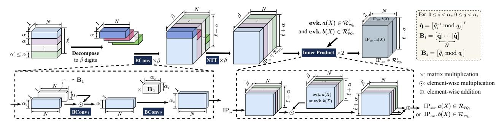

# B. CKKS Arithmetic

26: GMEM ← GMEM-Store ā

24: for  $i \in [0, 64), k \in [0, N_{13}), l \in [0, 64)$  do  $\mathbf{\bar{a}}[:,i,k,l] \leftarrow \text{NTT}_{N_{23}}(\mathbf{b}[:,i,k,l],\boldsymbol{\zeta}_{N_{23}})$ 

In this paper, we focus on RNS-CKKS [11], the widely adopted variant of CKKS that represents the large modulus Q (or  $Q_L$ ) using the Residue Number System (RNS) [17]. Specifically,  $Q_L$  is decomposed into L smaller moduli  $q_i$ , and RNS polynomials are defined over  $\mathcal{R}_{Q_L}$ . To efficiently support high-level operations, CKKS arithmetic can be categorized into the following three types based on data flow.

1) Poly-Wise Arithmetic: Poly-wise arithmetic includes NTT and automorphism (auto). Its four steps are: (a) columnwise NTTs on the data matrix, (b) element-wise twiddle factor multiplication (EWMult, also known as Hadamard product), (c) a matrix transpose to reorder the data, and (d) rowwise NTTs on the transposed matrix. In our approach, we recursively apply this 4-step method, as shown in Alg. 1. To optimize its execution on a GPU, we partition the computation into an *Inner-NTT* (NTT-Inner-part) and an *Outer-NTT* (NTT-Outer-part), which are defined as follows:

- *Inner-NTT*: The base case of the recursive NTT algorithm: a radix-64 NTT executed entirely on-chip, involving SMEM reads and writes.
- Outer-NTT: All other operations in NTT, excluding the

Fig. 2: Computation and data flow across the key steps (BConv, NTT, and IP) in KeySwitch.

*Inner-NTT*, comprise the EWMult, recursive calls on subproblems (*Residual NTTs*), the transpose, and GMEM/on-chip data transfers.

The base radix of 64 is selected to match the FP64-TCU's  $8 \times 4 \times 8$  Matrix Multiply-Accumulate (MMA) dimension, which facilitates an efficient  $8 \times 8$  decomposition. This provides a versatile foundation for handling the large polynomial degrees (N) common in FHE.

- 2) Element-Wise Arithmetic (EWArith): EWArith includes modular element-wise addition (EWAdd or  $\oplus$ ) and multiplication (EWMult or  $\odot$ ). In the NTT domain, polynomial addition and multiplication are reduced to EWAdd and EWMult.
- 3) Cross-Poly Arithmetic: Cross-poly arithmetic includes RNS base conversion (BConv) and inner product (IP): **BConv** transforms RNS polynomials between different RNS bases, enabling base extension. BConv must be performed in the non-NTT domain. RNS-CKKS adopts the fast BConv [6], which consists of two stages: EWMult (BConv1) and matrix multiplication (BConv2) (see Fig. 2). **IP** performs EWMult followed by accumulation across  $\beta$  digits, as shown in Fig. 2.

#### C. CKKS Operations

Given two ciphertexts at level  $\ell$ ,  $\operatorname{ct}_0$  and  $\operatorname{ct}_1$  in  $\mathcal{R}^2_{Q_\ell}$ , the following are the common CKKS evaluation operations (outputs are also in  $\mathcal{R}^2_{Q_\ell}$ ): **Homomorphic Addition (HAdd)** performs component-wise addition of two ciphertexts. **Homomorphic Multiplication (HMult)** multiplies two ciphertexts and relinearizes the result using Key-switching (KeySwitch). **Plaintext Multiplication (PMult)** multiplies a plaintext polynomial with a ciphertext. **Plaintext-Multiply-and-Add (PMAC)** combines PMult and HAdd to compute a linear combination of ciphertexts with plaintext coefficients. **Rotation (Rot)** applies a Frobenius automorphism to rotate packed slots in the ciphertext, followed by KeySwitch. **Rescaling (Rescale)** is needed after HMult and PMult to maintain fixed-point precision by reducing the modulus. To better manage precision loss, we adopt the composite scaling technique as proposed in [1], [25].

**Key-switching (KeySwitch)** is a procedure that converts a ciphertext from one secret key to another without decryption, which is essential for relinearizing ciphertexts after HMULT and restoring the key basis during Rots. We adopt the hybrid KeySwitch from [20] for its balance of computational efficiency and storage overhead. The process first decomposes the final component of the ciphertext in  $\mathcal{R}_{Q_\ell}$  into  $\beta$  digits.

A **ModUp** operation (involving NTT and BConv) then lifts these digits into the extended ring  $\mathcal{R}_{PQ_\ell}$ . The lifted values are multiplied with the evaluation key (**evk**) in  $\mathcal{R}_{PQ_\ell}^{2\times\beta}$  via an **IP**, and is then brought back to  $\mathcal{R}_{Q_\ell}^2$  using **ModDown**, which involves NTT and BConv. Finally, this output is added to the remaining components of the original ciphertext. Fig. 2 shows the key steps prior to ModDown. Due to its high computational complexity and frequent execution, KeySwitch constitutes the primary performance bottleneck at the CKKS operation level.

