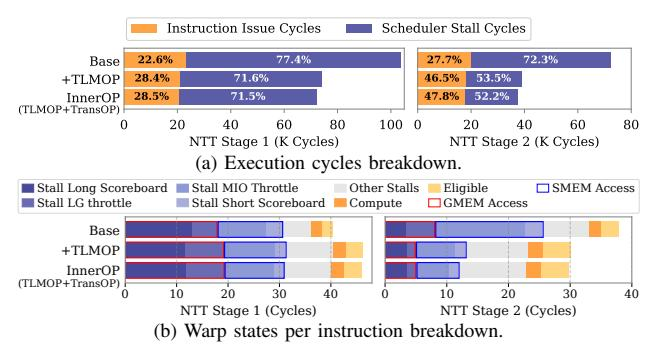
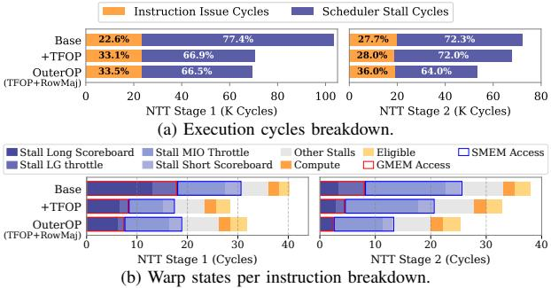
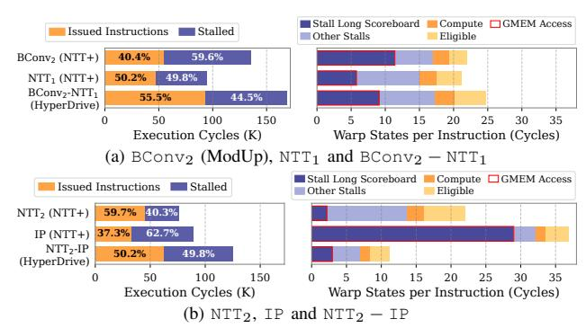

# B. Effectiveness of Optimization

1) NTT Optimization: Fig. 15 presents an ablation study illustrating the impact of cumulatively applying our optimizations on NTT performance. By progressively enabling TLMOP, TransOP, TFOP, and RowMaj, the NTT latency is

&lt;sup>‡ Tested with the pre-compiled library [24]. SetF (a built-in parameter) has the same *L* as SetE.

TABLE VIII: Comparison of CKKS workload execution times between HyperDrive and prior acceleration studies.

| Scheme (Params)        | Boot (ms) | HELR (ms) | ResNet20 (s) | ResNet32 (s) | ResNet56 (s) |
|---------------------------|--------------|--------------|-----------------|-----------------|-----------------|
| TensorFHE [21] (SetA)     | 850          | 730          | 40.68           | 66.19           | 117.3           |
| Neo [21] (SetA)           | 240          | 220          | 12.03           | 19.68           | 34.98           |
| WarpDrive [14] (SetC)     | 121          | -            | -               | -               | -               |
| WarpDrive [14] (SetD)     | -            | 113          | 5.88            | -               | -               |
| Cheddar ‡ [24] | 40.0         | 51.9         | 1.32            | -               | -               |
| HyperDrive (SetD)         | 33.54        | -            | -               | -               | -               |
| HyperDrive (SetE)         | 39.49        | 43.42        | 1.27            | 2.07            | 3.68            |
| HyperDrive (SetF)         | 38.91        | 42.12        | 1.21            | 1.99            | 3.55            |

&lt;sup>‡ Specific parameters are not disclosed.

TABLE IX: Performance of CKKS-Based ResNet110 Inference.

| Model     | HyperDrive (SetE) | HyperDrive (SetF) |
|-----------|-------------------|-------------------|
| ResNet110 | 7.04s             | 7.3s              |

reduced by 32.5%, 3.3%, 25.7%, and 19.7% at each respective step, culminating in a final latency of 50.2 ms for 36-limbs, representing an overall reduction of 61.1%. Concurrently, throughput is boosted by 53.3%, 3.7%, 52.7%, and 23.6%, reaching a peak of 932.6 KOPS, a total 3.0× performance improvement. Notably, TLMOP delivers the most substantial improvement, due to its significant reduction in SMEM access.

Fig. 16 compares the NTT execution time breakdown of HyperDrive against the INT8-TCU-based WarpDrive. Beyond the performance gains achieved in the Outer-NTT, Hyper-Drive delivers a substantial reduction in the MPA overhead. Specifically, the execution time dedicated to the MPA pipeline is reduced by 84%–91% relative to the baseline, ultimately accounting for a mere 5.0%–7.3% of the total NTT latency. This confirms that leveraging FP64-TCUs for the Inner-NTT effectively minimizes the multi-precision arithmetic costs, addressing a critical bottleneck in prior INT8-based solutions.

Fig. 17 illustrates the impact of our NTT optimizations on pipeline stalls. For the Inner-NTT, TLMOP cuts scheduler stall cycles in  $NTT_1$  and  $NTT_2$  by 44.2%, while adding TransOP increases the cumulative reduction to 50%. By lowering shared memory usage, TLMOP also boosts kernel occupancy from 55.0% and 62.3% to 76.8% and 77.0%, respectively. Although higher occupancy slightly increases total warp stalls per instruction, TLMOP cuts SMEM-related stalls by 33.2%, a figure that improves to 38.9% with TransOP.

Subsequently, we examine the *Outer-NTT* optimizations, with results presented in Fig. 18. Similarly, applying TFOP and RowMaj leads to a 27.4% reduction in scheduler stall cycles, which increases to a cumulative 39.3% after both are enabled. The corresponding reduction in the GMEM-related warp stall proportion starts at 50.9% from TFOP alone, and grows to a cumulative 59.5% with the addition of RowMaj.

2) Operation Level Optimization: To evaluate the COOP method, we conduct a comparative experiment between NTT+ and HyperDrive on the Keyswitch operation. As illustrated in Fig. 19, COOP boosts the overall performance by  $1.24\times$ . As shown in Fig. 20, (BConv2 - NTT1) kernel outperforms the separate execution by  $1.36\times$ . On the other hand, (NTT2 - IP) outperform its individual counterparts by  $1.32\times$ .

Fig. 15: Evaluation of NTT latency and throughput under incremental optimizations: TLMOP, TransOP, TFOP, RowMaj.

Fig. 16: Comparison of the latency breakdown for HyperDrive (FP64-TCU) NTT and reproduced WarpDrive (INT8-TCU) NTT ( $N=2^{16}$ , 1 or 2 sets of 36 limbs each).

Fig. 17: Comparison of execution cycles and warp state proportions of FP64-TCU-NTT  $(N=2^{16}, \#limbs=36)$  with base and incremental *Inner-NTT* optimizations.

Fig. 20 also details the scheduler and warp stall proportions of the relevant kernels. With COOP optimization, the fused ( $\mathbb{BConv}_2 - \mathbb{NTT}_1$ ) and ( $\mathbb{NTT}_2 - \mathbb{IP}$ ) kernels better balance memory access and computation than their standalone counterparts, leading to a marked decrease in GMEM-related warp stalls. While the ( $\mathbb{NTT}_2 - \mathbb{IP}$ ) kernel sees a dramatic drop in GMEM stalls, its scheduler stall reduction is modest, as it is constrained by the available parallelism.

Table X presents the register consumption and occupancy across various kernels. Compared to Base, NTT+ achieves higher occupancy by replacing FP64 fragments with 32-bit registers, reducing the per-thread footprint. While the NTT-IP kernel exhibits higher register usage due to intermediate accumulations for IP calculations, we forego lazy reduction to cap register usage at 72 per thread (35.3% occupancy). This fusion remains highly beneficial, as COOP significantly mitigates long scoreboard stalls during IP computation.

TABLE X: Registers and Occupancy of cross-poly and NTT  $kernels(N=2^{16}, L=32, \beta=2)$ 

|                                | NTT        | Stage 1    | BCONV      |               | NTT Stage 2 |            | IP         |            |
|--------------------------------|------------|------------|------------|---------------|-------------|------------|------------|------------|
| Metric                         | Base       | NTT+       | BConv      | BConv- NTT | Base        | NTT+       | IP         | NTT- IP |
| Reg. / Thread Occupancy (%) | 48 57.8 | 32 92.5 | 48 54.6 | 32 85.7    | 48 57.2  | 32 82.5 | 32 80.4 | 72 35.3 |

Fig. 18: Comparison of execution cycles and warp state proportions of FP64-TCU-NTT ( $N=2^{16}$ , #limbs=36) with base and incremental *Outer-NTT* optimizations.

Fig. 19: Comparison of the latency ( $\mu s$ ) breakdown of KeySwitch ( $N=2^{16},L=32,\beta=2$ ) for NTT+ and HyperDrive.

To individually analyze the contributions of NTT+, COOP, and CRPMAC, we break down bootstrap execution time across configurations (Fig. 21). Since NTT dominates Keyswitch and Rescale, the NTT+ setting alone delivers speedups over BASE: 1.49× for bootstrap, 1.63× for Keyswitch, and 1.89× for Rescale. HyperDrive-CORE builds on this, pushing the overall bootstrap performance by another 1.21×. This gain is driven by COOP, which accelerates Keyswitch and Rescale by a further 1.24× and 1.21×, respectively, and by CRPMAC, which reduces the significant overhead of redundant ciphertext reads compared to batched PMAC, leading to a 1.34× performance boost for CtS/StC EWArith. Cumulatively, HyperDrive-CORE's bootstrap is 1.85× faster than BASE. Furthermore, HyperDrive achieves 3.10× and 1.64× speedups over BASE-MDRS and BASE-EXT, respectively.

3) Future Scalability and Architectural Stability: The roadmap of flagship HPC GPU platforms (Table XI) reflects a continued trend of scaling FP64 performance to support high-precision scientific and cryptographic workloads [33], [34], [36], [38]. From an architectural perspective, the FP64 Tensor Core design has maintained a degree of consistency across recent generations. This architectural similarity allows HyperDrive to be executed on H100. Evaluation results on the H100 (Table XII) indicate that HyperDrive can benefit from the increased compute density of newer hardware. These observations suggest that the optimizations in HyperDrive remain applicable as HPC architectures continue to evolve.

TABLE XI: FP64 TCU Performance across GPU Generations.

| A100 (Ampere) | H100 (Hopper) | B200 (Blackwell) | Rubin    |
|---------------|---------------|------------------|----------|
| 19.5 [33]     | 67 [34]       | 37 [36]          | 200 [38] |

#### VIII. RELATED WORK

Numerous studies explored accelerating FHE on GPUs [4], [15], [23], [47]. [22] provided the first support for CKKS

Fig. 20: Comparison of kernel execution cycles, and warp states per instruction breakdown of cross-poly and NTT kernels ( $N = 2^{16}$ , L = 32,  $\beta = 2$ ) between NTT+ and HyperDrive.

Fig. 21: Bootstrap latency breakdown across configurations (Set-E).

TABLE XII: HyperDrive Performance (TFLOPS) Scaling on H100.

| Metric (Set-E)            | A100       | H100        |  |
|---------------------------|------------|-------------|--|
| NTT Throughput (32-bit)   | 932.6 KOPS | 1669.5 KOPS |  |
| KeySwitch Latency (SET-E) | 710.0 μs   | 414.0 μs    |  |
| Bootstrap Latency (SET-E) | 39.4 ms    | 24.7 ms     |  |

bootstrapping on GPUs. Others [45], [46] focused on accelerating programmable bootstrapping in TFHE and FHEW. Recent efforts shifted to specialized hardware, particularly TCUs. While TensorFHE [16] showcased TCU potential, they struggled with the overhead of frequent on-chip/off-chip data movement. WarpDrive [14] reduced memory stalls through NTT decomposition. Neo [21] transforms scalar and elementwise multiplications into matrix operations, effectively utilizing the TCU's FP components. The recent work, Cheddar [24], further innovates by introducing prime system and modular reduction optimizations, plus more extensive kernel fusion.

#### IX. CONCLUSION

This paper presents HyperDrive, a solution addressing multi-level memory bottlenecks in GPU-based FHE acceleration. HyperDrive combines fine-grained register access for *Inner-NTT*, a structured memory coalescing scheme for *Outer-NTT*, and operation-level optimizations like kernel cooptimization and ciphertext reuse to reduce memory traffic. Compared with representative solutions, WarpDrive and Neo, HyperDrive achieves speedups of  $2.0 \times$  to  $5.5 \times$  in NTT,  $2.2 \times$  to  $3.7 \times$  in HMult, and  $3.7 \times$  to  $8.2 \times$  in end-to-end workloads.

#### X. ACKNOWLEDGEMENTS

This work is supported in part by the National Cryptographic Science Foundation of China under Grant No. 2025NCSF02005.

