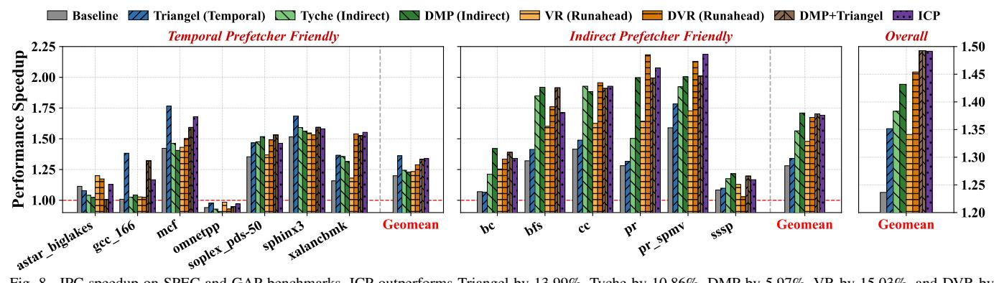
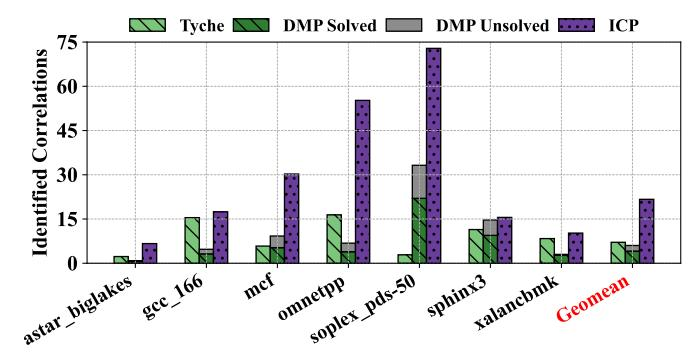
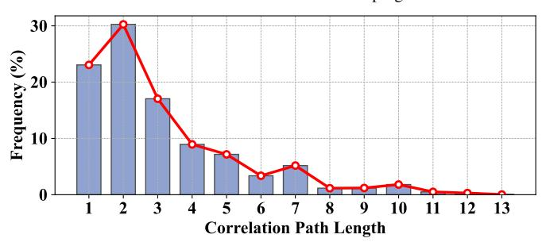
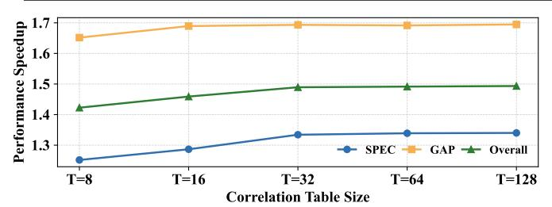
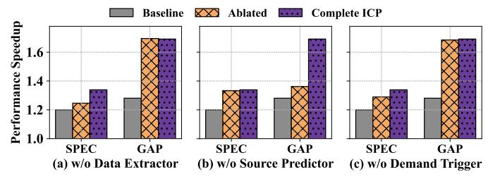

# *B. Performance Evaluation*

Figure 8 presents the performance speedup of ICP compared to other prefetchers designed for irregular memory access patterns. The evaluation spans two benchmark suites: SPEC, which features diverse and complex memory access patterns, and GAP, which primarily exhibits non-recurrent memory addresses but stable indirect instruction-level dependencies. The results demonstrate that ICP demonstrates consistent effectiveness across both SPEC and GAP benchmarks. ICP achieves a 25.51% performance improvement over the baseline system equipped only with basic prefetchers, outperforming Triangel by 13.99%, Tyche by 10.86%, DMP by 5.97%, VR by 15.03%, DVR by 3.74%, and performing on par with the combined DMP+Triangel configuration (25.61%).

Temporal prefetchers perform well on SPEC benchmarks but achieve poor performance across most workloads in the GAP benchmark suite. In particular, Triangel struggles to capture irregular memory accesses that exhibit instructionlevel repetition but lack explicit address-level repetition, which commonly occurs in GAP workloads (Section V-C).

Indirect prefetchers are ineffective for many workloads in the SPEC benchmarks. Specifically, they fail to identify and prefetch more complex irregular access patterns that extend beyond nested memory accesses in SPEC (Section V-D).

Runahead-based schemes deliver effective performance gains only when sufficient runahead time is available. Thus, VR fails to achieve strong performance across both SPEC and GAP. Although DVR improves over VR, it still struggles with workloads that exhibit complex dependency patterns, such as *mcf* and *gcc*. This limitation arises because DVR identifies dependency chains starting from striding loads, similar to indirect prefetchers. Moreover, a key drawback of runahead-based approaches is their substantial hardware complexity, as they require tight integration with the core pipeline (Section V-E).

Shortcomings of integrating indirect prefetchers with temporal prefetchers. Although integrating DMP with Triangel achieves a performance gain comparable to ICP, this

Fig. 8. IPC speedup on SPEC and GAP benchmarks. ICP outperforms Triangel by 13.99%, Tyche by 10.86%, DMP by 5.97%, VR by 15.03%, and DVR by 3.74%. While ICP attains performance comparable to the combined DMP+Triangel configuration, it provides several key advantages: 1) Substantially smaller storage overhead; 2) Lower hardware complexity; 3) Lower DRAM traffic; 4) Higher energy efficiency.

Fig. 9. Comparison of DRAM traffic. ICP introduces 6.84% less DRAM traffic than the DMP+Triangel hybrid configuration, 8.02% than the DVR.

hybrid configuration inherits the limitations of both prefetching designs. First, the hybrid design incurs significantly greater hardware overhead than ICP. Specifically, Triangel and other temporal prefetchers typically require substantially larger metadata storage (up to 1MB), along with additional metadata management strategies (e.g., 17.6KB in Triangel [7]). DMP additionally requires 912B storage. In contrast, ICP only requires 1.6 KB storage in total (Section V-I). Second, the hybrid design introduces significant hardware complexity. For instance, to support temporal prefetchers, the system must share the LLC space with the metadata table, necessitating partitioning schemes and specific metadata table access, insertion, and replacement strategies. Third, the hybrid design causes higher DRAM traffic than ICP. Figure 9 illustrates the DRAM traffic for each evaluated prefetcher configuration, normalized to the baseline. The results indicate that ICP introduces a 13.98% increase in DRAM traffic over the baseline system, compared to 9.04% for Triangel, 16.21% for DMP, and 20.82% for the DMP+Triangel combination. Consequently, DMP+Triangel incurs 6.84% more DRAM traffic than ICP. **Fourth**, the hybrid design is less energy efficient, consuming 4.9% more enegy than ICP (Section V-J).

## C. ICP vs Temporal Prefetchers: More Efficient Correlations

To demonstrate the efficiency of instruction-level correlations, Figure 10 compares the metadata reuse ratio between ICP and Triangel. In this comparison, the metadata in ICP corresponds to instruction-level correlations, whereas in Triangel it represents address-level correlations. The reuse ratio is computed as the total number of metadata accesses divided by the number of metadata insertions. A higher reuse ratio

Fig. 10. Comparison of metadata reuse ratio between ICP and Triangel. The reuse ratio in ICP is on the order of  $10^5$  times higher than that of Triangel.

indicates that the stored metadata is accessed more frequently after being recorded, reflecting higher metadata utilization.

The results show that the reuse ratio of metadata in ICP is on the order of 105 times higher than that of Triangel. Combined with Figure 1, our evaluations demonstrate that instruction-level correlations are substantially more efficient than address-level correlations in capturing irregular memory access patterns. Furthermore, the metadata reuse ratio of Triangel in GAP benchmarks is extremely low, indicating that memory addresses in these workloads are rarely re-accessed. This observation aligns with the performance results shown in Figure 8, where Triangel delivers limited benefits on GAP. In contrast, instruction-level correlations in them frequently reoccur, which validates ICP's strong performance in GAP.

## D. ICP vs Indirect Prefetchers: More General Correlations

To demonstrate the broader generality of ICP compared to indirect prefetchers, Figure 11 compares the total number of identified correlations across SPEC benchmarks, where Tyche and DMP exhibits limited effectiveness (Figure 8). The correlations identified by ICP represent general instruction-level relationships ( $PC_{\rm pre}, PC_{\rm suc}$ ). In contrast, the correlations identified by Tyche correspond to *IMA* patterns, while those in DMP correspond to *indirection pairs* [19], both of which are specifically designed to capture data-dependence relationships between two nested array access instructions.

We find that DMP's differential matching mechanism [19] can occasionally capture data dependencies between memory instructions beyond strictly nested array accesses, such

Fig. 11. Comparison of identified instruction correlations between ICP and indirect prefetcher. ICP can identify and handle more general correlations.

as data dependencies in array-of-pointers structures (e.g.,  $p[i] \to *p[i]$ ). However, not all such patterns can be effectively handled by DMP, since its prefetching mechanism is explicitly designed for nested array structures. To highlight this limitation, Figure 11 categorizes the indirection pairs identified by DMP into two groups: solved and unsolved, representing whether DMP can successfully prefetch for them.

Our results show that ICP identifies substantially more correlations than indirect prefetchers across the SPEC benchmarks, with an average of 22 correlations, compared to 7 for Tyche and 6 for DMP. Furthermore, nearly one-third (2 out 6) of the indirection pairs identified by DMP are ineffective. These findings underscore ICP's effectiveness in handling complex and diverse irregular memory access patterns.

## E. ICP vs Runahead: Lower Hardware Complexity

Table III compares ICP and DVR in terms of integration with CPU core and memory hierarchy. Overall, ICP achieves substantially lower complexity, whereas DVR requires tight coupling with the CPU pipeline and thread support.

**Thread requirement.** ICP does not require any additional hardware thread contexts. In contrast, DVR relies on a dedicated subthread to execute the decoupled runahead/discovery stream, introducing extra control for thread management.

**Decode/execute modifications.** ICP incurs no changes to the core's decode and execute stages. DVR, however, requires a mode-aware decode path (Discovery vs. DVR execution) and execution support for DVR-generated vectorized operations.

Commit requirements. ICP only needs committed instruction information with loose timing. This enables a clean decoupling via an asynchronous buffer between the commit stage and ICP. DVR instead must ensure that DVR-generated operations do not update architectural state and must additionally provide termination/recovery logic when DVR stops.

**Memory interface.** ICP uses a standard cache prefetcher interface. DVR, however, introduces additional throttling mechanisms to detect memory pressure and regulate the potentially high bandwidth demand generated by vectorized runahead.

## F. Analysis of ICP Characteristics

In this section, we examine two key characteristics of ICP: the **instruction correlation learning rate**, which reflects the time required to detect instruction correlations, and **the length** 

Fig. 12. The learning rate of ICP ICP completes the identification of all instruction correlations within less than 10% of total program execution time.

Fig. 13. The dependency path length distribution. ICP completes the majority of its prefetching process within only a few cycles.

of the derived dependency paths, which represents the total number of instructions needed to compute the path from  $PC_{pre}$  to  $PC_{suc}$ . A higher learning rate allows ICP to identify instruction correlations and initiate prefetching more quickly. Conversely, a shorter dependency path length enables ICP to compute the address of  $PC_{suc}$  more efficiently.

- 1) Instruction Correlation Learning Rate: Figure 12 shows the detection coverage, defined as the ratio of covered correlations to the total number of identified correlations at the end of the programs, plotted against the program execution time normalized to the total execution time for ICP. The results demonstrate that ICP completes the identification of all instruction correlations within less than 10% of total program execution time across both SPEC and GAP. Moreover, most correlations in SPEC are detected within the first 4% of execution, while the majority in GAP are identified in under 1%. By comparing the SPEC and GAP results, we find that the learning time increases with the complexity of memory access patterns. This is because instruction correlations may vary across different execution phases. ICP can only observe and record a correlation when the corresponding execution phase is encountered for the first time.
- 2) Dependency Path Length: Figure 13 shows the distribution of dependency path lengths across the SPEC and GAP benchmarks. The results reveal that most dependency paths are short: over 70% of the identified paths have a length

 $\begin{tabular}{l} TABLE~III\\ INTEGRATION~COMPLEXITY~COMPARISON~BETWEEN~ICP~AND~RUNAHEAD~SCHEMES.\\ \end{tabular}$ 

| Integration aspect                                                | ICP (this work)      | DVR                                                                                                  |  |  |
|-------------------------------------------------------------------|----------------------|------------------------------------------------------------------------------------------------------|--|--|
| Thread requirement                                                | Not required.        | Required.                                                                                            |  |  |
| Decode                                                            | No changes.          | Mode-aware (Discovery or DVR) decode path.                                                           |  |  |
| Execute                                                           | No changes.          | Support for DVR-generated vectorized address-generation ops.                                         |  |  |
| Commit                                                            | Asynchronous Buffer. | Ensure DVR-generated ops not update architectural state Termination/recovery logic When DVR stops |  |  |
| <b>Memory interface</b> Demand training and cache fill interface. |                      | Throttling mechanisms tied to memory pressure.                                                       |  |  |

Fig. 14. Performance impact of Correlation Table size.

Fig. 15. Ablation study of ICP.

of no more than three instructions. This indicates that the majority of the speculation process initiated by ICP (i.e., the time from receiving cache responses from  $PC_{pre}$  to issuing prefetch requests for  $PC_{suc}$ ) requires the execution of fewer than 3 instructions. Additionally, the longest dependency path identified by ICP consists of only 13 instructions. Since ICP handles only basic arithmetic and logical operations (Section IV-D) and excludes all others, the speculative execution process typically takes between 1 to 3 cycles, with a maximum of 13 cycles. Given that cache prefetchers operate off the core's critical execution path and typical memory access latencies span hundreds of cycles, this additional latency is negligible for prefetching timeliness and well within acceptable bounds.

3) Correlation Table Size: Figure 14 evaluates the performance impact of Correlation Table size. We vary the number of entries T from 8 to 128. The results show that performance improves as the table size increases from T=8 to T=32, as a larger table can store more instruction-level correlations discovered during execution. However, increasing the table size further to T=128 yields only marginal improvement, demonstrating clear diminishing returns. The results highlight that the number of active instruction correlations within a program phase is relatively small, and a lighweight Correlation Table is sufficient to store them.

#### G. Ablation Study

**Impact of Data Extractor.** Figure 15(a) shows performance on SPEC degrades noticeably when Data Extractor is removed. Data Extractor extracts the accessed value from prefetched

cache lines by predicting the offset. Without it, ICP must consider all possible offsets within the cache line to extract values. This behavior significantly increases the number of unnecessary prefetches and leads to severe cache pollution. In contrast,  $PC_{pre}$  in GAP often accesses multiple elements within a line with a fixed stride. Consequently, even when all values in the line are extracted, many of them remain useful.

Impact of Source Predictor. Figure 15(b) shows Source Predictor has a particular impact on GAP, whose indirect patterns often involve dependency chains where intermediate operations consume two operands, with one operand being a base array value that remains stable but lies outside the chain. Without Source Predictor, ICP cannot supply these external operands during speculation.

Impact of Demand-Trigger Execution. Figure 15(c) shows that demand-triggered execution plays a secondary role compared to prefetch-triggered execution. The prefetch-triggered execution contributes about 9.02% performance gain over the baseline for SPEC, whereas demand-triggered execution alone contributes about 4.92% for SPEC. The performance benefits enabled by demand-triggered execution stem from two main reasons. First, although the dependency chain from  $PC_{pre}$  to  $PC_{suc}$  is short (Figure 13), the two instructions can be separated by a large number of control-flow dependent instructions, which may stall issue/execute due to resource contention (e.g., back-end pressure) and significantly extend the effective time gap between  $PC_{pre}$  and  $PC_{suc}$ . In gcc, we observe cases where  $PC_{suc}$  executes only after several thousand cycles following  $PC_{pre}$ . Second, ICP executes the dependency chain upon receiving the cache-line response of  $PC_{pre}$ , which is still earlier than when the core can execute the  $PC_{\text{suc}}$ . When the core is blocked from issuing subsequent instructions due to resource contention, demand-triggered execution helps improve the prefetching timeliness.

