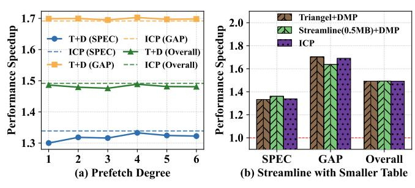

# H. Sensitivity Study for Temporal Prefetcher

**Sensitivity to prefetch degree.** Figure 16(a) studies the sensitivity of DMP+Triangel to the prefetch degree of Triangel. We vary the degree from 1 to 6. The results show that performance remains relatively stable across different degrees, indicating that the hybrid design is not highly sensitive to this parameter. Among the evaluated settings, a degree of 4 achieves the best overall performance, and we use this configuration in our experiments.

**Smaller metadata table.** Figure 16(b) considers the state-of-the-art temporal prefetcher Streamline with a 0.5MB metadata table. Results show that this setup achieves better per-

Fig. 16. Sensitivity study for temporal prefetcher degree and table size.

formance on SPEC, due to Streamline's efficient metadata compression, while it degrades on GAP. The degradation also stems from the compressed metadata, which binds multiple consecutive metadata targets with a single lookup address. GAP exhibits few memory-address repetition, making generating multiple prefetches within one lookup less reliable and issue more useless prefetches. Moreover, even when the metadata storage is reduced to 0.5 MB, the overhead remains several orders of magnitude larger than that of ICP.

## I. Storage Overhead

TABLE IV STORAGE OVERHEAD OF ICP.

| Structure               | Entries                              | Storage |
|-------------------------|--------------------------------------|---------|
| PC Selector&Classifier  | $8 \times 3.875B + 64 \times 1B$     | 95B     |
| PC Correlation Detector | $128 \times 3.75B + 32 \times 1.75B$ | 536B    |
| Correlation Table       | $64 \times 7B$                       | 448B    |
| Data Extractor          | $32 \times 392B$                     | 150B    |
| Source Predictor        | $8 \times 9.25B$                     | 74B     |
| Lightweight Calculator  | N/A                                  | 24B     |
| MSHR Extension          | N/A                                  | 160B    |
| Commit FIFO Buffer      | $8 \times 16B$                       | 128B    |
| ROB Extension           | $288 \times 2B$                      | 576B    |
| Total                   | N/A                                  | 2.1KB   |

Table IV shows ICP's storage overhead. Considering not all ROB implementations explicitly retain source register, we conservatively include the worst-case cost of augmenting the ROB with source register fields. Assuming a 288-entry ROB and an 8-bit register tag, storing two source register tags per entry incurs an additional  $288 \times 2 \times 8 = 4,608$  bits ( $\approx 576$ B) of storage overhead. Two source register fields are sufficient because ICP only needs to model the basic operations supported by the Lightweight Calculator. These operations are at most binary and therefore require no more than two source operands. ICP's SRAM overhead sums to 2.1 KB (17,200 bits) across all structures.

Since 6T SRAM bitcell stores one bit using six transistors, this corresponds to  $17,200 \times 6 = 103,200$  bitcell transistors before accounting for any periphery. To express this in a technology-independent metric, we adopt the common gate-equivalent convention that uses a 2-input NAND (NAND2) [1] as the reference unit. As a result, the bitcells alone map to  $103,200/4 \approx 25.8 \text{k}$  NAND2 gates. For small SRAM instances, decoders, wordline drivers, and sense amplifiers contribute non-trivial overhead. Therefore, we conservatively scale the bitcell-only estimate by  $1.3-1.8 \times$  to account for SRAM periphery, yielding  $\sim 33.5 \text{k}-46.4 \text{k}$  NAND2. Finally,

adding the remaining non-SRAM logic (e.g., set-associative tag-compare/mux/control and the Lightweight Calculator datapath) results in an overall ICP budget of  $\sim$ 40k–53k NAND2, which corresponds to a 6T-SRAM storage-equivalent capacity of  $(40k-53k) \times 4/6/8 \approx 3.3$ –4.3 KB.

## J. Energy Overhead

We evaluate ICP's energy overhead on memory hierarchy level. Specifically, we use CACTI [38] to model the energy consumption of the on-chip memory hierarchy under 22 nm. For DRAM accesses, we follow the methodology of Triangel [7], assuming the energy cost of a DRAM access is 25× that of an LLC access. The results show that ICP increases energy consumption by 2.4%, 3.7%, 1.8%, and 7.3% compared to Triangel, Tyche, DMP, and VR, respectively. In contrast, ICP reduces energy consumption by 6.0% and 4.9% compared to DVR and the DMP+Triangel, respectively.

We further evaluate energy overhead introduced by ICP's internal components. The dominant dynamic energy sources within ICP come from (1) accesses to its tables (e.g., Correlation Table) and (2) activations of Lightweight Calculator. To model the per-activation energy of Lightweight Calculator, we follow widely used energy reference points reported by Horowitz [24], which indicate that a simple integer add operation costs 0.1 pJ. Accordingly, we model one Lightweight Calculator operation as 0.1 pJ per activation. For table accesses, [24] also reports that SRAM/cache accesses are at the pJ-level (e.g.,  $\sim 10 \,\mathrm{pJ}$  for a 64-bit access to an 8 KB structure). Since ICP's tables are much smaller than KB-scale caches, we bound one table access as 1 pJ. Using measured event counts, we find that internal energy overhead of ICP is negligible, amounting to 0.24% of the memory-hierarchy energy, and therefore does not materially affect overall energy conclusions.

