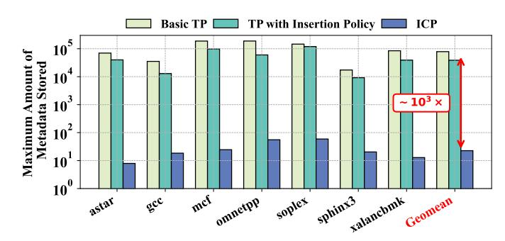

# I. INTRODUCTION

Cache prefetching, a long-standing technique for mitigating the "memory wall" problem [56], has been extensively explored as a means to improve processor performance. The fundamental challenge lies in efficiently predicting the diverse and complex memory access patterns that occur across different applications. To address this challenge, researchers have proposed various prefetching techniques tailored to distinct classes of access patterns [36], [21], [8], [59], [43], [34]. These prefetchers include stream prefetchers [30], [23], [25], stride prefetchers [9], [18], [33], spatial prefetchers [48], [32], [37], [41], [11], [13], [44], [47], [26], [29], indirect prefetchers [60], [28], [5], [31], [15], [17], [22], and temporal prefetchers [27], [42], [55], [51], [54], [10].

Among various prefetchers, **temporal prefetchers** represent a promising technique for addressing *irregular memory accesses*, where conventional prefetchers (e.g., stream, stride, spatial prefetchers) fall short. The core idea behind temporal prefetchers is to record previously accessed memory addresses and their correlated successor addresses as *metadata*. When a recorded address reappears during execution, prefetchers use this metadata to prefetch its correlated successor addresses.

Fig. 1. Comparison of the maximum amount of metadata stored by ICP and temporal prefetchers (TP). ICP reduces the metadata overhead by three orders of magnitude.

Practically, the effectiveness of temporal prefetchers depends on two factors: 1) whether memory addresses involved in irregular access patterns exhibit temporal recurrence; 2) if such recurrence exists, how many of those addresses can be retained in table until their next appearance. These two factors fundamentally constrain the capability of temporal prefetchers.

Factor 1. Not all irregular memory accesses exhibit tem**poral recurrence.** Currently, two classes of irregular memory accesses are commonly found in programs: pointer accesses and indirect memory accesses. Our evaluation shows that while temporal prefetchers are generally effective for pointer-based accesses, they fail to capture most indirect memory accesses1. Specifically, we evaluate a state-of-the-art temporal prefetcher on irregular sparse workloads dominated by indirect memory accesses [19], [20]. Our results show that it achieves only a 5.9% performance improvement over the baseline, whereas an indirect prefetcher yields a substantially higher 42.9% improvement. Furthermore, we observe that the metadata stored by temporal prefetchers exhibit a low reuse ratio (105 less than our solution) when processing indirect memory accesses. These observations all highlight their inherent limitation when memory addresses show weak or no temporal recurrence.

Factor 2. Temporal prefetchers suffer from significant storage overhead. Although temporal prefetchers effectively handle certain irregular memory access patterns (e.g., pointerbased accesses), they suffer from substantial metadata storage requirements, which are inherently difficult to reduce. This limitation arises because temporal prefetchers must record a large number of memory address correlations to maintain

&lt;sup>1Detailed experimental results are presented in Section V.

sufficient coverage of recurring access patterns. To illustrate this challenge, we evaluate the maximum metadata storage required by temporal prefetchers on irregular SPEC CPU benchmarks. Two representative classes of temporal prefetchers are considered: *basic temporal prefetchers* (e.g., Triage [54]) and *enhanced temporal prefetchers* that incorporate non-recurrence metadata filtering strategies (e.g., Triangel [7]). As shown in Figure 1, both designs require metadata storage of the same order of magnitude, demonstrating that the large storage footprint is a fundamental limitation of temporal prefetching rather than an artifact of a specific design.

In response to the fundamental limitations of temporal prefetchers, we propose ICP, a new prefetching technique that exploits general instruction-level correlations rather than memory address correlations to handle irregular memory accesses. The core insight of ICP is that, although many irregular memory accesses lack temporal recurrence at the address level, the instructions generating these accesses often recur with consistent patterns during program execution. For example, consider two dependent load instructions, *PC*i :ld a1, 0(a0) → *PC*j :ld a2, 0(a1). Here, *PC*i issues irregular memory accesses. While the specific memory addresses accessed by *PC*i and *PC*j may never repeat, their data-dependency relationship a1 remains stable across dynamic instances. By learning such persistent instruction correlations, ICP can speculatively compute and prefetch the memory addresses of irregular instructions using the execution results of their correlated predecessors.

ICP not only handles irregular memory accesses where temporal prefetchers fall short but also significantly reduces metadata storage requirements. As shown in Figure 1, ICP's metadata footprint is over three orders of magnitude smaller, i.e., < 0.1% of that required by temporal prefetchers. This efficiency stems from the fact that a single memory-access instruction may generate a vast number of dynamic requests. Consequently, one instruction-level correlation in ICP implicitly captures thousands or even millions of memory address correlations. By storing correlations at the instruction level rather than the address level, ICP achieves dramatically lower storage demands while maintaining comprehensive coverage of memory access patterns.

ICP is a *hardware-based* prefetching mechanism for irregular memory accesses. It consists of two primary components: PC Correlation Detection and Prefetching with PC Correlations. The PC Correlation Detection stage performs two key tasks: (1) it identifies memory instructions that are likely to generate irregular memory accesses (denoted as *PC*suc) and their corresponding predecessor instructions that produce the required input values (denoted as *PC*pre); and (2) it constructs the data-dependency paths starting from each *PC*pre and ending at its dependent *PC*suc: (*PC*pre, *PC*suc), and records them in the table. The Prefetching with PC Correlations stage then leverages cache line responses associated with *PC*pre to speculatively compute memory addresses and prefetch data for the corresponding *PC*suc. To enhance both prefetch coverage and timeliness, ICP simultaneously exploits cache lines fetched by demand and prefetch requests to drive the process.

Improvement over other prefetching solutions exploiting speculative instruction execution. ICP improves upon prior works by providing stronger generality for irregular memory accesses while maintaining moderate hardware complexity. This improvement stems from two key aspects of its design: (i) how it defines the speculated instruction chains and (ii) how it performs speculative execution to generate prefetches.

Definition of speculated instruction chains. State-of-theart *indirect prefetchers* (e.g., Tyche [57] and DMP [19]) and *runahead execution* (e.g., VR [39] and DVR [40]) typically initiate chain discovery at a *striding load* and define the speculated chain as the set of dependent loads reachable from that striding load. This design choice is convenient, but also restrictive: being dependent on a striding load is neither a necessary condition nor a sufficient condition for a load to be an irregular. In contrast, ICP directly treats irregular memory instructions as prefetching targets and does not constrain the starting point of dependency discovery to striding accesses.

Mechanisms for speculative execution. *Indirect prefetchers* typically rely on the ability of a stride prefetcher to predict the full future address of striding loads. This allows them to obtain the data accessed by the striding load from prefetched cache lines and use it to speculatively execute the chain. As a result, their speculative execution model is tightly coupled to stride-driven instruction chains. *Runahead executions*, on the other hand, speculatively execute the dependency chains by leveraging spare core resources or another subthread. However, this capability comes at the cost of substantial hardware complexity, as it requires intrusive support in the CPU core to manage speculative execution. In contrast, ICP exploits cache-line responses associated with any existing prefetcher or demand request to trigger speculative execution, improving generality without incurring runahead-level complexity.

ICP outperforms the state-of-the-art temporal prefetcher Triangel [7] (14.0% performance speedup) and indirect prefetcher DMP [19] (6.0% performance speedup) across both irregular SPEC CPU benchmarks [2], which represent recurring irregular memory access patterns and have been evaluated in previous temporal prefetching works [7], [55], [54], [53], and GAP benchmarks [12], which primarily feature nonrecurring indirect memory accesses and are widely used in indirect prefetching studies [19], [20], [28], [50]. ICP achieves these performance gains with only 449 B metadata storage and 1.7 KB control state, significantly lower than temporal prefetchers, which require up to 1 MB of metadata storage and 17.6 KB control state. Furthermore, our evaluations demonstrate that ICP achieves a substantially higher correlation reuse ratio than temporal prefetchers and exhibits greater correlation generality than indirect prefetchers.

