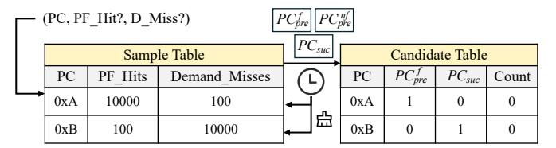
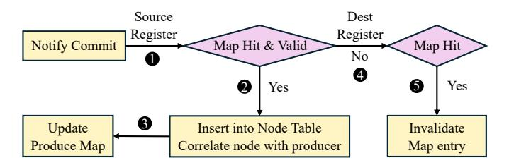

# III. OVERVIEW

In response to the motivations, we propose **ICP**, a new hardware prefetching scheme that records observed memory

Fig. 3. ICP Overview.

instruction correlations in a lightweight table and leverages this information to prefetch irregular memory accesses. Figure 3 illustrates the primary structures and workflow of ICP. The design includes two stages: *PC correlation detection* and *prefetching with PC correlations*.

#### A. PC Correlation Detection

In this stage, we identify correlated memory-instruction pairs ( $PC_{pre}$ ,  $PC_{suc}$ ), where  $PC_{suc}$  issues irregular memory accesses. To facilitate this process, we introduce the following hardware components:

**PC Selector.** This component is used to select PCs that are likely candidates for either  $PC_{pre}$  or  $PC_{suc}$  (Step ①).

**PC Classifier.** This component further classifies all  $PC_{\text{pre}}$ instructions into two categories: basic-prefetcher-friendly and non-basic-prefetcher-friendly. The rationale behind this classification is that the memory data of  $PC_{pre}$  can be obtained either from prefetch requests issued by basic hardware prefetchers or from demand accesses. Although both types of data can be used to execute the dependency path toward  $PC_{\text{suc}}$ , they differ in their impact on prefetching timeliness and accuracy. Data obtained from prefetch requests can initiate the execution of the dependency path earlier than demand accesses, thereby improving prefetching timeliness for  $PC_{suc}$ . However, inaccurate data generated by basic hardware prefetchers may ultimately lead to incorrect prefetches for  $PC_{\text{suc}}$ . To balance timeliness and accuracy, ICP adopts two distinct prefetching schemes for these categories: (1) if  $PC_{pre}$  can be effectively handled by basic prefetchers, its prefetched data is primarily used to compute the memory address of  $PC_{suc}$ , improving prefetching timeliness; and (2) if  $PC_{pre}$  cannot be effectively handled by basic prefetchers, ICP relies on the data from  $PC_{pre}$ 's demand accesses to prefetch for  $PC_{suc}$ , reducing inaccurate prefetches.

**PC** Correlation Detector. This component leverages the candidate sets of  $PC_{\text{pre}}$  and  $PC_{\text{suc}}$  provided by PC Selector and PC Classifier (Step ②) to identify correlated pairs ( $PC_{\text{pre}}, PC_{\text{suc}}$ ). To establish correlations between  $PC_{\text{pre}}$  and its potential  $PC_{\text{suc}}$ , the PC Correlation Detector monitors committed instructions and employs a simplified O(N) register renaming mechanism to construct data-dependency trees

rooted at  $PC_{pre}$  that extend to other  $PC_{suc}$  instructions. Each path from  $PC_{pre}$  to  $PC_{suc}$  defines a correlated instruction pair ( $PC_{pre}$ ,  $PC_{suc}$ ), consisting of a  $PC_{pre}$  node, a  $PC_{suc}$  node, and **intermediate instruction nodes** that form the dependency chain between them.

**PC** Correlation Table. This component records all identified correlated instruction pairs (Step ③) and serves as the interface between the *PC correlation detection* module and the *prefetching with PC correlation* module. Compared to the metadata table used in temporal prefetching, the PC Correlation Table introduces significantly lower storage overhead (less than 1 KB), as it only needs to record instruction-level correlations rather than memory address correlations.

## B. Prefetching with PC Correlations

ICP monitors cache line responses (Step 1, dotted in blue). When  $PC_{\text{pre}}$  is re-executed after its correlations have been identified, the correlations stored in the PC Correlation Table are used to prefetch the upcoming memory accesses of  $PC_{\text{suc}}$ . To facilitate the prefetching process, we develop three hardware components: the Data Extractor, the Lightweight Calculator, and the Source Predictor.

**Data Extractor.** At Step ②, if the data response corresponds to a  $PC_{pre}$  entry recorded in the table, ICP employs Data Extractor to retrieve data accessed by  $PC_{pre}$  from the returned cache line. If  $PC_{pre}$  is identified as basic-prefetcherfriendly, ICP uses Data Extractor to predict the data within the cache line fetched by both prefetcher and demand accesses. Otherwise, ICP extracts data *only* from cache lines fetched by demand accesses.

**Lightweight Calculator and Source Predictor.** At Step  $\@3$ , the Lightweight Calculator uses the data retrieved by Data Extractor to speculatively execute the instruction dependent on  $PC_{\text{pre}}$ . The dependent instruction may be an intermediate instruction along the dependency path or the  $PC_{\text{suc}}$  instruction itself. The Lightweight Calculator recursively executes the chained dependent instructions until the speculative execution reaches  $PC_{\text{suc}}$ . When source registers fall outside the identified dependency path, the Source Predictor predicts their corresponding values. Finally, at Step  $\@3$ , ICP computes the target memory address of  $PC_{\text{suc}}$  and generates the corresponding prefetch request. When the data of  $PC_{\text{pre}}$  is obtained from a demand-fetched line, the prefetch request is forwarded to the LLC to enhance prefetch timeliness. Otherwise, ICP issues the prefetch request to the current cache level.

## IV. HARDWARE DESIGN

#### A. PC Selector and Classifier

The PC Selector and PC Classifier record performance counters of memory instructions to construct the  $PC_{\text{pre}}^{\text{f}}$  ( $PC_{\text{pre}}$  and basic-prefetcher-friendly) candidate set,  $PC_{\text{pre}}^{\text{nf}}$  ( $PC_{\text{pre}}$  and non-basic-prefetcher-friendly) candidate set, and the  $PC_{\text{suc}}$  candidate set. For each demand request arriving at ICP, three types of information are extracted: its PC address, whether it results in a prefetch hit, and whether it results in a demand miss. As shown in Figure 4, ICP maintains a Sample Table to

Fig. 4. PC Selector and Classifier.

track the performance counters. The Sample Table is indexed by the PC address of memory access instructions. When a PC experiences a prefetch hit or a demand miss, ICP increments the corresponding counter value in the Sample Table. To retain frequently accessed PCs, the Sample Table is managed using an LRU replacement policy. Due to distinct memory access patterns at different cache levels, ICP maintains separate instances of the Sample Table for the L1 and L2 caches.

The Sample Table periodically exports the  $PC_{pre}$  and  $PC_{suc}$  candidates for subsequent uses. ICP defines an epoch e as the number of times the Sample Table has been accessed. At the end of each epoch, ICP ranks all PCs based on their demand miss counts and evaluates the prefetching coverage of each PC. Specifically, ICP determines whether a PC qualifies as a  $PC_{suc}$  candidate using Equation 1:

$$S_{suc} = \text{Top}_n(\{PC_i \mid \text{misses}(PC_i) \ge \theta_{\text{miss}}\}) \tag{1}$$

The formula selects n PCs with the highest demand miss counts as  $PC_{\text{suc}}$  candidates, where n is a design parameter controlled by the system designer. The rationale behind Equation 1 is that, in a system already equipped with basic prefetchers, PCs that still incur the most cache misses are likely not well served by those prefetchers and therefore are more likely to correspond to irregular memory accesses. ICP adjusts both the epoch length and the Sample Table size to ensure that the collected PCs accumulate sufficient demand misses for accurate classification. Specifically, prolonging the epoch length allows the Sample Table to gather enough statistical information, while restricting the Sample Table size ensures that PCs with fewer demand misses are gradually evicted and replaced by more memory-intensive ones. Additionally, ICP uses condition misses $(PC_i) \geq \theta_{\text{miss}}$  to filter out PCs with insignificant misses.

Then, ICP uses Equation 2 to determine whether a PC is selected as a  $PC_{\text{pre}}^{\text{f}}$ :

$$\begin{cases} \operatorname{Cov}(PC_i) = \frac{\operatorname{PF\_Hits}(PC_i)}{\operatorname{PF\_Hits}(PC_i) + \operatorname{Demand\_Misses}(PC_i)}, \\ \mathcal{S}_{pre}^f = \operatorname{Top}_n(\{PC_i \mid \operatorname{Cov}(PC_i) \geq \theta_{\operatorname{cov}}\}) \end{cases}$$
(2)

The formula selects n PCs with the highest prefetching coverage as  $PC_{\text{pre}}^{\text{f}}$  candidates. They could serve the potential data producer for  $PC_{\text{suc}}$ . Similar to Equation 1, ICP applies a threshold parameter  $\theta_{\text{cov}}$  to filter out PCs with low prefetching coverage. In our experiments, we set  $\theta_{\text{cov}} = 0.1$ .

ICP leverages an important observation to construct the candidate set  $\mathcal{S}_{pre}^{nf}$ : a  $PC_{suc}$  can also serve as a  $PC_{pre}$ . Consider the nested pointer access pattern \*(\*(\*p)). There are

Fig. 5. Process of dependency tree construction.

three memory instructions,  $PC_1$ ,  $PC_2$ , and  $PC_3$ , that access the pointers at p, \*p, and \*(\*p), respectively.  $PC_1$  is regular because it originates from an array of pointer structures, and therefore serves as the  $PC_{\rm pre}$  for  $PC_2$ .  $PC_2$ , which exhibits irregular behavior, acts as a  $PC_{\rm suc}$  dependent on  $PC_1$ . Furthermore,  $PC_2$  can also serve as  $PC_{\rm pre}$  for the subsequent instruction  $PC_3$ . Driven by this insight, ICP directly reuses the set of  $\mathcal{S}_{suc}$  as  $\mathcal{S}_{pre}^{nf}$ , as defined in Equation 3:

$$S_{pre}^{nf} = S_{suc} \tag{3}$$

Then, as shown in Figure 4, ICP employs another structure, Candidate Table (duplicated for L1 and L2 cache like Sample Table), to store identified  $\mathcal{S}_{suc}$ ,  $\mathcal{S}_{pre}^f$ , and  $\mathcal{S}_{pre}^{nf}$ . Since the content of  $\mathcal{S}_{suc}$  is identical to that of  $\mathcal{S}_{pre}^{nf}$ , ICP reduces the storage overhead by compressing Candidate Table and using a single field to indicate whether a PC entry belongs to  $PC_{pre}^{nf}$  or  $PC_{suc}$ . The Candidate Table serves as the interface between PC Selector/Classifier and PC Correlation Detector. After storing these three sets into Candidate Table, ICP clears Sample Table and continues searching for potential  $PC_{pre}$  and  $PC_{suc}$  instructions in the next execution phase.

#### B. PC Correlation Detector

The PC Correlation Detector leverages the candidate sets stored in Candidate Table to identify correlated instruction pairs ( $PC_{\rm pre}$ ,  $PC_{\rm suc}$ ). To discover these correlations, ICP constructs data-dependency trees rooted at each  $PC_{\rm pre}$ , which expands toward its dependent  $PC_{\rm suc}$  instructions. Each path from a  $PC_{\rm pre}$  node to a  $PC_{\rm suc}$  node represents a correlated instruction pair ( $PC_{\rm pre}$ ,  $PC_{\rm suc}$ ).

1) Dependency Tree Construction Triggering: The PC Correlation Detector leverages the committed instruction information from the ROB to construct dependency trees. The construction process is triggered whenever the PC of a committed instruction belongs to either  $PC_{\rm pre}^{\rm f}$  or  $PC_{\rm pre}^{\rm nf}$ . Once a dependency tree construction is initiated, ICP temporarily blocks subsequent construction requests, even if they correspond to another  $PC_{\rm pre}$ . This blocking mechanism prevents resource contention. To avoid a scenario where a single  $PC_{\rm pre}$  monopolizes hardware resources and causes deadlock, ICP introduces a Count field in the Candidate Table. This field records the number of attempts made to construct the dependency tree for the corresponding PC. When the count exceeds a predefined threshold, the PC Correlation Detector ceases further construction attempts for that PC.

Fig. 6. Example of dependency tree construction.

2) Dependency Tree Construction: As shown in Figure 6, ICP employs two hardware structures: the Node Table and the Produce Map, to construct the dependency tree rooted at the triggered  $PC_{pre}$ . The **Node Table** primarily records correlations between different PCs within the dependency tree (through the ID and Parent fields) and stores auxiliary information that enables reconstruction of the instructionlevel dependency path from  $PC_{pre}$  to  $PC_{suc}$  (through the PC, CInst, and Attr fields). By hitchhiking on the ROB commit process, ICP adopts the core concept of register renaming and implements a simplified O(N) register renaming scheme to efficiently track data dependencies among committed instructions during dependency tree construction. The **Produce** Map maintains the mapping between physical registers and their producer PC nodes. Specifically, it tracks which PC node last produced the value for each physical register (PR Tag), represented by the ID field in the Node Table, and uses the Valid field to indicate whether that mapping is currently valid. We now describe the process of dependency tree construction as follows:

First, upon triggering dependency tree construction, ICP initializes the Node Table and Produce Map using the committed instruction at the head of the ROB. ICP allocates a new entry in the Node Table with ID = 0 and records its compressed instruction format (detailed in Section IV-C), PC address, and attribute, which indicates whether the PC belongs to  $PC_{\rm pre}^{\rm f}$ ,  $PC_{\rm pre}^{\rm nf}$ , or  $PC_{\rm suc}$ . Then, as shown in Figure 5 and Figure 6, ICP updates the Node Table and Produce Map using information from subsequently committed instructions.

- Checking Source Registers. Each source register of the committed instruction notified from the ROB is sent to the Produce Map for lookup.
- 2) **Updating Node Table.** If any source register hits in the Produce Map, the committed instruction is determined to be data-dependent on the producer instruction indicated by the corresponding ID entry in the Produce Map (as illustrated by  $PC_{i+1}$  and  $PC_{i+2}$  in Figure 6). In such case, ICP inserts a new entry at the end of the Node Table and increments the node ID by one. It sets the Parent field of the newly inserted node to the node

ID of its producer instruction. If the instruction belongs to *PC*suc, ICP updates its Attr field accordingly.

- 3) Updating Produce Map. ICP updates the Produce Map using the destination register of the committed instruction. The ID field in the Produce Map is set to the corresponding ID previously allocated in the Node Table, and the Valid field is initialized to 1.
- 4) Checking Destination Register. If no correlation with previous instructions is found for the current committed instruction, ICP does not maintain any information about this instruction in either the Node Table or the Produce Map (P Ci+3 and P Ci+4 in Figure 6).
- 5) Invalidating Map Entry. Although ICP skips committed instructions without correlations, such instructions may overwrite physical registers whose values were produced by earlier instructions already tracked in the Produce Map (e.g., P Ci+3). In these cases, ICP invalidates the corresponding entry in the Produce Map to maintain the correctness of data-dependence correlations.

ICP defines two termination conditions for the above process. First, ICP limits the maximum number of committed instructions processed during each dependency tree construction trigger. Our experiments set this limit to 128. Second, ICP restricts the size of Node Table. When the number of recorded nodes reaches the maximum capacity of Node Table, ICP terminates the dependency tree construction for current *PC*pre. Our experiments set Node Table size to 16. The above two termination conditions are combined using a logical OR.

- *3) Correlated Instruction Pairs Reconstruction:* ICP traverses the *Node Table* to identify and generate correlated instruction pairs (*PC*pre, *PC*suc). With a Node Table capacity of N = 16, reconstructing all dependency paths from the root (*PC*pre, entry ID = 0) to every *PC*suc requires:
  - 1) a single linear scan of the table to collect the *PC*suc entries (≤ N − 1); and
  - 2) for each *PC*suc entry, following its Parent pointers back to ID = 0.

The total computational effort corresponds to the aggregate of all path lengths from each *PC*suc node to the root. In the worst-case scenario, this overhead can be expressed as:

$$\sum_{d=1}^{N-1} d = \frac{N(N-1)}{2}$$

When N = 16, we require at most 120 parent-pointer dereferences. Assuming a 1-cycle SRAM access per table lookup, the worst-case traversal requires no more than 120 cycles and utilizes only a small temporary buffer (up to 16 IDs) to record the path.

In practice, the dependency trees are typically shallow (Figure 13). By performing a one-time depth-first search (DFS) from the root node (*PC*pre) to all reachable *PC*suc nodes, ICP reduces the total number of table reads to O(N) (i.e., at most 16 cycles for 16 table lookups) to reconstruct all paths. Consequently, the path reconstruction overhead is negligible relative to overall program execution time.

| 0xA: lw t2,0(t5) -> 0xB: add t3,a1,t2 -> 0xC: lw t6,0(t3) |  |  |  |  |
|-----------------------------------------------------------|--|--|--|--|

|  | Correlation Table |         |           |       |         |                      |           |
|--|-------------------|---------|-----------|-------|---------|----------------------|-----------|
|  | PC Tag            | Counter | Friendly? | Level | Corr PC | Corr Inst            | Src Pred? |
|  | 0xA               | 1       | 1         | 1     | 0xB     | COP = add Imm = 0 | 1         |
|  |                   | …       | 0         | 2     | 0xDE    | …                    | …         |
|  | 0xB               | 1       | 0         | 1     | 0xC     | COP = ld Imm = 0  | 0         |
|  | X                 | X       | X         | X     | X       | X                    |           |

Fig. 7. Correlation Table structure and usage.

