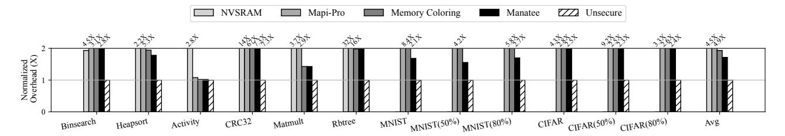
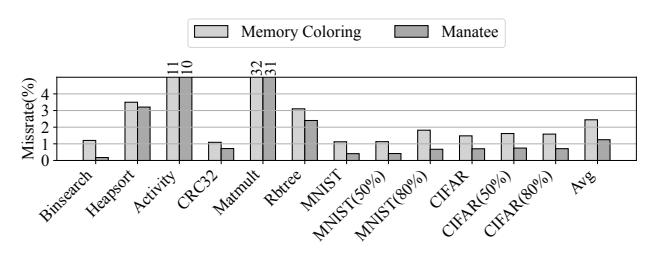
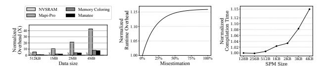

# C. Putting it All Together

Figure 7 presents the running example of MANATEE, detailing how pages are managed and persisted across power failures. SPM provides five page buffers, and the system

Fig. 8: Overview of MANATEE runtime with crash consistency support

maintains two entries in the WTQ. We assume that the system has sufficient energy to always make two WTQ checkpoints feasible. The program is assumed to be compiled, where the compiler assigns each instruction a page number and a corresponding color. These parameters are passed to the page manager. As shown in (a) and (b), when executing Store A, the instruction is augmented with its associated parameters (A, page number, and its color). If the requested page is not in the SPM, an SPM miss occurs. In response, the page manager fetches the page from NVM, decrypts it, and updates the page number and buffer (color) into the WTQ. As illustrated in (c) and (d), subsequent load to the same page are directly accessed from the SPM. On an SPM miss, the requested page is fetched from NVM and decrypted before being placed into the page buffer. In the event of a power failure, as shown in (e), all dirty pages recorded in the WTQ are re-encrypted and persisted back to NVM. During normal execution, if the WTQ becomes full, the oldest entry is evicted, and the corresponding dirty page is re-encrypted before being written to NVM. In addition, JIT checkpointing preserves volatile states such as registers. After recharging and rebooting, the previously loaded Page 7 is no longer in the SPM and the WTQ is reset. The execution then resumes with the next instruction, which triggers a fetch of Page 5 in the SPM (f).

#### V. EVALUATION

#### A. Experimental Setting

conducted all the experiments MSP430FR5994 [51] with a 1mF capacitor and developed MANATEE. We instrumented load and store instructions with a special mark by using the LLVM compiler infrastructure [58]. The benchmarks were compiled with -O3 optimization level. Then, the instrumented program is linked using TI's MSP430 GCC toolchain to generate the binary executable. We measured the total execution time of twelve benchmark applications tested in prior works [9], [57], [81], including machine learning (ML) workloads [70] with different sparsity levels [10], [48], [50], on the state-of-the-art (Mapi-Pro [9], NVSRAM [56], Memory Coloring [63]), and MANATEE. Also, our benchmarks also includes traditional memoryintensive benchmark such as Matmult and CRC32, which help evaluate MANATEE under high memory pressure.

Unsecure serves as a baseline, representing MANATEE without any security mechanisms enabled. MANATEE denotes the intermittence-aware speculative coloring described in Sec. III.

Memory Coloring is a model with security support. NVSRAM maintains data persistence by checkpointing the entire SPM when a power failure is detected. The system checkpoints all volatile memory to NVM so that execution can resume from the same state after power is back. Mapi-Pro places memory pages based on profiling. It collects memory access traces, identifies hot and cold pages using integer linear programming (ILP) based optimization, and maps hot pages to the SPM while cold pages are stored in NVM. During power outages, Mapi-Pro checkpoints the entire SPM contents into NVM to preserve state. Both NVSRAM and Mapi-Pro rely on whole SPM checkpointing, which may introduce overhead when checkpoints occur frequently.

By default, we configured the SPM size to 512 bytes. This setting was heuristically chosen based on our own preliminary experiments, where we observed that 512 byte SPM offered the best performance for the prior works. We further conduct a sensitivity analysis of varying SPM sizes, which will be discussed in Sec. V-D.

Using this default configuration, we evaluated all schemes in realistic energy harvesting situations. For such experiments, we utilized a power generator board with MSP430FR5994 to incur power failures [17]; we employed three power traces, thermal, RFHome, and solar, from prior works [17], [19], [42], [69], which were collected from real sources.

#### B. Execution Time Overhead Analysis

Figure 9, Figure 10, and Figure 11 describe the normalized overhead of each secure NVM design using thermal, RFHome, and solar traces [17], [19], [42], [69], respectively. This experiment takes into account both power-on and power-off periods. For performance analysis, we use Unsecure as the baseline. Across all applications and power traces, MANATEE consistently achieves the lowest overhead among secure designs. Its average normalized overhead remains low—1.71× for thermal, 1.71× for RFHome, and 1.72× for solar. This efficiency comes from MANATEE 's intermittence-aware speculative coloring, which effectively suppresses page conflicts and minimizes page-swapping overhead. Memory Coloring incurs substantially higher costs, exhibiting an average overhead of 1.93× relative to Unsecure. This gap highlights the benefit of intermittence-aware design in reducing page conflicts, and MANATEE further improves efficiency by approximately 12% compared to Memory Coloring on average. Mapi-Pro incurs significantly higher overheads, reaching 4.9× across thermal, RFHome, and solar. This overhead is primarily due to its full SPM checkpointing and the fact that all non-hot pages must be accessed from NVM, causing extra overhead.

NVSRAM shows a similar trend: while it also performs full SPM checkpointing, it is slightly faster than Mapi-Pro because execution itself occurs entirely in the SPM. Its overhead reaches 4.5×, 4.6×, and 4.6× on thermal, RFHome, and solar, respectively. However, NVSRAM fails to scale to larger workloads; for ML benchmarks such as MNIST and CIFAR, the checkpointing cost exceeds the energy of the capacitor, making execution infeasible under intermittent power.

Fig. 9: Normalized overhead of each scheme compared to MANATEE in thermal trace

Fig. 10: Normalized overhead of each scheme compared to MANATEE in RFHome.

Fig. 11: Normalized overhead of each scheme compared to MANATEE in Solar.

**Power-On Period Analysis.** We measured the power-on periods across all traces we used. The average power-on periods for thermal, RFHome, and solar were 2701.7 ms, 2662.8ms, and 2680.0ms. The longest power-on periods for thermal, RFHome, and solar were 2706.69ms, 2698.45ms, and 2705.43ms.

**Performance Breakdown.** Figure 13 illustrates the performance breakdown of MANATEE under a thermal trace. CRC32 shows significant encryption and decryption overhead, accounting for nearly 74% of the total execution time, which reflects its write-intensive nature. In contrast, Activity, which uses a relatively small number of pages, spends the majority of its time on actual program execution, with minimal overhead from page management and encryption. Across the other benchmarks, program execution accounts for about 58% of the total time, while page management and encryption consume around 25% and 16%.

**Memory Footprint Analysis.** We also profiled the memory footprint, running the benchmark applications. Figure 20 shows that global arrays in the data section account for about 95% of the total memory footprint on average across all benchmarks. This characteristic simplifies pointer analysis and improves its accuracy, as most memory references target statically allocated global arrays.

#### C. Page Miss Rate Analysis

To examine the effect of sliding-window analysis, we evaluated the page miss rates of MANATEE and Memory Coloring under the thermal trace, as shown in Figure 14. In general, MANATEE achieves about 50% page miss rate reduction compared to the Memory Coloring without sliding window; the miss rate of the coloring without sliding window is about 2.05% while MANATEE is about 0.99%.

**Misestimation Analysis.** We measured the misestimation rate of Manatee and its impact on the overall performance as shown in Figure 18. We found that the performance overhead increases when the misestimation rate increases. In particular, when Manatee misestimates the power-on period by 100%, i.e., it assumes frequent power failures even when none occur, it causes about up to 16% performance overhead compared to the ideal case with accurate no-power-failure estimation.

#### D. Sensitivity Analysis

Capacitor Size Variation. We measured the total execution time of each design using a thermal trace while varying the capacitor size between  $100\mu\text{F}$ , 1mF, and 10mF. As shown in Figure 15, NVSRAM, Mapi-Pro, Memory Coloring, and MANATEE perform best with a 1mF capacitor. In the case of NVSRAM, the system failed to operate under small capacitors

Fig. 12: Sensitivity analysis on applications varying the SPM size and SPM management schemes in thermal trace

Fig. 13: Performance breakdown of MANATEE in thermal

Fig. 14: Missrate of MANATEE

pacitor size

Fig. 15: Performance over- Fig. 16: Normalized overhead head in thermal varying ca- of each SPM size on average in thermal trace.

Fig. 17: Slowdown Fig. 18: Slowdown Fig. 19: Compile on a Cortex-M33 under power-on pe- time overhead over with MB datasets. riod misestimation varing SPM sizes

Fig. 20: Memory footprint breakdown

such as 100 µF and even 1mF. This is because the energy required to checkpoint and recover the entire SRAM exceeds the total energy capacity of these small capacitors. While NVSRAM was able to execute only with a large capacitor, such as 10mF, it still exhibited poor performance. A significant portion of the harvested energy had to be reserved for checkpointing and recovery, reducing the energy available for actual computation. This resulted in more frequent power failures and ultimately led to degraded performance.

Scratchpad Memory Size Variation. For the SPM size sensitivity analysis, we measured the total execution time of each benchmark application in all schemes, using the thermal trace. We set MANATEE with 512B SPM as our baseline and compared the performance to others as shown in Figure 12. Because larger SPMs increase leakage and smaller ones increase page misses, 512B offers the most balanced performance under intermittent power. Also, MANATEE consistently outperforms other approaches regardless of the size of the SPM. For a given SPM configuration, MANATEE can map NVM pages to SPM page frames of varying sizes accordingly. Workload Variation. We measured the total execution time of each scheme across ML benchmark applications using a thermal trace while varying input dataset sizes of 512KB, 1MB, 2MB, and 4MB. Since the MSP430 platform has limited NVM capacity, we conducted the experiments on the STM32 platform equipped with an ARM Cortex-M33 and 4MB of off-chip MRAM as the secondary memory. For performance measurement, we configured the SPM size to 512B and used a 1mF capacitor as default; we set MANATEE with 512KB dataset as a baseline. From the experiments, we found that MANATEE always outperforms Mapi-Pro by about 5.7x while NVSRAM is unavailable due to the expensive checkpoint/recovery support, as shown in Figure 17.

Compilation Time Overhead. Figure 19 shows the normalized compilation time overhead of MANATEE's page coloring algorithm across varying SPM sizes. As the SPM size increases, more page frames become available, which expands the coloring search space and thus increases compilation time. Discussion. For EHS devices equipped with endurance-limited or error-prone NVMs [44], [60], [61], [93], MANATEE can leverage the per-page checksum verification and lightweight wear-leveling schemes [12], [82], [85], [93], [97], that can track per-page access counts and migrate a page to a free space once its count exceeds a predefined threshold. MANATEE with the wear-leveling support causes about 15% performance overhead on average compared to MANATEE mostly due to the increased burden on MANATEE page manager.

