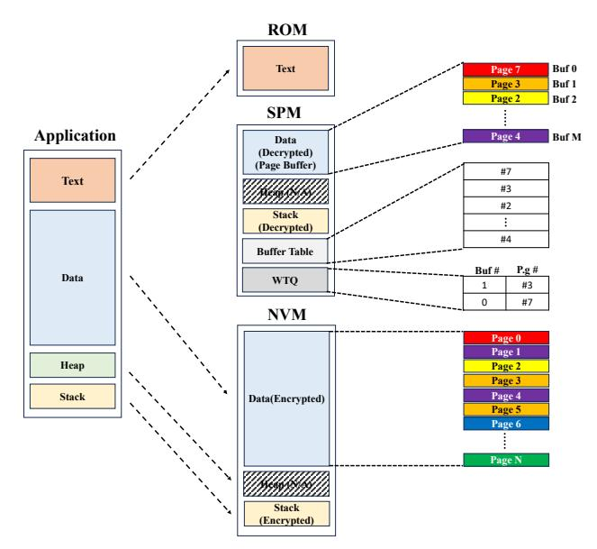
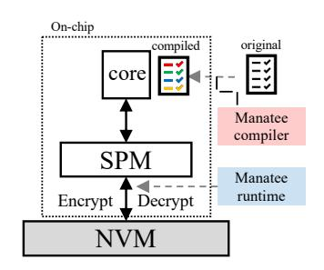
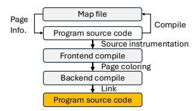
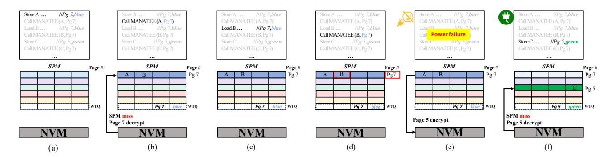

# III. MANATEE DESIGN

The goal of MANATEE is to offer EHS secure main memory on the cheap with compiler-directed paging. In particular,

Fig. 4: Memory mappings in MANATEE

MANATEE proposes to exploit the on-chip SPM of MCUs as the main memory and their off-chip NVM as secondary storage. Figure 3 shows this SPM-NVM memory model, which aligns with commodity MCUs including MSP430 series [51] though they often use NVM as main memory when deployed for EHS. Since SPM is volatile and loses its contents on power failure, the only time its data must be secured is when it is written to NVM.

The core of MANATEE is intermittence-aware speculative page coloring designed to leverage the short power-on periods of EHS. The key insight is simple: NVM pages only need to be assigned distinct colors (or SPM frames) during the brief time the EHS is powered on, eliminating the need to maintain these distinctions across the entire

Fig. 3: MANATEE overview

program execution. In case misspeculation happens, i.e., EHS lasts longer than the usual power-on period leaving two pages in conflict for the same SPM frame, MANATEE also devises its page manager runtime. It dynamically tracks if the page to be accessed exists in the corresponding SPM frame (colored statically), judging a page miss or hit with per-page tag matching. To handle a page miss (misspeculation), the page manager swaps the conflicting SPM frame with the NVM page being accessed, with encrypting the former and decrypting the latter.

In particular, MANATEE analyzes the entire memory address space using the linker-generated .map file at compile time to delineate the page for its static page coloring. By identifying the physical addresses of a data section from the .map file, MANATEE partitions it into logical pages (e.g., 64B) as a linear page array and generates page-level annotations. Using these annotations, MANATEE maps each program variable in the data section to one or more logical pages—depending on its size—and performs points-to analysis to measure their live range [78] which is the basis for determining conflict (interference) between pages during the coloring.

Figure 4 shows our memory organization where the program layout separates the text segment (stored in ROM) from the data, heap, and stack segments (stored in NVM). Upon execution, the heap and stack are preloaded into SPM, allocating them as dedicated pages, while data pages are loaded on demand into their pre-mapped frames in SPM. Nonetheless, dynamic memory allocation is often restricted in embedded systems [25], [51], [76], [77], [79]. According to the threat model in Section II-E, only the on-chip SPM resides within the trust boundary.

#### A. Intermittence-aware Speculative Coloring

MANATEE leverages memory paging to amortize encryption and decryption costs over a larger granularity, allowing the operations to occur less frequently than they would at the word level. To reduce page faults in SPM, we once considered *memory coloring* [63] that formulates the problem of allocating pages to SPM frames as a graph coloring problem, analogous to register allocation where each SPM page frame refers to an architectural register in the analogy. Traditionally, such a page coloring [63] analyzes the *live range* [78] of statically delineated pages (e.g., part of an array) and assigns different colors to conflicting pages—whose live range collides with each other—so that they map to the different SPM frames.

However, this conventional coloring [63] is lacking for EHSs, as it ignores their frequent outages and the resulting short power-on period. Suppose 2 pages X and Y in conflict at compile are accessed in order, and 2 distinct SPM page frames are allocated conventionally. However, they might not coexist in the SPM under the intermittent execution, provided power failure occurs after access to X wiping out all SPM frames, i.e.,  $(X_{frame}^{SPM} \rightarrow Outage \rightarrow Y_{frame}^{SPM})$ . In this case, Y can reuse the SPM frame of X unless it is accessed again in the same power-on window with Y. The lesson here is that pages need to be assigned different colors (SPM frames) only during the short power-on interval, forming the basis of our intermittence-aware page coloring. The implication is that page-conflict resolution is limited to such a short window, which offers greater flexibility in coloring and lowers SPM frame pressure.

Building on these observations, MANATEE introduces an intermittence-aware speculative page coloring, which fundamentally differs from conventional page coloring [63]. MANATEE exploits a speculated power-on period as a window size and applies distance coloring that enforces page conflict freedom only within this short window. In other words, MANATEE assigns pages to different colors (i.e., mapped to different SPM frames) only if they are likely to be live

within the same power-on interval. Pages whose accesses are separated by more than the power-on window are allowed to share a color, speculating that they do not coexist in SPM across power outages.

However, if ambient energy source conditions are stronger than expected, the actual power-on period becomes longer than the speculated window, leading to misspeculation. Such misspeculation can lead to program correctness issue due to two reasons. First, a page may end up occupying two SPM frames if the compiler incorrectly predicts that the page will be dead and assigns a new color. Second, two pages may incorrectly share the same frame if the compiler assumes one of them will be evicted before the other, even though both remain live.

To address the misspeculation issue, MANATEE incorporates runtime support, called *page manager*, which ensures correct page-to-SPM mappings even when compiler speculation turns out to be wrong. Upon every page access, *page manager* checks a small metadata structure, Buffer Table (BT), to determine whether the required page is in SPM or not. If the expected fram contains a different page due to misspeculation, page manager evicts the stale page to NVM, loading the required page into the frame, and updating the BT accordingly. With the help of page manager, MANATEE ensures program correctness under any energy harvesting environments, while still enabling intermittent-aware speculative page coloring.

#### B. Extended Distance Boundary-Sliding Window

Unlike conventional coloring where pages conflict if they are both live at any point of the entire program and must be resolved by assigning them different colors or permanently spilling one to memory, the intermittent-aware page speculative coloring only needs to resolve page conflicts within a short power-on window around the conflict point. Since compilers cannot determine when power failure may occur, we assume that it can happen both before and after the conflict point. To this end, MANATEE employs a sliding-window mechanism, that expands the power-on window both backward and forward from the conflict point, to identify what pages are likely to coexist with the conflicting page during a single power cycle. That is, the pages within this expanded window are assigned different colors; if page conflicts occur, MANATEE resolves them by reusing colors from the farthest pages outside the expanded window—effectively stealing colors that are unlikely to be needed during that power-on window. As a result, unlike conventional coloring, MANATEE avoids permanent memory spills by allowing pages to compete dynamically for SPM

Figure 5 illustrates the overall coloring process of MANATEE, including the sliding window. After the liveness analysis is completed, MANATEE first performs an interference-based coloring, as shown in (a). When a color assignment conflict occurs due to a shortage of available colors, MANATEE invokes the sliding-window mechanism to identify colors that are not used within the window and reassigns them to address the conflict. MANATEE begins by

Fig. 5: Intermittence-aware speculative coloring protocols. (a) describes the liveness analysis, (b) shows page coloring with the liveness analysis, (c) and (d) illustrate that MANATEE leverage sliding window to steal a color for Pg 4

examining the pages beyond the power-on window. Colors located outside the window may appear "live" under static interference analysis, but are unlikely to coexist with the current page during the expected power-on period. Thus, their colors can be safely reused without causing conflicts. In Figure (c), for example, orange and red fall outside the boundary and are considered available for reassignment.

MANATEE slides the power-on window forward to consider the case where a power outage occurs later than expected (d). This forwarded window identifies additional colors that are unlikely to coexist with the current page and can therefore be reused. For instance, in (d), orange and green newly appear outside the boundary, and consequently, orange, red, and green are all recognized reclaimable colors. MANATEE then selects the final reusable color from the union of colors identified by the two windows. In the example, the backward window yields red, orange, while the forward window yields orange, green, producing the combined set orange, red, green. Among these, orange is chosen first because it appears in both windows.

In some cases, the backward and forward windows may present disjoint color sets. When this occurs, MANATEE prioritizes the backward window because the backward window represents the execution state immediately before a power failure. By considering both backward and forward outage scenarios, MANATEE accounts for the inherent unpredictability of power failures in energy harvesting environments; this bidirectional sliding-window approach conservatively covers possible outages.

#### C. Discussion

While MANATEE uses static analysis for page mapping, it can be extended with runtime support for dynamic memory allocation though such runtime support not only increases complexity but also incurs performance overhead (will be discussed in Sec. V-B). Also, users may profile program behavior and leverage hot/cold page information manually. Furthermore, MANATEE can be extended with a compiler

optimization pass or a poss-pass binary optimizer to reorder global variables based on their temporal affinity [78]. We leave these as our future work.

Handling Loops and I/O. For any pages in I/O operations and loops whose iteration counts are unknown at compile time, our page coloring algorithm is unable to employ the sliding window. To address this challenge, MANATEE compiler designates specific colors for these pages, mapping them to dedicated page buffers that do not conflict with other pages. MANATEE excludes the colored pages from the set of colors. In our implementation, MANATEE reserves two pages for loops and I/O operations, as our workloads show that loops are mostly small and can be covered by only a few colors. For memory-intensive loops, MANATEE could instead release all colors for loop and I/O. We leave this optimization as our future work.

#### IV. IMPLEMENTATION

#### A. Compiler

MANATEE is composed of two main components: a compiler and a runtime system. MANATEE compiler performs static analysis and inserts hints for MANATEE runtime. The runtime manages page swapping, persis-

Fig. 6: Compiler workflow

tence, and encryption/decryption during execution and across power failures.

MANATEE compilation process is built upon the design described in Section III. The compiler translates this model into concrete transformations and metadata generation and produces a binary that the runtime can interpret without modification. Figure 6 illustrates the overall workflow of the MANATEE compiler. To obtain page-level layout information, MANATEE parses the .map file generated by the MCU compiler toolchain. In the first stage, MANATEE leverages

a linker to generate a .map file that specifies how program sections such as .text, .data, and .bss are placed in NVM or ROM. Although this stage uses the linker, MANATEE does not perform the actual linking process; instead, it only leverages the linker-generated mapping information to extract the NVM addresses in the data section and convert them into page numbers, which serve as input for page coloring.

With the mapping information, MANATEE conducts static analysis, constructing the control flow graph (CFG) of a given program. On the CFG, MANATEE performs page-level liveness analysis by leveraging alias analysis [7]. Across all tested benchmarks, MANATEE pointer analysis achieves more than 99% precision thanks to the linker-time mapping information, which consists mostly of must-alias or no-alias. For mayalias pointers, MANATEE conservatively assigns a new color if possible, or the farthest available color otherwise. The reason for such high pointer analysis precision is twofold. First, in our workloads, about 97% of pointers refer to global arrays, and their addresses are visible from the map file. Second, most memory access instructions are based on simple addressing modes while only a few use a symbolic mode where the exact target address is not clearly visible. Furthermore, MANATEE compiler unrolls loops whose iteration count is statically known and performs the pointer analysis on the unrolled loops. For loops whose iteration count is unknown at compile time, MANATEE reserves colors without pointer analysis (as discussed in Sec. III-C).

After that, MANATEE first performs interference graphbased page coloring to assign NVM pages and SPM frames. When a page miss occurs—i.e., when no remaining colors can be assigned, MANATEE then applies an intermittenceaware speculative coloring with a sliding window(distance boundary). MANATEE conducts both reverse and forward depth-first search (DFS) starting from the conflict point. The sliding window size is set to the power-on period. During each traversal, it scans the set of accessed pages and identifies their associated colors:  $C_{\text{accessed}} \subseteq C_{\text{total}}$ , where  $C_{accessed}$  and  $C_{\text{total}}$ denote the set of colors mapped to the pages accessed within the sliding window, and the total set of colors, respectively. The set of colors mapped to reclaimable pages is defined as follows:  $C_{\text{available}} = C_{\text{total}} - C_{\text{accessed}} = \{c \in C_{\text{total}} \mid c \notin C_{\text{accessed}}\}.$ Here,  $C_{\text{available}}$  represents the colors mapped to pages that are not accessed within the sliding window, which MANATEE can reuse for new pages. Finally, MANATEE links the generated metadata into the program binary. The metadata contains the page number and color associated with each instruction, allowing the runtime to manage page placement and migration during execution accurately.

**Distance Boundary** The distance boundary is derived from the power-on period,  $T_{on}$ , under intermittent computation.  $T_{on}$  can be estimated by dividing the available energy (i.e., energy buffered in a capacitor at wake-up) by the net power drain:  $T_{on} = \frac{E_{buf}}{P_{device} - P_{input}}$ , where  $E_{buf}$  is the energy buffer size given by a device manual, and  $P_{input}$  is the input power from ambient source. Here, we assume that  $P_{input}$  is weak yet

stable for a target application (e.g., wearable), and it can also be given at the system design time [47]. Finally, MANATEE obtains  $P_{device}$  by exploiting a static cost model [16]–[20], [47]:  $P_{device} = V_{dd}I_{leak} + C_{msp}V_{dd}^2f$ , where  $V_{dd}$  is the supply voltage of the MCU, f is its frequency,  $I_{leak}$  is the average leakage current, and  $C_{msp}$  represents the capacitance of the MCU;  $V_{dd}$ ,  $I_{leak}$ ,  $C_{device}$ , and f can all be found from a device manual [16]–[20], [47].

Once  $T_{on}$  is calculated, MANATEE compiler converts it to the MCU cycles. The compiler then traverses the control flow graph (CFG) of a given workload, while accumulating the execution time (cycles) of instructions on each CFG path both backward and forward, using a static energy/timing cost model [18], [19], [22], [71], [72], [84], [99]. During the instruction time accumulation on each CFG path, if the sum becomes greater than or equal to the  $T_{on}$ , then the compiler sets the boundary. Note that to account for possible variations in the leakage current ( $I_{leak}$ ) or energy profile, MANATEE employs a 20% safety margin by conservatively placing boundaries longer than the estimated power-on period. Even if the actual power-on period is longer than the estimated boundary, the correctness is always preserved—though performance degradation may occur with potential page faults after the boundary is crossed.

#### B. Runtime

MANATEE runtime manages pages in SPM-NVM memory hierarchy while ensuring crash consistency. For page management, MANATEE runtime employs a page manager with a software-managed page table, BT.1 The page manager handles page loading, eviction, encryption, and decryption, utilizing the AES accelerator/libraries provided by the MSP430FR5994 as used in prior works [55], [57].2 MANATEE also uses a Write Tracking Queue (WTQ), a lightweight structure that simply tracks which SPM pages have been dirtied. Each WTQ entry records the dirty page number and its SPM frame number. The code sizes of the page manager and the WTQ are 491B and 1,028B, respectively.

MANATEE compiler instruments each load/store instruction with two hints, the NVM page number and the page color. The color directly indicates which SPM frame the page should be loaded into, eliminating the need for the page manager runtime to perform any table lookups. With the help of MANATEE compiler, on each load/store instruction, the page manager checks a specific entry of the BT, as specified by the MANATEE compiler, to verify whether the page currently resides in its assigned SPM frame. If the requested page is not present, the manager fetches the page from NVM, decrypts it using AES-XTS, and updates the BT (and WTQ, if the instruction is a store). If the target SPM frame is already occupied by another page, the manager evicts the existing page, encrypting it and writing it back to NVM. The page manager also computes the offset of the memory address

&lt;sup>1The number of BT entries equals the number of SPM page frames (colors).

2We implemented an AES-XTS encryption/decryption mechanism with the AES accelerator/libraries as described in Sec. II-B.

Fig. 7: Running example of MANATEE memory management: (a–b) Just-booted state with empty SPM page buffer, fetching Page 7 from NVM on an SPM miss; (c–d) Accessing Page 7 directly from SPM without additional NVM fetch; (e) Power failure before storing to Page 5; (f) After recovery, fetching Page 5 from NVM on an SPM miss

within the page and provides this offset information to each SPM frame.

Figure 8 provides an overview of MANATEE page management workflow. Suppose a (decrypted) Page 3 is in the SPM, and the first instruction of a given program is store m1 100. 1 In this scenario, MANATEE calls the page manager before executing the store instruction, using a hint provided by the MANATEE compiler, the associated NVM page number and its page color, and computes the offset within that page at runtime from the address of the instruction. 2 The page manager then checks the BT to determine whether the requested page is already loaded in the SPM. 3 Since the BT already holds page number 3 at buffer index 1, the access is a hit and the store proceeds directly in the SPM at the computed offset, updating only the corresponding part of the page. 

The store instruction writes the value 100 to buffer index 1(red). @ After that, MANATEE records the update (buffer index 1, page number 3) in the WTQ.

Crash Consistency Support. To guarantee crash consistency, each page manager call must be failure-atomic. Consider the workflow in Figure 8. If power failure happens immediately at ①, i.e., after supplying the page number and color, then nothing has been updated in SPM; even though SPM loses its contents because of the power failure, the recovery runtime can fetch the lost page(s) by checking the BT in the wake of the failure. However, if power failure happens at ②, i.e., after the BT lookup reports a hit but before the store instruction, then the rebooted system has an empty SPM; so naive replaying would attempt to write to a buffer index with no resident page, thus violating crash consistency. Likewise, if power failure happens at ③, i.e., after the page update in SPM completes but before the WTQ is updated, then the JIT checkpoint would miss the dirty entry, losing the data permanently.

To address the challenges, MANATEE sets the backup voltage threshold ( $V_{backup}$ ) high enough to guarantee failure-atomicity of every page manager operation. Upon receiving a power failure interrupt (i.e., JIT checkpoint signal) during any page manager operation, MANATEE allows the current atomic operation to complete before initiating the checkpoint-

ing. Because the energy buffer is provisioned to cover both the page manager operation and the subsequent checkpoint, MANATEE guarantees crash consistency without causing an inconsistent state. This design also addresses the challenge of large encryption granularity (Sec. IV-B). The page manager buffers in-flight 16B ciphertext blocks in an internal buffer within the SPM. Once four 16B blocks are accumulated to form a 64B page, the page manager flushes them atomically as a single encrypted page; this is also backed by the failure-atomicity support for the page manager operation.

Checkpoint & Recovery. The JIT checkpointing mechanism detects an impending power loss using a voltage monitor [52], [71], [88]. When the capacitor voltage falls below a threshold, the monitor signals the processor to initiate JIT checkpointing. As a part of the JIT checkpointing, MANATEE runtime encrypts and persists all updated but not-yet-persisted pages recorded in the WTQ, together with other volatile processor state, updating the pages in NVM. The backup threshold  $(V_{backup})$  is provisioned so that these actions complete before shutdown. Concretely, we set the backup threshold to cover three operations: first, flushing two WTQ entries; second, completing the page manager call; and third, checkpointing program states (e.g., saving registers, heap, and stack and flipping the completion flag).

At the final step of checkpointing, Manatee flips a dedicated flag bit from 0 to 1 in NVM, indicating successful completion. In the wake of power failure, Manatee runtime resumes from the most recent checkpoint and checks the flag bit. If the flag bit is 1, Manatee runtime first resets it to 0 and then resumes execution from the checkpointed state. However, if the bit remains 0, the previous checkpoint is deemed incomplete and potentially compromised, and program execution is aborted to prevent attacks or inconsistent recovery. When power is restored with a fully charged capacitor, Manatee runtime resumes from the most recent checkpoint.

