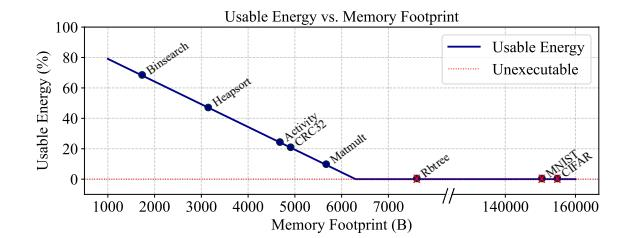

# Intermittence-Aware Speculative Page Coloring for Secure NVM

Jongouk Choi Junyeong Park Nicholas L'Heureux Yan Solihin *University of Central Florida* {*jongouk.choi, junyeong.park, nicholas.lheureux, yan.solihin*}*@ucf.edu*

Hyunwoo Joe *ETRI / UST hwjoe@etri.re.kr*

Changhee Jung *Purdue University chjung@purdue.edu*

*Abstract*—This paper revisits volatile scratchpad memory (SPM) for data confidentiality in an energy harvesting system (EHS) that suffers frequent power outages and thus features nonvolatile memory (NVM). Our insight is that low-cost data confidentiality can be achieved by using on-chip SPM as main memory and off-chip NVM as secondary storage. This strategic design naturally provides EHS with secure main memory (as SPM data vanish on an outage), encrypting them only when persistent in NVM. To realize this in a purely software manner, we introduce MANATEE, a compiler-directed memory management scheme that logically structures NVM pages and preallocates them in SPM. A key innovation of MANATEE is its intermittenceaware speculative page coloring that is explicitly designed taking into account frequent power outages. This design limits the requirement for page conflict resolution to the typically brief poweron period of EHS, providing greater flexibility in page coloring. If the period is longer than usual, two pages that would have been separated by an outage may instead be accessed within the same cycle, competing for the same SPM frame. To handle such a page miss (misspeculation), MANATEE devises page manager runtime that evicts the old SPM frame, encrypting and persisting it, and fetches the new NVM page decrypting it upon retrieval. Our evaluation shows that the page miss rate is not significant (≈ 1%), and MANATEE delivers a 2–3× speedup over the state-of-the-art work. These results demonstrate that MANATEE enables practical and secure memory for EHS, providing data confidentiality with minimal performance overhead.

#### I. INTRODUCTION

An energy harvesting system (EHS) has emerged as an alternative to battery-equipped Internet of Things (IoT) devices [2]. Without relying on batteries, EHS can sustain itself by harnessing ambient energy, e.g., from kinetic, radio frequency (RF), and thermal sources. However, they are inherently unstable, exposing EHS to frequent and unpredictable power failures. To address this problem, EHS utilizes a tiny capacitor as an energy buffer and implements a just-in-time (JIT) checkpointing mechanism; it persists all volatile data just before power failure using residual capacitor energy and restores them in the wake of the failure [3], [16]–[21], [47], [52], [65], [72], [88]. EHS typically builds on a low-power microcontroller (MCU), that lacks caches due to the difficulty of keeping them intact from an outage, and uses nonvolatile memory (NVM) as main memory [19], [31]–[34], [49], [90], [91], [96], [99]. Thus, across a power failure, the EHS needs only JIT checkpoint/restore registers to/from NVM.

Nevertheless, a critical security concern remains unresolved in EHS, i.e., data confidentiality. Since NVM is durable surviving power outages, EHS should encrypt all the data in NVM; otherwise, attackers can probe unencrypted NVM and extract sensitive information therein during the outages. This vulnerability poses a significant risk to end-users with severe consequences, including not only privacy violations but also security breaches such as unauthorized access and control. Therefore, ensuring data confidentiality in EHS devices is essential to enable their integration into secure IoT environments. [13], [35], [36], [100].

Unfortunately, it is a daunting challenge for EHS to realize data confidentiality, given the dual requirement of maintaining lightweight operation for energy efficiency and guaranteeing crash consistency for correct recovery [15], [16], [35], [36], [45], [100]. In the absence of a cache, loads and stores directly access NVM—becoming the most energy-consuming operation in EHS—and thus always involve decryption and encryption, further increasing the latency of already slow NVM accesses. Moreover, for crash consistency, EHS must persist the ciphertext—encrypted in a large granularity (e.g., 16 bytes) by Advanced Encryption Standard (AES)—in a failure-atomic manner. Persisting only a portion of such multiword ciphertext due to a power failure in between makes it impossible to decrypt data in NVM [13], [66].

To this end, this paper proposes to use the on-chip scratchpad memory (SPM) of existing MCUs as main memory and their off-chip NVM as secondary storage. The insight is that such a memory hierarchy naturally provides EHS with secure main memory because the on-chip SPM is within a secure domain and volatile losing all the data upon power failure. That is, they only need to be encrypted when persistent in NVM, leading to a question of how SPM should be persisted with crash consistency guarantee. One possible approach is to JIT checkpoint not just registers but also the SPM with them both encrypted upon power failure.

However, such a naive approach is lacking in several ways. First, a significant amount of energy must be reserved to encrypt and checkpoint the entire SPM atomically even before impending power failure, rendering the approach neither scalable nor energy-efficient. Figure 1 shows that tested benchmarks can spend only a small amount of harvested energy for program execution, while consuming most of the energy for encrypting and checkpointing SPM to NVM as well as restoring them from NVM to SPM across power failure. One might think of using a supercapacitor, but this causes power failure recovery to take a much longer time in that such a large capacitor must be recharged before rebooting, result-

Fig. 1: Portion of energy available for application execution with SPM JIT-checkpointed upon power failure; experiment is done atop a typical EHS: MSP430FR5994 microcontroller with  $100\mu F$  capacitor.

ing in significant performance degradation. More importantly, regardless of capacitor size, the naive approach cannot even utilize the full capacity of NVM as it is dedicated to checkpoint storage, i.e., main memory space is limited to SPM that is often much smaller than NVM in EHS devices.

To achieve energy-efficient data confidentiality, this paper presents MANATEE, a novel compiler/runtime co-designed memory management scheme for the proposed SPM-NVM memory hierarchy. The key challenge of realizing the memory hierarchy is managing explicit data transfers between SPM and NVM without capping the address space to the SPM size. Note that EHS architecture is simple without caches and lacks virtual memory support such as memory management units (MMUs) and translation lookaside buffers (TLBs) due to the low-power requirements. Consequently, the efficiency of memory management is crucial in determining the overall performance of the EHS backed by the proposed memory hierarchy of MANATEE.

Especially for software-only memory management, MANATEE logically partitions NVM into pages with SPM structured into page frames, and maps each page to one of the page frames in the SPM. To achieve this, MANATEE takes advantage of compile-time page coloring [63] and interacts with its runtime for page management during program execution. That is, the static page mapping provides a hint to the page manager runtime so that it dynamically checks if the pre-mapped SPM page frame holds a necessary page to be accessed—which can be done within a few clock cycles without relying on any hardware support.

To improve the efficiency of the page management, MANATEE introduces a new page reclamation strategy, considering a unique characteristic of EHS devices; they reboot only after the capacitor is fully charged and last until it drains. Both the short burst of execution followed by a long power outage for recharging and their repetitions characterize EHS program behavior, which is called *intermittent execution* [68]. Thus, for a given capacitor size, the execution distance is often consistent [54], which leads to a predictable power-on period between power outages.

In light of this, MANATEE creates intermittence-aware speculative page coloring—designed to exploit the short power

period of EHS. The key insight is that pages need to be assigned different colors (SPM page frames) only during these power-on intervals, thereby confining the page conflict resolution to a very brief window. However, if the power-on period lasts longer than usual, two pages that should have been separated by a power outage might be instead accessed within the same cycle, contending for the same SPM frame; such contention can compromise program correctness if either page performs writes. To handle such a page miss (mispeculation), MANATEE devises page manager runtime that evicts the old SPM frame, encrypting and persisting its data, and fetches the new NVM page decrypting it upon retrieval. The integration of compile-time speculative page coloring and runtime misspeculation handling provides substantial flexibility in page coloring, thereby enhancing the performance of EHS.

In contrast to conventional page coloring [63] that spills a conflicting page to off-chip memory, MANATEE accommodates all pages in the SPM at the cost of occasional page misses at run time. At each page conflict point where no color (i.e., no empty SPM frame) is available, MANATEE steals the color of the page whose access is as distant from the point as the power-on period in that the page is unlikely to be used in the same period. Since compilers cannot know when a power failure occurs, we conservatively assume it may precede or follow the conflict point. Accordingly, MANATEE employs a sliding window—sized to match the power-on period—to scan pages outside the window bidirectionally from the conflict point. Among these candidates, MANATEE reclaims (steals) the farthest page in either direction, encrypting and persisting it to NVM, thereby freeing the corresponding SPM frame. This strategy ensures that only the necessary pages remain resident in SPM during each power-on period, effectively minimizing page misses and thereby improving the performance of EHS.

Our experiments demonstrate that MANATEE provides secure NVM support while improving performance by an average of 12% over a scheme, that integrates with a prior memory coloring approach [63] lacking our distance formulation, and achieving a 2–3× speedup compared to the state-of-the-art profiling-based approach [9]. Finally, we make the following contributions:

- MANATEE is the first practical secure NVM solution for EHS. We propose a new memory hierarchy that uses SPM as main memory and NVM as secondary storage to achieve data confidentiality on the cheap.
- MANATEE devises intermittence-aware speculative page coloring with frequent power outages in mind. This limits the requirement for page conflict resolution to the brief power-on period of EHS, providing greater flexibility in the coloring with less SPM pressure and ultimately improving the performance of EHS significantly
- MANATEE significantly outperforms the state-of-the-art secure memory solution, achieving a 2–3× speedup on average across all 12 benchmarks, including 6 intermittent learning workloads.

## II. BACKGROUND AND MOTIVATION

#### *A. EHS Basics and Target Applications*

The harvested power of EHS is very weak (0∼2000µW [69]). In this harsh environment, EHS operates for a short amount of time (e.g., 15ms [54]), quickly depleting the capacitor energy but hibernating for a long time (e.g., more than 1s). To correctly recover from the frequent outages, EHS requires some form of crash consistency. Arguably, JIT checkpointing is the most popular way to offer EHS crash consistency guarantee. The JIT checkpointing mechanism detects an impending outage by using a voltage monitor. When capacitor voltage drops below a *Vbackup* threshold, the monitor signals the core to initiate the checkpointing. Upon receiving the signal, the core pauses program execution, checkpoint both a program counter (PC) and other registers to NVM (or nonvolatile registers [21], [88] if exist), and hibernates until the voltage reaches another threshold (*Vrestore*) to restore registers before resuming from the PC. That is, *Vbackup* and *Vrestore* should be set higher than nominal voltage to prevent the JIT checkpoint/restoration from being power-interrupted.

Applications. We target emerging energy harvesting wearables, e.g., implantable sensors [80], contact lenses [64], smart face masks [23], and human-warmth sensors [62]. These applications harvest ambient energy and run an infinite loop that repeatedly senses and alarms when something turns out to be wrong based on the sensing result. As with any other privacy-critical application, users here do not expect that their medical records can be exposed at the time of taking off or discarding the wearable devices. Note that these devices often lack the luxury of (remote) NVM erasure, and thus if they are lost or stolen, any unencrypted data in NVM is vulnerable to breaches in the end.

