# IroKnight: Ownership-Preserving Neural Acceleration for Inference Serving

Harsha Santhanam *University of California San Diego IroKnight AI, Inc.* La Jolla, California, USA harsha@ucsd.edu

Ashwin Rohit Alagiri Rajan *University of California San Diego* La Jolla, California, USA aalagiri@ucsd.edu

Hadi Esmaeilzadeh *University of California San Diego IroKnight AI, Inc.* La Jolla, California, USA hadi@ucsd.edu

*Abstract*—With the rise of Large Language Models (LLMs), cloud-hosted inference serving has become the norm, requiring users to relinquish data ownership to the ethereal cloud. This surrender of ownership is particularly concerning, as citizens' data is exposed to the cloud en masse and LLMs are increasingly deployed in highly regulated domains. Yet, existing approaches to preserving data ownership are either insufficient or impractical. Trusted Execution Environments (TEEs) incur modest overheads but expose plaintext in on-chip storage, thereby failing to preserve ownership and also presenting a well-exploited attack surface. Fully Homomorphic Encryption (FHE) keeps data encrypted onchip and thus theoretically provides cryptographic data ownership, but it remains impractical due to immense overheads. FHE's overheads stem from performing Arithmetic Logic Unit (ALU) operations directly on encrypted data. However, transient electrical signals within ALU wires and combinational logic gates are unobservable unless they are stored in registers or other onchip storage in plaintext. Thus, if plaintext assets never persist beyond these transient ALU signals and all stored values remain encrypted on-chip, FHE-level data ownership becomes attainable. Our work proposes this new paradigm for ownership-preserving inference, instantiated in a novel design point called the IroKnight Neural Processing Unit (NPU). IroKnight exposes plaintext only ephemerally within the wires and gates of ALUs—flashing for a literal nanosecond—while all on-chip storage (e.g., pipe-registers, buffers, etc.) remains encrypted and integrity-protected. To make this practical, IroKnight leverages two domain-specific insights: (1) the regular accesses in fine-grained tiled and vectored neural calculations enable same-cycle in-ALU encryption and decryption; (2) the mathematics of integrity checks mirrors the multiply-andaccumulate flow of neural operators, enabling mid-execution data authentication. By leveraging these LLM-specific properties, IroKnight achieves near-FHE-level data ownership with just 3.3% runtime and 15.2% energy overheads, whereas FHE NPUs increase runtime and energy by 1110× and 2872×, respectively. *Index Terms*—Neural Processing Units, Data Ownership, Secure Acceleration, Large Language Models, LLMs, Inference Serving

I. INTRODUCTION

## Large Language Models (LLMs) have accelerated the deep learning revolution, driving upheaval in healthcare, defense, finance, education, etc. The computational demands of early neural networks ushered in specialized accelerators, but the massive compute needs of LLMs has pushed deployment to the cloud, atop acceleration. While this transition to cloudbacked inference serving enables remarkable capabilities, it also forces customers (enterprises and individuals) to surrender ownership and control of their data to the ethereal cloud. This surrender of data ownership is a pressing issue due to its societal implications, including mass exposure of citizens' data

to service providers [\[1\]](#page-13-0) and deployment in highly regulated domains such as healthcare, banking, and the military [\[2\]](#page-13-1). Beyond ownership concerns, this move towards cloud execution introduces significant security risks: in healthcare, breaches of inference services could expose medical records; in finance, they could leak proprietary trading data; in defense, they could compromise national security. The consequences of security breaches are already substantial: IBM reports that the cost of a single data breach is \$4.4 million [\[3\]](#page-13-2), and cybercrime losses are projected to exceed \$10.8 trillion in 2026 [\[4\]](#page-13-3). Thus, there is a timely need to rethink the foundation of Neural Processing Units (NPUs) by elevating ownership and security to first-class design principles. *Data ownership is the property that each party retains exclusive cryptographic control over its sensitive digital assets, such that any entity observing the system's state gains no information about the underlying data [\[5\]](#page-13-4)*.

Fully Homomorphic Encryption (FHE): theoretically bulletproof, yet impractical. FHE can be considered the *theoretical* gold standard for ownership-preserving neural inference, as it enables computation directly on encrypted data, ensuring plaintext assets are never exposed. In principle, it provides complete ownership; yet despite years of research and the development of specialized accelerators [\[6\]](#page-13-5)–[\[13\]](#page-13-6), FHE still incurs latency and energy overheads that are several orders of magnitude beyond practical limits. Due to these overheads, the latest literature on FHE [\[6\]](#page-13-5)–[\[20\]](#page-13-7) focuses on securing small legacy models (e.g., ResNet-20), which do not reflect practical use cases and still incur ∼1000× slowdowns. This impracticality becomes even more pronounced for LLMs: FHE neural accelerators would take 10.9 hours to generate a response to a single query with Llama3-70B and would consume 0.6 kWh of energy ([§VI-C\)](#page-10-0). Such overheads render FHE a promising yet theoretical direction, rather than a deployable foundation for ownership-preserving inference serving today.

Trusted Execution Environments (TEEs): fast, yet fall short of preserving ownership. TEEs offer a more practical alternative by keeping data encrypted outside the chip, while data is still plaintext on-chip. As such, they aim to create a secure on-chip enclave that is expected to remain out of the reach of external hardware and software. However, once data enters the enclave, it is decrypted, stored, and processed in plaintext, enabling execution with modest overheads. Because TEEs expose plaintext in on-chip storage, they do not preserve ownership. Additionally, they also present a well-exploited attack surface, as microarchitectural exploits have repeatedly compromised TEEs and leaked plaintext from on-chip registers, caches, and buffers [\[21\]](#page-13-8)–[\[43\]](#page-14-0). Nevertheless, over the past decade, the importance of confidentiality and the lack of practical alternatives have driven the adoption of TEEs in CPUs [\[44\]](#page-14-1)–[\[46\]](#page-14-2). Recently, GPUs have begun to support TEEs [\[47\]](#page-14-3), while NPU TEEs exist only in research [\[48\]](#page-14-4)–[\[51\]](#page-14-5).

NPUs further exacerbate these data ownership and security concerns because they are entirely software-managed (e.g., by system software, host CPUs, runtime systems, etc.). As a result, ownership-preserving neural acceleration depends on the security of the surrounding infrastructure. For example, adversaries have exploited vulnerabilities in the software stacks of Samsung, Qualcomm, Huawei, and AMD NPUs to obtain unauthorized access, including arbitrary kernel code execution from unprivileged userspace [\[52\]](#page-14-6)–[\[63\]](#page-14-7). Such vulnerabilities expand the attack surface beyond the NPU itself to the broader system and cloud infrastructure that orchestrate its execution, placing TEEs in a position of questionable utility for NPUs. Towards a new model of secure acceleration. A gap thus emerges from the impracticality of FHE and the security and ownership shortfalls of TEEs, underscoring the need to fundamentally rethink ownership-preserving inference serving. To bridge this gap, we explore the research question: *how closely can we approach the level of digital asset ownership that FHE neural execution would offer, without incurring its prohibitive costs?* FHE's prohibitive overheads stem from performing ALU operations directly on encrypted data. However, transient electrical signals within the wires and combinational logic gates of ALUs are unobservable unless stored in registers or other on-chip storage in plaintext—consistent with observability principles in digital logic testing [\[64\]](#page-14-8). Thus, if plaintext never persists beyond these transient signals and all stored values remain encrypted on-chip, FHE-level data ownership becomes attainable. This work therefore sets out to design an NPU that exposes plaintext only ephemerally within the wires and combinational AND–OR gates of ALUs—flashing for a literal nanosecond—while all on-chip storage (e.g., pipe-registers, buffers, etc.) remains encrypted and integrityprotected. This design goal may seem extreme, as ephemeral exposure requires decrypting operands and encrypting results for each ALU operation. Doing so naively would be prohibitive, since encryption and decryption are long-latency operations that can lengthen the critical path and severely degrade frequency and performance. To resolve this challenge, we leverage the following domain-specific insights to enable same-cycle in-ALU encryption/decryption without degrading frequency. With these innovations, we contribute an ownership-preserving NPU, dubbed IroKnight, that delivers near-line rate performance.

Insight (1): Regular accesses in fine-grained tiled/vectored calculations enable same-cycle in-ALU encryption and decryption. LLM layers such as transformers decompose into sub-blocks (e.g., self-attention), which are in turn composed of neural operators (inner-product, softmax, etc.). These finegrained operators are organized into tiles or vectors, a wellknown domain-specific property that enables GPUs and NPUs to deliver orders-of-magnitude performance and efficiency gains [\[65\]](#page-14-9)–[\[69\]](#page-14-10). Tiled/vector execution follows strided affine walks, resulting in fine-grained regular accesses to on-chip storage. We uniquely exploit this fine-grained regularity to enable same-cycle in-ALU encryption/decryption, as follows. Encrypting and decrypting data is an XOR operation with a shuffle of the key, called a pad. While pad generation takes tens of cycles, encryption itself is just the bitwise XOR. The pad is generated through a process that does not depend on the value of the data, but rather on its address and the number of times that address has been written. We observe that given the regular accesses of fine-grained tile/vector calculations, pads can be pre-computed in a separate looping pipeline before the operands are fed to ALUs. Thus, we propose a design that reduces same-cycle encryption and decryption to bitwise XORs with no added latency by trickling the corresponding pads to the ALUs as they read encrypted operands (inputs and model weights) from on-chip buffers or pipe-registers.

Insight (2): Mathematics of integrity checks mirrors multiply-and-accumulate flow of GEMM, enabling midexecution authentication. Due to the software-managed nature of NPUs, adversaries can exploit software vulnerabilities to maliciously modify encrypted data and cause silent malfunctions in sensitive applications [\[52\]](#page-14-6), [\[55\]](#page-14-11), [\[59\]](#page-14-12)–[\[62\]](#page-14-13). Thus, IroKnight goes beyond encryption by providing mid-execution data integrity checks (authentication). To offer this capability, we observe that authentication computes hashes through a sequence of ⟨Galois-Field multiply, XOR-based accumulate⟩ operations, mirroring the Multiply-and-ACCumulate (MACC) flow of GEneral Matrix Multiplication (GEMM). Leveraging this insight, we introduce a parallel path that mirrors the connectivity of the MACC units and triggers hash (re)computation for writes to on-chip memory alongside the existing flow of data without runtime overheads. Through these domain-specific innovations, IroKnight keeps all on-chip data integrity-protected and encrypted—nearing FHElevel data ownership without its massive overheads—while moving well beyond TEEs, which only encrypt data off-chip.

We implement two variants of IroKnight in SystemVerilog one with encryption and another with both encryption and authentication—by modifying a TPU-like NPU [\[65\]](#page-14-9). Synthesis shows that with encryption there is a 1.79× area and a 1.76× Thermal Design Power (TDP) increase. When authentication is added, the overheads rise to 1.95× area and 2.18× TDP. Synthesis shows the critical path remains SRAM reads, confirming that the added logic does not reduce operating frequency.

We use representative LLM benchmarks, including the Mixture-of-Experts (MoE) models GPT-OSS-120B and Llama4- Scout, along with Llama3-70B, OPT-66B, Llama2-34B, OPT-30B, Llama3-8B, and Llama3-1B. For IroKnight with encryption, aside from pad pre-computation pipeline fill latencies, no further delays are introduced, leading to less than a 1% increase in end-to-end inference latency across all LLMs. When authentication is enabled, the extra off-chip memory traffic from hash verification introduces a small latency increase. However, since hashes are processed in parallel with multiply-

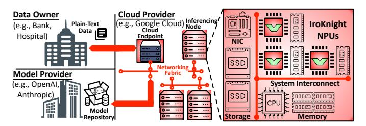

Fig. 1: IroKnight only trusts ALUs and on-chip key and pad generation circuits. All infrastructure and storage (pipe registers, buffers, HBM, CPUs, network, etc.) are untrusted.

and-accumulate operations, total latency overheads remain limited to 3% relative to a conventional NPU. Across the eight representative LLMs, IroKnight with encryption increases end-to-end energy at most by 14%. With authentication, the energy overhead rises to at most 18%. Considering compute alone, IroKnight increases energy by 4.3×. However, the relatively low overall energy overhead reflects the fact that LLM energy is dominated by memory accesses due to their large model footprint, and IroKnight minimally increases this memory traffic.

These results demonstrate that IroKnight is a significant step toward ownership-preserving LLM serving, avoiding the orders-of-magnitude overheads of FHE (1110× runtime and 2872× energy). As LLMs increasingly underpin social, economic, and national security infrastructure, waiting for practical FHE is untenable. Rather than replacing FHE's theoretical guarantees, IroKnight explores a new architectural design point for ownership-preserving LLM serving.

### II. OWNERSHIP, THREAT MODEL, AND CRYPTOGRAPHY

Cryptographic data ownership. IroKnight aims to preserve digital asset ownership for both the user and the model provider, requiring that their respective assets (user queries and model parameters) remain cryptographically hidden from each other and from the entire cloud infrastructure. This ownershippreserving model is particularly important in highly regulated industries, where queries cannot be exposed at any cost—underscoring the sustained national-security interest in FHE despite its immense overheads—as well as for preserving citizens' privacy amid widespread LLM exposure.

Threat model. IroKnight's Trusted Computing Base (TCB) consists solely of the ALUs within the NPU, along with onchip key and pad generation circuits. As shown in Figure 1, everything else is untrusted: first, on-chip storage structures such as registers, buffers, and SRAM; then off-chip memory; and finally all system components including the host-CPU, network, system software, etc. This threat model reflects the large body of evidence that both microarchitectural exploits and vulnerabilities in NPU system software can leak plaintext stored on-chip. For example, microarchitectural attacks have exposed plaintext in on-chip storage structures, including caches, registers, and SRAM [21]-[43]. Likewise, vulnerabilities in the software stacks of Samsung, Qualcomm, Huawei, and AMD NPUs have been exploited to execute arbitrary kernels and leak data [52]-[63]. Another important case is High Bandwidth Memory (HBM): NVIDIA's recent H100/H200 GPUs assume

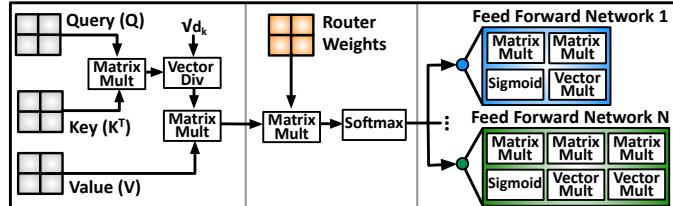

(a) Self-Attention (b) Expert Routing (c) Expert Feed Fwd Nets

Fig. 2: Mixture-of-Experts transformer layer.

HBM is trusted [70], but we exclude it from the TCB, motivated by recent demonstrations of HBM vulnerabilities [71]–[76]. IroKnight does not address power analysis or electromagnetic probing, as both require physically breaking into a datacenter and attaching specialized probes and equipment to the NPU for long periods of time—which is unrealistic for LLM serving. Cryptographic algorithm. To provide secure and ownershippreserving inference under this strong threat model, where an adversary can also tamper with and submit arbitrary ciphertexts for decryption, IroKnight adopts AES-GCM as its encryption and authentication algorithm. AES-GCM is widely deployed across industry, including NVIDIA's confidential computing platforms on H100 and H200 GPUs [77], AMD's SEV technologies [45], and is supported by Intel's AES-NI instruction set extensions [78]. AES-GCM is also extensively used in trusted execution literature [79]-[83] and is one of the primary authenticated encryption standards approved by the National Institute of Standards and Technology (NIST) [84].

## III. FINE-GRAINED LLM OPERATIONS AND SAME-CYCLE IN-ALU CRYPTOGRAPHY

NPUs are generally composed of vector engines for non-GEMM operators as well as systolic engines for GEMM operators. This section describes how IroKnight enmeshes cryptography within both engines to enable end-to-end, line-rate Fully-State Encrypted Acceleration—keeping LLM parameters, user data, and intermediate results always encrypted on-chip and everywhere else. We describe this design process using an MoE transformer layer, which includes dynamic selection besides non-GEMM and GEMM operators. The same design principles naturally generalize to all LLM operators and layers. **MoE transformer layers.** As shown in Figure 2, an MoE transformer layer consists of three sub-blocks: (a) self-attention, (b) expert router, and (c) expert feed-forward networks. Each of these sub-blocks is implemented as a sequence of operators. For instance, self-attention (attention = softmax $(QK^T/\sqrt{d_k})V$ ) consists of two matrix multiplications (MatMuls) and one softmax. The first MatMul computes the product of the Query matrix (Q) and the transpose of the Key matrix  $(K^T)$  by partitioning Q and K into tiles and processing them on a systolic engine. The resulting output tiles are then divided by the scaling factor  $\sqrt{d_k}$ , where  $d_k$  is the length of each key vector. Because the same scaling factor is applied to every element in a tile, this operation naturally maps to Single Instruction Multiple Data (SIMD) execution on the vector engine, proceeding as an affine walk with a stride

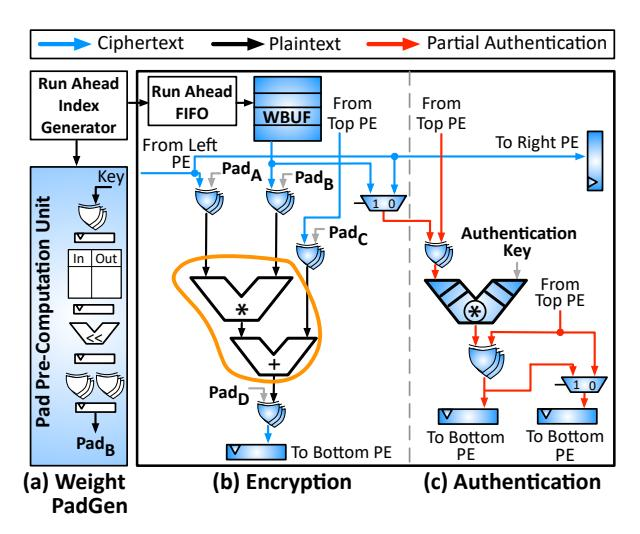

Fig. 3: IroKnight PE for a Systolic Array.

of one across the tile. The division outputs are then fed into  $\operatorname{softmax}(x_i) = e^{x_i} / \sum_j e^{x_j}$ . Computing the denominator requires exponentiating all elements of the tile, which is again an affine walk under SIMD execution on the vector engine. The exponentiated values are then summed using a vector reduction, in which sub-vectors are accumulated through an affine walk whose stride equals the SIMD width. Finally, each exponentiated element is divided by the resulting sum, which is another affine walk. Attention concludes with a second MatMul between the softmax output and the Value matrix (V), which is likewise a tiled calculation with regular accesses.

As Figure 2(b) shows, the next sub-block of the MoE layer is the expert router, which selects the expert corresponding to the current token. The router consists of a MatMul and softmax, both of which are fine-grained tiled/vectored operators with regular accesses. Based on the softmax output, the router selects the top-k values that identify the matching set of expert Feed-Forward Networks (FFNs) for the token (Figure 2(c)). The FFNs comprise the same tiled/vectored operators—MatMuls, sigmoid, etc.—thereby preserving the regularity of accesses.

Fully-State Encrypted Acceleration. Conventionally, the router's MatMul calculates each output element as  $R_{i,j} = \sum_k O_{i,k} * W_{k,j}$ , where i and j index the output row and column, respectively, and k indexes the shared dimension over which the dot product is accumulated. Under IroKnight's Fully-State Encrypted Acceleration, the same MatMul proceeds over operands that remain encrypted on-chip. Specifically, all matrices, vectors, and intermediate results (e.g., attention output (O) and router weights (W)) remain encrypted across all storage, especially on-chip (denoted by  $\widetilde{O}$ ,  $\widetilde{W}$ , etc.). As Eq. (1) shows, the MatMul's operands must be ephemerally decrypted within the ALUs, and the result must be re-encrypted before being written to any register or on-chip storage:

$$\widetilde{R}_{i,j} = \sum_{k} \left( (\widetilde{O}_{i,k} \oplus Pad_{i,k}^{O}(\cdot)) * (\widetilde{W}_{k,j} \oplus Pad_{k,j}^{W}(\cdot)) \right) \oplus Pad_{i,j}^{R}(\cdot)$$
 (1)

 $Pad_{i,k}^O(\cdot)$ ,  $Pad_{k,j}^W(\cdot)$ , and  $Pad_{i,j}^R(\cdot)$  are cryptographic functions that generate values, called pads. A pad recovers plaintext when bitwise XORed  $(\oplus)$  with ciphertext, and produces

ciphertext when XORed with plaintext. Ciphertext is a semi-randomized representation of the plaintext, calculated based on a secret cryptographic key.  $Pad_{i,j}^X(\cdot)$  is a function of this key, the tile/vector's address, and the number of times that tile/vector has been written (its version number), but not of the data itself. As such, if the address is known, the pad can be pre-computed before reading the data for ALU operations. Synergistically, as the formulation demonstrates, the access patterns of fine-grained LLM operators follow regular affine walks, making the address a pre-computable linear combination of the base address of the tile with i and j. Thus, IroKnight does not need to stall the ALU calculations to compute pads. Rather, it places a pipelined pad pre-computation unit beside each ALU that, given the tile's base address, stride, and offset, generates the corresponding pad each cycle using the cryptographic key.

## A. Systolic Engine for Same-Cycle in-ALU Cryptography

IroKnight Processing Element (PE). Figure 3 illustrates the interaction between a pad pre-computation unit (PadGen) for model weights and a single PE of a systolic array, consisting of a Multiply-and-ACCumulate (MACC) ALU (orange boundary). In a conventional PE, an Index Generator continuously outputs an index to the Weight Buffer (WBUF) based on the tile address and stride. IroKnight reuses the same logic except that it runs ahead and outputs the indices before the ALU computation. The Run Ahead Index Generator in Figure 3(a) directly feeds the pipelined PadGen unit, while the same indices are buffered in a Run-Ahead FIFO for the WBUF. Because of the limited range of indices in the WBUF, the PadGen combines the index with the physical address of the tile. The depth of the FIFO is equal to the number of pipeline stages in the PadGen, synchronizing the ALU operations and the pad generation for same-cycle in-ALU encryption/decryption. With this modification to the existing Index Generator, the only further modification needed is a row of bitwise XORs before and after the MACC ALU, as shown in Figure 3(b). Although this discussion focuses on the PadGen for weights, every operand and ALU output that goes to on-chip storage, including pipe-registers, needs its own PadGen that follows similar logic and structure.

The PadGens generate a unique 128-bit pad by advancing the address, cryptographic key, and version number (number of times a tile is modified) through ten rounds of key addition, S-box substitution [85], row shifting, and column mixing. For key addition, rather than using the secret key directly ( $\kappa$ ), AES-GCM expands it into distinct round keys for each decryption stage. This expansion ensures that each round uses a distinct transformation of  $\kappa$ , preventing decryption from collapsing into a linear operation. S-box substitution replaces each byte of the 128-bit intermediate pad through a nonlinear transformation. Column mixing swaps the bytes in each column of the pad using finite field arithmetic, so that every output byte depends on all bytes in that column. IroKnight places these PadGens alongside the PEs within the systolic engine (Figure 3(a)).

**IroKnight systolic engine.** Like a conventional NPU, a two-dimensional grid of IroKnight PEs forms a systolic array that operates identically to the conventional design. However,

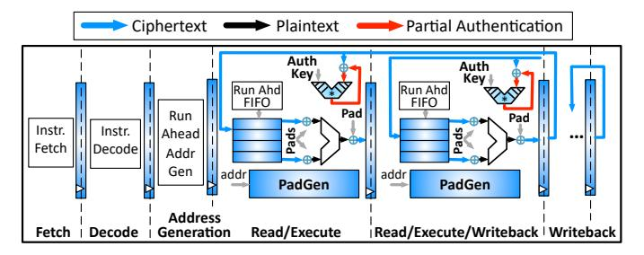

Fig. 4: IroKnight vector engine.

the PadGen units introduce additional design considerations. Because each PadGen produces 128 bits per cycle (the granularity AES-GCM operates at), one unit can be shared across sixteen PEs for 8-bit operands. The sharing of PadGens is determined by the ratio between the 128-bit pad width and the operand bitwidth. Once generated, these pads are immediately consumed by the ALUs, eliminating the need for pad storage. Because the outputs of the PadGen logic connect directly to the XOR gates at the ALU inputs and outputs, the pads do not exist beyond the XORs to ever be observed. As such, for the systolic engine, plaintext is never observable beyond the combinational wires and gates of the MACC ALUs.

In addition, to ensure pad uniqueness, the PadGens also incorporate version numbers that track how many times a given location (e.g., physical address or pipeline register) has been written. This is because AES-GCM requires a unique pad for each ⟨address, value⟩ pair, and as a result, pads change on writes but remain constant across reads. These version numbers are maintained on-chip within the PadGens and tracked per tile, while the address of each word ensures pad uniqueness. Tracking version numbers per tile is commensurate with prior work [\[48\]](#page-14-4), [\[49\]](#page-14-17). Because model weights and input activations are read-only, their per-tile version numbers do not change. For tiles of output activations, one version number is shared by the full tile and is tied to the destination's physical address. For registers holding intermediate values such as partial sums, each pipe register is assigned a version number that is incremented with every write. Since all the pipe registers of PEs in a systolic array are written at the same time when a wavefront moves, they share a version number that is personalized using a PE ID (the address), eliminating per-register bookkeeping. Thus, the read-only nature of most buffers and the ability to unify version numbers across IroKnight PEs significantly reduces the complexity of tracking logic. As such, the IroKnight systolic engine preserves cryptographic data ownership by keeping all on-chip data—buffers, pipe-registers, etc.—encrypted, while achieving near-line-rate matrix operations.

## *B. Vector Engine for Same-Cycle in-ALU Cryptography*

Neural workloads include more than just GEMM (matrix–matrix or matrix–vector) operations. A significant portion of LLMs consists of non-GEMM operators, such as elementwise additions and non-linear functions, including the MoE router's softmax. These operations do not map naturally to the systolic engine of an NPU and are instead executed on a vector

engine [\[86\]](#page-15-7)–[\[91\]](#page-15-8). These engines are specialized to ensure that non-GEMM operations do not become a bottleneck [\[92\]](#page-15-9), [\[93\]](#page-15-10).

In the vector engine, IroKnight needs to ensure every value is encrypted in pipe-registers and on-chip memory. IroKnight leverages the fact that specialized vector engines use affine addressing mechanisms, address generators, and hardware managed loops to efficiently execute non-GEMM operators [\[92\]](#page-15-9). These affine addressing mechanisms enable strided walks over vectors and tensors. The strides and offsets for the vectors are known at compile time, yielding regular, statically determined addressing patterns that are not data-dependent. This finegrained regularity and lack of data dependence directly enable IroKnight to pre-compute pads from addresses.

As Figure [4](#page-4-0) illustrates, after instruction fetch and decode, an address generator computes the addresses for the two source operands and the destination operand that reside in local vector memory. These addresses are generated based on the compilerprovided base, stride, and offset values. As shown, the vector memory is dispersed across the execution stages of the pipeline and coupled with ALUs that work in lock-step to carry out a vector instruction. The pipe registers carry the addresses from one stage to the next as the vector instruction rolls through the execution pipe stages. These addresses are used to read the operands from memory, where each operand is an element of the vector that a memory-ALU pair work on. Because the addresses are known before computation and are generated by the address generator, the encryption pads can be pre-computed. As such, IroKnight integrates bitwise XORs at each ALUs' inputs and outputs, ensuring that operands are always encrypted in pipe-registers, buffers, and any other vector engine storage. Additionally, to pre-compute the pads, IroKnight integrates pipelined PadGen units as shown in Figure [4.](#page-4-0) To supply addresses to the PadGens ahead of ALU operation, IroKnight reuses the existing address generator's logic to construct a Run-Ahead Address Generator, which feeds addresses to both the PadGens and the Run-Ahead FIFOs, which stage operand read addresses for vector memory.

Because the PadGens operate at the granularity of 128-bits, for two 32-bit operands and one 32-bit output (a total of 96 bits), 4 sets of memory-ALU pairs (384 bits = 4×96) can be served by 3 PadGens (384 bits = 3×128). If the operand size changes, the ratio between the number of PadGens to ALUs changes accordingly. By supporting both GEMM and non-GEMM operators across all MoE transformer sub-blocks, the IroKnight NPU enables *Fully-State Encrypted* inference

## *C. End-to-End LLM Serving with IroKnight*

Besides secure neural acceleration, IroKnight must work seamlessly with dynamic inference optimizations—such as Key-Value (KV) caching, speculative decoding, and token pruning to enable end-to-end ownership-preserving LLM serving.

KV caching. In the attention sub-block, each token attends to all prior tokens via softmax(QKT / √ dk)V , causing computation to grow quadratically with the number of input tokens. KV caching reduces this overhead by storing the Key and Value matrices of prior tokens and reusing them when computing

attention for new tokens, thereby reducing this growth to linear. To execute the first MatMul, the systolic engine loads tiles of  $K^T$  into on-chip storage and performs the MatMul with Q. IroKnight executes this MatMul identically, except that the cached Key matrix is stored in encrypted form  $(K^T)$ both on- and off-chip. Because of the regularity of MatMul's tiled execution, KV caching does not interfere with the precomputation of the corresponding pads. As a result, IroKnight continues to perform line-rate ephemeral decryption of cached  $K^T$  elements within the ALUs of the systolic engine. Similarly, the final attention MatMul is carried out over the cached encrypted Value matrix (V) without modification. As discussed, the attention computation follows  $\widetilde{Q}*\widetilde{K}^T$  with a vector division and a softmax operator. Thus, the encrypted intermediate results of the first MatMul are fed to the vector engine for SIMD execution of the division and softmax operators, whose regular fine-grained accesses do not require special consideration for KV caching. Altogether, KV caching is synergistic with IroKnight and does not change its execution semantics.

Speculative decoding. Another commonly used inference optimization is speculative decoding [94]. This approach uses a smaller draft LLM (e.g., Llama3-1B) to generate candidate tokens and reduce the number of calls to a larger LLM-called the target model (e.g., Llama3-70B)—that now only verifies the generated candidate tokens. If the target model rejects a candidate token at position i, it discards all subsequent tokens and provides a corrected token at that position (referred to as rollback), after which the process repeats. Speculative decoding does not change the draft and the target models or their operators; it only adds comparisons to verify the candidate tokens. Because this comparison reduces to a sequence of equality checks over vectors of token indices, it naturally forms a regular, affine access pattern. As a result, speculative decoding preserves the fine-grained tiled/vectored execution of LLMs. By leveraging this regularity, IroKnight enable Fully-State *Encrypted* speculative decoding, where all model parameters, input queries, draft tokens, etc. are always encrypted in onand off-chip storage, with plaintext only ephemerally exposed within the stateless ALUs at near-line-rate performance.

**Token pruning.** Token pruning [95] dynamically selects a subset of relevant tokens at each transformer layer and restricts computation to that subset instead of processing all tokens. To determine this subset, token pruning uses the output of the attention sub-block within each transformer layer to select tokens with the highest attention scores and forwards only those to the next layer. Because token pruning reuses the same previously discussed attention operators (i.e., MatMul, element-wise vector division, softmax), it does not alter the fine-grained tiled/vectored execution of attention. The only additional operator is Top-K selection, which performs a scan over the attention score array, compares each score against a running threshold, and retains the k highest-scoring token indices. Because this scan traverses the score array sequentially, it exhibits regular, affine accesses. With IroKnight, all attention scores, weights, etc. remain encrypted. Because regularity is

preserved across all operators, lroKnight can provide same-cycle in-ALU encryption and decryption even with token pruning.

Thus, although inference-time optimizations introduce coarsegrained dynamism into LLM serving, they do not alter the fine-grained regularity of tiled/vectored calculations. As a result, lroKnight naturally supports these optimizations while sustaining near-line-rate, ownership-preserving LLM serving.

## IV. MID-EXECUTION AUTHENTICATION THROUGH MIRRORING FLOWS OF DATA

While the previous section focused on keeping data encrypted throughout execution, IroKnight also provides protection against adversaries that modify encrypted data and corrupt execution. Data tampering is a broader risk in untrusted systems, but it is particularly acute for NPUs due to their software-managed nature. Adversaries can exploit vulnerabilities in the software stack to modify encrypted data and cause silent malfunctions in sensitive applications [52], [55], [59]–[62]. Thus, IroKnight goes beyond encryption by providing data integrity checks in the middle of execution by permeating AES-GCM's integrity-check mechanism (authentication) across its entire design to ensure every write to on-chip storage is authenticated. To that end, this section first introduces the mathematics of authentication and then describes how it can be integrated into both IroKnight's systolic and vector engines without compromising performance. **Mathematics of authentication.** Authentication computes a hash over all data blocks in a tile or vector, regardless of the underlying operator. When a tile/vector is loaded, its hash is recomputed and then compared against the hash value that was stored alongside the tile/vector. If the hashes do not match, the tile/vector has been tampered with. To compute a tile's hash, each of its blocks (128-bits) is Galois-Field multiplied with an authentication key, which AES-GCM derives algorithmically by encrypting a zero-bit vector. The resulting product is then XORed with the running partial hash. After the last product of the Galois-Field multiplication is XORed, the accumulated result is encrypted to produce the final 128-bit hash.

### A. Systolic Engine Design for Mid-Execution Authentication

This authentication process mirrors the structure of GEMM operations: it is fundamentally a sum-over-products, but uses bitwise XORs instead of addition and Galois-Field multiplication instead of conventional multiplication.

IroKnight PE with Ingrained Authentication. As such, IroKnight uses the systolic engine's existing flow of data to ingrain authentication through a mirrored path that performs Galois-Field multiplication and hash accumulation (XOR) alongside the Multiply-and-ACCumulate (MACC) ALUs. As illustrated in Figure 3(c), the two additional components integrated into each PE are a Galois-Field multiplier and a row of XOR gates for hash accumulation. These components are bitwise operations and are inherently less complex than the MACC logic already present in the PEs. The critical path also does not shift to the added Galois-Field multiplier and remains the read path from the Weight Buffer (WBUF) in each PE, as confirmed by synthesis results (§VI-A). Thus, the structure and

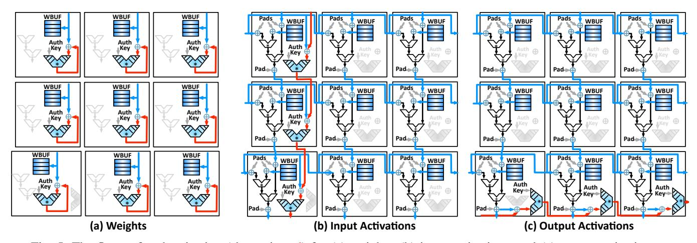

Fig. 5: The flows of authentication (shown in red) for (a) weights, (b) input activations, and (c) output activations.

flow of data of the systolic engine remains unchanged. Instead, a mirrored path runs alongside the connectivity of the original MACCs, allowing authentication values to flow through the array in parallel with the systolic flow of data.

The simplicity of Galois-Field multiplication. The simplicity of Galois-Field multiplication comes from the fact that it operates on binary polynomials rather than integer values. The digits in a binary polynomial are not the positional encoding of the value of each digit. Instead, they represent whether the x position term exists in the polynomial. For example, the 128-bit binary of 1100 . . . 0101 represents x 127 ⊕x 126 ⊕x 2 ⊕1 since only four digits are nonzero. With this representation, addition between coefficients reduces to a single XOR, so no carries occur between bit positions—eliminating the need for carry-propagation logic. The accumulation is also simplified: instead of a full adder tree required by MACC operations, authentication only needs a row of bitwise XORs to combine partial hashes. Conventional implementations of AES-GCM use 128×128 Galois-Field multipliers for authentication. However, because IroKnight ingrains these operations into the PEs, it must support the bitwidth of activations and weights flowing through the PEs. Thus, IroKnight breaks the 128×128 Galois-Field multiplier (typically used in TEEs) into multiple smaller multipliers (e.g., 128×8) that match the bitwidth of activations and weights. Since there is no carry, breaking the multiplication across PEs in the same column does not change either the organization or the flow of data in the systolic array.

Modifying the systolic engine for mid-execution authentication. In the systolic engine, the authentication-enabled IroKnight-PEs (Figure [3\)](#page-3-1) replace the conventional PEs that form the array. However, IroKnight does not merely add authentication logic to the PEs; it also orchestrates the movement of data across them so that authentication of weights, input activations, and output activations do not disrupt the systolic engine's flow of data or performance.

For model weights, IroKnight performs the weight authentication ahead of ALU operations as the weight values are trickling down to each PE. As shown in Figure [5\(](#page-6-0)a), in the same cycle the weight value is written to the WBUF, it is also

fed to the pair of ⟨Galois-Field multiply, XOR-addition⟩ for partial hash computation. This way as the loading of weights finishes, the full hash is also calculated and the weight block is authenticated and verified. Note that each PE operates locally on its own WBUF as shown by the red flows in Figure [5\(](#page-6-0)a). To guarantee that the weights are authenticated as soon as they are written to the PE, we hard-wire the write enable signal of the WBUFs to trigger authentication. As such, any modifications to the WBUFs will be authenticated.

IroKnight aligns hash generation for input activations read from the Input Buffer (IBUF) with the normal computation flow of the systolic array. As such, authentication is performed in the first column of PEs as the input wavefront moves from left to right. As illustrated in Figure [5\(](#page-6-0)b), the encrypted input activations streamed into the first column of PEs are fed into the ⟨Galois-Field multiply, XOR-addition⟩ pair for hash computation. Because data moves through the array in a wavefront, the first PE in the column begins the hash generation and passes its partial hash to the PE directly below, which continues the process using its own input activation. This partial hash is updated as it propagates downward through the first column while new input activations stream in. To avoid redundant hash computations, only the first column authenticates each IBUF read, as the same input activations are then passed to all subsequent columns of PEs.

Authentication requires that each encrypted block of output activations in the Output Buffer (OBUF) has a corresponding hash. In a similar fashion to the input activations, IroKnight leverages the last row of PEs in the systolic array to compute the hash as data is written to the OBUF. Because outputs flow in a wavefront manner, the hash is computed from left to right as encrypted output activations trickle out of the last row of PEs (Figure [5\(](#page-6-0)c)), using the ⟨Galois-Field multiply, XOR-addition⟩ pair already present in each PE. Because the first column of PEs is used for authenticating input activations and the last row of PEs is used for output activations, the bottom-left PE must sustain both flows of hash generation. Hence, only this one PE includes two pairs of ⟨Galois-Field multiply, XOR-addition⟩. Thus, by orchestrating authentication for inputs, outputs, and

weights, the IroKnight systolic engine can detect tampering of data in on- or off-chip storage during execution and raise alerts.

## *B. Vector Engine Design for Mid-Execution Authentication*

For the IroKnight vector engine to detect tampering, any write to on-chip memory must trigger authentication. To provide this capability, IroKnight generates a cryptographic hash for each write to vector memory using an authentication key. Because the adversary does not have access to this key, it cannot produce a matching hash when attempting to inject malicious data into either on- or off-chip memory.

As shown in Figure [4,](#page-4-0) IroKnight realizes authentication by passing each word written to a sub-bank of the vector engine through a ⟨Galois-Field multiply, XOR-addition⟩ pair that contributes to the hash. For example, consider a vector add operation (VADD) that adds A and B to produce C. When IroKnight loads a sub-vector of A into vector memory, each element is passed through its corresponding ⟨Galois-Field multiply, XOR-addition⟩ pair as it is written into the subbank, with the Galois-Field multiply using the authentication key. As the write proceeds, these operations accumulate the hash across all elements of the sub-vector. Once the write completes, IroKnight compares the generated hash against the expected hash associated with the data. If the hashes do not match, IroKnight detects tampering and raises alerts. The same process is applied when loading B. For the output C, each element produced by the ALU is likewise passed through a ⟨Galois-Field multiply, XOR-addition⟩ pair as it is written back to on-chip memory, thereby accumulating the hash for C. By the time VADD completes, the hash for C is also complete and accompanies C, whether it is written off-chip or consumed by subsequent GEMM or non-GEMM operations. By providing authentication in both the systolic and vector engines, IroKnight delivers integrity-protected, ownership-preserving LLM serving without disrupting the NPU's existing flow of data.

## V. OWNERSHIP-PRESERVING INFERENCE SERVING ON UNTRUSTED INFRASTRUCTURE

The mechanisms described so far secure computation within the NPU itself. This section broadens the discussion to show how IroKnight enables end-to-end ownership-preserving inference across untrusted cloud infrastructure. The objective is to make IroKnight a drop-in replacement for conventional NPUs. To do so, each NPU must first attest that it is a genuine instance of IroKnight using its manufacturer-issued, devicespecific private attestation key. Next, IroKnight has to exchange the encryption keys for the model parameters and user data, so that they can be securely communicated from the Model Provider and the Data Owner to the chip in encrypted form. Finally, since LLMs are commonly distributed across multiple NPUs, the serving IroKnight NPUs must establish secure interchip communication to exchange encrypted intermediate data. Thereafter, IroKnight acts like a conventional NPU.

The process of attestation. At a high level, attestation involves a challenge from the Data Owner or Model Provider and a response from the chip. Taking the Model Provider as an example, the process begins when a random number, called a nonce, is sent to the chip. The chip signs this nonce with the private attestation key from manufacturing time and sends it back to the Model Provider. The Model Provider then applies the public attestation key provided by the chip manufacturer to the signed nonce, and verifies that the signature is authentic by checking if the nonce was what was originally sent. Because model serving uses multiple chips, attestation repeats per chip. Establishing secure communication channels over untrusted infrastructure. Once the authenticity of the NPUs has been established, IroKnight establishes two independent *private RSAencrypted channels*—one between the chip and the Model Provider, and another between the chip and the Data Owner—as the entire underlying infrastructure is untrusted. The channels use RSA (Rivest–Shamir–Adleman) [\[96\]](#page-15-13) public/private key pairs to securely communicate the AES-GCM key for computation. The channels are initiated without relying on external infrastructure (e.g., host CPU). In addition, the private RSA keys are never communicated to the infrastructure and are held locally by Model Providers and Data Owners. Hence, even if the untrusted infrastructure sniffs the encrypted messages with the chip, they cannot be deciphered. Securing the Model Provider's or Data Owner's infrastructure that holds *their own* private keys is their responsibility and does not concern IroKnight. The Model Provider and Data Owner use separate RSA and AES-GCM keys, ensuring neither can access the other's data.

The Model Provider first sends its public RSA key to the IroKnight NPU, which then uses this public RSA key to encrypt the on-chip generated AES-GCM key. This encrypted AES-GCM key is then sent to the Model Provider, which decrypts it using its private RSA key, and uses the AES-GCM key to encrypt its model parameters. This process is repeated for each participating IroKnight NPU. From this point onward, the model parameters are encrypted with the AES-GCM key that was exchanged over the *private RSA-encrypted channel*. As a result, even if the underlying infrastructure is fully compromised and all communication is exposed, the model parameters remain encrypted and secure. This is because they are encrypted with a *privately RSA-encrypted AES-GCM key* that is never exposed to the infrastructure and is known only to the chip and the Model Provider. The same applies for the Data Owner.

Establishing secure communication channels between **IroKnight** NPUs. IroKnight also secures inter-chip communication. First, the serving NPUs have to establish trust amongst themselves through attestation. Next, the NPUs need to exchange AES-GCM keys to co-operate on intermediate data. To safely exchange the AES-GCM keys, each pair of IroKnight NPUs creates its own *private RSA-encrypted channel*. Setting up these channels requires that each NPU maintain its own RSA public/private key pair. The RSA key pairs are distinct from the AES-GCM keys and are used to securely exchange the AES-GCM keys between NPUs. The RSA private keys remain securely on-chip and are never transmitted over the untrusted infrastructure, ensuring that no observer can decipher the encrypted communication between NPUs. To accomplish this, each pair of IroKnight NPUs exchanges RSA public keys

and then uses their peer's public key to encrypt its own AES-GCM key. Once encrypted, these AES-GCM keys are exchanged across the *private RSA-encrypted channel*. This repeats for each pair of NPUs. After the exchange, each NPU decrypts the received RSA encrypted AES-GCM keys using its RSA private key and stores the decrypted AES-GCM keys locally. These AES-GCM keys are used to encrypt data sent to peer NPUs, enabling them to compute using encrypted data.

Isolation of compute keys. To further harden IroKnight's security, we make the AES-GCM compute keys physically unreadable from the PadGens. That is, during computation, IroKnight never uses the AES-GCM keys that were used to communicate with the Model Provider, Data Owner, and peer NPUs. Instead, the first column of the systolic array re-encrypts the received data with keys that are never sent off-chip. In the physical implementation, the compute keys are written to the PadGens from the chip's key generation unit with no physical path to observe them. When the results are sent to the Data Owner, they are re-encrypted with the Data Owner's keys.

Necessary architectural components. To generate keys, IroKnight includes RSA and AES-GCM key generation units. The AES-GCM key generation unit generates keys initially and also before version numbers (§III-A) overflow to ensure pad uniqueness. For attestation, IroKnight integrates a lightweight, in-order CPU with no branch predictors or caches. This CPU creates and signs the attestation report using the manufactureringrained attestation key and is shut off during execution.

#### VI. EVALUATION

## A. Methodology

Benchmarks. IroKnight is evaluated on eight LLMs: GPT-OSS-120B (16 NPUs), Llama4-Scout (16 NPUs), Llama3-70B (8 NPUs), OPT-66B (8 NPUs), Llama2-34B (4 NPUs), OPT-30B (4 NPUs), Llama3-8B (2 NPUs), and Llama3-1B (1 NPU) [97]–[101]. These benchmarks span a wide range of model sizes and architectures, including both dense and Mixture-of-Experts (e.g., OpenAI's GPT-OSS-120B and Meta's Llama4-Scout). Following prior work, the number of NPUs is chosen to accommodate the model parameters and key-value cache [102]. To distribute inference across multiple NPUs, we use a publicly available tool—Microsoft's DeepSpeed [103] for tensor-parallel and expert-parallel execution. For the main results, the number of input and output tokens is swept from 256 to 4096 using a batch size of 1. We also perform sensitivity sweeps over the number of PEs, memory bandwidth, and batch size. Additionally, IroKnight is evaluated on smaller neural networks, including BERT, MobileNet-v2, ResNet-50, and ViT, which, unlike LLMs, fit on a single NPU.

Hardware implementation. We begin with a conventional TPU-like NPU (Table I). Using this base design, we implement two variants of IroKnight: one with encryption and another with both encryption and authentication. Both are implemented in SystemVerilog and synthesized using Synopsys Design Compiler 2023.09 with the FreePDK 45nm standard cell library [104]. For on-chip SRAM, we use the OpenRAM

TABLE I: Conventional TPU-like NPU configuration.

| Conventional TPU-like NPU Configuration |                           |                   |        |  |  |  |  |
|-----------------------------------------|---------------------------|-------------------|--------|--|--|--|--|
| Systolic Array                          | 128×128                   | Vector Lanes      | 128    |  |  |  |  |
| Frequency                               | 1 GHz                     | Scratchpad Memory | 18 MB  |  |  |  |  |
| Off-Chip HBM                            | 16 GB                     | Memory Bandwidth  | 1 TB/s |  |  |  |  |
| PCle Bandwidth                          | 128 GB/s (bi-directional) | Precision         | INT8   |  |  |  |  |
| <b>HBM Access Latency</b>               | 41ns [107]                |                   |        |  |  |  |  |

TABLE II: Area and TDP.

|      | Conventional TPU-Like NPU | IroKnight NPU w/ Encrypt. | IroKnight NPU w/ Auth. |
|------|---------------------------|---------------------------|------------------------|
| TDP  | 30 W                      | 52.9 W                    | 65.5 W                 |
| Area | 9.4 mm 2       | 16.9 mm 2      | 18.4 mm 2   |

memory compiler [105]. Synthesis is used to obtain area, power, and timing at 1 GHz. Results show that the critical paths are SRAM reads rather than the added encryption and authentication logic, confirming that IroKnight does not reduce operating frequency. We use DeepScaleTool [106] to scale the synthesis results to 7nm while maintaining a 1 GHz frequency. Table II summarizes the area and Thermal Design Power (TDP) of the conventional TPU-like NPU and both IroKnight variants. Simulation infrastructure. For the conventional TPU-like NPU [65], we use an open-source cycle-accurate simulator [92] to report end-to-end latency and energy. This simulator includes a compiler that performs tiling, fusion, and other optimizations to generate hardware-executable kernels. The reported endto-end latency is the total time to generate the full output sequence and accounts for key-value cache growth. We follow prior work for HBM access latency [107]. End-to-end energy is measured using activity-level energies obtained from synthesis, with SRAM energy modeled using CACTI 6.0 [108]. For HBM2 and PCIe Gen4 energy, we follow prior work [109], [110]. We extend this simulator to account for the overheads of IroKnight with encryption and IroKnight with authentication and encryption. All microarchitectural and memory-level overheads are explicitly modeled, including in-ALU encryption/decryption, pad generation, mid-execution authentication, off-chip memory accesses, on-chip buffer accesses, etc. For IroKnight with encryption and authentication, the size of each data block with a hash follows prior secure NPU work [49]. The neural compiler's original functionality and optimizations remain unchanged, but it uses its knowledge of access patterns to provide information for version numbers, pad generation, etc. Modeling FHE NPU. To put IroKnight's overheads into perspective, we compare it to an FHE NPU [9], as FHE provides similar cryptographic ownership guarantees. Since FHE NPUs have not been demonstrated at the scale of the benchmarked LLMs, we provide an optimistic modeling of their performance. Our modeling does not disadvantage FHE, and we do not capture all inefficiencies. A more realistic measurement would likely show higher overheads. FHE natively supports linear operations but lacks support for non-linear operations, including layer normalization, softmax, etc. [10], [20], [111], [112]. However, it can still execute multiplications, additions, and research has shown approximations for some non-linear operations (e.g., softmax and ReLU) [112]-[114]. To model latency and energy, we follow the design used in prior work [9], which uses specialized functional units and a 180MB on-chip

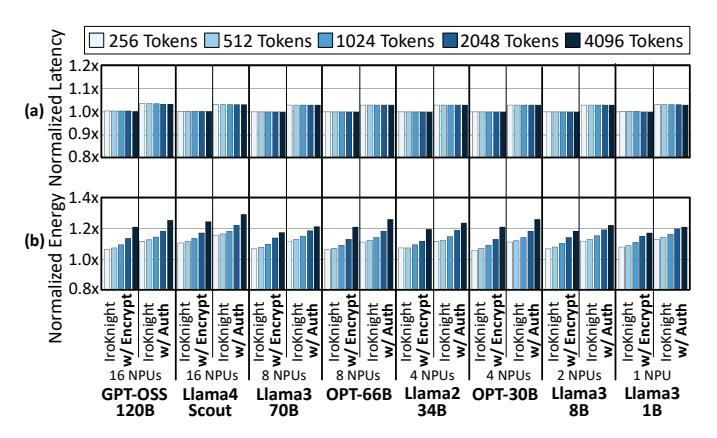

Fig. 6: Normalized end-to-end (a) latency and (b) energy of IroKnight across different input token lengths.

SRAM for intermediate FHE ciphertexts. Following prior work, we keep model parameters as FHE plaintexts [\[8\]](#page-13-11), [\[17\]](#page-13-12)–[\[20\]](#page-13-7), [\[115\]](#page-16-3), since encrypting them would incur additional overhead. Modeling NPU TEE. We also compare IroKnight to an NPU TEE. We adopt the design from prior work [\[49\]](#page-14-17), which uses an encryption and authentication engine at the off-chip memory interface and on-chip tile-based version numbering. For fairness, all designs match resources and encryption scheme.

## *B. Runtime and Energy*

Runtime and energy with different input token lengths. Figure [6](#page-9-0) reports the end-to-end (a) latency and (b) energy of both IroKnight variants as the number of input tokens increases from 256 to 4096, with an output size of 1024 tokens, commensurate with prior work [\[116\]](#page-16-4)–[\[118\]](#page-16-5). All results are normalized to the conventional NPU performing plaintext inference. Across all sequence lengths, IroKnight with encryption incurs a 0.2% runtime overhead. By exploiting the regular access patterns of fine-grained tiled/vectored execution, IroKnight pre-computes pads and avoids stalls in the NPU's flow of data. The only added cost is the pipeline fill latency of the PadGens per LLM operator. For IroKnight with encryption and authentication, the runtime overhead is 3.3%. This minimal overhead arises because IroKnight exploits the algorithmic similarity between AES-GCM's hash calculation and neural MACC operations, allowing them to run in parallel. The only authentication cost comes from fetching or writing hashes to off-chip memory.

For energy, both IroKnight variants exhibit modest increases, never exceeding 28%, as the number of input tokens grows. For GPT-OSS-120B, IroKnight with encryption increases the energy overhead from 7% at 256 tokens to 21% at 4096 tokens. Although encryption increases the compute energy by 4.3×, the overall energy is dominated by HBM accesses, as the footprint of Large Language Models requires large model parameter fetches and key-value cache reads/writes. For context, the pad generation logic for 128 bits requires 5.4 pJ, while reading the same amount of data from HBM needs 508.2 pJ, which is 94.1× more energy than generating the pad. The final XORs for encryption are negligible. The longer the input token length, the larger the energy overhead because they require

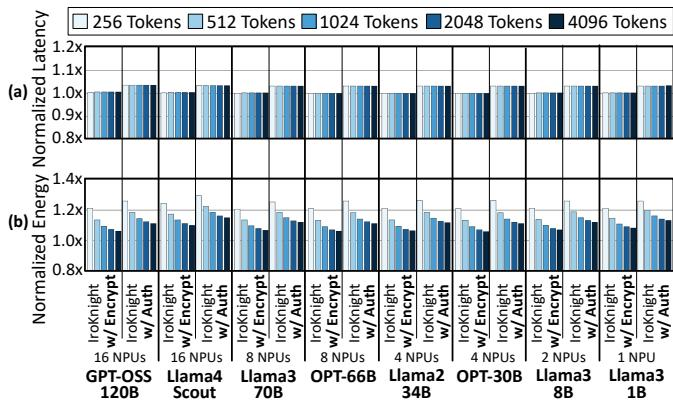

Fig. 7: Normalized end-to-end (a) latency and (b) energy of IroKnight across different output token lengths.

more computation to process the full input context before producing the first output token. A similar pattern is observed for IroKnight with both encryption and authentication, whose energy increases from 12% at 256 tokens to 25% at 4096 tokens for GPT-OSS-120B. This again reflects that energy is dominated by HBM accesses, which outweigh the compute

energy of encryption and authentication. Runtime and energy with different output token lengths. Figure [7](#page-9-1) shows the normalized end-to-end (a) latency and

(b) energy of both IroKnight variants as the number of output tokens increases from 256 to 4096, with an input token size of 1024. Because IroKnight leverages the insights that finegrained tiled/vectored neural operators exhibit regular accesses and that hash arithmetic mirrors MACC operations, it can precompute pads and compute hashes in parallel with the MACCs. As a result, the latency overhead is 0.2% for IroKnight with encryption and 3% for IroKnight with authentication. Unlike when increasing the input tokens, increasing the output tokens reduces IroKnight's energy overhead. For example, for Llama4- Scout, IroKnight with encryption decreases from 24% at 256 output tokens to 10% at 4096 tokens, while IroKnight with encryption and authentication decreases from 29% to 15%. This is because, after the first output token processes the full input sequence, each subsequent token uses the key-value cache instead of recomputing the entire context. As a result, the amount of computation per token becomes small, while off-chip accesses for model parameters remain large, and accesses to the key-value cache grow with each generated token. Thus, HBM traffic increasingly dominates the total energy of LLM serving, further shadowing the energy of encryption and authentication. Runtime and energy for non-LLM smaller neural networks. Figure [8](#page-10-1) shows the normalized end-to-end (a) latency and (b) energy of both IroKnight variants for smaller neural networks. Both variants incur minimal runtime overheads since pad precomputation and hash generation do not stall the NPU's flow of data. For energy, IroKnight with encryption incurs 3.55× and 3.39× overheads for BERT and ResNet-50, respectively; these figures grow to 3.80× and 3.92× when authentication is added. Unlike memory-bound LLMs, these smaller neural networks are compute bound, and lack the massive off-chip

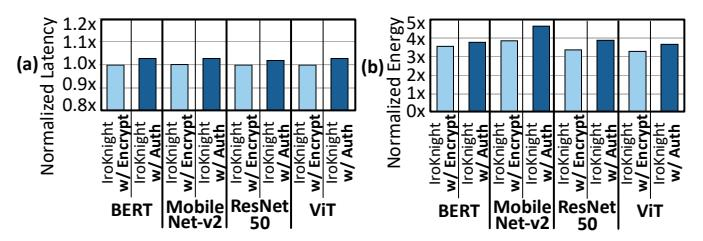

Fig. 8: (a) Latency and (b) energy for smaller neural networks.

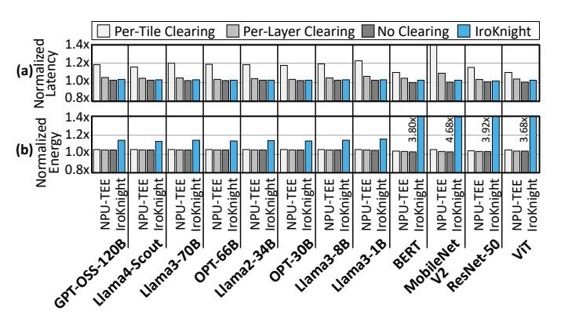

Fig. 9: (a) Latency and (b) energy comparison with NPU TEEs.

accesses of LLMs. Still, the overheads are orders of magnitude lower than FHE's, while keeping both model parameters and data encrypted across on-chip storage and pipeline registers. Comparison to NPU TEE with scratchpad clearing. Figure 9 reports the normalized end-to-end (a) latency and (b) energy for IroKnight with encryption and authentication, and for an NPU TEE with and without scratchpad clearing. The NPU TEE can perform either tile- or layer-level clearing, although layer-level clearing can violate Service Level Agreements [119]. The experiment uses batch size 1 with 1024 input and output tokens. On average, tile-level clearing incurs 19.6% runtime and 5.4% energy overhead, versus 5.1% and 4.9% with layer-level clearing, and 2.8% and 4.8% without clearing. Meanwhile, IroKnight keeps data encrypted at all times, incurring 3.3% runtime and 15% energy overheads. Critically, NPU TEEs, with or without clearing, do not preserve data ownership, since plaintext is present on-chip during computation. Moreover, because NPUs are software-controlled, an adversary can exploit software vulnerabilities during execution to leak onchip data, regardless of scratchpad clearing [52]-[63]. In contrast, IroKnight preserves cryptographic ownership with midexecution authentication, while exposing plaintext only for the literal nanosecond of ALU computation.

C. Putting Results into Perspective with Comparison to FHE To put IroKnight's overheads into perspective, we compare it to an FHE NPU [9]. Here, the LLMs use 1024 input and output tokens (batch size 1), following prior work [116]–[118], [120]. **FHE latency comparison.** Table III reports the absolute and normalized end-to-end latency for the conventional NPU (baseline), the FHE NPU, and the two variants of IroKnight. The FHE NPU incurs runtime overheads of 985× for GPT-OSS-120B, 713× for Llama4-Scout, and 819× for Llama3-8B. A

TABLE III: Latency comparison.

|              | Conventional NPU |       | FHE NPU   |              | IroKnight w/ Encrypt |        | IroKnight w/ Auth |                |
|--------------|------------------|-------|-----------|--------------|----------------------|--------|-------------------|----------------|
|              | Absolute         | Norm. | Absolute  | Norm.        | Absolute             | Norm.  | Absolute          | Norm.          |
| GPT-OSS-120B | 11.72 sec        | 1×    | 3.21 hrs  | 985×         | 11.79 sec            | 1.006× | 12.15 sec         | 1.037×         |
| Llama4-Scout | 27.24 sec        | 1×    | 5.40 hrs  | 713×         | 27.33 sec            | 1.004× | 28.16 sec         | 1.036×         |
| Llama3-70B   | 21.88 sec        | 1×    | 10.89 hrs | 1793×        | 21.91 sec            | 1.001× | 22.58 sec         | 1.032×         |
| OPT-66B      | 20.83 sec        | 1×    | 9.39 hrs  | 1624×        | 20.85 sec            | 1.001× | 21.48 sec         | 1.031×         |
| Llama2-34B   | 19.78 sec        | 1×    | 5.97 hrs  | $1015\times$ | 19.80 sec            | 1.001× | 20.40 sec         | 1.031×         |
| OPT-30B      | 18.15 sec        | 1×    | 4.96 hrs  | 985×         | 18.16 sec            | 1.001× | 18.71 sec         | 1.031×         |
| Llama3-8B    | 8.58 sec         | 1×    | 1.95 hrs  | 819×         | 8.59 sec             | 1.001× | 8.87 sec          | 1.032×         |
| Llama3-1B    | 2.50 sec         | 1×    | 0.66 hrs  | 954×         | 2.51 sec             | 1.003× | 2.59 sec          | $1.033\times$  |
| BERT         | 1.59 ms          | 1×    | 1.26 sec  | 795×         | 1.59 ms              | 1.002× | 1.63 ms           | 1.029×         |
| MobileNet-v2 | 0.28 ms          | 1×    | 0.17 sec  | 607×         | 0.28 ms              | 1.004× | 0.29 ms           | $1.030 \times$ |
| ResNet-50    | 0.81 ms          | 1×    | 1.41 sec  | 1745×        | 0.81 ms              | 1.001× | 0.82 ms           | 1.020×         |
| ViT          | 1.80 ms          | 1×    | 1.23 sec  | 684×         | 1.81 ms              | 1.002× | 1.85 ms           | 1.029×         |

TABLE IV: Energy comparison.

|              | Conventional NPU |       | FHE NPU  |        | IroKnight w/ Encrypt |               | IroKnight w/ Auth |               |
|--------------|------------------|-------|----------|--------|----------------------|---------------|-------------------|---------------|
|              | Absolute         | Norm. | Absolute | Norm.  | Absolute             | Norm.         | Absolute          | Norm.         |
| GPT-OSS-120B | 46.1 mWh         | 1×    | 0.34 kWh | 7396×  | 50.6 mWh             | 1.10×         | 52.9 mWh          | 1.15×         |
| Llama4-Scout | 184.1 mWh        | 1×    | 0.53 kWh | 2896×  | 209.2 mWh            | 1.14×         | 218.4 mWh         | 1.18×         |
| Llama3-70B   | 681.6 mWh        | 1×    | 0.59 kWh | 871×   | 750.1 mWh            | 1.10×         | 784.1 mWh         | 1.15×         |
| OPT-66B      | 650.7 mWh        | 1×    | 0.50 kWh | 770×   | 711.6 mWh            | 1.09×         | 744.8 mWh         | 1.14×         |
| Llama2-34B   | 318.7 mWh        | 1×    | 0.33 kWh | 1027×  | 349.7 mWh            | 1.10×         | 366.1 mWh         | 1.15×         |
| OPT-30B      | 292.4 mWh        | 1×    | 0.31 kWh | 1044×  | 319.3 mWh            | 1.09×         | 334.3 mWh         | 1.14×         |
| Llama3-8B    | 68.1 mWh         | 1×    | 0.16 kWh | 2282×  | 75.3 mWh             | 1.10×         | 78.5 mWh          | 1.15×         |
| Llama3-1B    | 9.8 mWh          | 1×    | 0.07 kWh | 6697×  | 10.9 mWh             | 1.11×         | 11.4 mWh          | $1.16\times$  |
| BERT         | 0.0024 mWh       | 1×    | 0.039 Wh | 16652× | 0.0084 mWh           | 3.55×         | 0.0091 mWh        | 3.80×         |
| MobileNet-v2 | 0.0004 mWh       | 1×    | 0.005 Wh | 11904× | 0.0016 mWh           | 3.87×         | 0.0019 mWh        | $4.68 \times$ |
| ResNet-50    | 0.0013 mWh       | 1×    | 0.045 Wh | 35564× | 0.0042 mWh           | $3.39 \times$ | 0.0049 mWh        | $3.92 \times$ |
| ViT          | 0.0030 mWh       | 1×    | 0.039 Wh | 12734× | 0.0099 mWh           | 3.28×         | 0.0112 mWh        | $3.68 \times$ |

single query under FHE takes 1.9 hours for Llama3-8B. As the model size increases, the FHE inference time rises to 3.2 hours for GPT-OSS-120B and 5.4 hours for Llama4-Scout. These latencies show how far FHE is from being practical. These large overheads stem from repeated bootstrapping operations and large off-chip accesses to plaintext-polynomial model parameters and ciphertext-polynomial activations. Although the model weights are plaintext, they must still be represented as polynomials—encrypting them as ciphertexts would further increase the overhead. FHE uses bootstrapping to manage the noise that accumulates during computation. Each multiplication or addition increases this noise, which can lead to the loss of data if not managed by bootstraps. In contrast, IroKnight with encryption secures both activations and model parameters while incurring around 0.2% latency overheads. Although FHE does not protect against data tampering, IroKnight with authentication provides this capability with only a 3% latency overhead.

FHE energy comparison. Table IV reports the absolute and normalized end-to-end energy for the conventional NPU, the FHE NPU, and the two variants of IroKnight. The FHE NPU incurs energy overheads of  $2282\times$  for Llama3-8B,  $871\times$  for Llama3-70B, and  $7396\times$  for GPT-OSS-120B. For one query, FHE consumes 160 Wh for Llama3-8B, compared to 78.5 mWh on IroKnight with encryption and authentication. The FHE energy increases to 0.59 kWh for Llama3-70B compared to 784 mWh for IroKnight. These large overheads stem from the massive off-chip memory accesses, costly bootstrap operations, and arithmetic of FHE. For smaller, non-LLM neural networks, the FHE NPU's latency ranges from  $607\times$  to  $1745\times$  (Table III), while IroKnight incurs a 3% overhead. The energy overhead of the FHE NPU ranges from  $11904\times$  to  $35564\times$ , while IroKnight's energy remains between  $3.68\times$  and  $4.68\times$ .

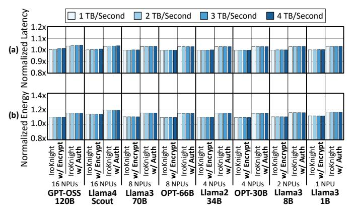

Fig. 10: Sensitivity to memory bandwidth.

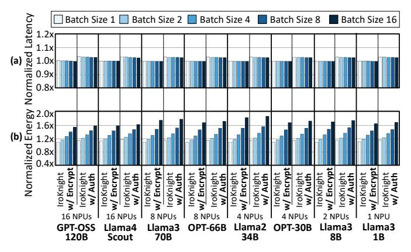

Fig. 11: Sensitivity to batch size.

## *D. Sensitivity Studies*

For sensitivities, the LLM benchmarks use 1024 input and output tokens with a batch size of 1, unless specified otherwise. Sensitivity to memory bandwidth. In the main evaluation, we use 1 TB/s for the memory bandwidth. In Figure [10,](#page-11-0) we scale the bandwidth to 4 TB/s to reduce memory pressure. Across all bandwidths, IroKnight with encryption has a runtime overhead of less than 1% as IroKnight leverages the regularity of accesses in tiled/vectored neural execution to pre-compute pads and not stall the NPU's flow of data. For IroKnight with encryption and authentication, the overhead is determined by the amount of data processed by the NPU rather than bandwidth. Thus, as bandwidth increases, it sustains around a 3% runtime overhead. Although energy varies with bandwidth, the normalized energy overheads of both IroKnight variants remain constant as bandwidth increases. This is because IroKnight uses the same tiling and memory access strategies as the conventional NPU, leaving the execution flow unchanged. Sensitivity to batch size. Figure [11](#page-11-1) shows the normalized end-to-end (a) latency and (b) energy of both IroKnight variants as batch size increases from 1 to 16. As batch size increases, IroKnight with encryption maintains less than a 1% latency overhead, while IroKnight with encryption and authentication sustains a 3% overhead. For energy, using GPT-OSS-120B, IroKnight with encryption incurs a 16% overhead at batch size 2 and 55% at batch size 16, while the encryption and

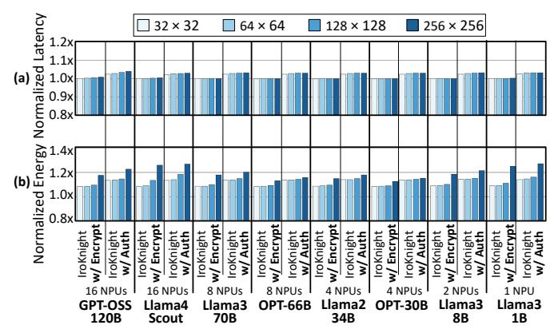

Fig. 12: Sensitivity to the number of PEs.

authentication variant increases from 21% to 58%. Larger batch sizes increase computation relative to memory accesses, raising encryption and authentication activity and therefore energy. Sensitivity to the number of PEs. Figure [12](#page-11-2) shows the (a) latency and (b) energy of both IroKnight variants as the number of PEs is swept. The number of vector lanes matches the number of columns in the systolic array. We consider configurations from 32×32 for the edge to 256×256 for larger datacenter NPUs. In Figure [12\(](#page-11-2)a), IroKnight with encryption incurs less than a 1% runtime overhead across all NPU sizes. The runtime overhead of IroKnight with authentication remains at 3%, as hash generation depends on the amount of data processed—not on the array size. Compared to the main design point of 128×128, when the array size shrinks to 32×32, the energy overhead remains ∼10%. Although smaller NPUs have a lower per cycle energy cost, the runtime latency is proportionally longer, resulting in similar overheads. At 256×256, the energy overhead increases to ∼20% because the systolic engine becomes underutilized. This under-utilization extends systolic runtime, while consuming more energy per cycle, resulting in a higher overhead than the 128×128 design.

## *E. Dynamic Inference Optimizations*

This section uses 1024 input and output tokens (batch size 1) with all results normalized to the conventional TPU-like NPU. Speculative decoding. Figure [13](#page-12-0) presents (a) latency and (b) energy for both IroKnight variants on two speculative decoding benchmarks: conventional [\[94\]](#page-15-11) (Llama3-1B drafter, Llama3- 70B target) and mixed-vocabulary [\[121\]](#page-16-8) (Llama3-8B drafter, Llama4-Scout target). We set the drafter to 3 and 5 tokens [\[94\]](#page-15-11), [\[122\]](#page-16-9) and sweep the target acceptance probability (α) from 0% to 100%. The acceptance probability is the likelihood that the target model accepts a drafted token. With encryption, IroKnight incurs 0.2%–0.5% latency overhead at 0% acceptance, decreasing to 0.1%–0.3% at 100%. With authentication added, IroKnight incurs 3.2%–3.3% at 0% acceptance, decreasing to 3.1%–3.2% at 100%. Lower acceptance slightly increases overhead due to more rollbacks, which require refilling the PadGen pipelines. For energy, IroKnight incurs 9.4%–9.8% (encryption) and 13.6%–18.9% (encryption and authentication) at 0% acceptance, increasing to 19.5%–29.3% and 22.8%–33.9%

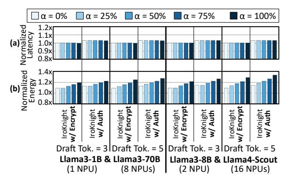

Fig. 13: Speculative decoding.

at 100% acceptance. This is because at higher acceptance rates the target model generates fewer tokens, reducing HBM traffic. **Token pruning.** Figure 14 shows (a) latency and (b) energy for both IroKnight variants under token pruning [95], where the LLM removes irrelevant tokens at each layer. We sweep pruning from 0% (no tokens removed) to 80%. Across this range, encryption incurs 0.3%-0.4% latency overhead for Llama4-Scout and 0.5%-0.7% for GPT-OSS-120B, while adding authentication increases these overheads to 3.3%-3.4% and 3.6%-3.7%, respectively. These overheads remain minimal because token pruning does not alter the fine-grained regularity of tiled/vectored execution. For energy, encryption alone incurs overheads of 13.6% for Llama4-Scout and 9.6% for GPT-OSS-120B at 0% pruning, decreasing to 9.7% and 6.4% at 80% pruning. With authentication added, the overheads decrease from 17.1% (Llama4-Scout) and 13.3% (GPT-OSS-120B) at 0% pruning to 14.2% and 11.1% at 80% pruning. Energy decreases because computation shrinks while HBM traffic for weights remains constant, further amortizing cryptographic costs.

#### VII. RELATED WORK

Secure machine learning techniques. FHE preserves data ownership, yet despite the development of specialized accelerators [6]-[14], [123]-[129], it still incurs orders of magnitude latency and energy overheads. Multi-Party Computation (MPC) aims to provide confidentiality by partitioning cryptographic execution across multiple nodes [130]–[140]. Beyond its immense communication/computation overheads, MPC depends on the security of the underlying system as it assumes not all parties can be compromised. However, if an adversary can break into one party, it can likely compromise the others—an issue exacerbated in datacenters, where security practices are uniformly applied to all nodes. Shredder [141] and Cloak [142] are software techniques that use stochasticity to obfuscate data during inference, but they neither offer cryptographic protection nor secure the model. Federated Learning [143] and Differential Privacy [144], [145] are for training and not inference.

**Trusted Execution.** Trusted Execution Environments (TEEs) protect data by encrypting it outside the chip, but they are not designed to encrypt on-chip storage (e.g., buffers, registers, or caches). TEEs have been deployed in CPUs, including Intel SGX [44], AMD SEV [146], and research

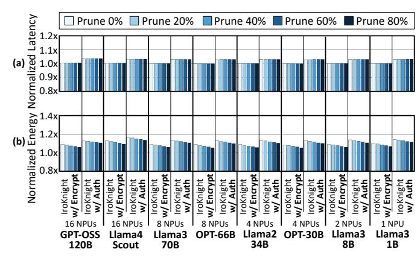

Fig. 14: Token pruning.

prototypes [147]–[149]. Recently, they have been deployed in NVIDIA's H100/H200 GPUs [47]. NPU TEEs remain academic and largely focus on adapting CPU-style trusted execution to NPUs [48]–[50]. Related efforts also explore CPU–NPU execution [150], shared off-chip memory setups [151], and restricting access from multiple GEMM engines to a global buffer and the network-on-chip [119]. None of these efforts preserve cryptographic data ownership, as plaintext persists in on-chip storage in contrast to IroKnight.

General-purpose ALU-only decryption. Prior work [152]— [154] has proposed performing encryption/decryption at ALU boundaries in general-purpose CPUs. To amortize the cost of encryption/decryption, Encrypted Data Processing (EDAP) [152] places a per-ALU plaintext buffer that caches recently referenced data. Sequestered Encryption [153] similarly retains plaintext across instructions, using a decryption cache that memoizes previously decrypted ciphertexts and a register cache that preserves live plaintext values across dependent instructions. Mojo-V [154] takes the same approach, retaining plaintext in dedicated secret registers within the CPU's register file. Across all three designs, plaintext is persistently resident in on-chip storage structures across instructions. As a result, they do not realize same-cycle encryption/decryption in practice without either severely degrading frequency or retaining plaintext in special on-chip caches. In contrast, IroKnight introduces a domain-specific NPU that leverages LLM-specific characteristics to offer same-cycle in-ALU encryption and decryption without plaintext caching or storage.

## VIII. CONCLUSION

As LLMs increasingly underpin social, economic, and national-security infrastructure, the need to preserve data ownership during inference grows increasingly urgent. To address this challenge, this work introduces IroKnight, which establishes a new paradigm for ownership-preserving neural execution. By exposing plaintext only ephemerally within the wires and gates of ALUs while keeping all on-chip storage encrypted and integrity-protected, IroKnight achieves near-FHE-level ownership without inheriting FHE's massive overheads. In doing so, IroKnight defines a new architectural foundation for practical ownership-preserving inference serving.

## REFERENCES

- [1] Stanford University, "Study exposes privacy risks of AI chatbot conversations," Stanford News, 2025, accessed: 2025. [Online]. Available: [https://news.stanford.edu/stories/2025/10/ai-chatbot-privacy](https://news.stanford.edu/stories/2025/10/ai-chatbot-privacy-concerns-risks-research) [-concerns-risks-research](https://news.stanford.edu/stories/2025/10/ai-chatbot-privacy-concerns-risks-research)
- [2] Air & Space Forces Magazine, "Fearing data leaks, army blocks air force ai program from its networks," *Air & Space Forces Magazine*, 2025. [Online]. Available: [https://www.airandspaceforces.com/fearing-d](https://www.airandspaceforces.com/fearing-data-leaks-army-blocks-air-force-ai-program-from-its-networks/) [ata-leaks-army-blocks-air-force-ai-program-from-its-networks/](https://www.airandspaceforces.com/fearing-data-leaks-army-blocks-air-force-ai-program-from-its-networks/)
- [3] IBM Security, "Cost of a data breach report 2024," IBM Corporation, 2024, accessed: 2025-10-15. [Online]. Available: <https://www.ibm.com/reports/data-breach>
- [4] Cybersecurity Ventures, "2025 Official Cybercrime Report," Cybersecurity Ventures, Tech. Rep., May 2025, accessed: April 4, 2026. [Online]. Available: [https://cybersecurityventures.com/officia](https://cybersecurityventures.com/official-cybercrime-report-2025/) [l-cybercrime-report-2025/](https://cybersecurityventures.com/official-cybercrime-report-2025/)
- [5] P. Subramanyan, R. Sinha, I. Lebedev, S. Devadas, and S. A. Seshia, "A formal foundation for secure remote execution of enclaves," in *Proceedings of the 2017 ACM SIGSAC conference on computer and communications security*, 2017, pp. 2435–2450.
- [6] A. Feldmann, N. Samardzic, A. Krastev, S. Devadas, R. Dreslinski, C. Peikert, and D. Sanchez, "F1: A Fast and Programmable Accelerator for Fully Homomorphic Encryption," in *Proceedings of the 54th annual IEEE/ACM international symposium on Microarchitecture (MICRO-54)*, October 2021.
- [7] N. Samardzic, A. Feldmann, A. Krastev, N. Manohar, N. Genise, S. Devadas, K. Eldefrawy, C. Peikert, and D. Sanchez, "Craterlake: a hardware accelerator for efficient unbounded computation on encrypted data," in *Proceedings of the 49th Annual International Symposium on Computer Architecture*, 2022, pp. 173–187.
- [8] J. Kim, G. Lee, S. Kim, G. Sohn, M. Rhu, J. Kim, and J. H. Ahn, "Ark: Fully homomorphic encryption accelerator with runtime data generation and inter-operation key reuse," in *2022 55th IEEE/ACM International Symposium on Microarchitecture (MICRO)*. IEEE, 2022, pp. 1237–1254.
- [9] J. Kim, S. Kim, J. Choi, J. Park, D. Kim, and J. H. Ahn, "Sharp: A shortword hierarchical accelerator for robust and practical fully homomorphic encryption," in *Proceedings of the 50th Annual International Symposium on Computer Architecture*, 2023, pp. 1–15.
- [10] S. Kim, J. Kim, M. J. Kim, W. Jung, J. Kim, M. Rhu, and J. H. Ahn, "Bts: An accelerator for bootstrappable fully homomorphic encryption," in *Proceedings of the 49th annual international symposium on computer architecture*, 2022, pp. 711–725.
- [11] R. Agrawal, A. Chandrakasan, and A. Joshi, "Heap: A fully homomorphic encryption accelerator with parallelized bootstrapping," in *2024 ACM/IEEE 51st Annual International Symposium on Computer Architecture (ISCA)*. IEEE, 2024, pp. 756–769.
- [12] N. Samardzic and D. Sanchez, "Bitpacker: enabling high arithmetic efficiency in fully homomorphic encryption accelerators," in *Proceedings of the 29th ACM International Conference on Architectural Support for Programming Languages and Operating Systems, Volume 2*, 2024, pp. 137–150.
- [13] X. Deng, S. Fan, Z. Hu, Z. Tian, Z. Yang, J. Yu, D. Cao, D. Meng, R. Hou, M. Li, Q. Lou, and M. Zhang, "Trinity: A general purpose fhe accelerator," in *2024 57th IEEE/ACM International Symposium on Microarchitecture (MICRO)*. IEEE, 2024, pp. 338–351.
- [14] A. Ebel, K. Garimella, and B. Reagen, "Orion: A fully homomorphic encryption framework for deep learning," in *Proceedings of the 30th ACM International Conference on Architectural Support for Programming Languages and Operating Systems, Volume 2*, 2025, pp. 734–749.
- [15] S. Fan, X. Deng, L. Kong, G. Shi, G. Fan, D. Meng, R. Hou, and M. Zhang, "Fast: An fhe accelerator for scalable-parallelism with tunable-bit," in *Proceedings of the 52nd Annual International Symposium on Computer Architecture*, 2025, pp. 92–106.
- [16] J. Kim, S. Yun, H. Ji, W. Choi, S. Kim, and J. H. Ahn, "Anaheim: Architecture and algorithms for processing fully homomorphic encryption in memory," in *2025 IEEE International Symposium on High Performance Computer Architecture (HPCA)*. IEEE, 2025, pp. 1158–1173.
- [17] A. Brutzkus, R. Gilad-Bachrach, and O. Elisha, "Low latency privacy preserving inference," in *International Conference on Machine Learning*. PMLR, 2019, pp. 812–821.
- [18] R. Podschwadt and D. Takabi, "Classification of encrypted word

- embeddings using recurrent neural networks." in *PrivateNLP@ WSDM*, 2020, pp. 27–31.
- [19] E. Lee, J.-W. Lee, J. Lee, Y.-S. Kim, Y. Kim, J.-S. No, and W. Choi, "Low-complexity deep convolutional neural networks on fully homomorphic encryption using multiplexed parallel convolutions," in *International Conference on Machine Learning*. PMLR, 2022, pp. 12 403–12 422.
- [20] R. Gilad-Bachrach, N. Dowlin, K. Laine, K. Lauter, M. Naehrig, and J. Wernsing, "Cryptonets: Applying neural networks to encrypted data with high throughput and accuracy," in *Proceedings of The 33rd International Conference on Machine Learning*, ser. Proceedings of Machine Learning Research, M. F. Balcan and K. Q. Weinberger, Eds., vol. 48. New York, New York, USA: PMLR, 20–22 Jun 2016, pp. 201–210. [Online]. Available: <https://proceedings.mlr.press/v48/gilad-bachrach16.html>
- [21] J. Götzfried, M. Eckert, S. Schinzel, and T. Müller, "Cache attacks on intel sgx," in *Proceedings of the 10th European Workshop on Systems Security*, 2017, pp. 1–6.
- [22] J. Van Bulck, M. Minkin, O. Weisse, D. Genkin, B. Kasikci, F. Piessens, M. Silberstein, T. F. Wenisch, Y. Yarom, and R. Strackx, "Ridl: Rogue in-flight data load," in *Proceedings of the 40th IEEE Symposium on Security and Privacy (SP)*. IEEE, 2019, pp. 88–105. [Online]. Available:<https://mdsattacks.com/files/ridl.pdf>
- [23] M. Schwarz, M. Lipp, D. Moghimi, J. Van Bulck, J. Stecklina, T. Prescher, and D. Gruss, "Zombieload: Cross-privilege-boundary data sampling," in *Proceedings of the 2019 ACM SIGSAC Conference on Computer and Communications Security*, 2019, pp. 753–768.
- [24] M. Li, Y. Zhang, and Z. Lin, "Crossline: Breaking" security-by-crash" based memory isolation in amd sev," in *Proceedings of the 2021 ACM SIGSAC Conference on Computer and Communications Security*, 2021, pp. 2937–2950.
- [25] S. Van Schaik, M. Minkin, A. Kwong, D. Genkin, and Y. Yarom, "Cacheout: Leaking data on intel cpus via cache evictions," in *2021 IEEE Symposium on Security and Privacy (SP)*. IEEE, 2021, pp. 339–354.
- [26] C. Canella, D. Genkin, L. Giner, D. Gruss, M. Lipp, M. Minkin, D. Moghimi, F. Piessens, M. Schwarz, B. Sunar, J. Van Bulck, and Y. Yarom, "Fallout: Leaking data on meltdown-resistant cpus," in *Proceedings of the 2019 ACM SIGSAC Conference on Computer and Communications Security*, 2019, pp. 769–784.
- [27] M. N. I. Khan, A. De, and S. Ghosh, "Cache-out: Leaking cache memory using hardware trojan," *IEEE Transactions on Very Large Scale Integration (VLSI) Systems*, vol. 28, no. 6, pp. 1461–1470, 2020.
- [28] Apple Inc., "About the security content of visionOS 2," Apple Support, Sep. 2024, "Presence — Impact: An app may be able to read sensitive data from the GPU memory. The issue was addressed with improved handling of caches.".
- [29] Z. Zhang, K. Cai, Y. Guo, F. Yao, and X. Gao, "{Invalidate+ Compare}: A {Timer-Free}{GPU} cache attack primitive," in *33rd USENIX Security Symposium (USENIX Security 24)*, 2024, pp. 2101–2118.
- [30] Cybersecurity and Infrastructure Security Agency (CISA), "Intel sidechannel l1 terminal fault (l1tf) vulnerability," [https://www.cisa.gov/new](https://www.cisa.gov/news-events/alerts/2018/08/14/intel-side-channel-l1tf-vulnerability) [s-events/alerts/2018/08/14/intel-side-channel-l1tf-vulnerability,](https://www.cisa.gov/news-events/alerts/2018/08/14/intel-side-channel-l1tf-vulnerability) 2018, accessed: 2025-10-31.
- [31] AMD, "AMD-SB-6013: Uninitialized GPU Register Access (CVE-2024- 21969)," AMD Product Security Bulletin, Aug. 2024, improper clearing of GPU registers could allow a malicious shader to read left-over pixel data, leading to loss of confidentiality.
- [32] R. Di Pietro, F. Lombardi, and A. Villani, "Cuda leaks: Information leakage in gpu architectures," *arXiv preprint arXiv:1305.7383*, 2013.
- [33] F. D. Pustelnik, X. M. Sass, and J.-P. Seifert, "Whispering pixels: Exploiting uninitialized register accesses in modern gpus," in *2024 IEEE 9th European Symposium on Security and Privacy (EuroS&P)*. IEEE, 2024, pp. 345–360.
- [34] J. Mahmod and M. Hicks, "Untrustzone: Systematic accelerated aging to expose on-chip secrets," in *2024 IEEE Symposium on Security and Privacy (SP)*. IEEE, 2024, pp. 4107–4124.
- [35] ——, "Sram has no chill: Exploiting power domain separation to steal on-chip secrets," *Communications of the ACM*, vol. 68, no. 9, September 2025, volt Boot attack—residual plaintext in caches, registers via domain power effects. [Online]. Available: [https://cacm.acm.org/research-highlights/sram-has-no-chill-exploitin](https://cacm.acm.org/research-highlights/sram-has-no-chill-exploiting-power-domain-separation-to-steal-on-chip-secrets/) [g-power-domain-separation-to-steal-on-chip-secrets/](https://cacm.acm.org/research-highlights/sram-has-no-chill-exploiting-power-domain-separation-to-steal-on-chip-secrets/)
- [36] AMD, "AMD-SB-6010: Insufficient Clearing of GPU Local Memory

- Could Leak Data (CVE-2023-4969)," AMD Product Security Bulletin, 2023, vendor advisory for LeftoverLocals mitigation modes. [Online]. Available: [https://www.amd.com/en/resources/product-security/bulletin](https://www.amd.com/en/resources/product-security/bulletin/amd-sb-6010.html) [/amd-sb-6010.html](https://www.amd.com/en/resources/product-security/bulletin/amd-sb-6010.html)
- [37] E. Feng, D. Feng, D. Du, Y. Xia, and H. Chen, "snpu: Trusted execution environments on integrated npus," in *Proceedings of the 51st IEEE/ACM International Symposium on Computer Architecture (ISCA) 2024*, 2024, pp. 708–723, discusses multitenancy risks in NPU scratchpad/NoC. [Online]. Available: [https:](https://ipads.se.sjtu.edu.cn/_media/publications/feng-isca24.pdf) [//ipads.se.sjtu.edu.cn/\\_media/publications/feng-isca24.pdf](https://ipads.se.sjtu.edu.cn/_media/publications/feng-isca24.pdf)
- [38] CERT Coordination Center, "Vu#446598 gpu kernel implementations susceptible to memory leak," CERT Vulnerability Note, 2024, vendor statements on LeftoverLocals affecting AMD, Apple, Qualcomm. [Online]. Available:<https://kb.cert.org/vuls/id/446598>
- [39] Trail of Bits, "Leftoverlocals," Vulnerability disclosure website, 2024, gPU local memory plaintext recovery across processes. [Online]. Available:<https://leftoverlocals.com/>
- [40] Intel Corporation, "Microarchitectural data sampling," [https://www.inte](https://www.intel.com/content/www/us/en/developer/articles/technical/software-security-guidance/advisory-guidance/microarchitectural-data-sampling.html) [l.com/content/www/us/en/developer/articles/technical/software-securit](https://www.intel.com/content/www/us/en/developer/articles/technical/software-security-guidance/advisory-guidance/microarchitectural-data-sampling.html) [y-guidance/advisory-guidance/microarchitectural-data-sampling.html,](https://www.intel.com/content/www/us/en/developer/articles/technical/software-security-guidance/advisory-guidance/microarchitectural-data-sampling.html) 2019, accessed: 2025-10-31.
- [41] Qualcomm Technologies, Inc., "Qualcomm security bulletin june 2025," [https://docs.qualcomm.com/product/publicresources/securitybull](https://docs.qualcomm.com/product/publicresources/securitybulletin/june-2025-bulletin.html) [etin/june-2025-bulletin.html,](https://docs.qualcomm.com/product/publicresources/securitybulletin/june-2025-bulletin.html) 2025, accessed: 2025-10-31.
- [42] CERT Coordination Center, Software Engineering Institute, Carnegie Mellon University, "Vulnerability note vu#446598: GPGPU driver information disclosure vulnerability on windows and linux," [https:](https://www.kb.cert.org/vuls/id/446598) [//www.kb.cert.org/vuls/id/446598,](https://www.kb.cert.org/vuls/id/446598) 2024, accessed: 2025-10-31.
- [43] N. Corporation, "Security bulletin: NVIDIA GPU display driver – january 2025," 2025, accessed: 2025-10-31.
- [44] V. Costan and S. Devadas, "Intel sgx explained," *Cryptology ePrint Archive*, 2016.
- [45] S. API, "Secure encrypted virtualization api version 0.22," 2019.
- [46] S. Pinto and N. Santos, "Demystifying arm trustzone: A comprehensive survey," *ACM computing surveys (CSUR)*, vol. 51, no. 6, pp. 1–36, 2019.
- [47] R. Nertney, "Announcing confidential computing general access on NVIDIA h100 tensor core gpus," [https://developer.nvidia.com/blog/an](https://developer.nvidia.com/blog/announcing-confidential-computing-general-access-on-nvidia-h100-tensor-core-gpus/) [nouncing-confidential-computing-general-access-on-nvidia-h100-ten](https://developer.nvidia.com/blog/announcing-confidential-computing-general-access-on-nvidia-h100-tensor-core-gpus/) [sor-core-gpus/,](https://developer.nvidia.com/blog/announcing-confidential-computing-general-access-on-nvidia-h100-tensor-core-gpus/) April 2024, nVIDIA Technical Blog.
- [48] S. Lee, J. Kim, S. Na, J. Park, and J. Huh, "Tnpu: Supporting trusted execution with tree-less integrity protection for neural processing unit," in *2022 IEEE International Symposium on High-Performance Computer Architecture (HPCA)*. IEEE, 2022, pp. 229–243.
- [49] W. Hua, M. Umar, Z. Zhang, and G. E. Suh, "Mgx: Near-zero overhead memory protection for data-intensive accelerators," in *Proceedings of the 49th Annual International Symposium on Computer Architecture*, 2022, pp. 726–741.
- [50] N. Shrivastava and S. R. Sarangi, "Securator: A fast and secure neural processing unit," in *2023 IEEE International Symposium on High-Performance Computer Architecture (HPCA)*. IEEE, 2023, pp. 1127– 1139.
- [51] K. Vaswani, S. Volos, C. Fournet, A. N. Diaz, K. Gordon, B. Vembu, S. Webster, D. Chisnall, S. Kulkarni, G. Cunningham, R. Osborne, and D. Wilkinson, "Confidential computing within an {AI} accelerator," in *2023 USENIX Annual Technical Conference (USENIX ATC 23)*, 2023, pp. 501–518.
- [52] MITRE Corporation, "CVE-2020-28343: Samsung NPU driver arbitrary code execution," National Vulnerability Database, 2020. [Online]. Available:<https://nvd.nist.gov/vuln/detail/CVE-2020-28343>
- [53] Samsung Mobile Security, "CVE-2022-22265: Samsung mobile devices NPU driver use-after-free vulnerability," National Vulnerability Database, 2022. [Online]. Available: [https://nvd.nist.gov/vuln/detail/C](https://nvd.nist.gov/vuln/detail/CVE-2022-22265) [VE-2022-22265](https://nvd.nist.gov/vuln/detail/CVE-2022-22265)
- [54] M. Peterlin, "Reversing and exploiting Samsung's NPU (part 2)," Impalabs Security Blog, 2021. [Online]. Available: [https:](https://blog.impalabs.com/2110_exploiting-samsung-npu.html) [//blog.impalabs.com/2110\\_exploiting-samsung-npu.html](https://blog.impalabs.com/2110_exploiting-samsung-npu.html)
- [55] MITRE Corporation, "CVE-2023-45864: Samsung Exynos NPU race condition," National Vulnerability Database, 2023. [Online]. Available: <https://nvd.nist.gov/vuln/detail/CVE-2023-45864>
- [56] M. Y. Mo, "GHSL-2021-1029 / CVE-2021-1940: Use-after-free in Qualcomm NPU driver," GitHub Security Lab Advisory, 2021. [Online]. Available: [https://securitylab.github.com/advisories/GHSL-2021-1029-n](https://securitylab.github.com/advisories/GHSL-2021-1029-npu/) [pu/](https://securitylab.github.com/advisories/GHSL-2021-1029-npu/)

- [57] ——, "GHSL-2021-1030 / CVE-2021-1968: Information leak in Qualcomm NPU driver," GitHub Security Lab Advisory, 2021. [Online]. Available: [https://securitylab.github.com/advisories/GHSL-2021-1030-n](https://securitylab.github.com/advisories/GHSL-2021-1030-npu/) [pu/](https://securitylab.github.com/advisories/GHSL-2021-1030-npu/)
- [58] ——, "GHSL-2022-038 / CVE-2022-22068: Use-after-free in Qualcomm NPU driver," GitHub Security Lab Advisory, 2022. [Online]. Available: [https://securitylab.github.com/advisories/GHSL-2022-038\\_m](https://securitylab.github.com/advisories/GHSL-2022-038_msm_kernel/) [sm\\_kernel/](https://securitylab.github.com/advisories/GHSL-2022-038_msm_kernel/)
- [59] Qualcomm Technologies, Inc., "CVE-2024-43047: Use-after-free in Qualcomm DSP service," Qualcomm Security Bulletin, 2024. [Online]. Available:<https://nvd.nist.gov/vuln/detail/CVE-2024-43047>
- [60] MITRE Corporation, "CVE-2021-22388: Arbitrary code execution in Huawei NPU driver," National Vulnerability Database, 2021. [Online]. Available:<https://nvd.nist.gov/vuln/detail/CVE-2021-22388>
- [61] TASZK Security Labs, "CVE-2021-22412: Huawei NPU kernel driver shared memory out-of-bounds write," TASZK Security Labs Advisory, 2021. [Online]. Available: [https://labs.taszk.io/blog/post/55\\_hw\\_npu\\_oo](https://labs.taszk.io/blog/post/55_hw_npu_oob_write/) [b\\_write/](https://labs.taszk.io/blog/post/55_hw_npu_oob_write/)
- [62] Advanced Micro Devices, Inc., "CVE-2024-36336: Integer overflow in AMD Ryzen AI NPU driver," AMD Product Security Bulletin AMD-SB-7037, 2024. [Online]. Available: [https://nvd.nist.gov/vuln/de](https://nvd.nist.gov/vuln/detail/CVE-2024-36336) [tail/CVE-2024-36336](https://nvd.nist.gov/vuln/detail/CVE-2024-36336)
- [63] ——, "CVE-2025-0014: Incorrect default permissions in AMD Ryzen AI software enabling privilege escalation," AMD Product Security Bulletin AMD-SB-7037, 2025. [Online]. Available: [https:](https://nvd.nist.gov/vuln/detail/CVE-2025-0014) [//nvd.nist.gov/vuln/detail/CVE-2025-0014](https://nvd.nist.gov/vuln/detail/CVE-2025-0014)
- [64] L. Goldstein, "Controllability/observability analysis of digital circuits," *IEEE Transactions on Circuits and Systems*, vol. 26, no. 9, pp. 685–693, 2003.
- [65] N. P. Jouppi, C. Young, N. Patil, D. Patterson, G. Agrawal, R. Bajwa, S. Bates, S. Bhatia, N. Boden, A. Borchers, R. Boyle, P.-l. Cantin, C. Chao, C. Clark, J. Coriell, M. Daley, M. Dau, J. Dean, B. Gelb, T. V. Ghaemmaghami, R. Gottipati, W. Gulland, R. Hagmann, C. R. Ho, D. Hogberg, J. Hu, R. Hundt, D. Hurt, J. Ibarz, A. Jaffey, A. Jaworski, A. Kaplan, H. Khaitan, D. Killebrew, A. Koch, N. Kumar, S. Lacy, J. Laudon, J. Law, D. Le, C. Leary, Z. Liu, K. Lucke, A. Lundin, G. MacKean, A. Maggiore, M. Mahony, K. Miller, R. Nagarajan, R. Narayanaswami, R. Ni, K. Nix, T. Norrie, M. Omernick, N. Penukonda, A. Phelps, J. Ross, M. Ross, A. Salek, E. Samadiani, C. Severn, G. Sizikov, M. Snelham, J. Souter, D. Steinberg, A. Swing, M. Tan, G. Thorson, B. Tian, H. Toma, E. Tuttle, V. Vasudevan, R. Walter, W. Wang, E. Wilcox, and D. H. Yoon, "In-datacenter performance analysis of a tensor processing unit," in *ISCA*, 2017.
- [66] Y.-H. Chen, J. Emer, and V. Sze, "Eyeriss: A spatial architecture for energy-efficient dataflow for convolutional neural networks," in *ISCA*, 2016.
- [67] T. Chen, Z. Du, N. Sun, J. Wang, C. Wu, Y. Chen, and O. Temam, "Diannao: a small-footprint high-throughput accelerator for ubiquitous machine-learning," in *ASPLOS*, 2014.
- [68] J. Choquette, W. Gandhi, O. Giroux, N. Stam, and R. Krashinsky, "Nvidia a100 tensor core gpu: Performance and innovation," *IEEE Micro*, vol. 41, no. 2, pp. 29–35, 2021.
- [69] J. Choquette, "Nvidia hopper h100 gpu: Scaling performance," *IEEE Micro*, vol. 43, no. 3, pp. 9–17, 2023.
- [70] E. Apsey, P. Rogers, M. O'Connor, and R. Nertney, "Confidential computing on nvidia h100 gpus for secure and trustworthy ai," NVIDIA Technical Blog, Aug. 2023, introduces confidential computing on the H100 GPU with a hardware root of trust, attestation, and secure execution modes. [Online]. Available: [https://developer.nvidia.com/blog/](https://developer.nvidia.com/blog/confidential-computing-on-h100-gpus-for-secure-and-trustworthy-ai/) [confidential-computing-on-h100-gpus-for-secure-and-trustworthy-ai/](https://developer.nvidia.com/blog/confidential-computing-on-h100-gpus-for-secure-and-trustworthy-ai/)
- [71] A. Olgun, M. Osseiran, A. G. Yaglıkçı, Y. C. Tu ˘ grul, H. Luo, S. Rhyner, ˘ B. Salami, J. G. Luna, and O. Mutlu, "Read disturbance in high bandwidth memory: A detailed experimental study on hbm2 dram chips," in *2024 54th Annual IEEE/IFIP International Conference on Dependable Systems and Networks (DSN)*. IEEE, 2024, pp. 75–89.
- [72] ——, "An experimental analysis of rowhammer in hbm2 dram chips," in *2023 53rd Annual IEEE/IFIP International Conference on Dependable Systems and Networks-Supplemental Volume (DSN-S)*. IEEE, 2023, pp. 151–156.
- [73] Z. Zhang and Q. Yu, "Modeling hardware trojans in 3d ics," in *2019 IEEE Computer Society Annual Symposium on VLSI (ISVLSI)*. IEEE, 2019, pp. 483–488.
- [74] C. S. Lin, J. Qu, and G. Saileshwar, "Gpuhammer: Rowhammer attacks on gpu memories are practical," 2025. [Online]. Available:

- <https://arxiv.org/abs/2507.08166>
- [75] C. S. Lin, Y. Yan, G. Ding, J. Qu, J. Zhu, D. Lie, and G. Saileshwar, "GPUBreach: Privilege escalation attacks on GPUs using rowhammer," in *Proceedings of the 47th IEEE Symposium on Security and Privacy*, ser. SP '26, 2026.
- [76] J. Wan, Y. Guo, Z. Zhang, Z. Li, D. J. Tian, and Z. Zhang, "Geforge: Hammering gddr memory to forge gpu page tables for fun and profit," in *Proceedings of the 2026 IEEE Symposium on Security and Privacy (SP)*. San Francisco, CA, USA: IEEE, May 2026.
- [77] G. Dhanuskodi, S. Guha, V. Krishnan, A. Manjunatha, M. O'Connor, R. Nertney, and P. Rogers, "Creating the first confidential gpus: The team at nvidia brings confidentiality and integrity to user code and data for accelerated computing." *Queue*, vol. 21, no. 4, pp. 68–93, 2023.
- [78] S. Gueron and M. E. Kounavis, "Intel® carry-less multiplication instruction and its usage for computing the gcm mode," *White Paper*, p. 10, 2010.
- [79] S. Volos, K. Vaswani, and R. Bruno, "Graviton: Trusted execution environments on gpus," in *USENIX Symposium on Operating Systems Design and Implementation*, 2018.
- [80] M. Umar, W. Hua, Z. Zhang, and G. E. Suh, "Softvn: Efficient memory protection via software-provided version numbers," in *Proceedings of the 49th Annual International Symposium on Computer Architecture*, 2022, pp. 160–172.
- [81] Y. Tan, C. Tan, Z. Mi, and H. Chen, "Pipellm: Fast and confidential large language model services with speculative pipelined encryption," in *Proceedings of the 30th ACM International Conference on Architectural Support for Programming Languages and Operating Systems, Volume 1*, 2025, pp. 843–857.
- [82] J. Park, N. Kang, T. Kim, Y. Kwon, and J. Huh, "Nested enclave: Supporting fine-grained hierarchical isolation with sgx," in *2020 ACM/IEEE 47th annual international symposium on computer architecture (ISCA)*. IEEE, 2020, pp. 776–789.
- [83] C. Li, J. Zhao, and Y. Xu, "Efficient security support for cxl memory through adaptive incremental offloaded (re-) encryption," in *Proceedings of the 58th IEEE/ACM International Symposium on Microarchitecture®*, 2025, pp. 1102–1116.
- [84] M. J. Dworkin, *Sp 800-38d. recommendation for block cipher modes of operation: Galois/counter mode (gcm) and gmac*. National Institute of Standards & Technology, 2007.
- [85] D. Canright, "A very compact s-box for aes," in *International Workshop on Cryptographic Hardware and Embedded Systems*. Springer, 2005, pp. 441–455.
- [86] N. P. Jouppi, D. Hyun Yoon, M. Ashcraft, M. Gottscho, T. B. Jablin, G. Kurian, J. Laudon, S. Li, P. Ma, X. Ma, T. Norrie, N. Patil, S. Prasad, C. Young, Z. Zhou, and D. Patterson, "Ten lessons from three generations shaped google's tpuv4i : Industrial product," in *ISCA*, 2021.
- [87] H. Genc, S. Kim, A. Amid, A. Haj-Ali, V. Iyer, P. Prakash, J. Zhao, D. Grubb, H. Liew, H. Mao, A. Ou, C. Schmidt, S. Steffl, J. Wright, I. Stoica, J. Ragan-Kelley, K. Asanovic, B. Nikolic, and Y. S. Shao, "Gemmini: Enabling systematic deep-learning architecture evaluation via full-stack integration," in *2021 58th ACM/IEEE Design Automation Conference (DAC)*. IEEE, 2021, pp. 769–774.
- [88] E. Kilgariff, H. Moreton, N. Stam, and B. Bell, "Nvidia turing architecture in-depth," [https://developer.nvidia.com/blog/nvidia-t](https://developer.nvidia.com/blog/nvidia-turing-architecture-in-depth/) [uring-architecture-in-depth/,](https://developer.nvidia.com/blog/nvidia-turing-architecture-in-depth/) Sep. 2018, accessed: 2025-10-31.
- [89] J. Fowers, K. Ovtcharov, M. Papamichael, T. Massengill, M. Liu, D. Lo, S. Alkalay, M. Haselman, L. Adams, M. Ghandi, S. Heil, P. Patel, A. Sapek, G. Weisz, L. Woods, S. Lanka, S. K. Reinhardt, A. M. Caulfield, E. S. Chung, and D. Burger, "A configurable cloudscale dnn processor for real-time ai," in *2018 ACM/IEEE 45th Annual International Symposium on Computer Architecture (ISCA)*. IEEE, 2018, pp. 1–14.
- [90] W. Lacy, G. M. Thorson, C. A. Clark, N. P. Jouppi, T. Norrie, and A. E. Phelps, "Vector processing unit," U.S. Patent US11 520 581B2, December, 2022.
- [91] Y. Xue, Y. Liu, L. Nai, and J. Huang, "Hardware-assisted virtualization of neural processing units for cloud platforms," in *2024 57th IEEE/ACM International Symposium on Microarchitecture (MICRO)*. IEEE, 2024, pp. 1–16.
- [92] S. Ghodrati, S. Kinzer, H. Xu, R. Mahapatra, B. H. Ahn, D. K. Wang, L. Karthikeyan, A. Yazdanbakhsh, J. Park, N. S. Kim, and H. Esmaeilzadeh, "Tandem processor: Grappling with emerging operators in neural networks," in *ASPLOS*, 2024.

- [93] J. Qin, T. Xia, C. Tan, J. Zhang, and S. Q. Zhang, "Picachu: Plug-in cgra handling upcoming nonlinear operations in llms," in *Proceedings of the 30th ACM International Conference on Architectural Support for Programming Languages and Operating Systems, Volume 2*, 2025, pp. 845–861.
- [94] Y. Leviathan, M. Kalman, and Y. Matias, "Fast inference from transformers via speculative decoding," in *International Conference on Machine Learning*. PMLR, 2023, pp. 19 274–19 286.
- [95] Q. Fu, M. Cho, T. Merth, S. Mehta, M. Rastegari, and M. Najibi, "Lazyllm: Dynamic token pruning for efficient long context llm inference," *arXiv preprint arXiv:2407.14057*, 2024.
- [96] R. L. Rivest, A. Shamir, and L. Adleman, "A method for obtaining digital signatures and public-key cryptosystems," *Communications of the ACM*, vol. 21, no. 2, pp. 120–126, 1978.
- [97] Llama Team, AI @ Meta, "The llama 3 herd of models," *arXiv preprint arXiv:2407.21783*, 2024.
- [98] H. Touvron, L. Martin, K. Stone, P. Albert, A. Almahairi, Y. Babaei, N. Bashlykov, S. Batra, P. Bhargava, S. Bhosale, D. Bikel, L. Blecher, C. C. Ferrer, M. Chen, G. Cucurull, D. Esiobu, J. Fernandes, J. Fu, W. Fu, B. Fuller, C. Gao, V. Goswami, N. Goyal, A. Hartshorn, S. Hosseini, R. Hou, H. Inan, M. Kardas, V. Kerkez, M. Khabsa, I. Kloumann, A. Korenev, P. S. Koura, M.-A. Lachaux, T. Lavril, J. Lee, D. Liskovich, Y. Lu, Y. Mao, X. Martinet, T. Mihaylov, P. Mishra, I. Molybog, Y. Nie, A. Poulton, J. Reizenstein, R. Rungta, K. Saladi, A. Schelten, R. Silva, E. M. Smith, R. Subramanian, X. E. Tan, B. Tang, R. Taylor, A. Williams, J. X. Kuan, P. Xu, Z. Yan, I. Zarov, Y. Zhang, A. Fan, M. Kambadur, S. Narang, A. Rodriguez, R. Stojnic, S. Edunov, and T. Scialom, "Llama 2: Open foundation and fine-tuned chat models," *arXiv preprint arXiv:2307.09288*, 2023.
- [99] S. Zhang, S. Roller, N. Goyal, M. Artetxe, M. Chen, S. Chen, C. Dewan, M. Diab, X. Li, X. V. Lin, T. Mihaylov, M. Ott, S. Shleifer, K. Shuster, D. Simig, P. S. Koura, A. Sridhar, T. Wang, and L. Zettlemoyer, "Opt: Open pre-trained transformer language models," *arXiv preprint arXiv:2205.01068*, 2022.
- [100] Meta AI, "The Llama 4 herd: The beginning of a new era of natively multimodal AI innovation," [https://ai.meta.com/blog/llama-4-multimo](https://ai.meta.com/blog/llama-4-multimodal-intelligence/) [dal-intelligence/,](https://ai.meta.com/blog/llama-4-multimodal-intelligence/) April 2025, accessed: 2026-02-19.
- [101] S. Agarwal, L. Ahmad, J. Ai, S. Altman, A. Applebaum, E. Arbus, R. K. Arora, Y. Bai, B. Baker, H. Bao *et al.*, "gpt-oss-120b & gpt-oss-20b model card," *arXiv preprint arXiv:2508.10925*, 2025.
- [102] Y. Mei, Y. Zhuang, X. Miao, J. Yang, Z. Jia, and R. Vinayak, "Helix: Serving large language models over heterogeneous gpus and network via max-flow," in *Proceedings of the 30th ACM International Conference on Architectural Support for Programming Languages and Operating Systems, Volume 1*, 2025, pp. 586–602.
- [103] R. Y. Aminabadi, S. Rajbhandari, M. Zhang, A. A. Awan, C. Li, D. Li, E. Zheng, J. Rasley, S. Smith, O. Ruwase, and Y. He, "Deepspeed-inference: enabling efficient inference of transformer models at unprecedented scale," in *SC22: International Conference for High Performance Computing, Networking, Storage and Analysis*. IEEE, 2022, pp. 1–15.
- [104] "FreePDK45," [https://www.eda.ncsu.edu/wiki/FreePDK45.](https://www.eda.ncsu.edu/wiki/FreePDK45)
- [105] M. R. Guthaus, J. E. Stine, S. Ataei, B. Chen, B. Wu, and M. Sarwar, "Openram: An open-source memory compiler," in *Proceedings of the 35th International Conference on Computer-Aided Design*, 2016, pp. 1–6.
- [106] S. Sarangi and B. Baas, "Deepscaletool: A tool for the accurate estimation of technology scaling in the deep-submicron era," in *ISCAS*, 2021.
- [107] S. Li, D. Reddy, and B. Jacob, "A performance & power comparison of modern high-speed dram architectures," in *Proceedings of the International Symposium on Memory Systems*, ser. MEMSYS '18. New York, NY, USA: Association for Computing Machinery, 2018, p. 341–353. [Online]. Available:<https://doi.org/10.1145/3240302.3240315>
- [108] N. Muralimanohar, R. Balasubramonian, and N. P. Jouppi, "Cacti 6.0: A tool to model large caches," *HP laboratories*, vol. 27, p. 28, 2009.
- [109] M. O'Connor, N. Chatterjee, D. Lee, J. Wilson, A. Agrawal, S. W. Keckler, and W. J. Dally, "Fine-grained dram: Energy-efficient dram for extreme bandwidth systems," in *Proceedings of the 50th Annual IEEE/ACM International Symposium on Microarchitecture*, 2017, pp. 41–54.
- [110] Y. Sun, Y. Yuan, Z. Yu, R. Kuper, C. Song, J. Huang, H. Ji, S. Agarwal, J. Lou, I. Jeong, R. Wang, J. H. Ahn, T. Xu, and N. S. Kim, "Demystifying cxl memory with genuine cxl-ready systems and devices,"

- in *Proceedings of the 56th Annual IEEE/ACM International Symposium on Microarchitecture*, 2023, pp. 105–121.
- [111] C. Juvekar, V. Vaikuntanathan, and A. Chandrakasan, "GAZELLE: A low latency framework for secure neural network inference," in *27th USENIX Security Symposium (USENIX Security 18)*. Baltimore, MD: USENIX Association, Aug. 2018, pp. 1651–1669. [Online]. Available: [https://www.usenix.org/conference/usenixsecurity18/presentation/juve](https://www.usenix.org/conference/usenixsecurity18/presentation/juvekar) [kar](https://www.usenix.org/conference/usenixsecurity18/presentation/juvekar)
- [112] J.-W. Lee, H. Kang, Y. Lee, W. Choi, J. Eom, M. Deryabin, E. Lee, J. Lee, D. Yoo, Y.-S. Kim, and J.-S. No, "Privacy-preserving machine learning with fully homomorphic encryption for deep neural network," *iEEE Access*, vol. 10, pp. 30 039–30 054, 2022.
- [113] E. Lee, J.-W. Lee, J.-S. No, and Y.-S. Kim, "Minimax approximation of sign function by composite polynomial for homomorphic comparison," *IEEE Transactions on Dependable and Secure Computing*, vol. 19, no. 6, pp. 3711–3727, 2021.
- [114] W. Cho, G. Hanrot, T. Kim, M. Park, and D. Stehlé, "Fast and accurate homomorphic softmax evaluation," in *Proceedings of the 2024 on ACM SIGSAC Conference on Computer and Communications Security*, 2024, pp. 4391–4404.
- [115] R. Dathathri, O. Saarikivi, H. Chen, K. Laine, K. Lauter, S. Maleki, M. Musuvathi, and T. Mytkowicz, "Chet: an optimizing compiler for fully-homomorphic neural-network inferencing," in *Proceedings of the 40th ACM SIGPLAN conference on programming language design and implementation*, 2019, pp. 142–156.
- [116] M. Kim, S. Hong, R. Ko, S. Choi, H. Lee, J. Kim, J.-Y. Kim, and J. Park, "Oaken: Fast and efficient llm serving with online-offline hybrid kv cache quantization," in *Proceedings of the 52nd Annual International Symposium on Computer Architecture*, 2025, pp. 482–497.
- [117] F. Ghodsian, A. Elmeleegy, J. Li, and S. Koparkar, "NVIDIA Blackwell Leads on SemiAnalysis InferenceMAX™ v1 Benchmarks," [https://deve](https://developer.nvidia.com/blog/nvidia-blackwell-leads-on-new-semianalysis-inferencemax-benchmarks/) [loper.nvidia.com/blog/nvidia-blackwell-leads-on-new-semianalysis-inf](https://developer.nvidia.com/blog/nvidia-blackwell-leads-on-new-semianalysis-inferencemax-benchmarks/) [erencemax-benchmarks/,](https://developer.nvidia.com/blog/nvidia-blackwell-leads-on-new-semianalysis-inferencemax-benchmarks/) Oct. 2025, nVIDIA Developer Blog, October 13 2025.
- [118] P. Patel, E. Choukse, C. Zhang, Í. Goiri, B. Warrier, N. Mahalingam, and R. Bianchini, "Characterizing power management opportunities for llms in the cloud," in *Proceedings of the 29th ACM International Conference on Architectural Support for Programming Languages and Operating Systems, Volume 3*, 2024, pp. 207–222.
- [119] E. Feng, D. Feng, D. Du, Y. Xia, and H. Chen, "snpu: Trusted execution environments on integrated npus," in *2024 ACM/IEEE 51st Annual International Symposium on Computer Architecture (ISCA)*. IEEE, 2024, pp. 708–723.
- [120] G.-I. Yu, J. S. Jeong, G.-W. Kim, S. Kim, and B.-G. Chun, "Orca: A distributed serving system for {Transformer-Based} generative models," in *16th USENIX Symposium on Operating Systems Design and Implementation (OSDI 22)*, 2022, pp. 521–538.
- [121] N. Timor, J. Mamou, D. Korat, M. Berchansky, G. Jain, O. Pereg, M. Wasserblat, and D. Harel, "Accelerating LLM inference with lossless speculative decoding algorithms for heterogeneous vocabularies," in *Forty-second International Conference on Machine Learning*, 2025.
- [122] J. Li, C. Yu, and H. Guo, "An Introduction to Speculative Decoding for Reducing Latency in AI Inference," [https://developer.nvidia.com/b](https://developer.nvidia.com/blog/an-introduction-to-speculative-decoding-for-reducing-latency-in-ai-inference/) [log/an-introduction-to-speculative-decoding-for-reducing-latency-in-a](https://developer.nvidia.com/blog/an-introduction-to-speculative-decoding-for-reducing-latency-in-ai-inference/) [i-inference/,](https://developer.nvidia.com/blog/an-introduction-to-speculative-decoding-for-reducing-latency-in-ai-inference/) Sep. 2025, nVIDIA Developer Blog, September 17 2025.
- [123] R. Agrawal, L. de Castro, G. Yang, C. Juvekar, R. Yazicigil, A. Chandrakasan, V. Vaikuntanathan, and A. Joshi, "Fab: An fpga-based accelerator for bootstrappable fully homomorphic encryption," in *2023 IEEE International Symposium on High-Performance Computer Architecture (HPCA)*. IEEE, 2023, pp. 882–895.
- [124] B. Reagen, W.-S. Choi, Y. Ko, V. T. Lee, H.-H. S. Lee, G.-Y. Wei, and D. Brooks, "Cheetah: Optimizing and accelerating homomorphic encryption for private inference," in *2021 IEEE International Symposium on High-Performance Computer Architecture (HPCA)*, 2021, pp. 26–39.
- [125] Y. Yang, H. Zhang, S. Fan, H. Lu, M. Zhang, and X. Li, "Poseidon: Practical homomorphic encryption accelerator," in *2023 IEEE International Symposium on High-Performance Computer Architecture (HPCA)*. IEEE, 2023, pp. 870–881.
- [126] Y. Yang, X. Xu, H. Zhang, J. Song, X. Tang, H. Lu, and X. Li, "Hydra: Scale-out fhe accelerator architecture for secure deep learning on fpga."
- [127] Y. Park, A. Amarnath, S. Pal, K. Swaminathan, A. Buyuktosunoglu, H. Shaul, E. Aharoni, N. Drucker, W. D. Lu, O. Soceanu, and P. Bose, "Fhendi: A near-dram accelerator for compiler-generated fully homomorphic encryption applications," in *IEEE International*

- *Symposium on High Performance Computer Architecture*, 2025.
- [128] M. Kabra, R. Nadig, H. Gupta, R. Bera, M. Frouzakis, V. Arulchelvan, Y. Liang, H. Mao, M. Sadrosadati, and O. Mutlu, "Ciphermatch: Accelerating homomorphic encryption-based string matching via memoryefficient data packing and in-flash processing," in *Proceedings of the 30th ACM International Conference on Architectural Support for Programming Languages and Operating Systems, Volume 2*, 2025, pp. 111–130.
- [129] S. Fan, X. Deng, L. Kong, G. Shi, G. Fan, D. Meng, R. Hou, and M. Zhang, "Fast: An fhe accelerator for scalable-parallelism with tunable-bit," in *Proceedings of the 52nd Annual International Symposium on Computer Architecture*, 2025, pp. 92–106.
- [130] P. Mohassel and Y. Zhang, "Secureml: A system for scalable privacypreserving machine learning," *2017 IEEE Symposium on Security and Privacy (SP)*, pp. 19–38, 2017.
- [131] P. Mishra, R. Lehmkuhl, A. Srinivasan, W. Zheng, and R. A. Popa, "Delphi: A cryptographic inference system for neural networks," in *Proceedings of the 2020 Workshop on Privacy-Preserving Machine Learning in Practice*, ser. PPMLP'20. New York, NY, USA: Association for Computing Machinery, 2020, p. 27–30. [Online]. Available:<https://doi.org/10.1145/3411501.3419418>
- [132] B. Knott, S. Venkataraman, A. Hannun, S. Sengupta, M. Ibrahim, and L. van der Maaten, "CrypTen: Secure Multi-Party Computation Meets Machine Learning," Sep. 2022, arXiv:2109.00984 [cs]. [Online]. Available:<http://arxiv.org/abs/2109.00984>
- [133] N. Kumar, M. Rathee, N. Chandran, D. Gupta, A. Rastogi, and R. Sharma, "CrypTFlow: Secure TensorFlow Inference," in *2020 IEEE Symposium on Security and Privacy (SP)*. San Francisco, CA, USA: IEEE, May 2020, pp. 336–353. [Online]. Available: <https://ieeexplore.ieee.org/document/9152660/>
- [134] X. Zhou, Z. Xu, C. Wang, and M. Gao, "PPMLAC: high performance chipset architecture for secure multi-party computation," in *Proceedings of the 49th Annual International Symposium on Computer Architecture*, ser. ISCA '22. New York, NY, USA: Association for Computing Machinery, Jun. 2022, pp. 87–101. [Online]. Available:<https://dl.acm.org/doi/10.1145/3470496.3527392>
- [135] S. Wagh, D. Gupta, and N. Chandran, "SecureNN: Efficient and Private Neural Network Training," Cryptology ePrint Archive, Paper 2018/442, 2018, [https://eprint.iacr.org/2018/442.](https://eprint.iacr.org/2018/442) [Online]. Available: <https://eprint.iacr.org/2018/442>
- [136] D. Li, R. Shao, H. Wang, H. Guo, E. P. Xing, and H. Zhang, "MPCFormer: fast, performant and private Transformer inference with MPC," Mar. 2023, arXiv:2211.01452 [cs]. [Online]. Available: <http://arxiv.org/abs/2211.01452>
- [137] S. Tan, B. Knott, Y. Tian, and D. J. Wu, "Cryptgpu: Fast privacypreserving machine learning on the gpu," in *2021 IEEE Symposium on Security and Privacy (SP)*, 2021, pp. 1021–1038.
- [138] Y. Wang, R. Rajat, and M. Annavaram, "Mpc-pipe: An efficient pipeline scheme for semi-honest mpc machine learning," in *Proceedings of the 29th ACM International Conference on Architectural Support for Programming Languages and Operating Systems, Volume 4*, 2024, pp. 203–219.
- [139] P. Huang, T. Hoang, Y. Li, E. Shi, and G. E. Suh, "Stamp: lightweight tee-assisted mpc for efficient privacy-preserving machine learning," *arXiv preprint arXiv:2210.10133*, 2022.
- [140] S. Wagh, S. Tople, F. Benhamouda, E. Kushilevitz, P. Mittal, and T. Rabin, "Falcon: Honest-majority maliciously secure framework for private deep learning," 2020.
- [141] F. Mireshghallah, M. Taram, P. Ramrakhyani, A. Jalali, D. Tullsen, and H. Esmaeilzadeh, "Shredder: Learning noise distributions to protect inference privacy," in *Proceedings of the Twenty-Fifth International Conference on Architectural Support for Programming Languages and Operating Systems*, ser. ASPLOS '20. New York, NY, USA: Association for Computing Machinery, April 2020, p. 3–18. [Online]. Available:<https://doi.org/10.1145/3373376.3378522>
- [142] F. Mireshghallah, M. Taram, A. Jalali, A. T. T. Elthakeb, D. Tullsen, and H. Esmaeilzadeh, "Not all features are equal: Discovering essential features for preserving prediction privacy," in *Proceedings of the Web Conference 2021*, 2021, pp. 669–680.
- [143] B. McMahan, E. Moore, D. Ramage, S. Hampson, and B. A. y Arcas, "Communication-efficient learning of deep networks from decentralized data," in *Artificial intelligence and statistics*. PMLR, 2017, pp. 1273– 1282.
- [144] M. Abadi, A. Chu, I. Goodfellow, H. B. McMahan, I. Mironov,

- K. Talwar, and L. Zhang, "Deep learning with differential privacy," in *Proceedings of the 2016 ACM SIGSAC conference on computer and communications security*, 2016, pp. 308–318.
- [145] C. Dwork, F. McSherry, K. Nissim, and A. Smith, "Calibrating noise to sensitivity in private data analysis," in *Theory of cryptography conference*. Springer, 2006, pp. 265–284.
- [146] D. Kaplan, J. Powell, and T. Woller, "Amd memory encryption," *White paper*, vol. 13, p. 12, 2016.
- [147] D. Lee, D. Kohlbrenner, S. Shinde, K. Asanovic, and D. Song, ´ "Keystone: An open framework for architecting trusted execution environments," in *EuroSys '20: Proceedings of the Fifteenth European Conference on Computer Systems*, ser. EuroSys '20. New York, NY, USA: Association for Computing Machinery, 2020. [Online]. Available: <https://doi.org/10.1145/3342195.3387532>
- [148] T. Bourgeat, I. Lebedev, A. Wright, S. Zhang, Arvind, and S. Devadas, "Mi6: Secure enclaves in a speculative out-of-order processor," in *Proceedings of the 52nd Annual IEEE/ACM International Symposium on Microarchitecture*, 2019, pp. 42–56.
- [149] V. Costan, I. Lebedev, and S. Devadas, "Sanctum: Minimal hardware extensions for strong software isolation," in *25th USENIX Security Symposium (USENIX Security 16)*, 2016, pp. 857–874.
- [150] H. Han, X. Zheng, Y. Wen, Y. Hao, E. Feng, L. Liang, J. Mu, X. Li, T. Ma, P. Jin, X. Song, Z. Du, Q. Guo, and X. Hu, "Tensortee: Unifying heterogeneous tee granularity for efficient secure collaborative tensor computing," in *Proceedings of the 29th ACM International Conference on Architectural Support for Programming Languages and Operating Systems, Volume 4*, 2024, pp. 282–297.
- [151] S. Lee, S. Na, J. Choi, J. Pyo, and J. Huh, "Unified memory protection with multi-granular mac and integrity tree for heterogeneous processors," in *Proceedings of the 52nd Annual International Symposium on Computer Architecture*, 2025, pp. 2017–2031.
- [152] J. Tseng, G. Bilardi, K. Ekanadham, M. Kumar, J. Moreira, and P. C. Pattnaik, "Encrypted data processing," *arXiv preprint arXiv:2109.09821*, 2021.
- [153] L. Biernacki, M. Z. Demissie, K. B. Workneh, F. A. Andargie, and T. Austin, "Sequestered encryption: A hardware technique for comprehensive data privacy," in *2022 IEEE International Symposium on Secure and Private Execution Environment Design (SEED)*, 2022, pp. 73–84.
- [154] T. Austin, "Mojo-V: A RISC-V Instruction Set Extension for Privacy-Oriented Programming," GitHub repository, 2025, [https://github.com/t](https://github.com/toddmaustin/mojo-v) [oddmaustin/mojo-v.](https://github.com/toddmaustin/mojo-v)