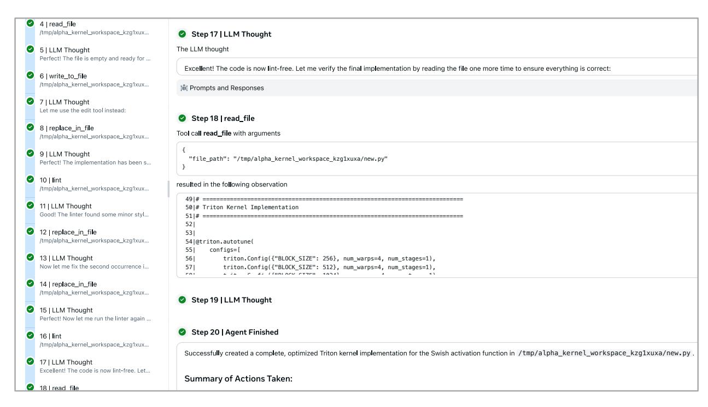
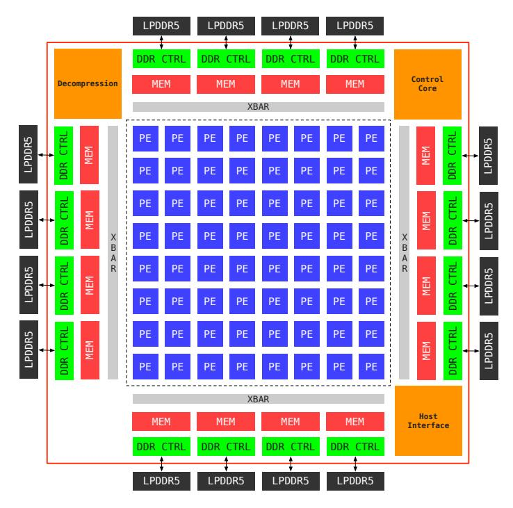
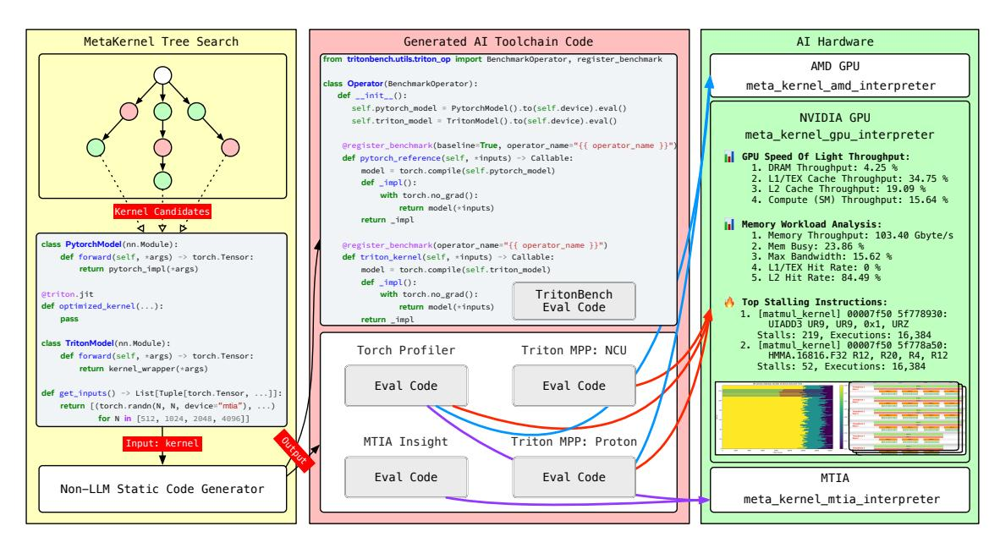

# **3 System Architecture**

Figure [5](#page-9-0) illustrates the KernelEvolve system architecture and its optimization workflow. The system centers around a self-improving state machine that drives exploration of the kernel optimization space through tree search strategies. Recent advancements [\[Jiang et al.](#page-42-3) [2025\]](#page-42-3) demonstrate state-of-the-art performance by conceptualizing iterative experimentation as tree search over potential solutions. Building on this insight, KernelEvolve employs multiple search strategies including greedy search for rapid initial solutions, Monte Carlo Tree Search (MCTS) [\[Kocsis and Szepesvári](#page-42-4) [2006\]](#page-42-4) for balanced exploration-exploitation, and evolutionary algorithms [\[De Jong](#page-41-6) [2017\]](#page-41-6) for population-based optimization. Each iteration begins with the LLM synthesizer generating dynamic prompts augmented with context from specialized sub-agents. The context memory sub-agent maintains relevant historical information from previous iterations and analyzes the current state of the search tree to guide exploration strategy, while the deep search sub-agent further enrich these prompts through retrieval from the persistent knowledge base, which organizes hardware-specific constraints for different accelerators (AMD, MTIA, NVIDIA), optimization guidelines, and code samples in a hierarchical file system structure. The augmented prompts are then processed by either external LLM backends (Claude 4.5, GPT-5) or internal models (Meta's CWM [\[Carbonneaux et al.](#page-41-3) [2025\]](#page-41-3) and Llama [\[Dubey et al.](#page-41-5) [2024\]](#page-41-5) on Twine [\[Tang et al.](#page-44-3) [2020\]](#page-44-3)) to generate Triton kernel candidates.

Generated kernels undergo comprehensive evaluation across multiple dimensions. TritonBench validates correctness by comparing generated Triton kernels against PyTorch reference implementations while measuring speedup over baselines. System-level profiling via Torch Profiler captures CPU/GPU time, kernel launch overhead, and function execution durations to identify host-device bottlenecks. However, modern AI accelerator optimization faces a fundamental challenge: performance signals are fragmented across abstraction layers—DSLs, compiler IR, CUDA/PTX/SASS, runtime APIs, and hardware counters—requiring manual correlation across siloed tools. Intra-kernel tracers such as Triton Proton [\[Zhou et al.](#page-45-9) [2025c\]](#page-45-9) expose instruction-level behavior, kernel profilers report occupancy and memory throughput, while system profilers capture execution timelines and communication patterns. No single tool provides complete stack visibility. To address this fragmentation, Meta developed MPP (Multi-Pass Profiler), a federated tooling framework that unifies instrumentation, compiler transforms, profiling, and trace synthesis as composable job graph tasks. Integrated with existing ecosystems including MLIR [\[Lattner et al.](#page-42-5) [2020\]](#page-42-5), Proton [\[Zhou et al.](#page-45-9) [2025c,](#page-45-9) [Guan et al.](#page-41-7) [2025\]](#page-41-7), NCU [\[Nvidia](#page-43-9) [2025\]](#page-43-9), and NVBit [\[Villa et al.](#page-44-4) [2019\]](#page-44-4), MPP enables KernelEvolve to automate cross-stack experiments and access metrics previously gated by tool fragmentation. Hardware-specific profilers (MTIA Insight and Triton Proton) provide platform-specific insights across MTIA, GPU, and AMD interpreters. The evaluation framework in KernelEvolve produces accuracy validation, performance metrics, and profiling insights that collectively determine each search tree node's status (correct or buggy) and assign optimization insights to guide automatic exploration strategy.

The persistent storage layer enables continuous learning and knowledge accumulation across optimization runs. The metadata store maintains a comprehensive execution context for each kernel candidate, including unique identifiers, parent-child relationships that encode the search tree structure, quality scores from evaluation results, and boolean flags (is\_buggy) indicating whether the kernel has execution errors or accuracy failures. Path references in the metadata store link to the object store, which maintains the actual kernel implementations organized by unique identifiers along with associated Triton kernel files and overview documentation (overview.md) containing profiling results analysis and optimization recommendations. This separation of metadata and content allows efficient querying and comparison of kernel variants while preserving complete implementation history. The architecture's modularity supports flexible deployment configurations with different LLM backends and hardware targets while maintaining a consistent optimization methodology. By systematically exploring the solution space and learning from both successful optimizations and failed attempts, KernelEvolve progressively generates higher-quality kernel implementations that approach theoretical performance limits for given hardware constraints.

<span id="page-10-0"></span>The following sections detail the design and implementation of key system components.

#### 3.1 Tree Search and State Machine

Given a kernel generation problem, KernelEvolve maintains a search graph  $G_t = (V_t, E_t)$  that evolves over multiple iterations  $t = 0, 1, \ldots$ , where each node  $v \in V_t \subseteq \mathcal{S}$  represents a kernel implementation artifact belonging to the set of all possible artifacts  $\mathcal{S}$ , and each directed edge  $(v_i, v_j) \in E_t$  represents a transformation from kernel  $v_i$  to  $v_j$ . The root node  $v_0$  represents the initial specification or baseline implementation. At each iteration, the agent executes three fundamental operations: (1) **selects** promising nodes via a selection policy  $\pi_{\text{sel}}$ , (2) **applies** a transformation operator to generate new kernel candidates, and (3) **scores** the resulting solutions via a fitness function  $\mathcal{F}$  that evaluates correctness and performance.

Recent research demonstrates that LLMs alone are insufficient for effectively solving open-ended optimization tasks [Nathani et al. 2025]. Performance significantly improves when augmented with external tools [Qin et al. 2024, Schick et al. 2023], execution feedback [Gehring et al. 2024], and solutions addressing context limitations. Developing high-performance kernels requires iterative experimentation where insights from prior attempts inform subsequent refinements. Building on recent advancements [Jiang et al. 2025, Toledo et al. 2025b], which achieve state-of-the-art results by conceptualizing iterative experimentation as tree search over potential solutions, we formalize kernel optimization as a graph-based search algorithm that systematically explores the solution space.

**Graph-Based Search Framework.** We model KernelEvolve as a graph-based search algorithm specified by the tuple  $(\mathcal{F}, \pi_{\text{sel}}, \mathcal{O}, \tau)$ , where:

- Fitness Function  $\mathcal{F}: \mathcal{S} \to \mathbb{R}_{\geq 0}$  estimates the quality of a kernel implementation node  $v \in V_t$  through the speedup achieved by the generated Triton kernel relative to the PyTorch compiled reference code [Ansel et al. 2024]. Specifically, for a generated Triton kernel with execution time  $t_{\text{triton}}$  and PyTorch compiled baseline with execution time  $t_{\text{pytorch}}$ , the fitness is computed as  $\mathcal{F}(v) = \frac{t_{\text{pytorch}}}{t_{\text{triton}}}$ . Kernels that fail correctness validation (numerical accuracy checks against reference code) or encounter compilation/runtime errors are assigned  $\mathcal{F}(v) = 0$ . This fitness measure directly captures the performance optimization objective while ensuring correctness as a hard constraint.
- Selection Policy  $\pi_{\rm sel}: 2^{V_t} \to 2^{V_t}$  chooses a subset of nodes  $U_t \subseteq V_t$  for expansion, guided by a heuristic function  $h: V_t \to \mathbb{R}$  that assigns scalar estimates to each node. Different instantiations support various search strategies: greedy search selects the single highest-scoring node, Monte Carlo Tree Search (MCTS) balances exploration-exploitation via upper confidence bounds for trees (UCT), and evolutionary algorithms maintain populations of diverse candidates for crossover and mutation operations.
- Universal Operator  $\mathcal{O}: \mathcal{S} \times \mathcal{C} \to \mathcal{S}$  is a single transformation function that generates new kernel candidates from existing implementations, where  $\mathcal{C}$  represents the contextual information (profiling results, error messages, hardware constraints, historical optimizations) that guides the transformation. Unlike traditional approaches that employ multiple specialized operators (Draft, Debug, Improve) with fixed prompting strategies, KernelEvolve's universal operator dynamically adapts its behavior based on runtime context through retrieval-augmented prompt synthesis.
- **Termination Rule**  $\tau$  halts search when computational budgets (wall-clock time or maximum number of artifacts) are exhausted, progress stalls, or fitness thresholds are achieved.

The Operator Bottleneck and Universal Operator Design. Prior research indicates that performance bottlenecks in LLM-based code generation stem primarily from operator design rather than search algorithms [Toledo et al. 2025b]. Traditional multi-operator frameworks face a fundamental limitation: each operator (e.g., Debug, Improve) is associated with a static prompt template that cannot adapt to runtime execution context. For instance, Debug operators employ fixed error-focused prompts regardless of whether the underlying issue stems from algorithmic errors, memory access patterns, or hardware-specific constraints, while Improve operators use performance-focused prompts that remain unchanged despite varying bottleneck characteristics (compute-bound vs. memory-bound vs. synchronization overhead). This static prompting strategy imposes cognitive constraints on the model's reasoning process, potentially misleading the model by framing optimization problems through predefined lenses that may not align with the actual runtime context. The operator-specific prompting creates artificial boundaries in the solution space, preventing the model from simultaneously reasoning about correctness, performance, and architectural trade-offs based on the specific execution characteristics observed at runtime.

<span id="page-12-1"></span>

**Figure 6** Universal operator's agentic kernel generation workflow for Swish activation. Agent iteratively reads, analyzes, modifies, and validates code through tool invocations (read\_file, write\_to\_file, replace\_in\_file, lint), guided by LLM reasoning at each step. The workflow completes after 20 steps, producing lint-free optimized Triton kernel with autotune configurations.

To address this limitation, KernelEvolve employs a **single universal operator** that dynamically adapts its behavior based on runtime context rather than predefined operator categories (Figure 6). Instead of fixed prompt templates associated with specific operators, we introduce a retrieval-augmented dynamic prompting mechanism (detailed in Section 3.2) that synthesizes contextually optimal prompts at each iteration. This design choice allows the LLM to reason holistically about kernel optimization without artificial constraints imposed by operator boundaries. By unifying operator functionality under a single context-aware interface, KernelEvolve enables more flexible exploration strategies where each generation step can simultaneously address multiple optimization objectives—correcting numerical errors, improving memory access patterns, exploiting hardware-specific features, and refining algorithmic approaches.

## <span id="page-12-0"></span>3.2 Agentic Retrieval & Self-Managed Context

KernelEvolve employs a retrieval-augmented approach where contextual information is dynamically loaded into the LLM's context at runtime rather than maintaining complete historical knowledge in working memory. This design philosophy aligns with recent agentic coding systems such as Anthropic's Claude Code [Anthropic 2025], which demonstrates that complex analysis over large datasets can be performed through targeted queries and incremental loading rather than exhaustive context consumption. This approach reflects human cognitive patterns: rather than memorizing entire corpuses of information, humans introduce external systems—file hierarchies, databases, indexing structures—to retrieve relevant information on demand. For KernelEvolve, this retrieval-based dynamic prompting eliminates cognitive constraints imposed by static prompt templates, enabling the LLM to reason freely about optimization strategies guided by actual runtime execution characteristics rather than predefined operator semantics.

KernelEvolve operationalizes this architecture through a two-stage pipeline implemented by specialized sub-agents. The **context memory sub-agent** analyzes dynamic runtime artifacts—kernel implementations, profiling measurements, error diagnostics, correctness validation results—to diagnose performance bottlenecks and synthesize optimization directives. These analysis outputs parameterize the **deep search sub-agent**, which performs targeted retrieval from a persistent knowledge base containing hardware constraints, optimization

patterns, and debugging methodologies. This staged design reflects a fundamental principle: effective knowledge retrieval requires runtime context to determine retrieval targets. The context memory sub-agent identifies which optimization challenges require attention; the deep search sub-agent retrieves domain knowledge addressing those specific challenges. By conditioning knowledge base retrieval on runtime analysis rather than static heuristics, KernelEvolve ensures retrieved content directly targets observed bottlenecks, maintaining context window efficiency while avoiding irrelevant generic guidance.

#### <span id="page-13-0"></span>**3.2.1 Deep Search Sub-Agent**

The persistent knowledge base implements a hierarchical file system encoding domain expertise across hardware platforms, optimization strategies, debugging patterns, and language constraints. This organization exploits structural metadata—folder hierarchies, naming conventions, and file relationships—as retrieval signals that guide agentic search without explicit semantic annotation. A comprehensive index (index.md, Figure [5\)](#page-9-0) maintains the complete directory tree with inline module documentation, serving dual purposes: human-readable reference and machine-parseable navigation structure for automated retrieval.

**Hierarchical Taxonomy.** The knowledge base partitions content across three primary categories addressing distinct optimization concerns:

- **Constraints** (constraints/): Enforces correctness requirements through anti-cheating rules (prohibiting cross-platform abstractions, external library dependencies), forbidden patterns (direct CUDA API usage, incomplete test coverage), and output format specifications. These constraints ensure generated kernels represent authentic Triton implementations rather than wrappers around pre-compiled libraries or high-level PyTorch operations that bypass kernel-level optimization.
- **Guidance** (guidance/): Provides platform-agnostic optimization knowledge organized by concern: debugging methodologies (error interpretation, numerical stability), performance tuning (autotuning, block sizing, fusion strategies), and Triton language idioms (data types, indexing patterns, memory primitives). This cross-platform content transfers across hardware architectures, establishing foundational implementation patterns before platform-specific specialization.
- **Hardware** (hardware/): Encodes platform-specific knowledge for NVIDIA GPUs, AMD GPUs, and MTIA accelerators. Each platform subtree maintains architectural documentation (compute hierarchies, memory subsystems, execution models), platform-specific debugging guidance (common pitfalls, precision issues), and advanced optimization techniques. NVIDIA content includes Hopper-generation features (Tensor Memory Accelerator, warp specialization via Triton Low-level Extensions (TLX)), persistent kernel patterns, and generation-specific optimizations. Hardware modules comprise 15-40 documents per platform—totaling ≥100 documents—reflecting the depth of architectural specialization required for production-grade kernel optimization.

**Index-Guided Retrieval.** The index.md file implements structured navigation enabling efficient content discovery. Upon receiving runtime feedback (profiling metrics, error diagnostics), the deep search sub-agent executes two-stage retrieval: (1) queries the index to identify relevant modules based on hardware platform, bottleneck type, and optimization phase; (2) fetches targeted content from identified modules. Memory bandwidth bottlenecks on NVIDIA H100 trigger index queries returning hardware/nvidia/optimization/{tma, shared\_memory, on\_device\_tma}.md. The hierarchical structure enables efficient pruning: top-level platform selection (hardware/{nvidia|amd|mtia}/) eliminates irrelevant architectures; folder hierarchies encode concern taxonomies (arch/, debug/, optimization/); file naming conventions signal specificity (memory\_ hierarchy.md versus on\_device\_tma.md).

**Progressive Specialization.** Content organization supports iterative refinement throughout optimization trajectories. Initial generation retrieves broad guidance—Triton basics, general optimization principles, correctness requirements. Subsequent iterations navigate progressively specialized content guided by profiling feedback. A representative trajectory for compute-intensive GEMM on H100: (1) hardware/nvidia/arch/tensor\_cores.md establishing Tensor Core capabilities; (2) hardware/nvidia/tlx/{overview, warp\_specialization, async\_tensor\_core\_operations}.md introducing fine-grained control through producer-consumer warp patterns and asynchronous matrix operations; (3) code\_samples/{hopper-gemm-pipelined, hopper-gemm-ws}.py providing complete reference implementations. This progression from high-level tensor core usage to expert-level TLX pipelined and warp specialization exemplifies support for both novice implementations and production-grade optimizations approaching theoretical hardware limits.

#### <span id="page-14-0"></span>**3.2.2 Context Memory Sub-Agent**

The context memory sub-agent bridges the persistent knowledge base and runtime optimization state through a two-tier storage architecture separating metadata from content. As shown in Figure [5,](#page-9-0) each explored search graph node persists to a metadata store (relational database) containing: unique identifiers (id), parent references (pid) encoding tree structure, fitness scores (score), correctness flags (is\_buggy), and path references (path\_ref) linking to an object store containing kernel implementations (kernel\_n.py), profiling results, and LLM-generated analysis reports (overview.md). This separation enables efficient metadata queries without loading large source files or profiling traces.

The relational storage architecture provides two critical capabilities beyond simple persistence. (1) **Distributed Concurrent Exploration.** It enables distributed concurrent exploration: multiple agents can simultaneously expand different nodes in the search graph, with the database providing transaction isolation and consistency guarantees. When KernelEvolve scales to dozens or hundreds of concurrent agents exploring thousands of optimization steps, maintaining an in-memory graph representation becomes infeasible. The metadata store allows agents to operate independently, querying only relevant subgraphs on demand. (2) **Complex Contextual Queries.** It supports complex contextual queries through SQL operations that logically reconstruct graph views without materializing the entire structure in memory [\[Liao and Abadi](#page-42-6) [2023\]](#page-42-6). The relational schema enables efficient graph traversal via recursive Common Table Expressions (CTEs). These queries enable sophisticated context construction: analyzing sibling node outcomes, retrieving strategies from high-performing ancestors, identifying global best solutions for comparison. (3) **Cross-Session Knowledge Reuse.** Persistence enables querying historically explored similar operators (matched by operator type, input shapes, hardware platform). When high-quality solutions exist, KernelEvolve initializes search with these implementations rather than generating from scratch [\[Liao et al.](#page-42-7) [2026\]](#page-42-7). Consider a new GEMM variant for transformer attention on AMD MI350: metadata queries identify 15 historical GEMM kernels, three achieving > 1.5× speedup through TLX warp specialization. KernelEvolve retrieves the highest-performing implementation (score 1.5) with its optimization report documenting successful strategies (async tensor core operations, double-buffered shared memory), then focuses exploration on problem-specific adaptations (different dimensions, fusion opportunities) rather than rediscovering fundamental patterns. This approach provides: (reduced timeto-solution starting from proven implementations, inference cost reduction eliminating redundant token consumption, and environmental impact reduction through decreased computational overhead. (4) **Fault Tolerance and Checkpointing.** Persistent storage enables fault-tolerant search with automatic checkpointing. When search processes crash or are interrupted, KernelEvolve reconstructs the complete search state from metadata: loading explored nodes, their parent-child relationships, fitness scores, and associated artifacts. Tree search resumes from the last successful iteration rather than restarting from scratch. This proves critical for long-running optimization campaigns where generating production-grade kernels may require hundreds of iterations spanning hours: hardware failures, deployment updates, or resource preemption no longer discard accumulated exploration progress. The metadata store serves as continuous checkpoint, with each node insertion atomically persisting exploration state.

**Runtime Artifact Analysis.** At each search node, KernelEvolve generates execution artifacts: kernel source, execution logs, correctness validation results, performance measurements (execution time, speedup), and profiling metrics (instruction latency, memory throughput, occupancy, synchronization overhead). The context memory sub-agent invokes the LLM to analyze these artifacts, producing structured reports diagnosing bottlenecks and recommending optimization strategies. Profiling revealing 30% occupancy on H100 with high shared memory pressure triggers analysis identifying register spilling and bank conflicts as root causes, recommending register usage reduction through value recomputation and warp-level memory access optimizations.

**Dynamic Prompt Synthesis.** The context memory sub-agent composes prompts for the universal operator combining: (1) current kernel implementation and execution history, (2) LLM-generated analysis reports, (3) retrieved knowledge base content, (4) hardware-specific constraints. This implements self-managed context windows maintaining only task-relevant information within token budgets (64K-1M tokens depending on LLM backend). When multiple optimization opportunities exist, the sub-agent prioritizes based on profiling

evidence, loading content for dominant bottlenecks while deferring secondary optimizations to subsequent iterations.

**Iterative Refinement.** The context memory maintains summaries of previous optimization attempts, enabling learning from successes and failures. If increasing block size fails to improve speedup or introduces correctness violations, subsequent iterations avoid that strategy and explore alternatives. This mirrors human debugging workflows where engineers track attempted fixes, analyze failures, and systematically explore solution spaces while avoiding dead ends. Combined with targeted knowledge retrieval, this enables efficient navigation of complex optimization landscapes compared to static prompts or naive trial-and-error approaches.

The persistent storage architecture scales efficiently: metadata queries execute in milliseconds even with millions of nodes, while object store access occurs selectively. Production deployments maintain search histories spanning months across hundreds of operator types and multiple platforms, creating continuously growing kernel expertise corpora benefiting all users while reducing aggregate inference costs.

#### <span id="page-15-0"></span>**3.2.3 MTIA Knowledge Injection**

MTIA presents unique challenges for LLM-based kernel generation: unlike widely-documented GPU architectures (NVIDIA CUDA, AMD ROCm), MTIA's proprietary architecture and programming model remain largely absent from public training corpora. Pretrained LLMs lack knowledge of MTIA-specific hardware features, extended Triton language constructs, and optimization patterns. KernelEvolve addresses this knowledge gap through systematic injection of MTIA domain expertise into the persistent knowledge base, enabling the deep search sub-agent to retrieve MTIA-specific content that educates the LLM during kernel generation.

**MTIA Triton Extensions.** While Triton originated as a GPU-focused language, Triton-MTIA extends the base language to expose hardware-specific features fundamentally different from GPU programming models. The knowledge base documents three categories of extensions addressing distinct requirements:

• **Hardware Feature Exposure**: As shown in Figure [7,](#page-16-0) MTIA v2i architectures [\[Firoozshahian et al.](#page-41-11) [2023,](#page-41-11) [Coburn et al.](#page-41-12) [2025\]](#page-41-12) expose unique capabilities including Specialized Function Units (SFU) with lookup table (LUT) operations, inter-Processing Element (PE) communication primitives, and dual-core synchronization mechanisms. The knowledge base provides detailed documentation of libdevice APIs and hardware-specific compiler directives.

Libdevice APIs map Triton operations to hardware primitives: tl.extra.libdevice.gelu(x) compiles to SFU LUT queries rather than mathematical approximations, providing higher performance at potential accuracy cost. Documented operations include exp, gelu, log, sigmoid, tanh—each mapping to dedicated SFU instructions unavailable on GPU targets.

MTIA exposes hardware-specific performance tuning through compilation options during kernel invocation. Two critical options documented in the knowledge base enable pipeline parallelism optimization: (1) cb\_ multiplier (integer) increases Circular Buffer allocation by specified factors, allowing multiple operations to execute concurrently by expanding on-chip memory capacity; (2) use\_dual\_core (boolean) instructs the compiler to distribute operations between core A and core B core—executing DMAs on core A while core B performs vector instructions—improving throughput through heterogeneous execution. These options can be explored statically via @triton.autotune decorators that evaluate configuration combinations (e.g., BLOCK\_SIZE ∈ {32, 1024}, cb\_multiplier ∈ {1, 8}), with autotuning keyed to input dimensions (key=["N"]) to rerun when problem characteristics change.

- **Compute Helper Functions**: MTIA provides three categories of optimized compute helpers documented in the knowledge base: (a) unary\_elemwise\_compute(op, x) supporting 30+ operations including mathematical functions (exp, log, sqrt), activations (relu, gelu, sigmoid), and logical operations; (b) binary\_elemwise\_compute(op, x, y) for tensor-tensor operations including arithmetic, comparisons, and ML-specific functions (gelu\_backward\_tanh, log\_sigmoid\_backward); (c) binary\_elemwise\_const\_ compute(op, x, const) for tensor-scalar operations. These helpers compile to optimized vector instructions, providing higher performance than manual Triton implementations expressing equivalent semantics.
- **Custom Type System**: MTIA kernels operate on device-specific data structures including TensorView (tensor metadata with shape, stride, addressing information), CoreID (PE identification and chip topology),

<span id="page-16-0"></span>

**Figure 7** MTIA 2i architecture featuring an 8×8 processing element (PE) array interconnected via network-on-chip. Each PE contains dual RISC-V cores and specialized fixed-function units: Memory Layout Unit (MLU) for data transformation, Dot Product Engine (DPE) for matrix operations, Reduction Engine (RE) for aggregations, SIMD Engine (SE) for vector operations, and Command Processor (CP) for control flow (more details can be found in Section 3 of [\[Coburn et al.](#page-41-12) [2025\]](#page-41-12)).

and ExecutionGrid (kernel launch configuration). The knowledge base documents type definitions via @core.struct\_type decorators and associated utility functions, enabling kernels to directly manipulate MTIA runtime structures rather than relying on compiler-managed abstractions.

**Advanced Synchronization and Communication Primitives.** MTIA's multi-PE architecture requires explicit control over inter-PE data movement and synchronization—capabilities absent from standard Triton. The knowledge base documents four critical extensions:

- **Cross-PE Broadcasting** (direction attribute in tl.load): Enables streaming memory between neighboring PEs, allowing multiple PEs reading identical memory to receive data from immediate neighbors rather than independent memory accesses. The direction parameter ("down" or "right") specifies propagation direction through the PE grid. Complementary tl.consume() operator reads and discards memory, maintaining functional correctness by ensuring all participating PEs execute identical load sequences.
- **Cross-PE Reduction** (direction attribute in tl.store): Extends tl.store to send computed results directly to neighboring PEs, enabling collaborative computation patterns where multiple program instances cooperate to produce results. This mechanism supports efficient row-wise and column-wise reductions across PE arrays.
- **Runtime Barriers** (tl.pe\_runtime\_barrier()): Introduces runtime synchronization across all PEs, enabling cross-PE reduction mechanisms and eliminating kernel splitting for explicit synchronization. This primitive maps directly to libjit\_fba\_runtime\_barrier(), requiring careful placement to execute exactly once per PE in the physical grid.
- **Explicit Tensor Copies** (tl.copy()): Creates deep tensor copies facilitating producer-consumer synchronization between MTIA cores. The compiler automatically detects data race conditions and fails compilation if copy operations prove insufficient for correctness.

**Knowledge Injection Mechanism.** The MTIA hardware subtree (hardware/mtia/) in the persistent knowledge base contains multiple documents spanning architectural overviews, language extensions, optimization patterns, and complete code examples. When the deep search sub-agent receives queries targeting MTIA hardware, it retrieves relevant documentation—libdevice API references for activation functions, cross-PE communication patterns for multi-PE kernels, custom type definitions for runtime structure manipulation. This retrieved content enters the LLM's context window during prompt synthesis, effectively teaching the model MTIA-specific programming idioms absent from pretraining data. The context memory sub-agent further refines retrieval based on runtime feedback: compilation errors citing undefined MTIA primitives trigger retrieval of language extension documentation; profiling results indicating suboptimal SFU utilization trigger retrieval of libdevice mapping tables.

This knowledge injection strategy proves critical for MTIA kernel generation quality. Without MTIA-specific documentation in context, LLMs generate standard Triton code targeting GPU semantics, producing compilation failures or functionally incorrect kernels when executed on MTIA hardware. With systematic knowledge base retrieval, KernelEvolve successfully generates production-grade MTIA kernels leveraging hardwarespecific features—SFU operations, inter-PE communication, dual-core synchronization—approaching handoptimized performance while maintaining the productivity benefits of automated generation. This approach generalizes to emerging accelerator architectures: as new hardware platforms enter production, corresponding documentation injected into the knowledge base enables immediate LLM-based kernel generation without model retraining.

## <span id="page-17-0"></span>**3.3 File and Code Search**

The deep search and context memory sub-agents operationalize their retrieval strategies through a unified code search interface implemented via Model Context Protocol (MCP) tools [\[Anthropic](#page-41-13) [2024\]](#page-41-13). This interface leverages Meta's production code search infrastructure—distributed systems (BigGrep, Glean [\[Marlow and](#page-42-8) [Iborra](#page-42-8) [2024\]](#page-42-8)) operating over fbsource, Meta's monolithic repository analogous to Google's monorepo [\[Potvin](#page-43-12) [and Levenberg](#page-43-12) [2016\]](#page-43-12)—capable of querying billions of lines of code providing millisecond-latency retrieval through pre-built indices and optimized search algorithms. The search infrastructure automatically detects and follows code references embedded within knowledge base documentation: when retrieved content contains fbcode file paths or repository links, the tools automatically trigger secondary searches retrieving the referenced implementation code. This automatic dereferencing mechanism bridges curated documentation and production codebases, allowing sub-agents to seamlessly traverse from abstract optimization guidelines to concrete implementation examples without manual intervention.

**Search Modalities.** The code search interface exposes three search modes via MCP tool invocations: STRMATCH executes exact string matching for locating specific identifiers (function names, API calls, hardware operations); REGEX performs pattern-based queries for matching structural patterns (class definitions, function signatures, optimization templates); FILENAME locates files matching path patterns (hardware-specific modules, configuration files, test implementations). These modes execute against both the knowledge base filesystem and distributed production code indices, providing millisecond-latency retrieval across documentation and implementation corpora.

**Result Integration.** Search results return as file paths with code snippets including contextual lines (default: 1 leading, 1 trailing). When automatic dereferencing occurs, both the knowledge base documentation and retrieved production code integrate into prompt synthesis, providing the LLM with complementary information: abstract optimization principles from curated documentation alongside concrete implementation patterns from production systems. This enables generation of kernels satisfying theoretical optimization criteria while conforming to organizational coding conventions and platform-specific idioms observed in deployed infrastructure.

## <span id="page-17-1"></span>**3.4 Evaluation and Tooling Framework**

#### <span id="page-17-2"></span>**3.4.1 Kernel Output Format**

KernelEvolve generates kernel implementations conforming to a standardized dual-implementation interface enabling automated correctness validation and performance benchmarking. Each generated artifact comprises three components: a PyTorch baseline, an optimized Triton kernel, and input data generation, structured to support systematic evaluation and downstream compilation integration.

**Dual Implementation Interface.** Generated kernels provide two nn.Module implementations with identical signatures[1](#page-18-1) .

```
import torch
import triton
import triton.language as tl
# from triton_mtia.python.mtia.eager import mtia_triton_launcher
# mtia_triton_launcher.init() # REQUIRED for MTIA execution
class PytorchModel(nn.Module):
    def forward(self, *args) -> torch.Tensor:
        return pytorch_impl(*args) # Baseline: standard PyTorch ops (torch.matmul, torch.sum)
@triton.jit
def optimized_kernel(...):
    pass # Low-level Triton implementation (tl.load, tl.store, tl.dot)
class TritonModel(nn.Module):
    def forward(self, *args) -> torch.Tensor:
        return kernel_wrapper(*args) # Launch Triton kernel with grid configuration
def get_inputs() -> List[Tuple[torch.Tensor, ...]]:
    # Generate test cases across multiple scales
    return [(torch.randn(N, N, device="cuda"), ...)
            for N in [512, 1024, 2048, 4096]]
```

The PyTorch baseline prioritizes correctness over performance, providing ground truth for numerical validation. The Triton implementation consists of a @triton.jit kernel, a wrapper managing grid configuration and kernel launch, and an nn.Module encapsulation. Input generation produces test cases spanning diverse sizes, exposing performance characteristics under varying computational and memory pressure.

**Design Rationale.** The nn.Module structure enables integration with PyTorch's torch.compile infrastructure, supporting hybrid optimization strategies combining compiler-driven graph transformations with handoptimized kernels. Standardized interfaces enable automated evaluation: correctness validation executes both implementations on identical inputs, comparing outputs via torch.allclose() with precision-dependent tolerances; performance profiling measures execution time and computes speedup ratios. This structured evaluation framework transforms kernel assessment from manual validation to systematic automation, enabling tree search to evaluate thousands of variants while maintaining correctness guarantees.

### <span id="page-18-0"></span>**3.4.2 AI Hardware Interpreters**

Generated Triton kernels require execution on target hardware platforms for correctness validation and performance profiling. To enable automated evaluation across heterogeneous accelerators (NVIDIA GPUs, AMD GPUs, MTIA), KernelEvolve establishes dedicated interpreter environments providing standardized execution contexts with complete software stacks, compilation toolchains, and runtime dependencies for each hardware target.

**Bento-Based Interpreters.** Meta's Bento platform—the standard Jupyter notebook environment—bundles external libraries (PyTorch, Triton, CUDA/ROCm) with internal frameworks including hardware-specific software stacks (MTIA runtime, vendor-specific compilers) and build systems. KernelEvolve configures three hardware-specific interpreters: meta\_kernel\_gpu\_interpreter (NVIDIA), meta\_kernel\_amd\_interpreter (AMD), and meta\_kernel\_mtia\_interpreter (MTIA). Each interpreter encapsulates platform-specific compilation toolchains (TritonGPU/AMDGPU/MTIA-MLIR backends), runtime libraries (mtia\_triton\_launcher for MTIA, cuDNN for NVIDIA), and profiling tools (NCU, Proton).

<span id="page-18-1"></span><sup>1</sup>For training operators requiring gradient computation, both implementations must additionally provide backward() methods with matching input/output signatures for gradient propagation.

<span id="page-19-1"></span>

| Node                                                                 | Last Release ① | Running Release | R54 | R53 | R52      | R51 | R504 | R49.4 | R48.4 | R474 | R46.4 | R45.4 | R44 4 | R43 | R42 | Raz | R40 | A39.4    | R38.4 | R37 83   | R36 8 | A35 |
|----------------------------------------------------------------------|----------------|-----------------|-----|-----|----------|-----|------|-------|-------|------|-------|-------|-------|-----|-----|-----|-----|----------|-------|----------|-------|-----|
| Graft Node                                                           | ✓ R54<br>1s    |                 | ~   | ~   | ~        | ~   | ~    | ~     | ~     | ~    | ~     | ~     | ~     | ~   | ~   | ~   | ~   | ~        | ~     | ~        | ~     | V   |
| Contbuild Tracking Node (bento_kerne I_meta_kernel_mtia_interpreter) | ✓ R54<br>0s    |                 | ~   | ~   | ~        | ~   | ~    | ~     | ~     | ~    | ~     | ~     | ~     | ~   | ~   | ~   | ~   | ~        | ~     | ~        | ~     | ~   |
| fbpkg Build Node (bento_kernel_meta<br>_kernel_mtia_interpreter)     | ✓ R54<br>14m   |                 | ~   | ~   | ~        | ~   | ~    | ~     | ~     | ~    | ~     | ~     | ~     | ~   | ~   | ~   | ~   | ~        | ~     | ~        | ~     | ~   |
| 🗓 kernel-startup                                                     | ✓ R54<br>9m    |                 | ~   | ~   | ~        | ~   | ~    | ~     | ~     | ~    | ~     | ~     | ~     | ~   | ~   | ~   | ~   | ~        | ~     | <b>~</b> | ~     | V   |
| Ej blocking-notebook-steps                                           | ✓ R54<br>2m    |                 | ~   | ~   | ~        | ~   | ~    | ~     | ~     | ~    | ~     | ~     | ~     |     |     |     |     |          |       |          |       |     |
| Ej Tag                                                               | ✓ R54<br>1m    |                 | ~   | ~   | <b>~</b> | ~   |      |       |       |      |       |       |       | ~   | ~   | ~   | ~   | <b>~</b> | ~     | <b>~</b> | ~     | V   |
| □ nonblocking-notebook-steps                                         | ✓ R54<br>2m    |                 | ~   | ~   | ~        | ~   |      |       |       |      |       |       |       |     |     |     |     |          |       |          |       |     |

Figure 8 Continuous deployment pipeline for KernelEvolve interpreter environments via Meta's Conveyor system. The pipeline monitors dependency updates across Triton compiler backends, hardware runtime libraries, and build systems, automatically triggering daily rebuilds and deployments. Green checkmarks indicate successful releases, red crosses denote failed builds, and yellow warnings flag non-critical issues. The bento\_kernel\_meta\_kernel\_mtia\_interpreter node shows regular deployment cadence with occasional build failures, demonstrating automated recovery and continuous integration across multiple release candidates (R54, R53, etc.).

**Automated Deployment.** Interpreters integrate with Meta's Conveyor continuous deployment system [Grubic et al. 2023], which monitors dependency updates and automatically publishes new versions on regular schedules (Figure 8). When underlying components update (Triton compiler, runtime libraries, build systems), Conveyor rebuilds and deploys interpreter packages with current dependencies. This eliminates manual environment maintenance: kernel artifacts submitted to interpreters execute directly against up-to-date software stacks. Interpreter isolation ensures reproducible profiling across tree search iterations.

This infrastructure abstracts hardware-specific complexities from kernel generation, enabling unified evaluation interfaces while maintaining platform-specific optimization capabilities.

#### <span id="page-19-0"></span>3.4.3 Evaluation Code Generation

Kernel candidates generated by tree search conform to the standardized interface specification (PytorchModel, TritonModel, get\_inputs()), but require evaluation harness instrumentation for automated profiling. KernelEvolve employs multiple profiling tools targeting different analysis objectives: TritonBench [Meta 2025a] validates correctness through numerical comparison against PyTorch baselines and measures speedup ratios across production input shapes; PyTorch Profiler [Meta 2021] captures system-level execution timelines including kernel launch overhead and host-device synchronization; NCU [Nvidia 2025] provides kernel-level hardware metrics including occupancy, memory throughput, and instruction mix; Proton [Zhou et al. 2025c] delivers intra-kernel instruction-level latency and pipeline behavior; MTIA Insight provides comprehensive MTIA-specific instrumentation: PE utilization, fixed-function accelerator metrics (DPE/SFU/MLU utilization and stall cycles), per-PE CPU runtime, cache analysis (CPU I/D-cache hit rates, branch prediction, LLC behavior), memory bandwidth (LLC/DRAM), and load-store throughput with per-PE read/write counters. KernelEvolve employs a deterministic code generator transforming LLM-generated kernel implementations into platform-specific evaluation scripts invoking these profiling tool APIs (Figure 9).

Multi-Tool Evaluation Harness Generation. The evaluation code generator accepts standardized kernel artifacts as input and produces executable Python scripts for each profiling tool. For TritonBench, the generator creates benchmark harnesses wrapping both PytorchModel and TritonModel within the BenchmarkOperator framework, configuring correctness validation (baseline=True) and speedup measurement. For Torch Profiler, generated scripts insert profiler contexts (torch.profiler.profile()) around kernel invocations capturing execution traces. For NCU and Proton (via Triton MPP), the generator synthesizes instrumentation invoking respective APIs with hardware-specific configurations. Each generated script imports models from standardized artifacts, instantiates profiler contexts, executes across test cases from get\_inputs(), and formats results as structured data consumable by the context memory sub-agent.

**Interpreter Execution Model.** Generated evaluation scripts leverage pre-deployed interpreter environments eliminating compilation overhead. Since hardware interpreters bundle complete toolchains (Triton compilers,

<span id="page-20-1"></span>

**Figure 9** End-to-end evaluation pipeline. Tree search generates kernel candidates with standardized dual implementations (PyTorch baseline, Triton optimized), executed on hardware interpreters (GPU, AMD, MTIA) collecting platform-specific profiling metrics via TritonBench, NCU, MPP, and MTIA Insight. Profiling feedback guides subsequent search iterations.

profiling frameworks, runtime libraries) via Conveyor's continuous deployment, evaluation code executes immediately without dependency resolution or environment setup. This architectural separation—LLM-generated kernel logic versus deterministically-generated evaluation harness—provides critical benefits: (1) compilation occurs once during interpreter deployment rather than per-kernel evaluation (reducing latency from  $\geq$ 10 minutes to seconds); (2) evaluation code remains consistent across kernel variants, ensuring reproducible profiling; (3) profiling tool APIs update independently through interpreter redeployment without modifying kernel generation prompts.

Figure 9 illustrates this workflow: tree search produces kernel candidates (left panel), the evaluation code generator transforms these into tool-specific harnesses invoking TritonBench, profilers, and hardware-specific instrumentation (center panel), and hardware interpreters execute generated evaluation code collecting platform-specific metrics (right panel) that feed back to guide subsequent tree search iterations.

#### <span id="page-20-0"></span>3.4.4 Unified Profiling: Triton MPP

KernelEvolve integrates Triton MPP (Multi-Pass Profiler) from Meta addressing fundamental GPU profiling challenges. Modern profiling workflows exhibit fragmentation: practitioners orchestrate IR-level tracers, assembly profilers (NCU), and binary instrumentation (NVBit), each with incompatible interfaces and vendor-specific assumptions. Profilers target human interpretation through textual reports and dashboards rather than structured data, forcing brittle text parsing unsuitable for automation. MPP provides a compiler-centric abstraction unifying heterogeneous profiling tools. The framework composes analysis through job graphs: compiler transforms insert MLIR-level instrumentation, profiling passes collect metrics, trace synthesis produces structured output. This proves critical for modern Triton kernels employing TMA operations, warp-specialized pipelines, and overlapped data movement.

Traditional GPU profilers expose asynchronous behavior coarsely, failing to reveal instruction-level overlap between memory and computation. Direct wait insertion perturbs execution: initial synchronization disrupts overlap, cascading timing changes through subsequent operations. MPP addresses this through minimally-invasive profiling: capturing unmodified base traces, applying targeted probe passes isolating single instructions in specific iterations, guarding instrumentation to prevent interference, and fusing results for attribution. This profiles warp-group operations, async copies, and TMA transfers at TTGIR level with negligible perturbation.

MPP integration provides KernelEvolve with structured, instruction-level performance data without vendorspecific parser implementations, transforming profiling from manual orchestration to programmatic composition.

#### <span id="page-21-0"></span>**3.4.5 Agentic Debugging in JIT Flow**

Beyond profiling metrics, MTIA-Triton provides compiler introspection capabilities critical for kernel debugging and optimization. MTIA-Triton supports optional C++ code emission exposing the compiler's intermediate representation before final RISC-V binary generation:

```
compiled_kernel = kernel[grid](x, *x.shape, BLOCK_SIZE=1024, cb_multiplier=8, emit_cxx=True)
cpp_source = compiled_kernel.asm["cpp"]
"""
/// This is a generated Triton C++ kernel.
extern "C" bool __mtia_is_core_b();
extern "C" uint64_t __mtia_scoped_block_print_info(uint64_t, uint64_t);
extern "C" v256_float16 __mtia_rvv_init256_fp16(float16_t);
extern "C" void __mtia_adjust_cb_read_pointer(uint32_t, uint32_t);
extern "C" void __mtia_adjust_cb_write_pointer(uint32_t, uint32_t);
"""
```

The emitted C++ code reveals low-level MTIA operations including RISC-V vector intrinsics, circular buffer pointer management, SFU initialization, and core affinity queries.

**Interactive Debugging Workflow.** When generated kernels crash, fail correctness validation, or exhibit unexpected performance, the context memory sub-agent retrieves emitted C++ code alongside error diagnostics. The universal operator analyzes this representation—identifying incorrect buffer management, missing synchronization, or suboptimal SFU usage—and generates corrected C++ implementations. Modified C++ kernels can be tested immediately without full recompilation through MTIA's replay mechanism:

```
from triton_mtia.python.mtia.eager.debug.replay_cpp import replay_cpp
# Rebuild modified C++ and launch with runtime arguments only
# (constexprs and compiler options already baked in)
replay_cpp(modified_cpp_source, compiled_kernel,
           args=(1, 1, 1, x, *x.shape)) # PID grid + runtime args
```

This rapid iteration cycle—emit C++, modify, replay—eliminates full Triton recompilation overhead (constexpr resolution, MLIR lowering, backend code generation), enabling agents to validate hypothesized fixes within seconds rather than minutes. Compiler introspection transforms opaque execution failures into actionable optimization opportunities grounded in hardware-specific implementation details.

## <span id="page-21-1"></span>**3.4.6 Kernel Evaluation on FaaS**

Tree search execution decomposes each node expansion into two phases: kernel generation and kernel evaluation. Generation comprises prompt synthesis, knowledge base retrieval, and LLM invocation—CPUbound operations requiring no accelerator access. Evaluation executes generated kernels on target hardware through TritonBench correctness validation, Torch Profiler timeline capture, and Triton MPP instruction-level analysis. This workload asymmetry—generation on CPU hosts versus evaluation on AI accelerators—motivates architectural disaggregation enabling independent, non-blocking evaluation execution on remote hardware.

**FaaS Integration for Remote Evaluation.** Kernel evaluation is an ideal FaaS workload: individual evaluation functions execute independently without inter-function dependencies or communication, unlike serverless databases requiring aggregation coordination [\[Liao et al.](#page-42-9) [2023\]](#page-42-9). KernelEvolve migrates kernel evaluation to Meta's FaaS (Function-as-a-Service) platform [\[Sahraei et al.](#page-43-15) [2023\]](#page-43-15), which abstracts infrastructure complexity including service routing [\[Saokar et al.](#page-44-7) [2023\]](#page-44-7), Twine autoscaling [\[Tang et al.](#page-44-3) [2020\]](#page-44-3), and lifecycle management. FaaS runtime auto-generates Thrift server interfaces for evaluation handlers, packaging them as fbpkg distributions with hardware interpreter dependencies. We extended FaaS's Tasklet resource model from CPU/RAM to include GPU resources, enabling hardware-specific evaluation functions targeting NVIDIA, AMD, and MTIA platforms. When tree search generates a kernel candidate, it asynchronously dispatches evaluation requests to FaaS endpoints corresponding to target hardware. Remote workers load pre-deployed interpreter environments, execute evaluation harnesses, and return structured results (correctness status, speedup ratios, profiling metrics) consumed by the context memory sub-agent.

**Benefits and Scalability.** Disaggregation addresses resource contention: a single host may run hundreds of generation agents but possess limited accelerators (8 GPUs or 24 MTIA devices per host). Without separation, agents serialize through available hardware—each occupying a device for 8-12 minutes (mostly idle during generation) while other agents queue. FaaS-based evaluation provides: (1) *resource decoupling*—generation agents execute CPU-bound work locally while dispatching evaluation to remote accelerator pools, preventing device occupation during idle generation phases; (2) *elastic capacity*—evaluation distributes across FaaS worker pools with hundreds of GPUs/MTIA devices rather than serializing through local hardware. This architecture maximizes both CPU (generation) and accelerator (evaluation) utilization, eliminating the mismatch between abundant generation parallelism and scarce local hardware resources.

