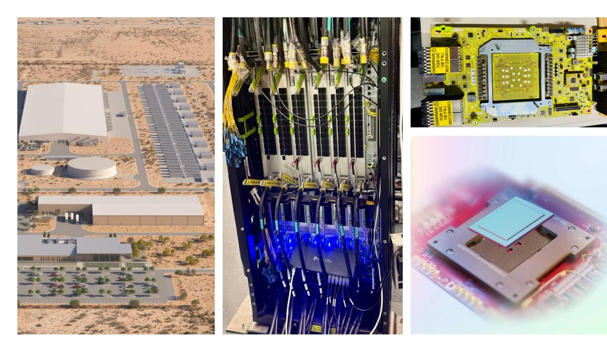
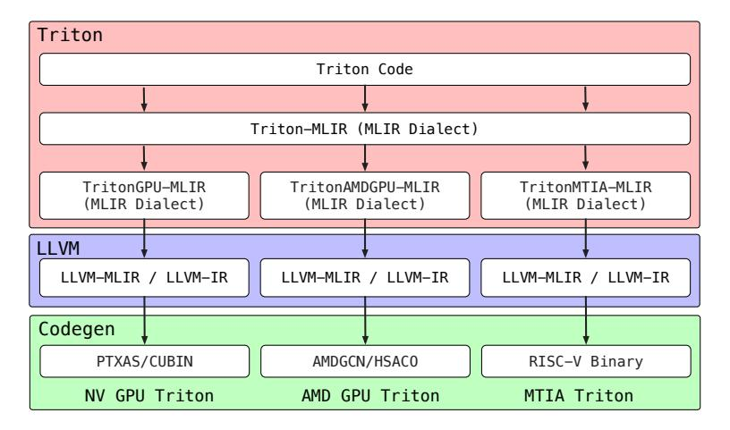
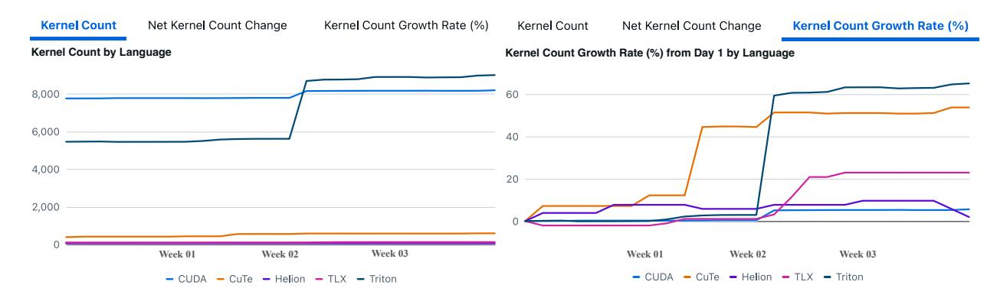
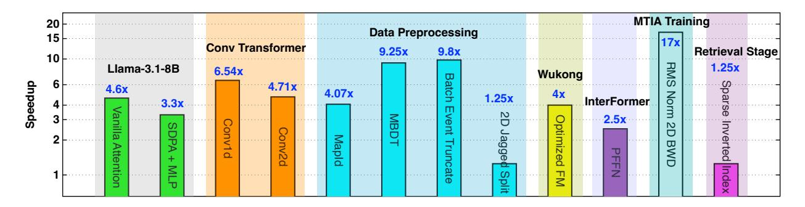

# **1 Introduction**

Modern online advertising systems demand massive-scale machine learning inference under stringent subsecond latency constraints. At Meta's operational scale – serving more than hundreds of trillions of ad-ranking inferences daily across global data centers consuming hundreds of megawatts – the infrastructure deploys an extensive ensemble of multi-stage ranking models (retrieval, early-stage ranking, and second-stage ranking, often exceeding 1500 distinct models) to address diverse prediction tasks. These models execute across a heterogeneous fleet of AI accelerators, including Meta Training and Inference Accelerator (MTIA), AMD GPUs, and NVIDIA hardware. Within this ecosystem, computational kernels—the low-level primitive functions implementing tensor operations, data transformations, and feature engineering—constitute a dual bottleneck affecting both training and serving architecture.

From a performance perspective, ads serving operates under strict real-time constraints where microsecondlevel kernel efficiency directly impacts user experience and revenue generation, as well as Meta's Total Cost of Ownership (TCO). The economic implications are substantial: marginal kernel-level performance improvements translate to multi-million dollar reductions in infrastructure operating costs while simultaneously enhancing user engagement metrics that correlate directly with advertising revenue. From an architectural perspective, kernel coverage on target hardware fundamentally determines system deployment viability. When critical operators lack native implementations on AI accelerators, production systems may architect disaggregated serving topologies where missing operators execute on separate CPU tiers, or halt deployment until kernels are implemented. This fragmentation introduces cross-node network overhead (adding millisecondscale latency), serialization costs, reduced reliability from cascading failures. Moreover, incomplete kernel coverage blocks model launches, directly constraining algorithmic innovation and competitive differentiation. This confluence of latency sensitivity, architectural constraints, and massive deployment scale elevates kernel optimization to a first-order system imperative for ads model serving infrastructure.

## **1.1 The Curse of Dimensionality**

The computational landscape of production ads ranking systems exhibits unprecedented complexity across three critical dimensions: model architecture diversity, kernel primitive diversity and hardware generation and architecture heterogeneity. This combinatorial explosion creates a fundamental scalability crisis that manual kernel development approaches cannot address.

**Hardware Diversity Across Vendors and Generations.** Production deployment spans heterogeneous accelerators including NVIDIA GPUs, AMD GPUs, and Meta's custom MTIA chips [\[Meta](#page-43-0) [2024\]](#page-43-0) in Figure [1—](#page-3-0)each exhibiting distinct architectural characteristics that prevent direct kernel portability.

- (1) Memory hierarchy heterogeneity: Architectures differ fundamentally in cache organization and bandwidth characteristics. NVIDIA architectures employ multi-level cache hierarchies with tens of megabytes of L2 cache, AMD architectures feature large Infinity Cache structures serving as shared L3-equivalent storage, while MTIA architectures implement custom on-chip SRAM subsystems optimized for recommendation inference patterns with distinct on-chip and off-chip bandwidth profiles. These differences necessitate architecture-specific memory access patterns and tiling strategies.
- (2) Programming model fragmentation: Each platform exposes hardware through incompatible abstractions—CUDA's thread-block model, Triton's tile-based DSL [\[Tillet et al.](#page-44-0) [2019\]](#page-44-0), AMD's ROCm/HIP extensions, CuTe's layout algebra for NVIDIA Hopper [\[NVIDIA](#page-43-1) [2025\]](#page-43-1), MTIA's C++ kernel DSL, and emerging frameworks like TileLang/TLX/Gluon [\[Wang et al.](#page-44-1) [2025c,](#page-44-1) [Meta](#page-43-2) [2025b,](#page-43-2) [OpenAI](#page-43-3) [2025\]](#page-43-3). These abstractions differ not merely in syntax but in fundamental execution models—from Triton's automatic memory coalescing to CUDA's explicit shared memory management—necessitating complete algorithmic restructuring rather than syntactic translation.
- (3) Generational architectural discontinuities: Even within a single vendor family, generational transitions introduce fundamentally different execution models. For example, NVIDIA's Ampere-to-Hopper evolution introduced the Tensor Memory Accelerator (TMA) for asynchronous bulk tensor transfers between global and shared memory, added a new 128-thread warp-group execution model to support WGMMA tensor operations, and exposed multiple asynchronous execution pipelines using mbarriers and producer–consumer

**Figure 1** Meta's MTIA (Meta Training and Inference Accelerator) is a custom-designed chip optimized for AI workloads. The figure illustrates the MTIA hardware from four perspectives: its integration within a data center or server farm, highlighting the overall facility layout and environment; its deployment within a rack-mounted system for high-bandwidth applications; a close-up of the chip's circuitry and board connections; and a detailed view of the chip core. Together, these images highlight MTIA's advanced design, connectivity, and its role in enhancing the performance and efficiency of AI tasks across Meta's platforms.

synchronization. These features require kernel developers to adopt new pipeline structures that differ significantly from traditional warp-centric Ampere kernels.

This hardware diversity renders manual cross-platform kernel development economically infeasible, as each hardware platform requires complete reimplementation of thousands of distinct kernel variants with hardware-specific optimization strategies that do not transfer across architectural boundaries. Each platformspecific implementation demanding 2-8 weeks of expert optimization effort. The resulting implementation matrix—O(operators × hardware platforms)—creates an unsustainable maintenance burden, further exacerbated by 12-18 month hardware generation update cycles that invalidate existing optimizations and necessitate complete kernel redesigns to exploit new architectural features.

**Model Diversity Across Ranking Stages.** As shown in Table [1,](#page-4-0) modern ads ranking employs multi-stage architectures where computational characteristics vary dramatically across pipeline stages. Retrieval models process millions of candidates using lightweight scoring functions optimized for both throughput and latency, employing approximate nearest neighbor search and efficient embedding operations. Early-stage ranking models apply moderate-complexity neural networks to thousands of candidates, balancing computational cost against filtering accuracy through pruned architectures and quantized operations. Second-stage ranking models execute heavyweight deep neural networks on hundreds of candidates with strict sub-100ms latency requirements, increasingly incorporating Transformer-based architectures that introduce distinct computational patterns. These Transformer-based ranking models [\[Zhai et al.](#page-45-0) [2024,](#page-45-0) [Zeng et al.](#page-45-1) [2025,](#page-45-1) [Zhang et al.](#page-45-2) [2024\]](#page-45-2) introduce 10-100× computational complexity increases per request compared to traditional dense architectures, requiring specialized attention kernels and sequence processing operations. Orthogonally, production recommendation models employ significantly larger embedding tables—often exceeding 100GB—that stress memory capacity and bandwidth, necessitating specialized embedding lookup and aggregation kernels optimized for irregular memory access patterns.

Each stage demands distinct kernel optimization strategies: retrieval favors batched operations maximizing memory bandwidth utilization; early-stage ranking requires balanced compute-memory workloads; final-stage ranking demands maximum single-request performance through aggressive operator fusion and specialization.

| Ranking Stages      | Description  | Production Models | Total Models  | Model Complexity        |
|---------------------|--------------|-------------------|---------------|-------------------------|
| Early stage ranking | Rank 10K ads | ≥ 150 models      | ≥ 500 models  | 0.01-0.1 GFLOPS/request |
| Late stage ranking† | Rank 100 ads | ≥ 200 models      | ≥ 1000 models | 0.2-2 GFLOPS/request    |

**Table 1** Examples of some production models distribution at Meta. †Transformer-based sequence models require significantly higher computational complexity at ∼80 GFLOPS/request, representing a 10-100× increase over traditional dense ranking models.

|                                                       | Serving Paradigm 1: Overall Latency Ms |    |    |    |  |  |  |  |  |  |  |
|-------------------------------------------------------|----------------------------------------|----|----|----|--|--|--|--|--|--|--|
| Compute Tier P50 P75 P90 P99              |                                        |    |    |    |  |  |  |  |  |  |  |
| Client → MTIA Tier                                    | 39                                     | 44 | 46 | 61 |  |  |  |  |  |  |  |
| Serving Paradigm 2: Overall Latency Ms                |                                        |    |    |    |  |  |  |  |  |  |  |
| Compute Tier                                          | P50 P75 P90 P99               |    |    |    |  |  |  |  |  |  |  |
| α: Client → CPU Tier                                  | 58                                     | 65 | 73 | 97 |  |  |  |  |  |  |  |
| β: CPU Tier → MTIA Tier                               | 42                                     | 48 | 51 | 57 |  |  |  |  |  |  |  |
| γ: Data Preproc Execution                             | 4                                      | 7  | 10 | 16 |  |  |  |  |  |  |  |
| δ: Extra Network Latency δ = α − β − γ = 10 ∼ 20ms |                                        |    |    |    |  |  |  |  |  |  |  |

**Table 2** Latency comparison of monolithic versus disaggregated serving paradigms for a production MTIA model. Paradigm 1 executes preprocessing client-side, achieving 61ms P99 latency with direct client→remote MTIA communication. Paradigm 2 introduces a dedicated CPU tier for preprocessing scalability, incurring additional network hops that increase P99 latency to 97ms. The extra network latency (δ = α − β − γ ≈ 10 ∼ 20ms) represents pure architectural overhead with no computational benefit, demonstrating the cost of disaggregated serving when preprocessing operators lack native accelerator implementations.

This architectural diversity—spanning from traditional MLPs to attention-based sequence models—prevents one-size-fits-all kernel optimization approaches and necessitates model-aware kernel generation strategies that can synthesize implementations for both established operators and rapidly emerging architectural patterns.

**Kernel Diversity Beyond GEMM.** While dense matrix multiplication (GEMM) operations benefit from mature, highly-optimized libraries (cuBLAS, FBGEMM, DeepGEMM) [\[PyTorch](#page-43-4) [2025a,](#page-43-4) [DeepSeek](#page-41-0) [2025\]](#page-41-0), production ads ranking workloads exhibit fundamentally different computational characteristics that necessitate broader kernel coverage. Ads ranking models execute over 200 distinct data preprocessing operators as integral components of model inference pipelines, where raw features undergo transformation before feeding subsequent neural network layers. These transformations [\[Zhao et al.](#page-45-3) [2022\]](#page-45-3) span feature derivation (bucketization, set operations, n-gram hashing), dense normalization (variance-stabilizing transformations, one-hot encoding), and sparse normalization (cryptographic hashing with modulo reduction and type downcasting to map categorical features to embedding indices, top-k truncation with score-based ranking).

While individually exhibiting low arithmetic intensity compared to GEMM operations, kernel availability for these preprocessing operators fundamentally determines deployment architecture. The lack of optimized preprocessing kernels on AI accelerators creates a binary constraint: without native accelerator implementations, models become ineligible for unified accelerator deployment. Executing preprocessing on accelerator host CPUs proves infeasible: (1) host CPUs in accelerator servers are underprovisioned compared to dedicated CPU tiers, lacking capacity for preprocessing-intensive workloads; (2) heterogeneous preprocessing demands—varying compute and memory bandwidth requirements—contend with accelerator I/O and system management for limited host resources; (3) allocating additional host CPU capacity negates accelerator consolidation's economic and power efficiency benefits.

This constraint forces disaggregated serving architectures partitioning models across compute tiers: preprocessing on CPU servers, neural network computation on accelerators (GPU, AMD, MTIA). While enabling independent tier scaling—a desirable microservice property [\[Audibert et al.](#page-41-1) [2023,](#page-41-1) [Murray et al.](#page-43-5) [2021\]](#page-43-5)—disaggregation **imposes severe penalties** for latency-critical models at multi-megawatt serving capacity. Table [2](#page-4-1)

**Figure 2** Triton multi-target compilation architecture. Source code transforms through progressive MLIR lowering stages—platform-independent Triton-MLIR, hardware-specific GPU/AMDGPU/MTIA dialects, LLVM-IR—generating native binaries for NVIDIA (PTX/CUBIN), AMD (AMDGCN/HSACO) [\[Zhang and Wang](#page-45-4) [2025\]](#page-45-4), and MTIA (RISC-V) platforms.

quantifies these costs for a production MTIA deployment. Paradigm 1 executes preprocessing client-side before accelerator invocation (P99: 61ms). Paradigm 2 introduces a dedicated CPU preprocessing tier, incurring additional network hops increasing P99 to 97ms—a 25% degradation (compared to expected 57 + 16 ≈ 73ms with zero network overhead). The 10-20ms network overhead represents pure architectural tax consuming a substantial portion of the sub-100ms latency budget required for ads serving. This fragmentation compounds through: (1) cross-node serialization and communication costs; (2) cascading failure modes across service tiers; (3) operational complexity from synchronized deployments and version compatibility; (4) increased TCO from redundant CPU infrastructure.

The architectural implications prove severe: preprocessing kernel absence creates a binary deployment constraint rather than incremental performance loss. A single missing preprocessing operator—regardless of arithmetic intensity—blocks entire model deployments on new accelerators, forcing disaggregated architectures with system-level costs exceeding individual kernel inefficiency. This constraint paradoxically elevates preprocessing operators to equal or greater priority than compute-intensive kernels: while suboptimal GEMM implementations degrade performance incrementally, missing preprocessing kernels impose architectural penalties preventing monolithic deployment entirely. Consequently, comprehensive kernel coverage enabling monolithic accelerator deployment—where preprocessing and neural network computation colocate—emerges as a first-order requirement for cost-effective serving. This architectural imperative motivates KernelEvolve's automated generation framework synthesizing optimized implementations across the complete operator-hardware matrix, treating data preprocessing as first-class optimization targets alongside traditional compute kernels.

**Emerging AI-Powered Kernel Authoring.** Recent advances in large language models have catalyzed a wave of AI-powered coding agent systems, with several targeting GPU kernel optimization. Academic efforts include KernelBench [\[Ouyang et al.](#page-43-6) [2025\]](#page-43-6), which benchmarks LLM capabilities across three difficulty levels (operator, kernel fusion, full model) spanning canonical GPU operators, and AutoTriton [\[Li et al.](#page-42-0) [2025\]](#page-42-0) from Tsinghua, which applies reinforcement learning to Triton programming. Industry initiatives span multiple organizations: Meta's KernelLLM [\[Fisches et al.](#page-41-2) [2025\]](#page-41-2) and CWM [\[Carbonneaux et al.](#page-41-3) [2025\]](#page-41-3) explore code generation with world models; Amazon's TritonRL [\[Woo et al.](#page-45-5) [2025\]](#page-45-5) trains LLMs for Triton synthesis; AMD's GEAK-agent [\[Wang et al.](#page-44-2) [2025b\]](#page-44-2) targets Triton kernel generation with agentic workflows on AMD MI300X and MI250; Cognition AI's Kevin [\[Baronio et al.](#page-41-4) [2025\]](#page-41-4) employs multi-turn RL for CUDA kernel generation. These systems demonstrate that AI agents can generate competitive implementations on isolated OSS benchmarks through iterative refinement and learned optimization strategies.

However, these remain research prototypes with fundamental limitations for production deployment. (1) narrow optimization scope: systems target isolated subproblems—AutoTriton focuses on RL post-training for Triton, Kevin optimizes CUDA generation—without addressing end-to-end kernel lifecycle management from

**Figure 3** Triton overtakes CUDA as dominant kernel programming model at Meta. Left: Triton has grown to over 8,000 kernels, surpassing CUDA's stagnant legacy codebase, while emerging DSLs (CuTe, TLX, Helion) remain under 600. Right: Growth trajectories show Triton's 60% expansion rate driving this transition, with CuTe at 50% following November deployment. This shift toward higher-level DSLs—while maintaining legacy CUDA and introducing new abstraction (TLX)—creates programming model fragmentation across 5+ languages, motivating KernelEvolve's automated synthesis approach.

synthesis to deployment. (2) synthetic evaluation: benchmarks use canonical operators with static tensor shapes rather than production workloads exhibiting dynamic batching, variable sequence lengths, and domainspecific transformations (e.g., jagged tensor operations, cryptographic hashing for feature engineering). (3) single-platform focus: most target homogeneous NVIDIA environments without cross-platform synthesis for heterogeneous accelerator fleets (NVIDIA, AMD, custom ASICs). (4) limited agent capabilities: existing systems lack fully autonomous workflows encompassing automated synthesis, multi-level correctness verification (unit tests, integration tests, numerical accuracy), hierarchical profiling feedback (system, kernel and intra-kernel granularities), and persistent knowledge bases via filesystem that enable context-aware prompt synthesis by dynamically retrieving relevant optimization patterns, hardware specifications, and historical profiling data. (5) absence of inference-time scaling: no system employs large-scale search strategies (greedy, Monte Carlo Tree Search, evolutionary algorithms) that iterate hundreds to thousands of optimization steps per kernel, a capability critical for achieving expert-level performance. (6) no checkpointing support: systems restart from scratch on failure rather than resuming from intermediate states, making multi-hour optimization runs brittle and resource-inefficient. These gaps—spanning workload realism, hardware heterogeneity, agent autonomy, search scalability, and operational robustness—prevent existing prototypes from meeting production requirements.

**KernelEvolve.** To address these fundamental limitations, we propose KernelEvolve, an agent-based framework that automates the generation and optimization of high-performance compute kernels for ads ranking model serving across heterogeneous hardware architectures. Responding to the programming model evolution in Figure 3—where Triton has emerged as the dominant DSL with 60% growth—KernelEvolve adopts Triton as its primary target, capitalizing on its cross-platform support across NVIDIA, AMD, and MTIA accelerators (see Figure 2). We additionally target Triton-TLX, enabling low-level hardware-specific tuning while maintaining Triton's portability advantages.

Figure 4 demonstrates KernelEvolve's effectiveness across diverse production workloads and hardware platforms. KernelEvolve achieves substantial speedups spanning LLM inference workloads (Llama-3.1-8B: Vanilla Attention  $4.6\times$ , SDPA-MLP  $3.3\times$ ), convolutional transformers (conv1d:  $6.5\times$ , conv2d:  $4.7\times$ ), memory-bound data preprocessing operators critical for model enablement (MapId:  $4.1\times$ , MBDT:  $9.3\times$ , Batch Event Truncate:  $9.8\times$ ), compute-intensive fusion kernels in ranking models (WuKong Optimized FM:  $4.0\times$ , InterFormer PFFN:  $2.5\times$ ), MTIA-specific optimizations (RMSNorm 2D backward:  $17\times$ ), and retrieval operations (Sparse Inverted Index:  $1.25\times$ ). These results validate KernelEvolve's ability to generate production-grade implementations across the full spectrum of recommendation and LLM inference workloads—from compute-bound fusion to memory-bound preprocessing—while addressing hardware-specific optimization challenges on proprietary accelerators. Detailed evaluation and analysis are presented in Section 5.

KernelEvolve leverages agentic AI capabilities to establish an end-to-end kernel generation service that

**Figure 4** KernelEvolve achieves 1.25-17× speedups across Meta LLMs and production use cases, spanning convolutional Transformers, data preprocessing operators, and recommendation systems, over heterogeneous AI hardware.

autonomously handles kernel synthesis, compilation, profiling, correctness verification, and performance benchmarking. This approach fundamentally transforms traditional kernel development from a manual, expertise-dependent process to an automated, scalable service maintaining production-grade performance standards while adapting to evolving model architectures and hardware diversity.

This paper makes the following contributions:

- We present KernelEvolve, the first production-grade AI-powered kernel optimization system deployed at industrial scale for recommendation model training and inference. KernelEvolve operates continuously in Meta's production infrastructure, autonomously generating optimized Triton kernels for hundreds of models serving billions of users daily. Our agent-based approach achieves production-grade reliability while exploring optimization strategies infeasible through manual development, and demonstrates how structured knowledge bases encoding hardware-specific constraints enable effective kernel generation for proprietary architectures absent from LLM training corpora.
- We demonstrate KernelEvolve's autonomous kernel optimization achieving competitive performance with expert manual implementations while reducing development time from weeks to hours. Through diverse production use cases spanning ads training and serving workloads, KernelEvolve-generated kernels achieve 1.2 to 17 times speedup over the PyTorch baselines, demonstrating that automated synthesis can exceed state-of-the-art compiler-generated code for domain-specific operators. We analyze optimization trajectories across diverse operator types and hardware platforms, identifying patterns in successful kernel generation strategies that inform future automated optimization systems.
- We share insights from operating KernelEvolve in production environments, including failure mode analysis, debugging strategies for incorrect kernel generation, performance validation methodologies ensuring production safety, and organizational integration patterns for adopting automated kernel generation workflows.

