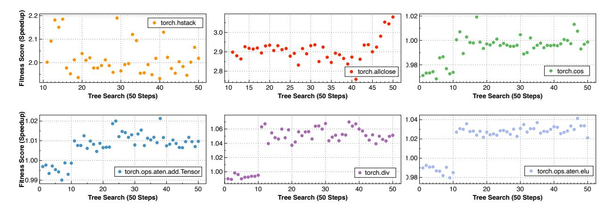
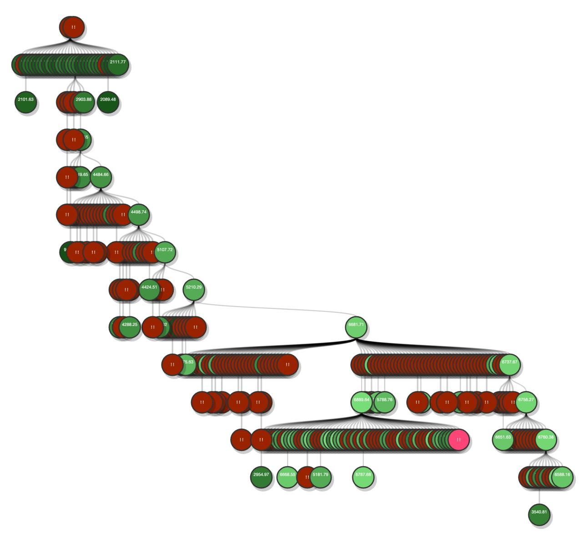
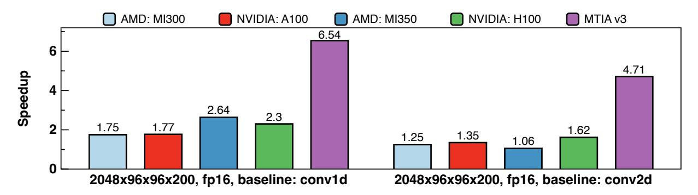
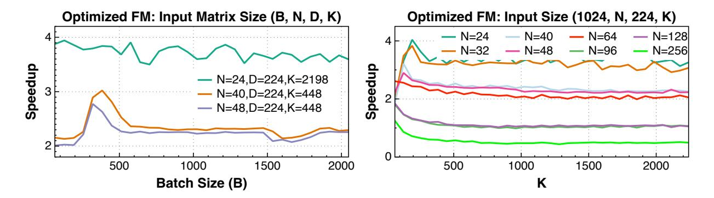
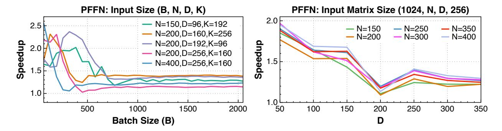
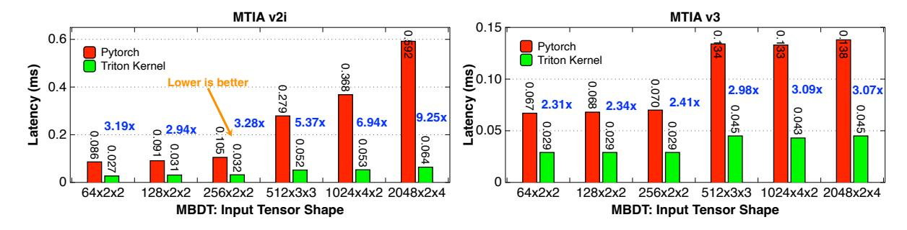

# <span id="page-22-0"></span>**4 OSS Operator Evaluation**

Kernel coverage—the availability of optimized implementations for standard operators—is a fundamental prerequisite for deploying models on emerging AI accelerators. Before optimizing for performance, the system must first demonstrate the ability to generate correct kernels across the operator set. This section evaluates KernelEvolve's end-to-end capability to generate, validate, and benchmark kernels across heterogeneous hardware.

We curate a test suite of 160 ATen operators covering basic computational patterns: element-wise arithmetic (torch.add, torch.div), transcendental functions (torch.cos, torch.exp), reductions (torch.amax, torch.allclose), and activation primitives (torch.ops.aten.elu). While these operators are relatively simple, they represent the foundational building blocks required for PyTorch model execution and serve as an end-to-end validation of KernelEvolve's kernel generation correctness. For each operator, KernelEvolve generates Triton kernel implementations targeting three platforms: NVIDIA H100, AMD MI350, and MTIA v3. Generated kernels are validated against PyTorch reference implementations compiled with torch.compile. Numerical equivalence is verified using torch.allclose in TritonBench with precision-appropriate tolerances.

KernelEvolve achieves 100% correctness across all 480 operator-platform configurations (160 operators × 3 platforms). We further validate on KernelBench [\[Ouyang et al.](#page-43-6) [2025\]](#page-43-6), achieving 100% pass rate across all three levels: Level 1 (single operators), Level 2 (fused operator patterns), and Level 3 (full model blocks). While KernelBench originally targets CUDA kernel generation, these results demonstrate that KernelEvolve reliably produces numerically correct Triton kernels across diverse architectures and operator complexities—from individual primitives to end-to-end model components—establishing the foundation for addressing the kernel coverage challenge on emerging hardware.

Figure [10](#page-23-2) shows optimization trajectories for six operators. The fitness score is defined as the speedup of the generated Triton kernel over the PyTorch reference. The search operates in two phases. In the draft phase (steps 0–10), KernelEvolve generates candidate kernels through independent sampling without feedback. In the tree expansion phase (steps 10–50), each node incorporates execution feedback—profiling data, compilation status, and correctness results—from its ancestors, enabling iterative refinement. The trajectories exhibit operator-dependent behavior. torch.cos improves from 2.8× to 3.05× during tree expansion, indicating that feedback-guided search discovers superior implementations. torch.ops.aten.add.Tensor shows early-stage improvement (0.64× to 0.70×), demonstrating that iterative refinement benefits even initially suboptimal kernels. torch.amax and torch.div remain near 1.0× throughout, suggesting limited optimization headroom for these operators. Four of six operators achieve fitness scores exceeding 1.0×, confirming that KernelEvolvegenerated kernels can outperform compiler-generated baselines.

<span id="page-23-2"></span>

**Figure 10** Fitness score trajectories during KernelEvolve's tree search optimization for 6 representative ATen operators. The x-axis denotes search steps (50 total), and the y-axis shows the fitness score defined as the speedup ratio of the generated Triton kernel over the PyTorch baseline. The first 10 steps correspond to the draft phase (repeated sampling without memory context), while subsequent steps represent tree expansion with execution feedback.

These basic ATen operators serve primarily to validate KernelEvolve's end-to-end correctness rather than to demonstrate optimization potential. As fundamental primitives, they offer limited headroom for improvement. In the following section, we evaluate KernelEvolve on high-level ads operators, which compose multiple ATen primitives with ads-specific logic, exhibiting unique fusion opportunities and memory access patterns that yield substantially larger optimization potential and direct business impact.

## <span id="page-23-0"></span>5 Monetization Case Study

Figure 4 presents KernelEvolve's performance across production workloads, achieving 1.2-17× speedups over PyTorch baselines. We present detailed analysis of representative kernels: 1D convolution in convolutional transformers, operator fusion in WuKong's Optimized FM and InterFormer's PFFN, and data preprocessing operators (MapId, MBDT, Batch Event Truncate) across heterogeneous accelerators.

Beyond these detailed case studies, several kernels achieve substantial speedups through more straightforward optimizations: expanded autotuning search spaces exploring block sizes and pipeline configurations, platform-specific compilation flags (MTIA's cb\_multiplier), and memory access improvements (cache modifiers, alignment hints). While individually less sophisticated, these optimizations demonstrate KernelEvolve's ability to systematically explore configuration spaces that manual development often overlooks.

#### <span id="page-23-1"></span>5.1 Convolutional Transformer

Inspired by CNN Inceptions [Szegedy et al. 2015] and convolution-augmented transformers [Gulati et al. 2020], the Convolutional Transformer architecture combines convolutional and transformer components to capture both local and global patterns in user sequential events for large-scale recommendation systems.

The core of this architecture is a stack of 1D convolutional layers, which serve as the receptive field. Through multi-scale sliding windows with varying kernel sizes and strides, these conv1d layers compress long event sequences into shorter segment representations, extracting hierarchical patterns at different granularities. Given that conv1d operations dominate the computational workload, kernel-level optimization is critical for deployment at scale. To address this, we employ KernelEvolve to automatically generates and tunes high-performance kernels on H100 GPUs through iterative refinement.

Baselines and Evaluation Setup. We compare KernelEvolve-generated kernels against two PyTorch baselines on production shapes. The first baseline uses torch.nn.functional.convld directly. The second—a common optimization technique—reshapes input to 2D with channels\_last memory format and invokes torch.nn.functional.conv2d, mapping to cuDNN's heavily optimized Tensor Core path for NHWC convolu-

<span id="page-24-0"></span>

| Precision | Tensor Shape<br>(B × Cin<br>× Cout<br>× L) | torch.conv1d<br>(ms) | torch.conv2d<br>(ms) | Triton<br>(ms) | Speedup<br>vs. conv1d | Speedup<br>vs. conv2d |
|-----------|--------------------------------------------|----------------------|----------------------|----------------|-----------------------|-----------------------|
|           | 64 × 96 × 96 × 200                         | 0.03050              | 0.02019              | 0.01597        | 1.91×                 | 1.26×                 |
|           | 128 × 96 × 96 × 200                        | 0.03840              | 0.02490              | 0.01830        | 2.10×                 | 1.36×                 |
|           | 256 × 96 × 96 × 200                        | 0.05318              | 0.03347              | 0.02842        | 1.87×                 | 1.18×                 |
|           | 512 × 96 × 96 × 200                        | 0.08646              | 0.06006              | 0.04982        | 1.74×                 | 1.21×                 |
| FP16      | 1024 × 96 × 96 × 200                       | 0.17226              | 0.11299              | 0.08406        | 2.05×                 | 1.34×                 |
|           | 2048 × 96 × 96 × 200                       | 0.34243              | 0.24106              | 0.14864        | 2.30×                 | 1.62×                 |
|           | 32 × 64 × 64 × 512†                        | 0.02768              | 0.01779              | 0.01264        | 2.19×                 | 1.41×                 |
|           | 32 × 256 × 256 × 1024†                     | 0.07933              | 0.05485              | 0.06029        | 1.32×                 | 0.91×                 |
|           | 64 × 768 × 768 × 1024†                     | 0.71549              | 0.55354              | 1.12784        | 0.63×                 | 0.49×                 |
|           | 64 × 96 × 96 × 200                         | 0.03501              | 0.02531              | 0.02186        | 1.60×                 | 1.16×                 |
|           | 128 × 96 × 96 × 200                        | 0.04630              | 0.03248              | 0.03510        | 1.32×                 | 0.93×                 |
|           | 256 × 96 × 96 × 200                        | 0.07168              | 0.05712              | 0.05789        | 1.24×                 | 0.99×                 |
|           | 512 × 96 × 96 × 200                        | 0.15030              | 0.11517              | 0.11219        | 1.34×                 | 1.03×                 |
| FP32      | 1024 × 96 × 96 × 200                       | 0.32077              | 0.24269              | 0.19725        | 1.63×                 | 1.23×                 |
|           | 2048 × 96 × 96 × 200                       | 0.61411              | 0.46384              | 0.35594        | 1.73×                 | 1.30×                 |
|           | 32 × 64 × 64 × 512†                        | 0.02730              | 0.01978              | 0.01571        | 1.74×                 | 1.26×                 |
|           | 32 × 256 × 256 × 1024†                     | 0.13469              | 0.10326              | 0.13501        | 1.00×                 | 0.77×                 |
|           | 64 × 768 × 768 × 1024†                     | 1.26237              | 1.04234              | 2.64502        | 0.48×                 | 0.39×                 |

Yellow : production configuration. Purple † : randomly selected shapes (not optimization target).

**Table 3** Conv1d kernel performance: KernelEvolve-generated Triton kernel vs. PyTorch conv1d and conv2d baselines. The kernel is optimized for production ads ranking shapes (highlighted in yellow), achieving strong speedups. Performance on other shapes (highlighted in purple) varies: similar shapes benefit from the optimization, while out-of-distribution shapes show degraded performance.

tions. Table [3](#page-24-0) evaluates performance across batch sizes with FP16 (serving) and FP32 (training) precision, verified with atol=10<sup>−</sup><sup>4</sup> , rtol=5 × 10<sup>−</sup><sup>4</sup> .

**Performance Results.** On production shape (B × Cin × Cout × L) = (2048, 96, 96, 200), KernelEvolve achieves 2.30× speedup over conv1d and 1.62× over the optimized conv2d baseline in FP16, with consistent gains across batch sizes (1.74-2.30× vs. conv1d). For FP32 training workloads, speedups reach 1.73× over conv1d and 1.30× over conv2d. The generated kernel is deliberately specialized: on out-of-distribution shapes (e.g., 64 × 768 × 768 × 1024), it underperforms baselines (0.49-0.63×), confirming that optimization targets production distributions rather than arbitrary inputs.

**Kernel Fusion as Primary Optimization.** Figure [11](#page-25-1) and Table [4](#page-25-2) reveal the source of these improvements through execution trace analysis. PyTorch conv1d launches five separate kernels: multiple layout transformations (nchwToNhwcKernel, nhwcToNchwKernel), Tensor Core GEMM (sm90\_xmma\_fprop), and a Tritongenerated fusion kernel. Each launch incurs synchronization overhead and intermediate memory traffic. The conv2d baseline reduces this to four kernels via optimized NHWC paths but still requires separate operations for layout manipulation and computation.

KernelEvolve fuses the entire operation into two kernels: weight preparation and the main convolution kernel. The Triton Conv1d kernel outperforms the PyTorch Conv2d workaround by eliminating memory layout conversions. The Conv2d approach launches four auxiliary kernels for unsqueeze, channels-last conversion, convolution, and squeeze operations—each requiring a full tensor pass and incurring significant global memory traffic. In contrast, Triton launches only two kernels: a lightweight weight-packing step and the fused convolution, operating directly on the native 1D layout. While cuDNN's implicit GEMM achieves high compute efficiency for the convolution itself, Triton delivers better end-to-end performance by avoiding redundant layout transformations and their associated memory overhead.

**Complementary Optimizations.** Beyond fusion, the generated kernel employs architectural optimizations discovered through search. Expanded autotuning explores over 20 configurations across block sizes, warp counts, and pipeline stages, tailored to input dimensions and convolution parameters. A 3D grid launch

<span id="page-25-1"></span>

|  |  | Torch.Conv1d  |  |  |
|--|--|---------------|--|--|
|  |  |               |  |  |
|  |  |               |  |  |
|  |  |               |  |  |
|  |  |               |  |  |
|  |  |               |  |  |
|  |  | Torch.Conv2d  |  |  |
|  |  |               |  |  |
|  |  |               |  |  |
|  |  |               |  |  |
|  |  |               |  |  |
|  |  | Triton Kernel |  |  |
|  |  |               |  |  |
|  |  |               |  |  |

**Figure 11** Profiling traces comparing conv1d implementations on production shape. PyTorch conv1d (top) launches five separate kernels including layout transformations and GEMM. PyTorch conv2d (middle) reduces to four kernels via optimized NHWC paths. KernelEvolve (bottom) fuses operations into two kernels with cross-operation fusion. Note that durations shown in the profiling trace include profiling overhead and do not represent actual kernel latency.

<span id="page-25-2"></span>

| Implementation                | Kernel                                                                                                                                                                        | Operation                                                                                                                                                      |
|-------------------------------|-------------------------------------------------------------------------------------------------------------------------------------------------------------------------------|----------------------------------------------------------------------------------------------------------------------------------------------------------------|
| torch.nn.Conv1d               | nchwToNhwcKernel<br>nchwToNhwcKernel<br>sm90_xmma_fprop_implicit_gemm<br>nhwcToNchwKernel<br>triton_poi_fused_convolution_0                                                   | Convert input NCHW → NHWC<br>Convert weights NCHW → NHWC<br>Convolution (cuDNN implicit GEMM)<br>Convert output NHWC → NCHW<br>Bias addition / post-processing |
| torch.nn.Conv2d               | triton_poi_fused_to_copy_unsqueeze_0<br>triton_poi_fused_to_copy_convolution_unsqueeze_1<br>sm90_xmma_fprop_implicit_gemm<br>triton_poi_fused_to_copy_convolution_unsqueeze_2 | Layout conversion (unsqueeze + channels-last)<br>Weight preparation (unsqueeze)<br>Convolution (cuDNN implicit GEMM)<br>Post-processing (squeeze 4D → 3D)      |
| KernelEvolve<br>Triton Conv1d | pack_conv1d_weight_kernel<br>conv1d_gemm_kernel                                                                                                                               | Weight packing for GEMM-style access<br>Fused GEMM-style convolution                                                                                           |

**Table 4** Kernel breakdown comparison for conv1d implementations. PyTorch conv1d incurs significant layout conversion overhead. PyTorch conv2d reduces conversions through optimized NHWC paths. Triton conv1d eliminates redundant transformations through kernel fusion.

parallelizes grouped convolution channels, eliminating inter-group dependencies. Double-buffered execution prefetches the next data blocks while computing current blocks, overlapping memory access with Tensor Core operations. Differentiated cache modifiers optimize memory hierarchy usage (.ca for streaming activations, .cg for reused weights).

**Search-Based Discovery.** Figure [12](#page-26-0) visualizes the optimization trajectory over 300 search steps, where the fitness score equals 1/latency (higher is better). Green nodes indicate successful generations; red nodes indicate compilation or correctness failures. Initial draft phases achieve fitness scores around 2000. As search progresses with accumulated execution feedback, scores improve systematically—reaching 4000, then 5000, and ultimately converging to 6889. This trajectory demonstrates that graph-based search with performanceguided selection discovers increasingly efficient implementations through inference-time scaling, automatically identifying the fusion strategies and tiling configurations that manual development would require weeks to explore.

Appendix [A](#page-46-0) provides source code for the PyTorch conv1d and conv2d baselines, the KernelEvolve-generated Triton kernel, and TritonBench scripts for accuracy and speedup evaluation.

## <span id="page-25-0"></span>**5.2 Convolution on Heterogeneous Hardware**

The diversity of hardware vendors and generations in large-scale model inference environments poses significant challenges for both enablement and optimization. KernelEvolve's graph-based search and retrieval-

<span id="page-26-0"></span>

**Figure 12** Search tree visualization for conv1d kernel generation over 300 steps. Green: successful generation; Red: compilation/correctness failures.

<span id="page-27-1"></span>

**Figure 13** KernelEvolve-generated kernels compared against PyTorch conv1d and optimized conv2d baselines, demonstrating up to 6.22× speedup across NVIDIA, AMD, and MTIA architectures.

augmented prompting are specifically designed to accommodate this heterogeneity, generating optimized kernels for AMD, NVIDIA, and MTIA accelerators from unified operator specifications. To validate crossplatform effectiveness, we evaluate the conv1d kernel from convolutional transformers (Section [5.1\)](#page-23-1) across five hardware platforms spanning three vendors and multiple generations.

**Cross-Platform Baseline Comparison.** Figure [13](#page-27-1) compares KernelEvolve-generated kernels against two PyTorch baselines on production shape (B × Cin × Cout × L) = (2048, 96, 96, 200) with FP16 precision. The first baseline uses torch.nn.functional.conv1d directly. The second baseline employs a common optimization technique: reshape the input to 2D with channels\_last memory format and invokes torch.nn.functional.conv2d, which maps to cuDNN's heavily optimized Tensor Core path for NHWC convolutions. While mathematically equivalent to conv1d, this conv2d approach often provides superior performance on modern GPUs by exploiting vendor-optimized libraries.

KernelEvolve-generated kernels achieve consistent speedups over the conv1d baseline across all platforms: 1.75× on AMD MI300, 2.30× on NVIDIA H100, 2.54× on AMD MI350, 1.77× on NVIDIA A100, and 6.54× on MTIA v3. Performance relative to the optimized conv2d baseline varies by platform: NVIDIA GPUs show modest improvements (1.62× on H100, 1.35× on A100), reflecting cuDNN's maturity on these architectures. AMD platforms demonstrate smaller gains (1.25× on MI300, 1.06× on MI350). MTIA v3 achieves the largest speedup at 4.71× over conv2d, demonstrating that KernelEvolve's automated synthesis can effectively target custom accelerator architectures where vendor library coverage is less mature.

**Hardware-Specific Optimization Strategies.** The performance variations across platforms reflect fundamental architectural differences that KernelEvolve's knowledge base encodes. On NVIDIA GPUs, generated kernels exploit Tensor Core operations through careful tile sizing and memory layout transformations. AMD platforms benefit from Infinity Cache-aware tiling that maximizes on-chip data reuse. MTIA kernels leverage specialized function units and inter-PE communication primitives absent from GPU programming models (Section [3.2.3\)](#page-15-0). Critically, these hardware-specific optimizations emerge through systematic search guided by platform-specific documentation retrieved from the knowledge base—rather than manual per-platform tuning.

<span id="page-27-0"></span>**Portability vs. Performance Trade-offs.** The results illustrate a fundamental challenge in heterogeneous deployment: optimizations targeting one platform may not transfer to others. KernelEvolve addresses this challenge through shape-aware dispatch: for each platform, the system generates and validates platformspecific kernels during an offline optimization phase, then deploys the highest-performing variant while maintaining fallback paths to vendor libraries (conv1d/conv2d) when generated kernels underperform. This architecture ensures that automated synthesis delivers performance improvements where possible without risking regressions, enabling safe production deployment across diverse accelerator fleets.

## **5.3 WuKong and InterFormer: Kernel Fusion**

#### <span id="page-28-0"></span>**5.3.1 Optimized FM in WuKong**

Optimized FM is a core computational primitive in Meta's Wukong recommendation model [\[Zhang et al.](#page-45-2) [2024\]](#page-45-2) (Section 3.6). In factorization machine-based architectures, computing the pairwise dot product XX<sup>⊤</sup> has O(N2D) complexity, prohibitive for real-world datasets with thousands of features. Wukong exploits the low-rank property of XX<sup>⊤</sup> by introducing a learnable projection matrix Y ∈ R <sup>N</sup>×<sup>K</sup> where K ≪ N, reducing output dimensionality from N × N to N × K. Leveraging associativity, the computation reorders to:

$$\mathsf{out} = X \cdot (X^\top Y) \tag{1}$$

```
def pytorch_ref_impl(x: torch.Tensor, y: torch.Tensor) -> torch.Tensor:
   """
   Reference PyTorch native implementation of Optimized FM kernel.
   """
   xty = torch.bmm(x.permute(0, 2, 1), y) # (B, D, N) @ (B, N, K) = (B, D, K)
   return torch.bmm(x, xty) # (B, N, D) @ (B, D, K) = (B, N, K)
```

where X ∈ R <sup>B</sup>×N×<sup>D</sup> and Y ∈ R <sup>B</sup>×N×<sup>K</sup>. Computing X<sup>⊤</sup>Y first reduces complexity from O(N2D) to O(NKD). This two-stage batched matrix multiplication presents a fusion opportunity: the intermediate result X<sup>⊤</sup>Y ∈ R <sup>B</sup>×D×<sup>K</sup> can remain in registers or shared memory, eliminating global memory round-trips.

**Production Configuration.** We evaluate on production shapes extracted from a deployed Wukong variant: (B, N, D, K) ∈ {(1024, 24, 224, 2198),(1024, 40, 224, 448),(1024, 48, 224, 448)}. The PyTorch baseline with torch.compile generates two separate extern\_kernels.bmm calls, each independently loading inputs from HBM, performing computation, and writing results back—missing the fusion opportunity between operations.

**Kernel Optimization Strategy.** KernelEvolve generates a fused Triton kernel exploiting two key optimizations:

- *(1) Operator Fusion Eliminating Intermediate Materialization.* The PyTorch baseline executes two independent matrix multiplications with an intermediate HBM round-trip. KernelEvolve fuses both operations into a single kernel: inputs are loaded once, the intermediate result X<sup>⊤</sup>Y remains in SRAM throughout computation, and only the final output writes to HBM. This reduces memory traffic by approximately 2×—eliminating one full read-write cycle of the intermediate tensor.
- *(2) Shape-Specific Tiling for SRAM Residency.* Rather than using PyTorch's standardized autotuning templates, KernelEvolve generates custom tiling configurations tailored to production shapes. The kernel decomposes inputs into tiles sized to fit the complete computation chain (both multiplications) within SRAM capacity. For production configurations where B = 1024, D = 224 remain fixed, tile dimensions are optimized to maximize SRAM utilization while ensuring the fused operation executes entirely on-chip.

**Performance Analysis.** Figure [14](#page-29-1) analyzes speedup across production shape variations. The left panel shows speedup as a function of batch size B for three representative configurations. The kernel achieves 3.6-3.9× speedup for small N (24 features), maintaining stable performance as batch size scales from 128 to 2048. For medium N (40, 48 features), speedup ranges from 2.1-3.0× at small batch sizes, gradually decreasing to 2.2-2.3× as B increases—reflecting the trade-off between fusion benefits and tiling overhead.

The right panel examines speedup as a function of output dimension K with fixed B = 1024, D = 224. Small N values (24-32 features) maintain 3.0-3.5× speedup across the entire K range (256-2304), demonstrating robust performance. Medium N values (40-64 features) achieve 2.0-2.5× speedup, while larger N (96- 256 features) show diminishing returns, approaching 1× as N increases. This degradation occurs because larger feature counts require more tiles to fit in SRAM—as the number of tiles grows, the overhead of tile management and accumulation eventually surpasses the benefits of on-chip computation, making direct HBM execution competitive.

<span id="page-29-1"></span>

Figure 14 Optimized FM speedup on production shapes. Left: Performance across batch sizes for three representative (N,D,K) configurations extracted from deployed Wukong models. Right: Speedup variation with output dimension K at fixed batch size B=1024, showing strong performance for small-to-medium feature counts  $(N \le 64)$  and degradation for larger N where tiling overhead dominates.

Deployment Strategy. The generated kernel demonstrates consistent  $2\text{-}4\times$  speedups on production shapes where  $N \leq 64$ , covering the majority of deployed Wukong variants. For configurations with larger feature counts where tiling overhead dominates, the system falls back to PyTorch's unfused baseline. This shape-specific dispatch ensures performance gains on target workloads without risking regressions on out-of-distribution inputs. The results validate that KernelEvolve's search-based optimization can discover fusion strategies and tiling configurations tailored to production distributions, achieving competitive performance with expert manual implementations while reducing development time from weeks to hours.

#### <span id="page-29-0"></span>5.3.2 PFFN in InterFormer

Personalized FeedForward Network (PFFN) is a key component of the InterFormer architecture in Meta's ads ranking system [Zeng et al. 2025]. In recommendation models, user behavior sequences are inherently noisy—users browse items randomly, making pure sequential modeling ineffective. InterFormer addresses this by enabling bidirectional information flow between non-sequential features (e.g., user demographics) and sequential features (e.g., browsing history).

**Module Structure.** The PFFN module comprises five operations executed sequentially: (1) a feed-forward neural network (batched matrix multiplication with bias), (2) GELU activation, (3) root-mean-square normalization (RMSNorm), (4) another feed-forward layer, and (5) final RMSNorm. This operator chain processes tensors  $X \in \mathbb{R}^{B \times N \times D}$  with weight matrices  $W_1 \in \mathbb{R}^{B \times D \times K}$  and  $W_2 \in \mathbb{R}^{B \times K \times D}$ , where B denotes batch size, N sequence length, D input dimension, and K hidden dimension.

**Production Configuration.** We evaluate on shapes extracted from deployed InterFormer models:  $(B, N, D, K) \in \{(1024, 200, 256, 160), (1024, 200, 192, 96), (1024, 400, 256, 160), (1024, 150, 96, 192)\}$ . Production deployments exhibit consistent patterns with  $B = 1024, N \in [150, 400], D \in [96, 256]$ , and  $K \in [96, 256]$ . The PyTorch baseline with torch.compile generates two separate kernels: (1) extern\_kernels.bmm for matrix multiplication (single pass: load inputs, compute, write output), and (2) a two-pass fused Triton kernel triton\_per\_fused\_rms\_norm\_add\_gelu where the first pass loads data to perform bias addition and accumulate RMSNorm statistics, and the second pass reloads data to apply normalization. This results in three total memory round-trips: one for BMM and two for the fused operations. While PyTorch exploits fusion opportunities among element-wise operations, the multi-pass execution and kernel separation incur redundant memory traffic.

**Kernel Optimization Strategy.** KernelEvolve generates two kernel variants targeting different operator chains: (1) fusing feed-forward network with RMSNorm, and (2) fusing feed-forward network, GELU, and RMSNorm. We select the highest-performing variant for production deployment, evaluating on FP16 precision matching production serving requirements. The generated kernel achieves performance improvements through two key optimizations:

(1) Shape-Specific Tiling for Target Distributions. KernelEvolve's search process incorporates production input

shape ranges during kernel generation. The generated kernel employs customized tiling configurations that maximize SRAM utilization for target dimensions—in contrast to PyTorch's templated BMM kernel using generic tiling heuristics. For production shapes where D ∈ [96, 256] and K ∈ [96, 256], the specialized tiling ensures tiles remain SRAM-resident throughout computation, avoiding HBM fallback that occurs with one-size-fits-all tile sizes.

*(2) Cross-Operation Tile Reuse.* KernelEvolve generates a unified single-pass kernel that loads tiles once, performs the complete operator chain (matrix multiplication, bias addition, GELU, RMSNorm) while data resides in SRAM, and writes final results to HBM—requiring only one load and one write per tile. The PyTorch baseline executes PFFN through two separate kernels with three total passes: (1) the first kernel (extern\_kernels.bmm) loads inputs, performs matrix multiplication, and writes intermediate results; (2-3) the second kernel (triton\_per\_fused\_rms\_norm\_add\_gelu) executes in two passes—the first pass reloads data to perform bias addition and accumulate RMSNorm statistics, the second pass reloads data again to apply normalization.

**Performance Analysis.** Figure [15](#page-31-1) analyzes speedup across production shape variations. The left panel shows performance as a function of batch size B for five production configurations extracted from deployed InterFormer models. Peak speedups of 2.0-2.6× occur at small batch sizes (B ≤ 256), where the fused kernel's reduced memory traffic dominates performance. As batch size increases beyond 512, speedup stabilizes at 1.2-1.4× across all configurations. This convergence reflects a fundamental trade-off: larger batches amortize kernel launch overhead for both optimized and baseline implementations, reducing the relative advantage of fusion as compute-to-memory ratio increases. The configuration (N = 200, D = 256, K = 160)—representative of high-dimensional production embeddings—maintains consistent 1.2× speedup at large batch sizes, validating robust performance on primary deployment targets.

The right panel examines speedup as a function of input dimension D with fixed B = 1024, K = 256 across varying sequence lengths N ∈ [150, 400]. Performance exhibits non-monotonic behavior: speedup peaks at 1.6-1.9× for small D (D ≤ 100), drops to a local minimum of 1.1-1.2× around D = 200, then recovers to 1.2-1.4× for larger dimensions (D > 200). This pattern arises from the interplay between tile size and SRAM capacity. At small D, tiles fit comfortably in SRAM enabling effective fusion; at intermediate D ≈ 200, tile dimensions approach SRAM limits causing partial spilling that negates fusion benefits; at large D > 200, the kernel adapts tiling strategy to maintain SRAM residency, recovering performance. Across all sequence lengths tested, curves follow similar trajectories—demonstrating that the optimization strategy generalizes across the N dimension spanning production workloads.

Critically, all configurations maintain speedup ≥ 1.0 across the tested parameter space, with the majority achieving 1.2-2.0× improvements. The absence of performance regressions validates KernelEvolve's shapeaware optimization approach: generated kernels exploit fusion opportunities when tile configurations permit on-chip execution, while avoiding pathological cases through adaptive tiling strategies discovered during search.

**Discussion.** The PFFN case study demonstrates KernelEvolve's ability to discover non-obvious fusion opportunities through systematic search over operator compositions and tiling configurations. While human experts might identify the matrix multiplication and normalization fusion conceptually, determining the precise tile dimensions and reuse strategies that maximize SRAM occupancy across production shape distributions requires extensive trial-and-error—effort KernelEvolve automates through graph-based search with execution feedback. The 1.5-2× speedups achieved on production workloads validate that automated synthesis can match expert-level kernel implementations while reducing development cycles from weeks to hours.

## <span id="page-30-0"></span>**5.4 Data Preprocessing Kernels on MTIA**

MTIA is a custom silicon platform designed for both LLM and recommendation workloads. Unlike mature GPU ecosystems, MTIA presents unique kernel development challenges: not all PyTorch ATen operators are natively supported across hardware variants, and achieving optimal performance requires MTIA-specific tuning.

*MTIA Kernel Coverage Challenge* Running PyTorch models on MTIA requires kernel implementations for all ATen operators in the model graph. Missing kernels force either model rewrites or fallback to CPU execution,

<span id="page-31-1"></span>

**Figure 15** PFFN speedup on production shapes. Left: Speedup as a function of batch size B for five production (N, D, K) configurations, showing peak performance of 2.0-2.4× at small batch sizes converging to 1.2-1.4× at large batches as kernel launch overhead amortization reduces fusion advantages. Right: Speedup variation with input dimension D at fixed B = 1024, K = 256 across sequence lengths N ∈ [150, 400], exhibiting non-monotonic behavior arising from tile size and SRAM capacity interactions.

both unacceptable for production latency requirements. Table [5](#page-31-2) summarizes unsupported operators for two data preprocessing kernels across MTIA hardware generations.

<span id="page-31-2"></span>

| AI Hardware | Data Preproc Operator | Missing ATen Ops                                                                                    |
|-------------|-----------------------|-----------------------------------------------------------------------------------------------------|
| MTIA v2i    | MapId<br>MBDT         | clamp.out, gather.out, sort.values_stable, all.all_out, _unique2<br>all.all_out, unique_consecutive |
| MTIA v3     | MapId<br>MBDT         | clamp.out, sort.values_stable, _unique2<br>unique_consecutive                                       |

**Table 5** Unsupported ATen operators on MTIA hardware for data preprocessing operators (MapId: MapIdTransform, MBDT: MergeBucketizedDenseTransform).

KernelEvolve addresses both model enablement and kernel optimization. On hardware with limited coverage (MTIA v2i), KernelEvolve-generated kernels provide the missing implementations required for model execution. On hardware with higher coverage (MTIA v3), KernelEvolve delivers performance gains through operator fusion and MTIA-specific tuning. The following sections evaluate two preprocessing kernels: MapIdTransform and MergeBucketizedDenseTransform (MBDT).

#### <span id="page-31-0"></span>**5.4.1 MapId Transform**

MapIdTransform remaps sparse, high-cardinality categorical IDs to dense consecutive integers for embedding lookup. Given a sorted mapping tensor M containing known IDs, the kernel maps each input value to its 1-indexed position in M, reserving index 0 for unknown values.

**Algorithm.** For input tensor V and sorted mapping M:

- 1. Binary search to find insertion index: idx<sup>j</sup> = bucketize(v<sup>j</sup> , M)
- 2. Clamp index to valid range: idx<sup>j</sup> = min(idx<sup>j</sup> , |M| − 1)
- 3. Validate match: if M[idx<sup>j</sup> ] = v<sup>j</sup> , output idx<sup>j</sup> + 1; else output 0

| Input  | values = [100, 300, 500, 200, 999]<br>mapping = [100, 200, 300, 400, 500] |
|--------|---------------------------------------------------------------------------|
| Output | [1, 3, 5, 2, 0]                                                           |

**Table 6** MapIdTransform example. Value 100 is at position 0 in mapping, outputs 1 (1-indexed). Value 300 is at position 2, outputs 3. Value 999 is not in mapping, outputs 0 (unknown).

The PyTorch reference implementation uses torch.bucketize, torch.clamp, torch.gather, and

torch.where—operators partially unsupported on MTIA v2i (Table [5\)](#page-31-2).

```
class MapId(nn.Module):
    def forward(
        self,
        values: torch.Tensor,
    ) -> torch.Tensor:
        mapped_to_index = torch.clamp(
            torch.bucketize(values, self.mapping), max=self.mapping.numel() - 1
        )
        mapped_as_values = torch.gather(self.mapping, 0, mapped_to_index)
        mapped_values = torch.where(
            torch.eq(mapped_as_values, values), mapped_to_index + 1, 0
        return mapped_values
```

**Generated Kernel Optimizations.** KernelEvolve synthesizes a fused Triton kernel that consolidates four PyTorch operators into a single accelerator invocation, applying three MTIA-targeted optimizations:

- *(1) Operator Fusion.* The generated kernel fuses bucketize, clamp, gather, and where into a single kernel launch, eliminating three intermediate tensor materializations. Each thread block loads input values once, performs in-register binary search, validates matches, and writes final outputs—reducing global memory traffic by 4× compared to operator-by-operator execution.
- *(2) Compile-Time Loop Unrolling.* The binary search employs a fixed iteration bound of 20 steps, supporting mapping tables up to 2 <sup>20</sup> entries. This compile-time constant (for \_ in range(20)) enables aggressive loop unrolling by the Triton compiler, converting control flow into predicated straight-line code. Search bounds are maintained in registers using vectorized tl.where operations for branchless conditional updates:

```
left = tl.where(search_active & (values > mapping_val), mid + 1, left)
right = tl.where(search_active & (values <= mapping_val), mid, right)
```

*(3) Coalesced Block-Parallel Execution.* The kernel organizes work into contiguous blocks via BLOCK\_SIZE (a tl.constexpr parameter), where each program instance computes offsets as block\_start + tl.arange(0, BLOCK\_SIZE). This layout ensures that adjacent threads access adjacent memory addresses, maximizing DRAM burst efficiency. Boundary conditions are handled through predicated loads and stores (mask = offsets < n\_elements), avoiding divergent control flow while maintaining full memory coalescing across the warp.

**Performance Analysis.** Table [7](#page-33-1) compares KernelEvolve-generated kernels against PyTorch on MTIA v2i and v3. As shown in Table [5,](#page-31-2) several ATen operators required by MapIdTransform lack native MTIA support, forcing PyTorch to execute CPU fallbacks with expensive host-device synchronization. KernelEvolve synthesizes a fused Triton kernel executing entirely on-device, providing both functional enablement and performance optimization.

On MTIA v2i, KernelEvolve achieves 3.28-3.48× speedup for large batches (batch size = 10000), with consistent performance across mapping table sizes. Performance scales with batch size: 0.78× at 2000 (launch overhead dominates), increasing to 1.38× at 4000, 2.00× at 6000, and 3.23× at 10000, reaching peak 4.07× at batch size 50000. This scaling reflects the trade-off between fixed kernel launch overhead and batch-dependent computation benefits.

On MTIA v3, latencies are substantially lower (0.035-0.174ms vs. 0.399-8.090ms on v1), reflecting improved hardware capabilities. Speedups are more modest at 1.05-1.36×, peaking at batch size 8000. The reduced gains arise from stronger PyTorch baselines on v2i due to improved native operator coverage and memory subsystem performance.

<span id="page-33-1"></span>

| AI Hardware | Tensor Shape: (UniqueIDs × Batch) | PyTorch (ms) | Triton Kernel (ms) | Speedup |
|-------------|-----------------------------------|--------------|--------------------|---------|
|             | 100 × 10000                       | 1.623        | 0.466              | 3.48×   |
|             | 500 × 10000                       | 1.636        | 0.472              | 3.47×   |
|             | 1000 × 10000                      | 1.641        | 0.480              | 3.42×   |
|             | 5000 × 10000                      | 1.667        | 0.508              | 3.28×   |
| MTIA v2i    | 10000 × 2000                      | 0.399        | 0.514              | 0.78×   |
|             | 10000 × 4000                      | 0.720        | 0.521              | 1.38×   |
|             | 10000 × 6000                      | 1.046        | 0.523              | 2.00×   |
|             | 10000 × 8000                      | 1.367        | 0.520              | 2.63×   |
|             | 10000 × 10000                     | 1.688        | 0.523              | 3.23×   |
|             | 10000 × 50000                     | 8.090        | 1.989              | 4.07×   |
|             | 100 × 10000                       | 0.061        | 0.058              | 1.05×   |
|             | 500 × 10000                       | 0.063        | 0.055              | 1.15×   |
|             | 1000 × 10000                      | 0.063        | 0.050              | 1.26×   |
|             | 5000 × 10000                      | 0.060        | 0.048              | 1.25×   |
| MTIA v3     | 10000 × 2000                      | 0.039        | 0.035              | 1.11×   |
|             | 10000 × 4000                      | 0.046        | 0.036              | 1.28×   |
|             | 10000 × 6000                      | 0.049        | 0.037              | 1.32×   |
|             | 10000 × 8000                      | 0.053        | 0.039              | 1.36×   |
|             | 10000 × 10000                     | 0.063        | 0.048              | 1.31×   |
|             | 10000 × 50000                     | 0.140        | 0.174              | 0.80×   |

MTIA v2i / v3 : Triton Kernel. Color: speedup , regression .

**Table 7** MapIdTransform kernel performance: KernelEvolve-generated Triton kernels vs. PyTorch baseline on MTIA v2i and v3.

Across both hardware generations, KernelEvolve delivers robust speedups on large-batch workloads representative of production inference (up to 4.07× on v2i, 1.36× on v3). For edge cases where regressions occur on v2i and v3, runtime dispatch based on input dimensions ensures fallback to PyTorch, preventing performance degradation in deployment.

## <span id="page-33-0"></span>**5.4.2 MergeBucketizedDense Transform**

MBDT is a data preprocessing kernel that maps continuous features to discrete bin indices for embedding lookup in recommendation models. Given an input tensor and per-feature border lists, MBDT performs batched bucketization—a vectorized binary search assigning each value to its corresponding bin.

**Operation.** For input tensor X ∈ R <sup>F</sup> <sup>×</sup><sup>B</sup> (F features, B batch size) and border lists {B<sup>f</sup> } F <sup>f</sup>=1 where each B<sup>f</sup> = [b1, b2, . . . , bK<sup>f</sup> ] is sorted, the output Yf,i is:

$$Y_{f,i} = \min\{k \mid X_{f,i} < B_f[k]\}$$
 (2)

**Example.** Figure [16](#page-34-0) illustrates MBDT execution with 2 features × 3 batch elements. Feature 0 has borders [0.3, 0.6] creating 3 bins; Feature 1 has borders [0.4, 0.7] creating 3 bins. The preprocessing stage flattens all borders into a single array with inf sentinels marking boundaries, enabling O(1) lookup of each feature's border range via offsets.

During parallel execution, each feature's values undergo binary search against their respective borders. For Feature 0, input [0.1, 0.4, 0.8] maps to bins [0, 1, 2]: value 0.1 falls in bin 0 (x ≤ 0.3), value 0.4 in bin 1 (0.3 < x ≤ 0.6), and value 0.8 in bin 2 (x > 0.6). Feature 1's outputs are offset by 3 to ensure globally unique bin indices, yielding [3, 4, 5] for inputs [0.2, 0.5, 0.9]. The final output tensor preserves the input shape with bin indices replacing continuous values.

**Implementation.** The core operation is a binary search over the borders array for each input value. The following pseudocode illustrates the sequential logic (the actual PyTorch baseline uses torch.bucketize):

```
+-------------------------------------------------------------------+
| INPUT |
| values: [[0.1, 0.4, 0.8], (2 features x 3 batch) |
| [0.2, 0.5, 0.9]] |
| borders: [[0.3, 0.6], feature 0: 3 bins |
| [0.4, 0.7]] feature 1: 3 bins |
+-------------------------------------------------------------------+
| FLATTEN BORDERS (with inf sentinels) |
| |
| flattened: [0.3, 0.6, inf, 0.4, 0.7, inf] |
| |-----------| |-----------| |
| feature 0 feature 1 |
| |
| offsets: [0, 3] (start index per feature) |
+-------------------------------------------------------------------+
| PARALLEL BUCKETIZE |
| |
| Feature 0: values [0.1, 0.4, 0.8], borders [0.3, 0.6] |
| bins: (-inf,0.3], (0.3,0.6], (0.6,inf) |
| output: [0, 1, 2] |
| | | | |
| | | +-- 0.8 > 0.6 -> bin 2 |
| | +---- 0.3 < 0.4 <= 0.6 -> bin 1 |
| +------ 0.1 <= 0.3 -> bin 0 |
| |
| Feature 1: values [0.2, 0.5, 0.9], borders [0.4, 0.7] |
| bins: (-inf,0.4], (0.4,0.7], (0.7,inf) |
| output: [3, 4, 5] (offset +3 for global indices) |
| | | | |
| | | +-- 0.9 > 0.7 -> bin 2+3 = 5 |
| | +---- 0.4 < 0.5 <= 0.7 -> bin 1+3 = 4 |
| +------ 0.2 <= 0.4 -> bin 0+3 = 3 |
+-------------------------------------------------------------------+
| OUTPUT |
| [[0, 1, 2], feature 0 bins (indices 0-2) |
| [3, 4, 5]] feature 1 bins (indices 3-5, globally unique) |
+-------------------------------------------------------------------+
```

**Figure 16** MBDT execution example. **Section headers** in red. **Feature 0** data in blue. **Feature 1** data in green. Borders are flattened with inf sentinels; output indices are offset per feature for global uniqueness.

```
def mbdt_sequential(values, borders_list, offsets):
    # values: [F, B], borders_list: List[Tensor], offsets: [F]
    output = torch.empty_like(values, dtype=torch.int64)
    for f in range(num_features):
        for i in range(batch_size):
            # Binary search for bucket index
            idx = torch.bucketize(values[f, i], borders_list[f])
            output[f, i] = idx + offsets[f]
    return output
```

The offset parameter assigns globally unique bin indices across features (e.g., Feature 1's bins start at index 3 in the example above). The nested loops over features and batch elements present clear parallelization opportunities.

**Performance Analysis.** Figure [17](#page-35-2) compares KernelEvolve-generated kernels against PyTorch (with torch.compile) across input configurations on MTIA v2i and v3. Configuration format is Batch × Features × Borders.

On MTIA v2i, KernelEvolve achieves substantial speedups ranging from 2.94× to 9.25×. Speedup scales with input size: smaller configurations (64 × 2 × 2) achieve 3.19×, while larger configurations (2048 × 2 × 4) reach 9.25×. This scaling behavior reflects the kernel's ability to better amortize launch overhead and exploit parallelism as workload size increases.

On MTIA v3, absolute latencies are significantly lower (0.029–0.045ms vs. 0.027–0.064ms on v1), reflecting the next-generation hardware's improved compute throughput. KernelEvolve achieves consistent speedups

<span id="page-35-2"></span>

**Figure 17** MBDT kernel latency comparison. Configuration format: Batch × Features × Borders. KernelEvolve achieves 2.94–9.25× speedup on v2i and 2.31–3.09× on v3, with larger speedups at higher batch sizes.

of 2.31–3.09× across all configurations. The lower speedup magnitude compared to v1 is expected: v2i has higher native operator coverage (Table [5\)](#page-31-2), resulting in a stronger PyTorch baseline with less room for optimization. Nevertheless, kernel fusion and vectorized execution still deliver meaningful gains.

**Generated Kernel Optimizations.** KernelEvolve generates a fused Triton kernel with several MTIA-specific optimizations:

*Kernel Fusion.* The entire bucketization pipeline—border lookup, binary search, and offset computation—executes in a single kernel launch, eliminating inter-kernel communication.

*Vectorized Counting.* Instead of scalar binary search, the kernel uses SIMD-vectorized counting: values > border\_val is applied to blocks of 64–256 elements simultaneously. For typical small border arrays (3–10 elements), this O(n) approach outperforms O(log n) binary search due to reduced control flow overhead and branch-free execution.

*Adaptive Block Sizing.* Block size is tuned based on input dimensions (64 for small, 128 for medium, 256 for large inputs) to maximize Processing Element utilization and ensure hardware saturation.

*Register-Resident Computation.* Intermediate results (left/right counts, averages) remain in registers throughout computation. No intermediate tensor allocations occur; results write directly to the output buffer.

*MTIA-Specific Patterns.* The kernel avoids constructs that fail MTIA compilation (e.g., tl.where in loops), using direct boolean-to-int conversion instead. Memory loads are coalesced with proper masking, and small border arrays are cached across processing blocks.

## <span id="page-35-0"></span>**5.4.3 Summary**

The MapIdTransform and MBDT evaluations demonstrate KernelEvolve's dual value proposition on emerging hardware platforms: *enablement* and *optimization*. On MTIA v2i, where native operator coverage is limited, KernelEvolve-generated kernels provide the only viable on-device execution path—without them, PyTorch falls back to CPU for unsupported operators, incurring order-of-magnitude latency penalties. On MTIA v3, where coverage is more complete, KernelEvolve still delivers 2–3× speedups through kernel fusion and hardware-specific tuning.

These results highlight a key insight: as new accelerators emerge, the gap between hardware availability and software ecosystem maturity creates a critical need for automated kernel generation. Traditional approaches—waiting for vendor libraries or hand-tuning by kernel experts—cannot scale to the diversity of operators and hardware variants in production. KernelEvolve addresses this by generating correct, optimized kernels from high-level operator specifications, reducing the time from hardware deployment to production readiness from months to hours.

<span id="page-35-1"></span>Looking forward, we envision KernelEvolve as a foundational tool for heterogeneous accelerator ecosystems. As Meta continues to deploy next-generation MTIA hardware alongside NVIDIA and AMD GPUs, the ability to rapidly generate and optimize kernels across platforms becomes increasingly critical.

<span id="page-36-0"></span>

|           | Feature 0 (ad format)<br>Feature 1 (page id) |                                          |  |  |  |  |  |  |  |  |  |
|-----------|----------------------------------------------|------------------------------------------|--|--|--|--|--|--|--|--|--|
|           | Input (3 users with [3, 4, 1] events)        |                                          |  |  |  |  |  |  |  |  |  |
| outer_len | [ 3 ,<br>4 ,<br>1 ]                          | [ 3 ,<br>4 ,<br>1 ]                      |  |  |  |  |  |  |  |  |  |
| inner_len | [ 1, 0,<br>2 ,<br>0, 3,<br>1, 1 ,<br>1 ]     | [ 1, 1,<br>1 ,<br>1, 1,<br>1, 1 ,<br>1 ] |  |  |  |  |  |  |  |  |  |
| values    | [ 1,<br>2, 3 ,<br>4, 5, 6,<br>7, 8 ,<br>9 ]  | [ 1, 2,<br>3 ,<br>4, 5,<br>6, 7 ,<br>8 ] |  |  |  |  |  |  |  |  |  |
|           | Output (truncate to N=2 events)              |                                          |  |  |  |  |  |  |  |  |  |
| outer_len | [ 2 ,<br>2 ,<br>1 ]                          | [ 2 ,<br>2 ,<br>1 ]                      |  |  |  |  |  |  |  |  |  |
| inner_len | [ 1, 0 ,<br>0, 3 ,<br>1 ]                    | [ 1, 1 ,<br>1, 1 ,<br>1 ]                |  |  |  |  |  |  |  |  |  |
| values    | [ 1 ,<br>4, 5, 6 ,<br>9 ]                    | [ 1, 2 ,<br>4, 5 ,<br>8 ]                |  |  |  |  |  |  |  |  |  |

**Figure 18** Batch Event Truncate with multiple features. Colors indicate users ( User 0 , User 1 , User 2 ). Nested red highlights data discarded when truncating to N=2 events—showing which user's data is being removed.

## **5.5 Sequence Learning: Batch Event Truncate**

Event-based features (EBF) [\[Reddy et al.](#page-43-16) [2024\]](#page-43-16) are a time-ordered sequence of interactions of a specific type, such as ad\_impression, where each interaction contains multiple feature values (e.g., ad display format types, page id). EBF encodes user behavior sequences in ads ranking models as nested jagged tensors. Each batch contains three tensors: outer\_lengths specifies the number of events per user, inner\_lengths specifies the number of attributes per event, and values stores the flattened attribute data.

**Operation.** Figure [18](#page-36-0) illustrates the Batch Event Truncate operation with multiple features. The input batch contains three users with [3, 4, 1] events respectively, and two features per event: Feature 0 (e.g., ad display format) with variable-length attributes, and Feature 1 (e.g., page id) with uniform single attributes. For Feature 0, User 0 has events with [1, 0, 2] attributes containing values [1, 2, 3]; User 1 has events with [0, 3, 1, 1] attributes containing values [4, 5, 6, 7, 8]; User 2 has a single event with 1 attribute containing value [9]. For Feature 1, all events have single attributes, with values [1, 2, 3] for User 0, [4, 5, 6, 7] for User 1, and [8] for User 2. When truncating to N=2 events, the operator retains only the first two events per user across all features simultaneously. For User 0, the third event is discarded—removing 2 attributes (values [2, 3]) from Feature 0 and 1 attribute (value [3]) from Feature 1. For User 1, the third and fourth events are removed—discarding attributes [1, 1] (values [7, 8]) from Feature 0 and attributes [1, 1] (values [6, 7]) from Feature 1. User 2 is unchanged since it has fewer than N events.

The operation requires coordinated index arithmetic across three nested levels and multiple features—a pattern poorly suited to standard tensor primitives. In production, sequences can reach 200 events with 5–32 features, making efficient batched truncation critical for serving latency and motivating a custom Triton kernel that processes all features in a single launch.

The original PyTorch implementation processes each feature event sequence independently in a loop—no batched variant existed due to the complexity of coordinating index arithmetic across nested jagged tensors. KernelEvolve automatically generates a batched Triton kernel that processes multiple features in parallel, a non-trivial optimization that would require significant manual engineering effort.

**Performance Analysis.** Table [8](#page-37-1) compares the KernelEvolve-generated batched Triton kernel against the non-batched PyTorch baseline. The PyTorch implementation processes each feature sequentially, while the Triton kernel batches all features into a single launch.

Two factors drive the performance difference. First, when no truncation is needed (Max N ≥ actual event count), PyTorch loops through each batch element comparing lengths individually, while the batched kernel performs a single vectorized comparison—yielding 9.8× and 14.5× speedups at higher feature counts. Second, when truncation is required, the batched kernel uses constant kernel launches for parallel processing versus PyTorch's sequential iteration, achieving 1.4–2.0× speedups.

<span id="page-37-1"></span>

| Description         | Feature Counts | Events | Max Length | PyTorch<br>(ms) | Triton<br>(ms) | Speedup |
|---------------------|----------------|--------|------------|-----------------|----------------|---------|
| Single feature      | 1              | 200    | 100        | 0.148           | 0.313          | 1.0×    |
| Single feature      | 1              | 200    | 200        | 0.148           | 0.109          | 1.4×    |
| Prod multi-feature  | 5              | 200    | 100        | 0.788           | 0.571          | 1.4×    |
| Prod multi-feature  | 9              | 200    | 200        | 1.443           | 0.148          | 9.8×    |
| Large feature count | 32             | 200    | 100        | 5.078           | 2.548          | 2.0×    |
| Large feature count | 32             | 200    | 200        | 5.085           | 0.350          | 14.5×   |

**Table 8** Batch Event Truncate performance: KernelEvolve-generated batched Triton kernel vs. non-batched PyTorch baseline.

In production end-to-end benchmarks, the batched kernel achieves 2× speedup over the PyTorch implementation. Notably, speedup scales with batch size, indicating that the batched kernel enables further model scaling by supporting additional event-based features without proportional latency increase. These results demonstrate that KernelEvolve can generate efficient batched implementations for operators where only sequential baselines exist, enabling significant latency reductions in production serving.

