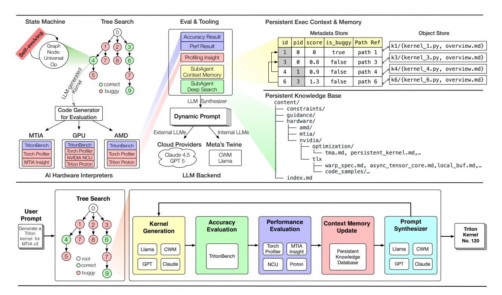

# **2 Background**

## **2.1 Meta's Recommendation Model**

Meta's products—Facebook, Instagram, Reels, Threads—rely on deep learning recommendation models (DLRM) [\[Naumov et al.](#page-43-7) [2019\]](#page-43-7) delivering personalized content including advertisements, short videos, and posts. Llama-based generative AI additionally powers advertising features such as image and text generation [\[Dubey et al.](#page-41-5) [2024\]](#page-41-5). Recommendation infrastructure processes trillions of daily inferences through multi-stage pipelines exhibiting substantial architectural diversity driven by stage-specific computational and latency constraints.

**Multi-Stage Ranking Pipeline.** The recommendation funnel comprises three stages with distinct characteristics: Retrieval processes millions of candidates narrowing to 10K-100K items through low-complexity models operating at large batch sizes with significant preprocessing overhead; Early-stage ranking refines thousands of

candidates to hundreds using moderate-complexity models; Late-stage ranking scores hundreds of candidates with heavyweight models (up to 2 GFLOPS per sample) incorporating high-order feature interactions through hierarchical architectures (DHEN [\[Zhang et al.](#page-45-6) [2022\]](#page-45-6), Wukong [\[Zhang et al.](#page-45-2) [2024\]](#page-45-2)). Production late-stage models exhibit over 60× complexity variation reflecting diverse quality-latency trade-offs.

**DLRM Architecture.** Traditional recommendation models combine sparse feature embeddings (categorical inputs: post IDs), dense feature transformations via MLP (continuous values: age, time), and interaction layers modeling cross-feature dependencies. Recent architectures incorporate Transformer-like components for sequence modeling—HSTU [\[Zhai et al.](#page-45-0) [2024\]](#page-45-0) processes user history through jagged attention mechanisms, while InterFormer [\[Zeng et al.](#page-45-1) [2025\]](#page-45-1) enables bidirectional information flow between sequential and nonsequential features through personalized attention—introducing 10-100× per-request complexity increases versus traditional DLRM while demanding larger embedding tables stressing memory bandwidth.

**Emerging Generative Recommendation.** Recent recommendation systems explore generative approaches treating recommendation as sequence generation. Architectures like OneRec [\[Zhou et al.](#page-45-7) [2025a](#page-45-7)[,b\]](#page-45-8) employ quantization techniques (RQVAE [\[Rajput et al.](#page-43-8) [2023\]](#page-43-8), RQ-Kmean [[\[Luo et al.](#page-42-1) [2025\]](#page-42-1))] converting continuous embeddings into discrete semantic IDs for LLM-based modeling. These introduce computational patterns—autoregressive decoding, token-based retrieval, quantization operations—requiring kernel support beyond traditional DLRM operators.

This architectural diversity creates heterogeneous kernel optimization requirements. Retrieval prioritizes throughput at large batch sizes; late-stage ranking demands compute-intensive fused interactions under sub-100ms latency; sequence models require jagged tensor operations for variable-length histories; generative recommendation introduces quantization and autoregressive decoding primitives. Each stage combines these specialized operators with data preprocessing transformations, creating a diverse operator landscape requiring hundreds of optimized kernel implementations.

## **2.2 Data Preprocessing Operations**

Data preprocessing transforms raw features into model-ready inputs, executing transformations on batched data before feeding neural network stages. During training, preprocessing executes on distributed workers [\[Zhao et al.](#page-45-3) [2022\]](#page-45-3); during inference, preprocessing operators are embedded within model modules as integral components—executing synchronously with model invocation under strict latency constraints where preprocessing latency directly impacts end-to-end inference response time.

**Feature Types and Memory Layout.** Ads ranking models consume four primary feature types with distinct memory representations [\[Liao et al.](#page-42-2) [2025\]](#page-42-2): (1) Dense features (float32) encode continuous user/item attributes (age, click-through rates, engagement scores); (2) Sparse features (list<int64>) represent categorical IDs (page IDs, post IDs) as variable-length lists requiring jagged tensor support; (3) Weighted sparse features (list<pair<int64, float32>>) associate scores with IDs for ranking-based operations; (4) Eventbased features capture user history events as temporal sequences, increasingly adopted in production models for improved prediction quality through sequential interaction modeling.

**Preprocessing Transformation Categories.** Production preprocessing pipelines execute three operation classes: (1) Dense normalization applies statistical transformations (BoxCox, Logit) and one-hot encoding to grouped features, followed by linear scaling (shift, multiplication) across the feature matrix; (2) Sparse processing truncates ID lists via top-k selection (optionally sorted), applies cryptographic hashing mapping IDs to embedding table indices, and downcasts hashed values from int64 to int32 for memory efficiency; (3) Feature derivation computes new features from existing ones through complex operator compositions—bucketizing continuous values into categorical bins, set operations across multiple sparse lists, n-gram hashing for text features. Feature derivation comprises hundreds of operator branches in abstract syntax trees executing over feature subsets, creating substantial kernel diversity beyond standard neural network primitives.

This preprocessing complexity—hundreds of operators with irregular memory access patterns, data-dependent control flow, and sparse computation characteristics— fundamentally determines serving paradigm in production systems, as discussed in Section [1.](#page-2-0) The diversity and computational significance of preprocessing operators motivate comprehensive kernel coverage as a first-order architectural requirement rather than focusing solely on compute-intensive operations like GEMM.

Figure 5 KernelEvolve System Architecture (top) and Execution Workflow (down). KernelEvolve employs a self-improving state machine with tree search to explore and validate kernel optimizations. The system integrates evaluation tooling (accuracy, performance, profiling), specialized sub-agents for context management and deep search, and AI hardware interpreters for MTIA, GPU, and AMD platforms. An LLM synthesizer generates dynamic prompts, which are then used by external (Claude 4.5, GPT-5) or internal (Meta's CWM) LLM backends to generate Triton kernel candidates. Persistent storage includes a metadata store tracking execution scores and parent-child relationships in the search tree (connected to the object store via path references), an object store for kernel files, and a knowledge base that serves as a retrieval system for hardware constraints and optimization guidance to support LLM context augmentation.

