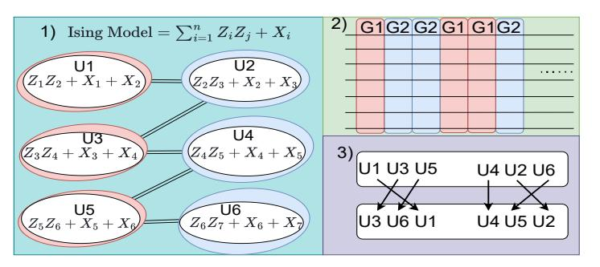

# **4 Kernpiler Framework**

In this section, we introduce in detail the Kernpiler framework that can deeply optimize the quantum Hamiltonian simulation by leveraging the optimization opportunities and overcoming the challenges mentioned above.

## **4.1 Overview**

The Kernpiler framework is outlined in Figure. [1b](#page-1-0)). The input is a quantum Hamiltonian for which the user wishes to obtain *e iHt* for a set time *t*.

Firstly, the input is partially Trotterized. For example, instead of fully Trotterizing *e i*(*H*1+*H*2+*H*3)*t* to *e iH*<sup>1</sup> *t e iH*2*t e iH*3*t* , the algorithm may partially Trotterize to *e i*(*H*1+*H*2)*t e iH*3*t* . To do this, partitions must be formed by sorting Hamiltonian terms

<span id="page-4-0"></span>Table 1: Input is an array of Pauli strings. First the algorithm sorts the array on the highest qubit indices acted upon with tiebreakers being the weight of the string. Next the terms are grouped in a greedy fashion such that in each group the terms act on no more than 3 unique qubit indices.

| Step   | Terms                                                                   |  |  |  |  |  |  |  |  |
|--------|-------------------------------------------------------------------------|--|--|--|--|--|--|--|--|
| Input  | $[X_3, X_1X_2, Z_3Z_4, Z_1]$                                            |  |  |  |  |  |  |  |  |
| Sort   | $[Z_1, X_1X_2, X_3, Z_3Z_4]$                                            |  |  |  |  |  |  |  |  |
| Group  | $[Z_1, X_1X_2], [X_3, Z_3Z_4]$                                          |  |  |  |  |  |  |  |  |
| Result | $e^{i\frac{t}{n}(Z_1+X_1X_2)}=U_1$ , $e^{i\frac{t}{n}(X_3+Z_3Z_4)}=U_2$ |  |  |  |  |  |  |  |  |

based on their operator weight (e.g.,  $X_1X_2X_3$  which acts on three qubits is a weight 3 term), constraining each partition to not act on more than n qubits, where n can be chosen arbitrarily. This results in the dense unitaries labeled  $U_i$  in Figure. 1b). Because, in order to do this, the entire circuit needs to be searched, this is the Challenge 1 which we referred to as dense circuit partitioning as discussed in section 3, and which we solve by remaining at a higher level operator representation, referred to as high-level circuit partitioning. Later, these n weight unitaries will be decomposed directly using reinforcement learning methods. Because decomposing arbitrarily high weight unitaries is hard, in the rest of this paper we choose n=3, however we will also comment on choosing larger n later.

Secondly, the partially Trotterized unitaries are grouped such that in each group, the unitaries commute. After constructing groups of commuting unitaries, the order of groups within the Trotter step is determined. For our implementation, two groups containing the most and second most unitaries are placed on the edge of the Trotter step. In every step the side in which the two groups are placed is flipped such that neighboring Trotter steps have at their adjacent edges the identical commuting groups (these will be merged in the following step).

Thirdly, still at the Hamiltonian term level, adjacent identical groups which commute, (i.e.,  $[U_i, U_j] = 0$ ) are merged together (i.e.,  $U_iU_jU_jU_i$  is 'merged' to  $U_i^2U_j^2$ ). After merging groups, there will still be a source of error that comes from the non-commuting terms within a single Trotter step (see Eq. 1). This approximation error would be repeated each time the Trotter step is applied. We refer to this as coherent noise. To counteract this, we randomly shuffle the order of the terms within each successive Trotter step maintaining terms in their respective groups such that this noise becomes stochastic. The k Kernpiler framework then concludes with rewriting the dense unitaries into a target gate set to be executed on a quantum computer.

### 4.2 Hamiltonian Partitioning Algorithm

The first stage in our compilation pipeline is the partitioning step (shown in Table 1), which allocates Pauli strings into partitions for partial Trotterization. The goal is to maximize the density of terms which do not commute in each partition. will then be added to the same partition. At this point the group is full, so when  $X_3X_4$  is selected next going from left to right, a new group will be created to avoid having more than 3 unique indices in one group. The resulting partitions tend

#### <span id="page-4-1"></span>Algorithm 1 Greedy Partitioning Algorithm

```
Require: List of Hamiltonian terms Hamiltonian_terms
Ensure: Partitions of Pauli operators acting on at most 3
  qubits
  Sort Hamiltonian_terms by their highest qubit index then
  by term weight
  partitions \leftarrow []
  for each term in sorted_terms do
      placed \leftarrow False
     for each partition in partitions do
         if combined qubits of term and partitions contain at
  most 3 qubits then
             append term to partition
             placed \leftarrow True
             break
     if not placed then
         append | term | as a new partition to partitions
  return partitions
```

The input to this Figure is an array of Hamiltonian Pauli terms and the output is partitioned sets of Hamiltonian terms. Currently, each partition of Hamiltonian terms can act nontrivially on 3 qubits maximum, and the unitary made from the partitioned Hamiltonian terms needs to be of size  $8 \times 8$ . Different from circuit-level partitioning strategies, which can only partition a few adjacent gates [12, 24], partitioning the high-level Pauli strings allows us to obtain more dense partitions because many circuit complexities are abstracted away.

Our Hamiltonian term partitioning algorithm is shown in Algorithm 1 and we explain it using the example in Table 1. In this table, the input is the terms of a 4 qubit spin Hamiltonian where each term is weight 1 or weight 2. After receiving the input, the terms are ordered by the largest qubit index acted upon in the term. The terms are then sorted by weight when two terms have an identical max index to define the final ordering.

For example, consider Pauli string  $X_1X_2X_3$  and  $Z_3$ . The highest qubit index of both terms is shared, and therefore what would decide the final ordering is the weight of the terms (i.e.,  $Z_3 \leq X_1X_2X_3$ ). In this sorted order, locally overlapping or anti-commuting terms that should be partitioned together effectively appear near each other, while high-weight or irrelevant terms end up at the tail of the array. In Table 1 we see that  $Z_1$  and  $X_1X_2$  are non-commuting and naturally align close to each other because non-commutation is determined strongly by shared indices. Due to many Hamiltonians being local in nature, sorting by qubit indices tends to put large portions of non-commuting terms very close to each other in the array.

The partitioning phase uses a greedy algorithm which adds terms to the first partition it sees available. If no half constructed partition is available, a new one is created. In our example,  $Z_1$  will invoke a partition creation,  $X_1X_2$  and  $X_3$  will then be added to the same partition. At this point the group is full, so when  $X_3X_4$  is selected next going from left to right, a new group will be created to avoid having more than 3 unique indices in one group. The resulting partitions tend

<span id="page-5-0"></span>

Figure 3: 1) **Create Groups:** A conflict graph is constructed showing commutation relations of Hamiltonian terms. A vertex indicates a unitary of the Trotter step. An edge indicates that two unitaries do not commute. Independent sets are created about the graph which are used to group unitaries with other pairwise commuting unitaries. 2) **Order Full Groups:** The groups created are ordered in the Trotter step for cancellation with other groups. The two largest groups are placed on edges of the Trotter step. At the neighboring Trotter steps, the groups placed at the edges swap places such that identical groups are neighboring each other. Unitaries are then merged via commutation equivalences. 3) **Shuffling Group Term Order:** The order of terms within each group is shuffled to invoke stochastic noise over coherent noise.

to be dense enough to allow meaningful circuit optimizations while also maintaining simplicity.

#### 4.3 Trotter Step Reordering and Randomization

In the second stage of our optimization pipeline, we reorder and randomize our partially Trotterized unitaries (see Figure 3). Here, we use a simple input case, the 1D Ising model. The input consists of a set of partially Trotterized unitaries of the form  $e^{i(\sum H_i)t}$ , which together form a single Trotter step. The Pauli strings contained in each unitary are also listed. In Step 1, we construct a conflict graph that represents the commutation relationships between the Trotter step unitaries. These unitaries are generated as outputs from the previous algorithm described in section 4.1. Independent sets, corresponding to mutually commuting unitaries, are then extracted from this graph to form commuting groups. The two independent groups are denoted as G1, and G2 respectively, in Figure 3. Extracting independent sets is done in a greedy fashion according to Figure. 3. After identifying independent sets, Step 2 shows the ordering of groups within 1 Trotter step. Groups are ordered such that with neighboring Trotter steps, identical groups are neighboring each other and can be trivially merged into fewer unitaries; this is beneficial for the final output.. For example, imagine  $e^{iH_it}$ . Due to all of the terms mutually commuting, the identical unitaries can be reordered such that  $e^{iH_it}e^{iH_i\bar{t}} \rightarrow e^{i2H_it}$  which reduces the unitary count from the perspective of mapping unitaries to gates. Step 3 we mitigate coherent noise by shuffling the order of unitaries in each group. Notice that the ordering is not shuffled between groups, and that all unitaries stay within their assigned group from Step 1. This approach effectively reduces the overall circuit depth and gate complexity, optimizing the quantum circuit compilation without incurring

additional approximation errors.

Here we describe how to obtain the groups found in Step 2 of Figure 3. The greedy independent set algorithm, described in Algorithm 2 starts with the conflict graph as input. Starting with a vertex, for example the vertex with the lowest index, add all vertices not sharing an edge with the target vertex to our group. Second, we need to remove all vertices in our newly formed group from the conflict graph so that these vertices are not repeated in newer groups. The process is then iterated again to get the second largest maximally independent set of the graph. The conclusion of this algorithm outputs two sets which are to be merged with their identities on the boundaries of Trotter steps, as seen in Figure 3, Step 2.

#### <span id="page-5-1"></span>Algorithm 2 Trotter Step Reordering and Randomization

```
function BUILDCONFLICTGRAPH(H)
   Initialize graph G = (V, E) where each node v_i \in V
corresponds to a term in H
   for each pair of terms (t_i, t_i) in H do
      if [t_i, t_i] \neq 0 (they do not commute) then
          Add edge (v_i, v_i) to G
   return G
function GreedyCommutingGroups(G)
   groups \leftarrow []
   while G is not empty do
       I \leftarrow \text{GreedyMaxIndependentSet}(G)
       append I to groups
       Remove nodes in I (and their edges) from G
   return groups
function REORDERTROTTERSTEPS(\{H_1, \ldots, H_n\})
   for each Trotter step H_k do
       G_k \leftarrow \text{BuildConflictGraph}(H_k)
       groups_k \leftarrow GreedyCommutingGroups(G_k)
       randomize the ordering within each group in
groups_k
      concatenate commuting groups contiguously
   reorder consecutive Trotter steps
   merge commuting operators across adjacent steps
where possible:
   if [A, B] = 0 for A in step k, B in step k+1 then
   return {modified Trotter steps}
```

