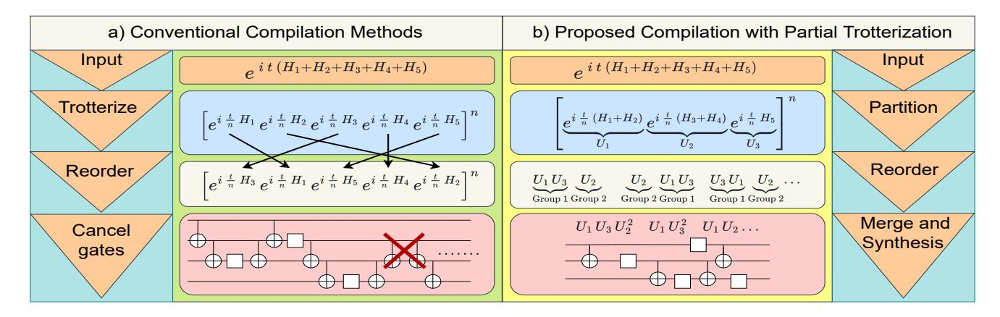

# Kernpiler: Compiler Optimization for Quantum Hamiltonian Simulation with Partial Trotterization

Ethan Decker\* University of Pennsylvania Lucas Goetz ETH Zurich

Evan McKinney University of Pittsburgh

Erik Gustafson

(RIACS) at NASA Ames Research Center

Junyu Zhou

University of Pennsylvania

Yuhao Liu University of Pennsylvania

Alex K. Jones Syracuse University

Ang Li Pacific Northwest National Laboratory

Samuel Stein

Pacific Northwest National Laboratory

Gushu Li

Massachusetts Institute of Technology

University of Pennsylvania

November 19, 2025

University of Pennsylvania Syracuse University of Pennsylvania Syracuse University of Maryland Pacific Eleanor Crane Massachusetts Institute of Technolog November Quantum computing promises transformative impacts in simulating Hamiltonian dynamics, essential for studying physical systems inaccessible by classical computing. However, existing compilation techniques for Hamiltonian simulation—in particular, the commonly used Trotter formulas—struggle to provide gate counts feasible on current quantum computing. gle to provide gate counts feasible on current quantum computers for beyond-classical simulations. We propose partial Trotterization, where sets of non-commuting Hamiltonian terms are directly compiled, allowing for less error per Trotter step and therefore a reduction of Trotter steps overall. Furthermore, a suite of novel optimizations is introduced which complement the new partial Trotterization technique, including reinforcement learning for complex unitary decompositions and high-level Hamiltonian analysis for unitary reduction. We demonstrate with numerical simulations across spin and fermionic Hamiltonians that compared to state-of-the-art methods such as Qiskit's Rustiq and Qiskit's Paulievolutiongate, our novel compiler presents up to  $10 \times$  gate and depth count reductions.

#### Introduction 1

Quantum computing holds immense promise as a paradigmshifting technology, with one of its most impactful applications lying in *Hamiltonian simulation* [31, 8, 32, 7]—the process of evolving a qubit array according to the physics (Hamiltonian) of a target quantum system. Hamiltonian simulation is widely recognized as a cornerstone of quantum computing's value proposition, as it enables the study of complex physical phenomena that elude classical methods, promising advances in materials science [2], quantum chemistry [5], nuclear-[3]

\*Corresponding author. ecd5249@upenn.edu

and high-energy physics [11]. However, bringing these benefits to fruition requires efficient compilation strategies to convert the Hamiltonian time evolution to the quantum gate sequences.

Existing efforts in quantum simulation compilation, beyond higher-level compilers such as [43, 34], have employed the domain knowledge and Pauli algebra to optimize the quantum Hamiltonian simulation circuit. In the conventional compilation flow for quantum Hamiltonian simulation (on the left of Figure 1), a Hamiltonian, H, will first be decomposed into a sum of weighted terms, e.g. Pauli strings,  $H = \sum_i H_i$  (weights absorbed to  $H_i$ 's). The Trotter product formula then allows one to approximate the Hamiltonian time evolution  $e^{iHt}$  with a long sequence composed of each individual Hamiltonian term,  $e^{iH_it}$ , for time evolution. Existing optimization approaches include simultaneous diagonalization of commuting Pauli strings in the decomposition [9, 10, 45], Pauli string reordering optimizations after Trotterization [27, 19, 1], Pauli network synthesis[14, 37], etc., which have yielded noticeable benefits.

The drawback of such conventional compilation flow for quantum Hamiltonian simulation is that each of the Hamiltonian terms must individually be decomposed into its own unitary. Therefore, all these compilation approaches rely on the vanilla error bound in the Trotter formula [20] and focus on reducing the number of gates per Trotter step. Furthermore, to reduce the approximation error one must then increase the number of Trotter steps according to this bound. Notably, for spin and fermionic Hamiltonians, achieving high fidelity with low approximation error typically demands extraordinarily long quantum circuits [4, 7, 21].

The objective of this paper is to show a new path forward for quantum Hamiltonian simulation by incorporating the optimization opportunity from error analysis. We observe that the fundamental bottleneck of product formulas arises from

Figure 1: **Conventional compilation flow vs the proposed Kernpiler compiler**. b) Pipeline for reducing gates through error term reduction. First we group into partial Trotter steps which act on a subset of N qubits, in our case N=3. Then we perform an efficient numerical rewrite of the partial Trotter unitaries. Next step, group into commuting subsets of unitaries placing the largest two groups of unitaries on the edges of the Trotter step. Finally, we use a partially symmetric Trotter step to cancel error terms in the expansion by alternating every other Trotter steps order. Commuting unitaries then merge back together naturally allowing for a unitary reduction with no additional error. The compilation finishes at circuit-level.

*error scaling*, wherein non-commuting Hamiltonian terms are approximated by sequential exponentials. As the error in Trotterization is directly dependent on the non-commutativity of Hamiltonian terms, strategies to mitigate this characteristic in a fine-grained manner can provide a new and scalable way for continued progress in Hamiltonian simulation.

To this end, we propose the new paradigm of *Partial Trotterization* for Hamiltonian compilation, as depicted on the right side of Figure [1.](#page-1-0) Along with this novel concept, we develop a suite of optimizations, namely Kernpiler, which complement partial Trotterization to command large reductions over modern full Trotterization techniques. **First,** rather than fully decomposing each Hamiltonian term as a separate exponential, we partially Trotter the input Hamiltonian by partitioning non-commuting Hamiltonian terms together into more complex unitaries. We then manipulate and decompose multi-term exponentials instead of exponentials of individual terms. This can significantly improve the error scaling compared with conventional full Trotterization. **Second,** after the partial Trotterization, our Kernpiler groups commuting unitaries together and orders the exponentials of the partially Trotterized Hamiltonian terms to maximize the gate cancellation and term merging. The terms within each group are shuffled at every Trotter step to avoid systematic approximation errors. **Third,** at the final stage, we propose a Monte Carlo Tree Search (MCTS) method to synthesize the exponential of partially Trotterized Hamiltonian terms into a highly optimized basic gate sequence. To maintain the search efficiency, we only search for coupling structures in the MCTS framework, while the single-qubit gates are realized via differentiable methods. This allows us to fully exploit the potential of error reduction from partial Trotterization.

Theoretical analysis shows that Partial Trotterization can effectively lower the Trotter depth (and thus the gate count) needed to reach a desired accuracy, yielding a quadratic reduction in circuit depth as a function of group size for firstand higher-order Trotterization. We also conduct numerical simulation for a range of benchmark Hamiltonians (Heisenberg, Ising, Fermi–Hubbard, etc.) with diverse localities, geometries, and term weights. The results show that Kernpiler outperforms Qiskit's Rustiq [\[14\]](#page-12-9) and Qiskit's Paulievolutiongate (Paulihedral) [\[27\]](#page-13-3) with up to a 86% (40% on average) reduction in depth and CNOT gate count along with up to a 85% (11% on average) reduction in single qubit gates (comparing against whichever does better between Rustiq and Paulihedral).

Our major contributions can be summarized as follows:

- 1. We propose a new decomposition technique, Partial Trotterization, for reducing the error per Trotter step in product formulas.
- 2. We propose a series of compilation algorithms , Kernpiler, to group the Hamiltonian terms, reorder and merge the grouped Hamiltonian terms, and synthesize the exponential of the grouped terms into basic gates.
- 3. Experimental results show that Kernpiler outperforms Qiskit's Rustiq [\[14\]](#page-12-9) and Qiskit's Paulievolutiongate [\[27\]](#page-13-3) with significant gate count and circuit depth reduction.

