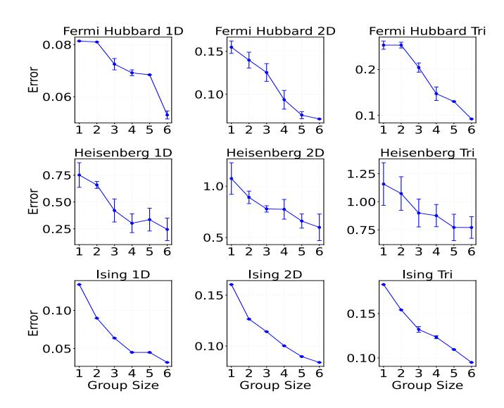
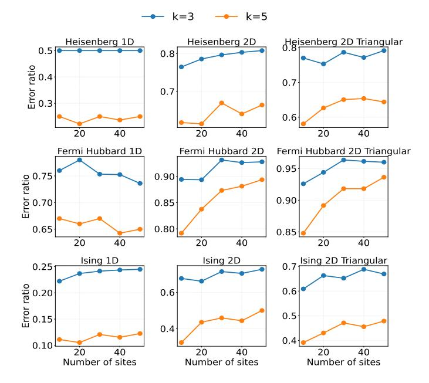

# 6 Error Reduction Theoretical and Experimental Data

Here we offer a theoretical explanation for the error reductions observed, alongside an understanding of how this concept scales to larger rewrite radii and lattice size. Theoretical error reduction fundamentally arises through commutator cancellations. To illustrate this, we start from the standard derivation of Trotterization, where the error terms can be expressed as a sum of commutator norms:

Error = 
$$\sum_{i < j} \frac{|[H_i, H_j]|}{2} \Delta t^2 + \mathcal{O}(\Delta t^3).$$
 (7)

By partitioning Hamiltonian terms, we instead consider commutators between entire groups rather than individual terms, leading to:

Error partitioned = 
$$\sum_{A \le B} \frac{|[H_A, H_B]|}{2} \Delta t^2 + \mathcal{O}(\Delta t^3)$$
 (8)

where each group  $H_A$  is composed of individual Hamiltonian terms maximized for non-commutativity. Importantly, the commutator between partitions  $[H_A, H_B]$  is simply the aggregation of all individual commutators  $[H_i, H_j]$  where  $H_i \in H_A$  and  $H_j \in H_B$ . Thus, the partitioned error (Eq. 8) explicitly represents the original error minus the intra-group commutator contributions that vanish due to partially Trotterized unitaries. This leads to a final reduced error of Trotterization to:

$$Error reduced = Error - Error grouped, (9)$$

quantifying the precise error savings achieved through term partitioning and highlighting the scalability of this methodology. As the partition size increases, the number of intra-partition commutators grows combinatorially, scaling roughly as  $n_A^2$  for a partition of size  $n_A$ . Consequently,

Figure 6: Depth, CNOT and U3 count comparison when compiling to less than 1% approximation error on a range of time evolution unitaries.

| Test Case | Size | Partition | Reorder | Rewrite  | Total    |
|-----------|------|-----------|---------|----------|----------|
| FH 1D     | 64   | 0.003     | 0.013   | 2644.173 | 2704.220 |
| FH 2D     | 50   | 0.002     | 57.530  | 3116.759 | 3236.742 |
| FH Tri    | 50   | 0.003     | 55.665  | 3139.404 | 3206.768 |
| HB 1D     | 64   | 0.002     | 0.002   | 116.388  | 117.043  |
| HB 2D     | 64   | 0.006     | 0.005   | 160.582  | 161.790  |
| HB Tri    | 64   | 0.009     | 0.006   | 163.014  | 164.746  |
| HF        | 10   | 0.000     | 0.013   | 637.678  | 696.476  |
| IS 1D     | 64   | 0.001     | 0.002   | 599.855  | 600.327  |
| IS 2D     | 64   | 0.003     | 0.004   | 509.389  | 510.116  |
| IS Tri    | 64   | 0.005     | 0.005   | 520.807  | 521.738  |
| LiH       | 10   | 0.000     | 0.013   | 58.921   | 60.359   |
| PD1       | 28   | 0.001     | 0.006   | 78.796   | 80.077   |
| PD1-ext   | 74   | 0.016     | 0.266   | 540.464  | 555.245  |
| PD1-super | 222  | 0.496     | 159.378 | 5396.862 | 5885.737 |

Figure 7: Runtime (in seconds) for all passes of Kernpiler summary 10 0.000 0.013 637.678 696.476 when compiling large benchmarks

error reduction becomes significantly more pronounced as larger partitions are formed, since more commutator terms vanish. Thus, increasing the rewrite radius directly enhances error reduction, emphasizing the scalability and efficiency of this partial Trotterization approach in practical quantum simulations.

We investigated this empirically with first order Trotterization of Hamiltonians decomposed using 10 Trotter steps with no special optimizations. The only change over decompositions is the amount of partial Trotterization performed. In Figure [8,](#page-10-2) we show scaling of the compiler error versus group decomposition size (number of qubits) across 3 different models with 3 different geometries. We performed 5 runs per data point. The remarkable find is that the approximation error decreases drastically as a function of group size; this highlights a remarkable benefit of the partial Trotterization schema.

The Ising models possess the monotonic trends which are likely an artifact of the simple distribution of Hamiltonian terms that allows for easily converging on the best partitions.

Figure 8: Increasing the number of qubits per unitary to decompose directly reduces the error.

For the other models we see more significant effects from noise. This originates from the partitioning of Hamiltonian terms. As the entanglement structure becomes increasingly non-trivial, the partitioning algorithm encounters greater difficulty converging to the optimal partitions causing more noise in the commutation error observed.

**Scalability Discussion** Now we discuss the scalability of our technique to larger quantum lattices and Pauli weight terms. Modeling the exact error is intractable as we scale qubit size, however Trotter error is directly proportional to the amount of non-commuting pairs of terms which define the Hamiltonian (see Equation [7\)](#page-9-1).

Figure [9](#page-11-0) shows the amount of non-commutivity as we increase qubit size. In this experiment, we graph the ratio of non-commuting pairs between a partitioned and unpartitioned Hamiltonian. More specifically, we graph #non commuting pairs partitioned # non commuting pairs . Partition sizes used were *n* = 3

Figure 9: Ratio quantifying percentage reduction of noncommuting pairs of Hamiltonian terms between partitioned and unpartitioned Hamiltonians over increasing quantum lattice sizes.

and n = 5. This ratio is measured over system sizes from 10 to 50, extending out from our benchmarks measured in Figure 6. At each qubit array size, we measure the ratio of noncommuting pairs, seen on the Y axis. The expected behavior is that for k-local Hamiltonians, the non-commutation ratio should not significantly increase. The reason for this expectation is that while more terms are being added, their weight is not increasing. As a consequence, these terms can also be fit into new partitions which reduces the error relative to an unpartitioned Hamiltonian. This implies our technique—and improvements made to the partition size—would continue to have a constant rate decrease in total Trotter error that is independent on array size. This is the exact behavior seen in the data of Figure 9. For the electronic structure Hamiltonians, the fermion to qubit mapping used was the Bravyi-Kitaev mapping [40]. The weight of Pauli terms increases logarithmically, so in this experiment, the expected behavior is a logarithmic curve. This is because logarithmically, terms are being added which cannot fit into our partition size (n=3,5). This however can be mitigated as techniques exist to have constant weight pauli terms [15] We notice that there is noise in some of the ratios and we believe this is an artifact of the partitioning heuristics used. Overall, this proxy measurement gives evidence towards the scalability of constant-size partitions for reducing Trotter error as the ratio of non-commutation appears to have no dependence on quantum lattice size.

#### Related Works

Trotterization error has been extensively studied, resulting in various strategies aimed at mitigating and managing these errors. Gui et al. [19] demonstrated that grouping neighboring terms in the Trotter step ordering can reduce errors by partial Trotterization and strategic clustering of non-

effectively clustering commuting operations. Additionally, a recent survey shows early work for rewriting certain partitions of the Hamiltonian to save on error per Trotter step [33]. However, these partitions are not general to all Hamiltonians of interest, and are also restricted to unitaries with special properties, making adaptability to input very difficult.

Theoretical advancements, including higher-order Trotter decompositions [4], systematically eliminate specific-order errors through symmetric expansions. Our method can provide better performance due to the partial Trotter decomposition. By rewriting the non-commuting terms with minimal error, the error bound is reduced, which complements the optimizations and techniques described above in practice.

Compiler optimizations for quantum Hamiltonian simulation, outside of error reduction, have also been extensively studied. Simultaneous diagonalization of commuting Pauli strings [9, 10, 45] is one early type of approach. They are later outperformed by reordering-based gate cancellation [27, 19, 1] and Pauli network synthesis [14, 37, 39].

Similar work casted reordering and synthesis of the Trotter step as a travelling salesman graph problem, [39] which was able to reduce the depth of Trotter steps substantially. Unlike our goal of grouping by commutation for merger across Trotter steps, the authors of this work framed Trotter reordering for optimization within a singular step.

The recent work QuCLEAR [28] investigated extraction and absorption for Clifford gates in quantum Hamiltonian simulation, but it requires updating the observable. This work does not change other parts of the circuit, and the compiled Hamiltonian time evolution operator can be freely reused. Moreover, all of them rely on the vanilla error bound of Trotterization and do not consider the fine-grained error scaling. Finally, other works focused on fermion to qubit mappings for cancellation of gates [30],[29] but this is specific to Fermionic Hamiltonians, and is complementary to our work due to the mapping of the Hamiltonian into the spin representation being assumed as input to Kernpiler.

Unitary decomposition has been investigated mostly in a generic manner and separately from Hamiltonian mapping. Initial advancements, such as the quantum Shannon decomposition [41], demonstrated how arbitrary unitaries can be decomposed into single- and two-qubit unitaries. Recent studies have precisely quantified the number of gates required for unitary operations, notably demonstrating that any 3-qubit unitary can be decomposed into a maximum of 19 CNOT gates [26]. Although still above the theoretical minimum, these advances represent considerable progress. Additionally, numerical methods, while traditionally offering lower accuracy, provide intuitive trade-offs by significantly reducing gate counts, making them valuable for practical quantum computation applications [38], [35], [42], [49]. Overall, none of these general unitary decomposition methods take into account high level Hamiltonian information and therefore cannot adapt to high level structures of the unitary.

#### Conclusion

We introduced a novel compilation paradigm—leveraging

commuting Hamiltonian terms—that substantially improves the computational efficiency and accuracy of quantum Hamiltonian simulation. Reinforcement learning (via MCTS) proved effective in discovering optimized gate structures, and the RL search frequently identified recurring CNOT scaffolds and entanglement motifs; these learned circuit patterns suggest heuristic or graph-based synthesis algorithms that do not rely on RL, and motivate studying how CNOT scaffolds relate to accuracy convergence of overparameterized circuits.

### **Acknowledgements**

GL and ED were supported in part by the U.S. Department of Energy, Office of Science, Office of Advanced Scientific Computing Research through the Accelerated Research in Quantum Computing Program MACH-Q project., NSF CA-REER Award No. CCF-2338773 and ExpandQISE Award No. OSI-2427020. GL is also supported by the Intel Rising Star Award. EM and EC were supported by the FY24 C2QA Postdoc Seed Funding Award from the Co-design Center for Quantum Advantage. EC was also supported in part by ARO MURI (award No. SCON-00005095), and DoE (BNL contract No. 433702). EG was supported by the NASA Academic Mission Services, Contract No. NNA16BD14C and the Intelligent Systems Research and Development-3 (ISRDS-3) Contract 80ARC020D0010 under Co-design Center for Quantum Advantage (C2QA) under Contract No. DE-SC0012704. AS acknowledges support from the U.S. Department of Energy, Office of Science, National Quantum Information Science Research Centers, Quantum Systems Accelerator.

