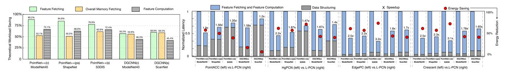

# *B. Theoretical Workload Optimization*

Before we present the measured performance of the prototype implementations on the FPGA, we first present a software-based analysis to quantify the advantage of our method for exploiting spatial locality. The results of theoretical optimization against the traditional method (without data reuse) are shown in Figure 15.

Memory-fetch Saving: As previously stated, once point subsets are formed, the late stage of data structuring requires fetching the feature information of these points from memory to prepare inputs for feature computation. The Islandization Unit reduces memory fetches by eliminating repeated fetches for overlapping points. In Figure 15, the first (green) bars represent the optimization ratio for feature fetching, while the second (yellow) bars show the impact of reduced feature fetching on overall memory access (including both weight and feature fetching). As shown in Figure 15, for the benchmark PCN tasks in Table I, L-PCN's methods for exploiting spatial

Fig. 15. Theoretical workload optimization Fig. 16. Performance comparison between L-PCN prototypes and baselines.

locality reduce feature fetches ranging from 55.2% to 90.2% and overall memory access from 50.5% to 60.9%.

Computation Saving: For Feature Computation, L-PCN prevents overlapping points from re-entering the MLP layers. As shown in the third (grey) bars of Figure 15, for the benchmark PCN tasks, L-PCN's methods for exploiting spatial locality reduce computational workload ranging from 45.4% to 73.1%. The savings in feature computation are slightly less than those in point-feature fetching primarily due to the one-time overhead of supplementary computation introduced by result delta compensation, as discussed at the end of Section IV-B1. Despite this, our techniques for exploiting spatial locality still achieve substantial reductions in computational workload.

