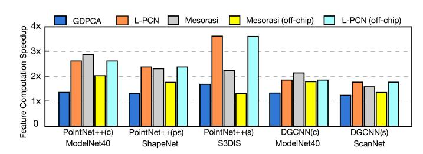

# *C. Comparison with Baseline Accelerators*

In this section, we present the evaluation results by comparing the baseline accelerators with L-PCN prototypes. As mentioned, for the first four baseline PCN accelerators (two accurate and two approximate Data Structuring methods), each L-PCN prototype utilizes the same DSU and FCU structure as its corresponding baseline. The key difference is the integration of an Islandization Unit between the DSU and FCU. By doing so, this comparison showcases the performance improvements achieved by enhancing baseline accelerators with L-PCN's Islandization Unit.

Figure 16 illustrates the performance improvements of L-PCN prototypes over the four baselines, using benchmarks in Table I. For each benchmark, the left bar represents the latency breakdown of the baseline accelerator (end-to-end latency normalized to 1), while the right bar represents the normalized latency of the corresponding L-PCN prototype along with its speedup (number, from cycle-accurate RTLlevel simulation) and energy reduction (red dot, estimated from activity factors tracing). In all benchmarks, the latency overhead of the Islandization Unit is less than 1% and is therefore omitted from Figure 16 (cycle-accurate latency will be reported in Section VI-G).

The first two PCN accelerators—PointACC and Hg-PCN—follow the traditional Data Structuring approach, performing accurate neighbor gathering. PointACC accelerates the neighbor gathering step using a hardware-based ranking kernel; whereas HgPCN utilizes an Octree method to narrow the neighbor gathering space and then conducts the rankingbased gathering. As shown in Figure 16, L-PCN prototypes can achieve speedups ranging from 1.2× to 1.9× and 38% average energy reduction over PointACC, and from 1.4× to 2.2× and 55% average energy reduction over HgPCN.

The second two PCN accelerators—EdgePC and Crescent—leverage the approximate nature of DNN algorithms to enable efficient approximate neighbor search for data structuring. EdgePC utilizes Morton code to structure points and performs approximate neighbor gathering through an indexbased method, while Crescent employs a KD-tree method to perform approximate neighbor gathering by efficient KDtree search. As shown in Figure 16, when compared to these two approximate PCN accelerators, L-PCN prototypes achieve speedups ranging from 1.7× to 3.2× and 56% average energy reduction over EdgePC, and speedups from 1.65× to 3.1× and 56% average energy reduction over Crescent.

L-PCN vs. GDPCA: We further compare L-PCN with GDPCA [5] and Mesorasi [16], two existing PCN accelerators that incorporate workload-reduction mechanisms for feature computation. We first present the comparison with GDPCA, which proposes a *Geometry-aware Differential Update* method to leverage the inter-point feature similarity and perform computation on inter-point feature delta [34], which can reduce the input bit width and enable speedup by using the classic Bit-Pragmatic accelerator (PRA) [1]. However, for GDPCA, the total number of inputs fed into the MLP layers remains unreduced, as in the common method. Consequently, the benefit of bits reduction is limited when translated into actual speedup. In Figure 17, we compare the feature computation speedup provided by GDPCA (the 1st bar of each group) and L-PCN (the 2nd bar) against the commonly used method (normalized as 1, without workload reduction). Compared to GDPCA's method, our mechanism for exploiting spatial locality prevents overlapping points from re-entering the MLP, fundamentally reducing the total number of feature computations.

Fig. 17. Feature Computation speedup of GDPCA, L-PCN, and Mesorasi.

L-PCN vs. Mesorasi: Mesorasi proposes the *Delayed-Aggregation* to reduce feature computation workload. Mesorasi first applies MLP to all points twice to generate two sets of features: MLP(X, Y, Z, f1, . . . , fn) and MLP(X, Y, Z, 0, . . . , 0), and stores them in a Point Feature Table (PFT). For each 32-point subset, it retrieves from PFT the 32 features MLP(X, Y, Z, f1, . . . , fn) and one central-point feature MLP(Xc, Yc, Zc, 0, . . . , 0), then concatenates them into the 32 MLP(X−Xc, Y −Yc, Z−Zc, f1, . . . , fn) results of this subset.

Although Mesorasi achieves higher MLP computation reduction compared to L-PCN, its Delayed-Aggregation method essentially shifts the burden to the PFT [54]. The intensive memory access of Delayed-Aggregation phase makes it the new bottleneck [5]. Moreover, the separation of MLP (which performs computation) and Delayed-Aggregation (which involves memory access from PFT) into two distinct serialized phases prevents the overlap of computation and memory fetching. This limitation worsens when the PFT exceeds the capacity of on-chip memory, making off-chip memory access the critical bottleneck. Figure 17 analyzes the feature computation speedup of L-PCN and Mesorasi under two settings: (1) when intermediate data is stored in on-chip buffer (the 2nd and 3 rd bars of each group), and (2) when it is stored in off-chip memory (the 4th and 5th bars). Under the on-chip setting, L-PCN still achieves higher speedup in most benchmarks. Under the off-chip setting, L-PCN largely maintains its speedup through overlapping memory access and computation, while Mesorasi incurs obvious performance degradation due to its inability to hide off-chip memory access latency.

Limitation Discussion: L-PCN's optimization primarily relies on overlaps between subsets and thus shares a common limitation with Mesorasi: the inability to optimize certain no-overlap PCN layers. For instance, in PointNet++ (c), the last Set Abstraction which contains only one subset and the final classification layers (together account for ∼11% of feature computation FLOPs) cannot benefit from our method. Similarly, for PointNeXt (a large-scale PCN, evaluated next), the beginning Stem MLP that expands per-point features (∼0.1% of FLOPs) and the segmentation decoder (∼3% of FLOPs) remain unoptimized. Nevertheless, their workload is low relative to the remaining "layers with overlap" and has limited impact on overall gains.

