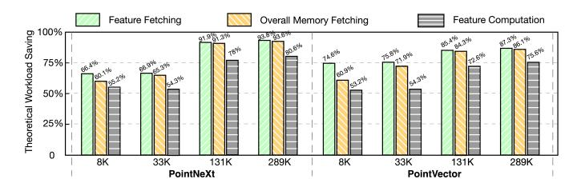
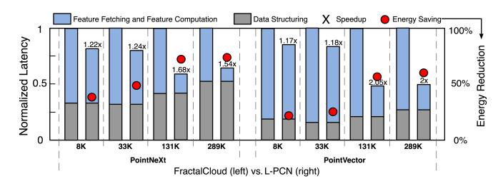
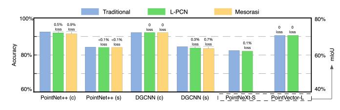
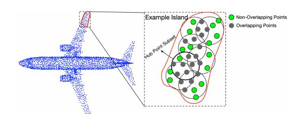
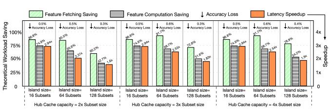
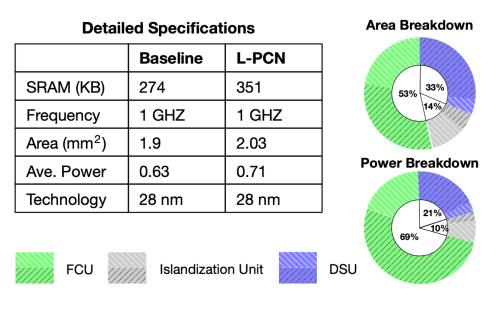

# *D. Additional Baseline and Benchmark for Large-Scale PCNs*

In addition to the benchmarks in Table I, we further evaluate the performance of L-PCN for another scenario: large-scale point cloud processing. PointNeXt [40] and PointVector [12] are scalability-oriented variants of PointNet++ for large-scale point cloud inputs. To the best of our knowledge, FractalCloud [18] is the only accelerator designed for PointNeXt and PointVector. We therefore include it as a baseline and adopt its original benchmarks: the PointNeXt-S and PointVector-L models on the S3DIS dataset with input points ranging from 8K to 289K. Similar to the previous evaluation, we first analyze L-PCN's theoretical workload optimization for PointNeXt and PointVector, and then evaluate the performance gain when L-PCN's Islandization Unit is integrated as a plugin into FractalCloud. As shown in Figure 18, for these two models, L-PCN's methods for exploiting spatial locality reduce feature fetching by 66.4%–93.8% (translating to 60.9%–93.6% overall memory access savings) and reduce computational workload by 53.2%–80.6%. In general, L-PCN shows even higher optimization on larger-scale point clouds, as higher point density leads to greater overlap among subsets.

Fig. 18. Theoretical workload optimization for PointNeXt and PointVector.

FractalCloud proposes a block-based (approximate) data structuring to avoid prohibitive global-search overhead for large point clouds and enable block-wise parallelism. The original FractalCloud deploys Mesorasi's Delayed-Aggregation for feature computation optimization. Our L-PCN prototype adopts the same data structuring method but replaces Delayed-Aggregation with the Islandization Unit and compares with vanilla FractalCloud. As shown in Figure 19, L-PCN achieves speedups of 1.2×–2.1× and an average energy saving of 48.5% over FractalCloud. This improvement stems from the additional feature-computation optimization of the Islandization Unit over Delayed-Aggregation (analyzed in Figure 17).

Fig. 19. Performance Comparison of L-PCN prototype and FractalCloud.

#### *E. Accuracy Comparison*

Even though L-PCN's methods reuse MLP results between adjacent point subsets, the result delta compensation (Section IV-B1) introduces potential accuracy degradation. That is because MLPs contain non-linear activation layers, and MLP(A−B) ≈ MLP(A)−MLP(B) only holds approximately (e.g., Mesorasi can incur up to 0.9% accuracy loss).

Fig. 20. Accuracy comparison among traditional method, L-PCN, and Mesorasi across different benchmarks.

Figure 20 analyzes the resulting accuracy loss of L-PCN and Mesorasi relative to traditional methods on benchmarks used in Mesorasi [16] and on PointNeXt and PointVector, showing that L-PCN better maintains accuracy. This is mainly because Mesorasi applies approximation to all MLP results, whereas L-PCN selectively applies approximation (by result delta compensation) to MLP results related to "overlapping" points and preserves exact computation for "non-overlapping" points [43]. Moreover, these non-overlapping points often play a more critical role in prediction, as they tend to lie near the shape boundaries of the point cloud (see Figure 21). The MLP results of these boundary points are typically higher and more likely to be retained by max pooling, while the approximated results tend to be pooled out. In particular, DGCNN (c) and PointVector-L exemplify cases where accuracy loss can be avoided when activation is applied only at the end of each building block. This allows the reuse of pre-activation results to fully compensate for the result delta, since CONV (A−B) = CONV (A) − CONV (B) holds exactly.

Fig. 21. Empirical analysis shows that non-overlapping (usually boundary) points more effectively capture the shape of the "airplane wings".

#### *F. Sensitivity Study*

Figure 22 examines how the Islandization Unit's two hyperparameters, Island size (algorithmic) and Hub Cache capacity (resource-related), affect performance and accuracy on PointNet++(c) benchmark. Default-configuration results were previously reported in Figures 15-20. Based on the sensitivity study in Figure 22, smaller Island sizes generally improve theoretical workload reduction and latency/energy efficiency. For Hub Cache capacity, larger caches show negligible impact for small islands (indicating overprovisioning) but improve performance for large islands. Since L-PCN preserves precise computation for non-overlapping points, configurations with less data reuse generally exhibit higher accuracy. For example, comparing the 4th and 6th groups of bars shows that a larger Island Size leads to less data reuse (the 1st and 2nd bars of each group), decreasing speedup (the 3rd bars) from 2.94× to 1.83× but improving accuracy (the top numbers) by 0.2%. Moreover, such adjustable accuracy for different demands is not supported by Mesorasi's fully approximated method.

Fig. 22. Sensitivity Study of Islandization hyperparameters

#### *G. Detailed Configuration of the L-PCN Prototype*

Table II reports the resource utilization and cycle-accurate latency of an L-PCN prototype for PointNet++(c). This prototype adopts the "Mapping Unit" design from PointACC for its Data Structuring Unit, which consists primarily of 16 parallel distance calculators and a 32-way bitonic sorter, and deploys a 16×16 systolic array as its Feature Computation Unit. Its Islandization Unit (default hyperparameter setting) mainly comprises the Partitioning and Overlap Detection modules (implemented with two pipelined Octree-Search Engines), along with an attached BRAM-based Hub Cache. Overall, the Islandization Unit introduces acceptable resource overhead, but provides significant improvement as demonstrated.

TABLE II RESOURCE UTILIZATION AND CYCLE-ACCURATE LATENCY

| Resource Type | DSU Usage | Islandization Unit Usage | FCU Usage | Total Resource on device |
|------------------|--------------|-----------------------------|--------------|-----------------------------|
| Logic (ALMs)     | 26,071       | 14,361                      | 6,229        | 119,900                     |
| Register         | 19,389       | 10,140                      | 12,049       | 239,800                     |
| DSP              | 48           | 0                           | 256          | 984                         |
| BRAM             | 278,528      | 770,048                     | 9,437,184    | 18,247,680                  |
| Latency (cycles) | 1,046,461    | 1,497                       | 1,263,176    | –                           |

Based on the FPGA prototype in Table II, we implement the L-PCN ASIC version, operating at 1 GHz. We synthesize it using Synopsys Design Complier under TSMC 28nm technology, with SRAM generated by the TSMC memory Compiler. We use PrimeTime PX to obtain power measurements based on switching activities. Figure 23 shows the unitwise area and power breakdown of the L-PCN prototype. For each unit, white-shaded portions indicate SRAM-related components (area or power), while black-shaded portions indicate logic-related components. Overall, the Islandization Unit incurs ∼14% area overhead and ∼10% power overhead.

Fig. 23. Detailed specifications and area/power breakdown of the L-PCN ASIC prototype.

### VII. RELATED WORK

PCN accelerator. The compelling performance of PCNs has driven the development of domain-specific PCN designs. Prior work on PCN acceleration primarily spans customized Data-Structuring units [14], [18], [19], [31], [53], [55], Processingin-Memory [9], and ISA-level extensions [23]. However, these works inevitably incur redundant operations during the Feature Computation step due to cross-subset overlapping points. Both Mesorasi [16] and our L-PCN target redundancy mitigation in feature computation, but differ in their data-reuse mechanisms and precision (as detailed in Sections VI-C and VI-E, respectively). For data reuse, Mesorasi adopts a "precomputationand-refetch" scheme. This method requires a large buffer to store all precomputed data and the refetch latency cannot be hidden, making performance limited by memory bandwidth. Alternatively, L-PCN employs a runtime reuse mechanism that effectively hides memory-access latency. For precision, unlike Mesorasi's fully approximated method, L-PCN is analogous to selective precision [43]. This allows it to better preserve accuracy and provide higher cross-domain robustness.

Point Cloud Partitioning. Input partitioning is a common optimization technique in graph processing [7], [20], [51] and has recently been applied to point cloud domain. GDPCA [5] leverages Space-Uniform Partitioning to cluster points with similar features and performs computation on interpoint feature deltas. SimDiff [29], an extended version of GDPCA, introduces Density-Uniform Partitioning to better balance the workload across partitions. For efficient large-scale point cloud partitioning, FractalCloud proposes a lightweight Shape-Uniform Partitioning scheme that skips most point traversals. This partitioning constrains the Data-Structuring search space to intra-block regions, thereby avoiding globalsearch overhead and enabling block-wise parallelism. Unlike prior approaches, L-PCN performs partitioning by clustering neighboring central points to organize their associated point subsets into Islands, enabling cross-subset data reuse.

