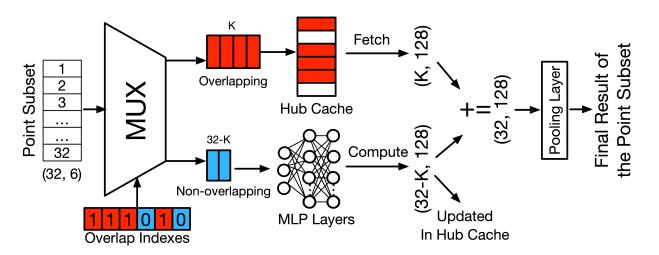

# Example: L-PCN's Dataflow to Exploit Spatial Locality:

Figure 13 illustrates the overall L-PCN architecture (a detailed version of the architecture presented in Figure 5), showcasing the active dataflow using examples from Figures 10 and 12. As shown in Figure 13, the Islandization Unit consists of a Partitioning Module, an Overlap Detection Module, and an attached Hub Cache. It receives its inputs from the Data Structuring Unit and outputs data to the Feature Computation Unit (FCU). Within the FCU in Figure 13, the arrows represent dataflows, while the MLP and Pooling Layers are performed by a Systolic Array module (e.g., NPU). In Figure 13, to support the Islandization Unit in exploiting spatial locality, the FCU dataflow is divided into two cases:

• Case 1 (top section) illustrates the dataflow for the Hub Point Subset. This involves completing computations

- (arrows ⃝1 ) for all 32 of its points and subsequently caching the 32 results (arrows ⃝2 ) into Hub Cache.
- Case 2 (bottom section) illustrates the dataflow for the remaining non-Hub point subsets based on Hub-based Scheduling. This dataflow is further detailed in Figure 14. The Overlap Detection Module divides the 32 points within each non-Hub point subset into two groups: K overlapping and (32 – K) non-overlapping points. For the K overlapping points, the Islandization Unit retrieves the cached MLP results (with dimensions of (K, 128)) from the Hub Cache (arrow ⃝3 in Figure 13) and inputs them into the Pooling Layer. For the (32 – K) non-overlapping points, the Islandization Unit input them into the MLP layer (arrow ⃝4 ) from the Overlap Detection Module. The resulting MLP outputs (with dimensions of (32-K, 128)) are then forwarded to the Pooling Layer and stored in the available entries in the Hub Cache (arrow ⃝5 ). These points are subsequently updated in the Hub Octree.

Fig. 14. Example of Data Reusing Method with overlap detection. In this example, the feature dimension of a point subset is changed from (32, 6) to (32, 128) during MLP layers. K is the number of detected overlapping points.

In summary, due to the optimization provided by the L-PCN's Islandization Unit, the workload of the FCU's MLP layers, which accounts for over 98% of the computational workload in the FC step, is fundamentally reduced. Within an island, compared to the traditional method, only the workload for Hub point subset remains unchanged. For the remaining non-Hub point subsets, the K/32 overlapping points can avoid repeated feature fetching and re-entering the MLP layers. As we will demonstrate in Section VI, this leads to significant workload savings for the overall PCN workflow.

#### VI. EVALUATION

