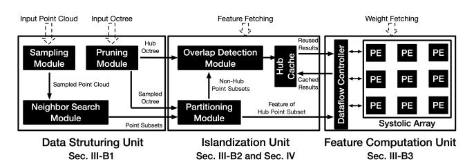
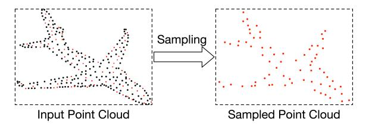
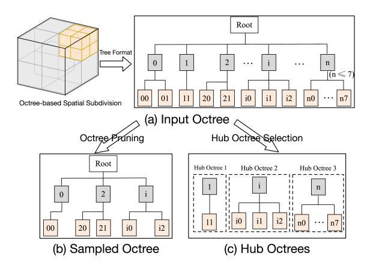
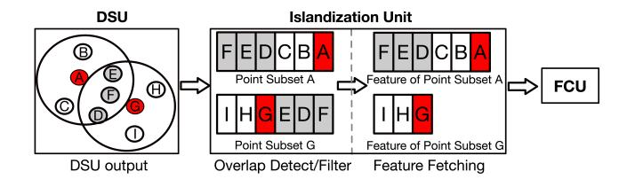
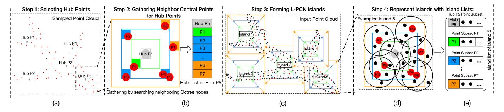
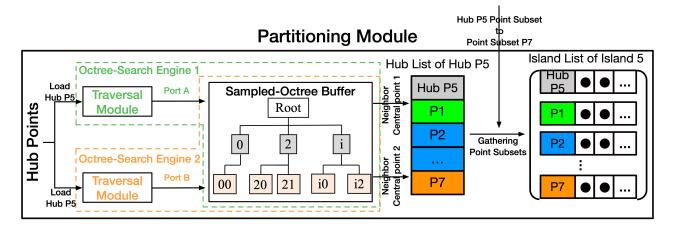
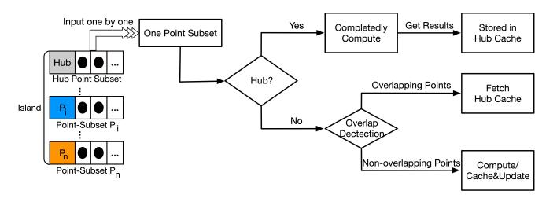
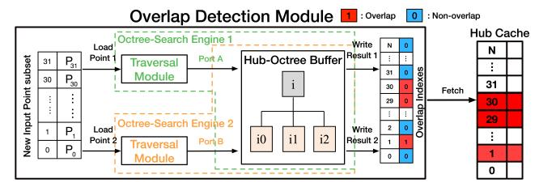
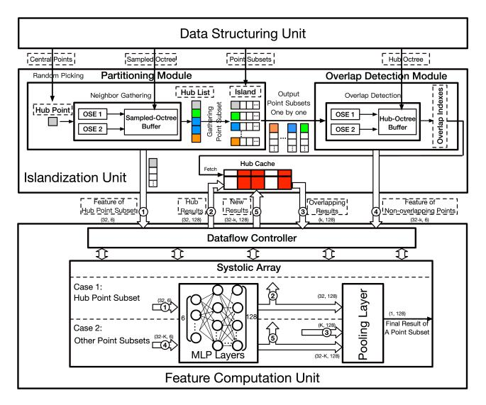

# III. L-PCN: DESIGN PRINCIPLES AND ARCHITECTURE

#### *A. Design Principles: Detect and Exploit Spatial Locality*

The two observations stated at the end of the previous section drive the design principles of the L-PCN's Islandization methods to detect and cluster adjacent point subsets; and to exploit spatial locality for maximal intra-island data reuse.

Recall from Section II-A (and illustrated in Figure 3), after the point subsets are formed, the feature vectors f of the points included in each point subset need to be retrieved from memory to create input feature maps. Then, during Feature Computation, the feature of each point enters the MLP layers one by one; and MLP layers apply the same weight to every point. As shown in the example in Figure 3, let us assume there are N overlap points between Point-subset A and Pointsubset G. During the DS step, without optimization, the feature information fn of these N points are fetched from memory for Point-subset A and fetched again from memory when processing Point-subset G. Similarly, during the FC step, these N points re-enter the MLP layers for both Point-subset A and Point-subset G.

These redundant operations between the overlapping (usually adjacent) point subsets result in excessive performance cost, but provide a good opportunity to optimize the PCN workload by exploiting spatial locality. However, exploiting spatial locality in PCNs involves unique challenges and is more difficult than in CNNs and GCNs: First, the spatial sparsity of point clouds and the lack of explicit neighbor indexing (e.g., adjacency matrix in graph) make it difficult to detect shared neighbors between point subsets. Moreover, unlike CNNs and GCNs, which process feature maps in a spatially adjacent order (e.g., row-major traversal in CNNs), standard PCN workflows often process point subsets in a spatially distant order. This is because, when forming a new point subset, PCNs typically use the farthest point sampling (FPS) algorithm to select a central point that is farthest from those already selected. Consequently, the subsets formed and processed in adjacent iterations are often far apart in space.

To address these PCN-specific challenges, the L-PCN's approach is to gather the adjacent point subsets to detect the overlapping points, and schedule the sequential execution of the PCN steps for these highly overlapping point subsets in such a manner that the repeated memory fetches after Data Structuring and repeated Feature Computation can be avoided.

To this end, we develop an Octree-based Islandization method to detect spatial locality caused by shared points by partitioning the point cloud and clustering the adjacent point subsets into islands. As we demonstrated in Section II, highly overlapping point subsets tend to be spatially adjacent. Consequently, the point subsets inside the same island share the most overlap. Within a given island, we deploy a Hubbased Scheduling method to exploit the inter-subset spatial locality within each island in a temporal manner. In L-PCN, these two methods are implemented within an Islandization Unit. Based on these design principles, we will now introduce the overall architecture and PCN workflow of L-PCN, with the integration of an Islandization Unit.

#### *B. L-PCN Architecture and Workflow*

Fig. 5. Overall architecture of L-PCN

The general architecture of L-PCN is shown in Figure 5, which consists of three main units: Data Structure Unit, Islandization Unit, and Feature Computation Unit. Unlike the architecture of existing PCN accelerators (whose workflow is shown in Figure 1), the L-PCN is enhanced with an Islandization Unit after Data Structuring to exploit the spatial locality of the point cloud. In this section, we give an overview of the functions of three main units in the L-PCN architecture and their roles in the workflow. In the next section, we will describe the design of the Islandization Unit and the techniques used to exploit spatial locality.

*1) Data Structuring Unit:* The Data Structuring Unit (DSU) performs the Data Structuring step of the L-PCN workflow, which prepares the inputs for the Islandization Unit. As shown in Figure 5, there are two main inputs to the DSU: (1) the Input Point Cloud, and (2) an Input Octree, which is a spatial data structure to organize and index the input point cloud data. In L-PCN, two Islandization-based methods will utilize the Input Octree to algorithmically minimize the required computational workload in the PCN steps. The DSU consists of three main modules: Sampling Module, Neighbor Gathering Module, and Pruning Module.

Sampling Module: As shown in Figure 5, when the Input Point Cloud is processed by the DSU, it gathers all points (e.g., 1,024 in total) into multiple subsets (e.g., 512 subsets, each containing 32 points). This is accomplished by using the Sampling Module, followed by the Neighbor Search Module. The input to the Sampling Module is the Input Point Cloud. A simple example of the Sampling step for a point cloud frame is illustrated in Figure 6: The Sampling Module samples the input point cloud (black and red points) to select the central points (red). The output of the Sampling Module is the Sampled Point Cloud, containing all the central points.

Fig. 6. Input and output of Sampling Module.

Neighbor Search Module: As in a standard PCN, after selecting the central points, the point subsets can be formed by searching the neighboring points around these central points. As shown in Figure 2(a), each point subset (black circle) is formed by searching and gathering the neighboring (black) points around a (red) central point. (In Figure 2(a), we just show some of the black circles for simplicity). This step is performed in the Neighbor Search Module, as shown in Figure 5. To calculate the distance and rank the nearest points, the Neighbor Searching step is performed based on the coordinate information pn = (xn, yn, zn) of points. The method to efficiently performing the Neighbor Searching step is well developed, and can be divided into two main categories: approximate Neighbor Searching (e.g., Cresent [14]), and accurate Neighbor Searching (e.g., PointACC [31]). In our L-PCN prototype implementations, we demonstrate that our techniques in the Islandization Unit are compatible with existing PCN accelerators, using either the approximate or accurate neighbor search methods.

Fig. 7. Detailed operations in Pruning Module.

Pruning Module: The second input to the DSU is the Input

Octree, which is a spatial data structure to regularize the corresponding Input Point Cloud by subdividing the overall 3D space of the point cloud into voxels (i.e., cubic subdivisions) [41]. Figure 7(a) shows how an Octree subdivides the 3D space, and an example Input Octree with a depth of three (in general, Octrees can have a depth of more than three). In an Octree, each node corresponds to a non-empty voxel (i.e., containing points) and each node can have up to eight child nodes (because a voxel can be sub-divided into up to 8 subvoxels). Using Octree search, the desired item (a point or an Octree node) can be retrieved through tree traversal, without using brute-force methods such as exhaustive search.

Like many other tree-based accelerators for Point Cloud [14], [38], [50], in L-PCN, we assume that the *Input Octree* has been built by existing methods [6]. One of the outputs from the Pruning Module is a *Sampled Octree* (Figure 7(b)), which corresponds to Sampled Point Cloud from the Sampling Module. The Sampled Octree can be efficiently obtained by pruning the Input Octree in a Pruning Module. Since the Sampled Point Cloud is made sparse from the Input Point Cloud through sampling (as shown in Figure 6), the Sampled Octree is similarly made sparse from the Input Octree by cutting off some nodes, as shown in Figure 7(b). The Sampled Octree will be used by the Octree-based Islandization method to partition point cloud, to be detailed in Section IV.

The second output from the Pruning Module is a set of *Hub Octrees*. After Sampling, L-PCN includes an extra step to pick certain number of sampled (central) points as Hub points. The point subsets centered around these Hub points are referred to as Hub point subsets, and the Octree corresponding to each Hub point subset is called its Hub Octree. Note that the Hub Octrees can be efficiently obtained by selecting some subtrees from the Input Octree, as shown in Figure 7(c). The Hub Octrees will be used by a Hub-based Scheduling algorithm in the Islandization Unit to identify the overlapping points, which will also be detailed in Section IV.

Fig. 8. L-PCN workflow with Islandization Unit. Between Point-subset A and Point-subset G (gathered by DSU), the grey points D, E, F are overlapping. The Islandization Unit can index these overlapping points and prevent them from being repeatedly fetched from memory and inputted into the FCU.

*2) Islandization Unit:* The main functions of the Islandization Unit are illustrated by the simple example in Figure 8. The Islandization Unit receives the gathered point subsets from the DSU as input, which can have a large percentage of overlapping points among neighboring point subsets. The Islandization Unit performs optimization by eliminating redundant operations through: clustering (Octree-based Islandization) and scheduling (Hub-based Scheduling) to filter

Fig. 9. (a) An example of picking five central points as Hub points (Hub P1 to Hub P5) from the Sampled Point Cloud. (b) Searching adjacent Octree nodes to gather neighboring central points for Hub P5 and create the Hub list P5. (c) Returning to the Input Point Cloud, partitioning it by forming L-PCN Islands based on the Hub Lists (d) An example of Island 5, which comprises eight point subsets. (e) The Island List used to represent the data of Island 5.

out overlapping points (as shown in Figure 8). In this way, unlike existing PCN accelerators, the features of the filtered points (e.g., overlapping points D, E, and F between Pointsubset A and Point-subset G) do not need to be fetched from memory again and will not enter the downstream FCU for redundant computation. The details of the novel techniques of the Islandization Unit and their hardware support (Partitioning Module, Hub Cache, and Overlap Detection Module) will be presented in the next Section IV.

*3) Feature Computation Unit:* As shown in Figure 5, the Feature Computation Unit (FCU) in L-PCN can be built using an existing AI accelerator, combined with a Dataflow Controller, to perform the PCN's Feature Computation step (including MLP and Pooling Layers). In general, a commercially available AI accelerator (such as the Intel NPU) is structured as a systolic array architecture. In the existing PCN accelerators (e.g., PointACC and EdgePC), the inputs to the FCU are typically provided directly by the DSU, as shown in Figure 1. On the other hand, the L-PCN architecture is enhanced with an Islandization Unit, which operates between the DSU and the FCU (as shown in Figure 5). Because the Islandization Unit prevents a large volume of overlapping points (between the point subsets gathered by DSU) from re-entering the FCU, the number of points that need to be processed by the MLP layers for L-PCN is fundamentally reduced, as compared to existing PCN accelerators.

#### IV. DESIGN OF ISLANDIZATION UNIT

The main role of Islandization Unit of the L-PCN is to detect the spatial locality to minimize the repeated workload of the PCN Process. The Islandization Unit uses two novel methods to exploit spatial locality: Octree-based Islandization and Hub-based Scheduling.

- As will be described in Section IV-A, the first method, Octree-based Islandization, is to detect spatial locality and cluster the adjacent point subsets into L-PCN Islands. The Octree-based Islandization method is supported by the Partitioning Module within the Islandization Unit (see Figure 5).
- As will be described in Section IV-B, the second method, Hub-based Scheduling, is to exploit the inter pointsubset data reuse within each Island in a temporal manner.

To perform the Hub-based Scheduling, overlap detection between point subsets is required for optimizing the workload. In the Islandization Unit, overlap detection is supported by the Overlap Detection Module (Figure 5).

#### *A. Octree-based Islandization*

*1) Point Cloud Partitioning Method:* The Islandization Unit first performs an *Octree-based Islandization* process to gather the highly overlapping point subsets as Islands. This process is based on the Sampled Point Cloud (shown in Figure 6 which is composed of central points) and Sampled Octree (Figure 7(b)). The *Octree-based Islandization* process in L-PCN consists of four steps, as illustrated in Figure 9.

Step 1 Selecting Hub Points: From the Sampled Point Cloud, the Islandization process begins by selecting some central points as *Hub points*, as shown in Figure 9(a).

Step 2 Gathering Neighbor Central Points for Hub Points: After selecting the Hub points, a gathering process [3] is performed for each Hub point to gather its neighbor central points. This gathering process is achieved using standard Octree search operations [17] to search adjacent Octree nodes on the Sampled Octree. As shown in Figure 9(b), the green, blue, and orange voxels ("boxes") correspond to the adjacent Octree nodes gathered by the first, second, and third round of the gathering process, respectively. As a result of the gathering process, each Hub point is associated with a *Hub List* which consists of this Hub point (e.g., Hub P5), together with its neighbor central points, as shown in Figure 9(b).

The process of gathering adjacent Octree nodes (and their included central points) stops when every central point belongs to a Hub List. During this process, if one Octree node is repeatedly gathered by more than one Hub List, the central point(s) within this node will be kept only in the Hub List of the nearest Hub point and removed from other Hub Lists (The node gathered in an earlier round is considered nearer). Next, we will form the L-PCN Islands based on the Hub Lists.

Step 3 Forming L-PCN Islands: After a Hub List has been created, the Islandization process is performed by returning to the original Input Point Cloud and partition it to form L-PCN Islands. An *L-PCN Island* (Island for short) is formed by gathering the point subsets (from the Input Point Cloud) whose central points are spatially neighboring and grouped into the same Hub List. Because the overlapping elements between Hub Lists have been removed, there are no identical point subsets between Islands. Figure 9(c) shows the point cloud after Islandization, and Figure 9(d) provides a detailed view of the example Island 5. Now the point cloud is partitioned into Islands, the L-PCN will proceed with the remaining PCN steps with the granularity of Islands.

Step 4 Represent Islands with Island Lists: After the Input Point Cloud has been partitioned into Islands, each Island can be represented by an *Island List*, as shown in Figure 9(e). The Island lists will be used in the Hub-based Scheduling process to schedule the sequential execution of the rest of the PCN steps to optimize the repeated workload.

*2) Architecture Support: Partitioning Module:* The function of the Partitioning Module is to perform the Octree-based Islandization process, as explained in Section IV-A1 (and illustrated in Figure 9). The architecture of the Partitioning Module is shown in Figure 10, demonstrating the processing of an example Hub point "Hub P5" (with point subsets P1- P7). It performs the adjacent node gathering process using Octree search operations. The Octree search operations in the Partitioning Module are implemented by two Octree-Search Engines (OSEs) operating in parallel on a Sampled Octree. The function of Octree-search Engine in L-PCN is to perform Octree-search queries based on Morton code [35], using a linked-list traversal mode [33] in OSE's Traversal Module.

Fig. 10. Architecture of Partitioning Module.

The Partitioning Module first randomly picks a fixed number of points from sampled point cloud to serve as Hub points. As shown in Figure 10, each Hub point (e.g., Hub P5) is then inputted into the two Octree-search Engines (OSEs). The OSEs gather the neighbor central-points for this Hub point by searching the Sampled Octree. In the Partitioning Module, the Sampled Octree is stored in an Octree Buffer with hierarchical BRAMs in the FPGA. In our implementation, dual-port BRAM units are used to provide two parallel ports (port A and B). For this reason, we can use two OSEs to simultaneously load and process two Octree-search queries in parallel. As stated in Section IV-A1, the points found in these Octree searches are added into the corresponding Hub List until every central point has been inserted into a Hub List. At the end, each Island is formed by collecting the point subsets whose central points are included in the same Hub List.

#### *B. Hub-based Scheduling*

*1) Intra-Island Scheduling Method:* After Islandization, the L-PCN uses a Hub-based Scheduling process to exploit intraisland data reuse. This Hub-based Scheduling approach is analogous to Cache-guided scheduling mechanisms [36], [46], ensuring that the dataflow exhibits a high degree of data locality in a temporal manner. Hub-based Scheduling leverages the data locality by dynamically caching, updating, and reusing the overlapping runtime results. As illustrated in Figure 11, for the point subsets of each Island, L-PCN first performs the complete computation for the point subset associated with the Hub point (the first row of the Island List) and caches the results into the *Hub Cache*. The reason is that the Hub point subset is the central part of an Island, sharing the most overlap with other point subsets. The Hub Cache is then progressively updated as computation proceeds within the Island.

Fig. 11. Workflow of Hub-based Scheduling.

The remaining non-Hub point subsets are processed in a top-down order along the Island List, which naturally yields an inside-to-outside order within each island. As shown at the bottom of Figure 11, when processing each non-Hub point subset in this Island, L-PCN first detects overlapping points between the currently processed point subset and the points in the Hub Octree using the Octree-based *Overlap Detection* method, which will be described in Section IV-B2 (and illustrated in Figure 12). For the overlapping points, L-PCN can reuse the cached results. Only for the non-overlapping points, L-PCN has to fetch their features from memory and inputs them into the MLP layers. For these non-overlapping points, a *Tree-updating Method* is used to update them to the Hub Octree and add the corresponding results into the Hub Cache. Recall from the analysis discussed in Section II-B, the overlapping points between adjacent point subsets can reach up to around 90%, which means a significant amount of workload can be saved by L-PCN's locality-exploiting method.

Result Delta Compensation: In modern PCNs, partial point features are often normalized relative to the central point before entering the MLP. For example, PointNet++ adjusts non-central points' XYZ coordinates by subtracting the central point's XYZ. Due to differences between the central points of the two point subsets, cached MLP results from one subset cannot be directly reused for another. To address this, after retrieving the cached MLP results from the Hub Cache, we compensate this result delta with an incremental adjustment derived from the difference between the central points:

For example, when processing Point-subset G (in Figure 8), we find results of N overlapping points from Point-subset A already stored in Hub Cache (N = 3 in this example). To reuse these three cached results, we input the ∆A−G into the Feature Computation Unit and obtain the incremental adjustment w ·∆A−G. The three fetched results are compensated by this adjustment, following Eq. 1 [5], [16]. The compensated results are the actual values reused by Point-subset G.

$$w \cdot (P - P_G) = w \cdot ((P - P_A) + \Delta_{A-G}) = w \cdot (P - P_A) + w \cdot \Delta_{A-G}$$
 (1)

*2) Architecture Support:* To achieve Hub-based Scheduling, L-PCN deploys an Overlap Detection Module, the architecture of which is shown in Figure 12. The Overlap Detection Module consists of the following main components: two Octree-Search Engines (OSEs), Hub-Octree Buffer, and Hub Cache. The two OSEs and the Hub-Octree Buffer are used to identify overlapping points between the points of the previously processed point subsets of an Island, and the newly inputted point subsets. The Hub Cache is used to store the results of the potential overlapping points.

Fig. 12. Detailed architecture and workflow of the Overlap Detection Module and Hub Cache.

Overlap Detection: As stated earlier, to reuse the cached data, L-PCN needs to index the overlapping points between previously processed point subsets and newly inputted point subset. This is done in the Overlap Detection Module, where a Hub Octree is used to identify and index these overlapping points. A Hub Octree corresponds to the points of an Island's Hub point subset at the beginning of processing that Island. Then during processing, the Hub Octree is dynamically updated with new non-overlapping points from the non-Hub Point Subsets.

As shown in Figure 12, the Overlap Detection Module receives a new (non-Hub) point subset as input. It employs an Octree-search method [33] to perform the overlap detection and outputs the *Overlap Indexes* (using two OSEs, similar to the Octree search in Partitioning Module). When a new non-Hub point subset arrives, the points within it are checked for overlaps by searching them in the Hub Octree (in the Hub-Octree Buffer). Points found in the Hub Octree (i.e., hits) are marked as overlapping in the Overlap Indexes, while those not found (i.e., non-hits) are marked as non-overlapping. The Overlap Indexes are used to fetch cached results (stored in the Hub Cache) for the overlapping points, and to determine which points are non-overlapping and the corresponding feature should be fetched and enter FCU.

Hub Cache: The Hub Cache is designed to store reusable results for Hub-based Scheduling. Each entry of the Hub Cache holds the MLP result of a point. Figure 12 illustrates an example architecture of the Hub Cache with N entries. The first 32 entries (assuming the size of the Hub point subset is 32) are to store the MLP results of the points from Hub point subset, while entries 33 to N store the MLP results of newly added, non-overlapping points. When a new non-Hub point subset is inputted, the Hub Cache utilizes the Overlap Indexes (provided by the Overlap Detection Module) to return the results related to the overlapping points. During intra-island processing, the Hub Cache adopts a no-replacement policy [20] and entries are replaced only at the next island.

In summary, the Islandization Unit deploys two novel methods to detect and exploit the spatial locality of a point cloud to optimize the repeated workload of the PCN steps. The Octreebased Islandization method is used to detect spatial locality by clustering the spatially adjacent point subsets into L-PCN Islands. The Hub-based Scheduling method is used to exploit the reuse of inter point-subset data within each Island in a temporal manner. By doing so, the features of the overlapping points do not need to be fetched from memory again and will not re-enter the downstream FCU for redundant computation.

#### V. OVERALL DATAFLOW AND OPTIMIZATION OF L-PCN

In the previous section (Section IV), we presented the design of L-PCN's Islandization Unit and its methods for detecting and leveraging spatial locality. In this section, we will provide the details of the dataflow of the overall L-PCN architecture to show how the optimization strategy takes advantage of the data reuse methods implemented in the Islandization Unit.

Fig. 13. L-PCN architecture with active dataflow.

