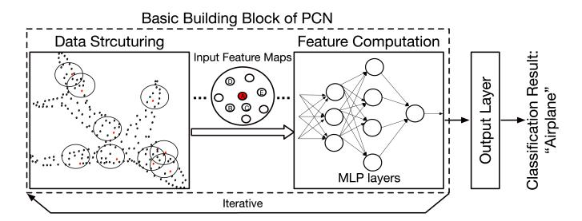
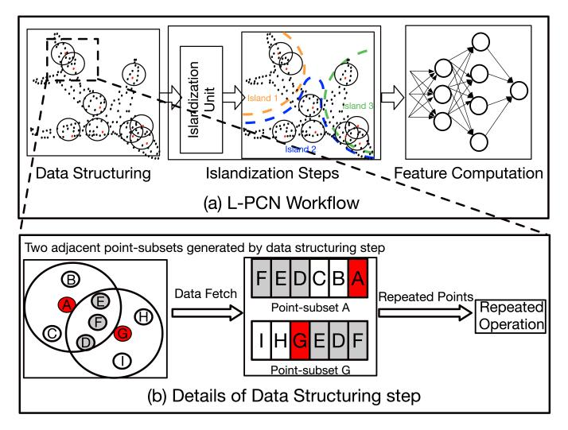
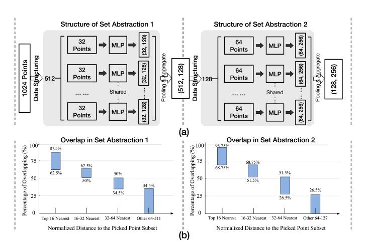

# L-PCN: A Point Cloud Accelerator Exploiting Spatial Locality through Octree-based Islandization

Yiming Gao†‡, Jieming Yin† , Yuxiang Wang† , Xiangru Chen‡ , Zhilei Chai§ , Bowen Jiang§ , Jiliang Zhang†∗, and Herman Lam‡ † Nanjing University of Posts and Telecommunications ‡University of Florida § Jiangnan University {gaoyiming, hlam}@ufl.edu {jieming.yin, zhangjiliang}@njupt.edu.cn

*Abstract*—Existing Point Cloud Networks (PCNs) have proven to achieve great success in many point cloud tasks such as object part segmentation, shape classification, and so on. The most popular point-based PCNs are usually composed of two sequential steps: Data Structuring (DS) and Feature Computation (FC). In this paper, we first describe an important characteristic of the PCN-specific DS step that has not been addressed in existing PCN accelerators: the spatial locality resulting from overlapping points of the gathered point subsets. Using algorithmhardware co-design, L-PCN (Locality-aware PCN) proposes two novel techniques to exploit this characteristic to reduce the large amount of repetitive operations in the overall PCN. The first of which is a point cloud partitioning technique, Octree-based Islandization. Using Octree-based adjacency gathering, a point cloud is partitioned into islands in L-PCN, where the point subsets inside the same island exhibit a strong spatial correlation. After partitioning, L-PCN performs the rest of PCN steps at the granularity of islands. The second method of L-PCN is scheduling the intra-island computation with a Hub-based Scheduling to exploit the intra-island data reuse by dynamically caching, updating, and reusing the repeated data. The two methods are implemented in an Islandization Unit, which can be seamlessly integrated into standard PCN workflow. Our evaluation shows that based on our methods for exploiting spatial locality, L-PCN achieves a theoretical reduction in feature fetching ranging from 55.2% to 93.8% and in feature computation ranging from 45.4% to 80.6% during the PCN process. For experimentation, prototype L-PCN accelerators are implemented on the Intel Arria 10 GX FPGA. Experimental results prove that with the Islandization Unit as a plug-in, state-of-the-art PCN accelerators can achieve an additional speedup ranging from 1.2× to 3.2×.

#### I. INTRODUCTION

With the development of 3D sensors, such as LiDARs and RGB-D cameras, point cloud data has become prevalent in modern embedded applications such as autonomous driving [32], robotics [25], AR/VR [44], [49]. Point Cloud Networks (PCNs) have proven to achieve great success in different tasks of point cloud analysis, including object part segmentation [4], shape classification [45], and semantic segmentation [2], [11].

Current PCNs can be classified into the following categories according to the method used [22]: 2D-CNN based [8], [27], [52], 3D-CNN based [21], [28], [42], and point-based [39], [47], [48]. Among these categories of PCNs, the point-based PCNs are most widely used and their basic building block can be generalized into an architecture comprising two steps: Data Structuring and Feature Computation, as shown in Figure 1. In

Fig. 1. Standard workflow and the two steps in the basic building block of point-based PCN: Data Structuring and Feature Computation.

a point-based PCN (will subsequently be referred to as PCN for simplicity), the Data Structuring (DS) step is to gather the localized points to form point subsets. For example, the points in each black circle in Figure 1 are gathered to form a point subset. Together, these point subsets are the input feature maps for the Feature Computation (FC) step. The features of the point subsets serve as inputs for the MVM (Matrix-Vector Multiplication) operations needed for the convolutional layers of the Feature Computation step.

In a general-purpose PCN architecture in GPU and CPU platforms, both the Data Structuring and Feature Computation steps consume a non-trivial part of overall latency [31]. With existing domain-specific designs [16], [31], the Feature Computation step performs the same functions as traditional Deep Neural Networks (DNNs), and can be directly accelerated by existing commercially available Deep Learning Accelerators (DLAs) such as NPUs [13]. However, the Data Structuring step is a PCN-specific operation and cannot be directly supported by these commercially available DLAs. If unaccelerated, the Data Structuring step will become a major bottleneck in PCN tasks, as demonstrated in [16], [31], [53].

Domain-specific PCN accelerators primarily target the DS step by developing customized units, while delegating the FC step to DLAs (e.g., NPUs). They can be categorized into two types: Accurate DS accelerators [19], [31], which perform accurate neighbor search as in traditional methods; Approximate DS accelerators [14], [53], which adopt approximate neighbor search for higher DS efficiency. With these efforts reducing DS overhead (e.g., to less than 15% in EdgePC [53]), the FC step (typically optimized only by DLAs) has in turn become the major source of latency in current PCN accelerators (e.g., up to above 85% in [14], [19], [31], [53]).

∗Corresponding author.

Fig. 2. (a) L-PCN workflow: adding Islandization Steps to exploit spatial locality. (b) Details of Data Structuring step, illustrating the overlap of points between point subsets.

As will be discussed in more detail in Section II, there is an important characteristic of the Data Structuring step that has not been addressed in existing PCN accelerators: the spatial locality resulting from overlapping points of the gathered point subsets, which can be exploited to reduce the large amount of repetitive operations in the overall PCN.

Many existing CNN and GCN (Graph Convolutional Network) accelerators [7], [10], [20] have effectively leveraged data locality from shared neighbors among adjacent input feature maps to eliminate redundant operations. In this work, we demonstrate that, in a similar manner, data redundancy also exists in PCNs in a spatially overlapping manner. As illustrated by the left part of the L-PCN workflow in Figure 2(a), the PCN-specific Data Structuring step first picks a set of central points (red points) and gathers its neighboring points to form point subsets (points within the black circles). Figure 2(b) provides some details of such a point subset. Points A and G are selected as central points of the two example point subsets. The grey points (D, E, F) are parts of both point subsets (i.e., overlap). From a benchmarking study that will be discussed in Section II-B, up to above 90% overlap of gathered points (grey points in Figure 2(b)) can be observed among adjacent point subsets. Consequently, this data redundancy leads to non-trivial repeated memory accesses and computations in PCNs. However, unlike GCNs and CNNs, PCNs face unique challenges for exploiting spatial locality due to the spatial sparsity of point clouds and the non-adjacent execution order in standard workflows, as further discussed in Section III-A.

To effectively exploit spatial locality in PCNs, L-PCN enhances the PCN workflow by incorporating novel Islandization steps (between Data Structuring and Feature Computation), implemented through an Islandization Unit. The L-PCN workflow, shown in Figure 2(a), will be detailed in Section III, and is briefly described here. To discover the overlapping points between point subsets (gathered by Data Structuring step), L-PCN uses a novel point cloud segmentation method, Octreebased Islandization, to partition the point cloud by clustering adjacent point subsets into L-PCN Islands. L-PCN Islands are groups of point subsets with strong spatial correlation, i.e., sharing a large number of overlapping points. As the example shown in the middle Figure 2(a), the Islandization Unit partitions the example point cloud into Island 1 (orange), Island 2 (blue), and Island 3 (green). A key feature of L-PCN is that a point subset cannot belong to more than one island.

After the Octree-based Islandization process, L-PCN performs the remaining PCN steps at the granularity of each island, instead of the granulation of each point subset as in existing PCN accelerators. To exploit the intra-island data reuse, we propose an Hub-based Scheduling method to schedule [37] the intra-island computation, resulting in high data locality during the runtime processing of an Island. This method deploys a novel cache design to reuse overlapping data, thereby avoiding redundant memory fetch operations after the Data Structuring step. It also results in avoiding repeated computation during the Feature Computation step related to these overlapping points. As shown in Figure 2(a), these two methods—Octree-based Islandization and Hubbased Scheduling—are implemented in the Islandization Unit. Both methods rely on Octree search [33] as the basic operation and performed using an Octree-search Engine. The detailed strategies and supported architectures of these two methods will be detailed in Section IV and Section V.

The L-PCN prototype, along with the evaluation, is described in Section VI. The evaluation is performed on two representative PCN models: PointNet++ and DGCNN, as well as two large-scale PCN variants: PointNeXt and PointVector, using four modern point cloud datasets. The experiments show that, in terms of theoretical workload optimization, the Islandization-based methods (for exploiting spatial locality) reduce memory fetching and computation workloads, ranging from 55.2% to 93.8% and from 45.4% to 80.6%, respectively. The prototype L-PCN accelerators are implemented on the Intel Arria 10 GX FPGA. We further show that L-PCN's Islandization Unit can be integrated into both categories of existing PCN accelerators (i.e., accurate and approximate) as a plug-in, enhancing their performance with an additional speedup from 1.2× to 3.2×. Moreover, L-PCN's methods for exploiting spatial locality outperform the workload reduction mechanism of the state-of-the-art PCN accelerators, GDPCA [5] and Mesorasi [16].

In Section VIII, we provide the conclusions and discuss the broader applications of our work.

#### II. BACKGROUND AND MOTIVATION

In this section, we present the background and motivation for L-PCN. Sub-section II-A introduces some of the key PCN basics. Sub-section II-B explains our motivation for exploiting spatial locality caused by shared neighbors using a representative PCNs, PointNet++ [39], as an example.

#### *A. PCN Basics: General Operations of PCN Steps*

Figure 1 illustrates the general steps followed by current PCNs in processing a basic PCN Building Block: a Data Structuring (DS) step, followed by a Feature Computation (FC) step. For example, in PointNet++ [39], such a PCN Building Block is called a Set Abstraction; in DGCNN [48], it is called EdgeCONV. As shown in Figure 1, a PCN process needs to iterate through several such PCN Building Blocks before processing the output layer. Figure 3 illustrates the general operations within these two steps.

Fig. 3. Details of the two steps in a basic PCN Building Block

The Data Structuring (DS) step is used to adapt the spatial sparsity of the points in point cloud to form the "input feature map" for the Feature Computation (FC) step. The FC step is the actual convolutional step typically implemented using MLP layers. Of these two types of operations, DS is unique to PCN. The DS step first picks a set of points as central points, then performs the neighbor-point gathering around these central points to form the point subsets. The feature information of these point subsets, akin to the input feature map in traditional DNNs, are sequentially inputted into the MLP layers for feature computation.

A point cloud comprises a collection of points denoted as x = {(pn, fn)}, where each pn = (xn, yn, zn) is the 3D coordinate of a point, and fn is its feature vector. The DS step forms the point subsets by leveraging the spatial coordinates pn = (xn, yn, zn) to perform neighbor gathering. Each central point picks the K spatially nearest points to form the point subset through a neighbor gathering algorithm, like KNN (K-Nearest Neighbors ) [48] or BQ (Ball Query) [39]. In Figures 2 and 3, the points enclosed by a black circle represent a formed point subset resulting from the DS step. The K (enclosed point number of each black circle) is a fixed number (e.g., K = 32), as the example shown in Figure 3. For the rest of this section, we will use K = 32 for illustration.

After the point subsets are formed, the 1-D feature vectors f of the points included in each point subset need to be retrieved from memory to create input feature maps. Within an input feature map, the feature of each point enters the MLP layers one by one. The dimension of the feature vector f will be transformed during the MLP layers. As shown in Figure 3, during the processing of the MLP layers, the dimension of feature f of each point will be changed from (1, 6) to (1, 128), resulting in the entire point subset being transformed from (32, 6) to (32, 128). At the final stage of Feature Computation, a Pooling Layer (e.g., max pooling) aggregates the MLP results of the 32-point subset into the central point. *Between* *two 32-points point subsets, if there are N overlapping points, then the feature fetch and MLP computation related to these N points are repeated*. In the subsequent Section II-B, we will show the ratio N/32 can be quite large, resulting in a high percentage of feature fetch and computation being repeated.

#### *B. Motivation: Exploiting Spatial Locality in PCN*

As discussed earlier, similar to CNNs and GCNs, PCNs also adopt a neighbor aggregation scheme, where feature maps are collected from neighboring elements and aggregated into a central element by applying weights. Many existing accelerators for CNNs [10], [26] and GCNs [7], [20], [51] have demonstrated that leveraging data locality from shared neighbors among adjacent feature maps can greatly reduce redundant operations for CNN and GCN processing.

However, existing PCN accelerators have not yet exploited the data redundancy caused by overlapping points between neighbor point subsets. We will now provide a benchmarking study quantifying the overlap-driven optimization opportunity, which motivates our Islandization-based methods to exploit spatial locality and enhance the efficiency of PCN acceleration. The PointNet++ [39] for ModelNet40 [45] dataset will be used as the benchmark for this evaluation.

Fig. 4. Detailed breakdown and overlap analysis of two major Set Abstractions (i.e., two iterations of the PCN Building Block) of the benchmark PointNet++ PCN.

Figure 4(a) illustrates the structures of the first two iterations of the Set Abstractions (i.e., Building Blocks) of the benchmark PointNet++ PCN, which collectively consume over 90% of the overall runtime. Figure 4(b) shows the results of an experiment that we performed to validate our hypotheses that the overlapping points (grey points in Figures 2 and 3) are primarily found between neighboring point subsets. And more importantly, among these neighboring subsets, the overlap ratio is very high, providing an opportunity to greatly reduce redundant memory accesses and computations.

In the experiment to generate the results in Figure 4(b), each point subset within a Set Abstraction is compared with all other point subsets to determine two items of information:

- 1) The distance between them, which is determined by the distance between their central points.
- 2) The percentage of overlap between the two point subsets. For example, if 17 out of the 32 points of the two point subsets are overlapped, the percentage is 53% (17/32).

In Figure 4(b), the x-axis of each graph is divided into four groups: top 16 point subsets that are closest to a selected point subset, next 16 closest, next 32 closest, and the remainder point subsets which are furthest away. Each of the four bars represents the range of overlap percentages for that group.

From the results in Figure 4(b), two observations can be made, which experimentally validate our stated hypotheses. Firstly, overlap of gathered points occurs mostly between point subsets which are spatially adjacent. This is evident because the left-most (nearest) bars of the two Set Abstractions exhibit the highest overlap, whereas the point subsets of rightmost (farthest) bars share few or no overlapping points. The second observation is the percentage of overlapping points of neighboring point subsets can be very high; reaching 87.5% (28 out of 32) in Set Abstraction 1 and 93.75% (60 out of 64) in Set Abstraction 2.

