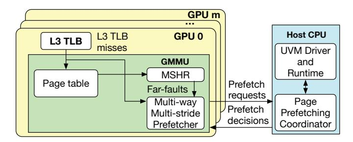

# *A. Overview*

Based on Takeaway 1 and 2, we introduce LIBRA, a High-Accuracy, Cost-Aware, and Coordinated multi-GPU stride-based page prefetcher that addresses limitations of prior work through three key innovations. (1) High-Accuracy Per-GPU Hardware Multi-way Multi-stride Prefetcher: LIBRA equips each GPU with a hardware Multi-way Multi-stride Prefetcher (MMP) to accurately capture page access patterns per SM and generate high-accuracy prefetching requests via dynamic-depth stride prediction, guided by our observation in Take Away 2. (2) Cost-benefit analysis of prefetching requests. In contrast to existing methods that do not estimate future accesses for migrated or prefetched pages, LIBRA monitors accesses to selected prefetched pages, enabling accurate prediction of their subsequent GPU access counts. (3) Multi-GPU Page Prefetching Coordinator. LIBRA introduces a software-based Page Prefetching Coordinator (PPC) on the CPU, which quantitatively evaluates prefetch requests from all GPUs, considers estimated future accesses, and coordinates decisions across GPUs based on global cost-benefit analyses.

Figure 7 provides an overview of LIBRA, whose high-level workflow is as follows. All L3 TLB misses are forwarded to the prefetcher to facilitate learning of access patterns. Farfaults are managed by the prefetcher, which triggers predictions as necessary. The prefetcher predicts pages to be

Fig. 7. LIBRA overview

accessed along with their anticipated future access counts on the local GPU, subsequently generating and forwarding prefetch requests to the PPC. The PPC on the host CPU quantitatively evaluates incoming prefetch requests and coordinates prefetching decisions across all GPUs based on comprehensive cost-benefit analyses.

