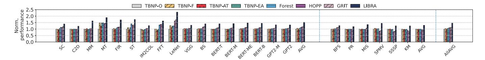
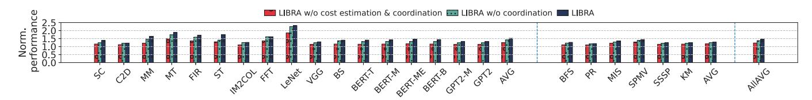

# *B. Detailed Analysis*

*1) Performance Breakdown:* Figure 15 provides a detailed breakdown of each method. The definitions of these metrics

Fig. 14. End-to-end performance normalized to TBNP-O (left: regular benchmarks, middle: irregular benchmarks, right: overall average)

Fig. 15. Performance breakdown normalized to TBNP-O (left: regular benchmarks, middle: irregular benchmarks, right: overall average). The bars for each benchmark, from left to right, represent TBNP-O, TBNP-F, TBNP-AT, TBNP-EA, Forest, HOPP, GRIT, and LIBRA

Fig. 16. Breakdowns of page migration overhead normalized to GRIT (left: regular benchmarks, middle: irregular benchmarks, right: overall average). The bars for each benchmark, from left to right, represent TBNP-O, TBNP-F, TBNP-AT, TBNP-EA, Forest, HOPP, GRIT, and LIBRA

Fig. 17. Total remote access changes for all migrated/prefetched pages (left: regular benchmarks, middle: irregular benchmarks, right: overall average). The bars for each benchmark, from left to right, represent TBNP-O, TBNP-F, TBNP-AT, TBNP-EA, Forest, HOPP, GRIT, and LIBRA

are in Section III-B. TBNP-EA prefetcher exhibits substantial proportions of remote access (26% on average) and page migration (18% on average) due to low prefetching coverage and accuracy. GRIT, a reactive method, uses more page migrations to reduce remote accesses, with migrations occupying 36% and remote accesses occupying 5% of the total time. Conversely, LIBRA evaluates migration costs and benefits to make informed decisions, reducing the combined total of migration and remote access times of GRIT by 59%. Additionally, the accurate predictive method employed by LIBRA also reduces translation overhead by 54% compared to GRIT.

*2) Breakdown of Page Migration Overhead:* Figure 16 presents the page migration overhead of all evaluated methods, normalized to GRIT. Migration overhead comprises flushing in-flight instructions from the SM pipeline, invalidating cache contents and TLBs on the source GPU, and the data transfer latency, with data transfer being the dominant contributor. LIBRA incurs only 16% additional overhead compared to GRIT, owing to its access-pattern-aware prefetching, which enhances accuracy and coverage. In contrast, TBNP-O, TBNP-F, TBNP-AT, TBNP-EA and Forest exhibit similarly high overheads. HOPP incurs approximately 89% of GRIT's overhead, reflecting its limited ability to hide migration latency due to low prefetch accuracy.

*3) Remote Access Changes:* We evaluate remote access changes across GPUs for each migration or prefetching event. Figure 17 categorizes migrations based on total remote access changes: fewer than 0, between 0 and 200, and greater than 200. Our simulator equates migration overhead to approximately 200 remote GPU accesses; thus, only migrations reducing more than 200 accesses are beneficial. This finding aligns with NVIDIA UVM's migration threshold of 256 remote accesses [49].

In LIBRA, over 95% of migrations successfully reduce remote access counts for migrated pages, with more than 69% proving beneficial. This underscores the effectiveness of LIBRA's cost-awareness and multi-GPU coordination mechanisms in making informed migration decisions. In contrast, TBNP-based methods show a significantly lower percentage of beneficial migrations; the best among them, Forest, achieves only 12% beneficial migrations. HOPP and GRIT perform slightly better than Forest, with beneficial migration percent-

Fig. 18. Prefetching Accuracy (left) and Coverage (right) for irregular benchmarks

Fig. 19. Impact of each LIBRA design component on overall performance (left: regular benchmarks, middle: irregular benchmarks, right: overall average)

Fig. 20. Total remote access changes for migrated/prefetched pages (left: regular benchmarks, middle: irregular benchmarks, right: overall average). The bars for each benchmark, from left to right, represent LIBRA w/o cost estimation & coordination, LIBRA w/o coordination, and LIBRA

ages of 18% and 34%, respectively. The lower effectiveness of these methods is due to their lack of cost-aware and coordinated multi-GPU strategies.

TABLE V PREFETCHER COMPARISON

| Abbr.        | Accuracy (%) | Coverage(%) | Average number of prefetched pages |
|--------------|--------------|-------------|---------------------------------------|
| TBNP-O [21]  | 33.8%        | 42.2%       | 28548                                 |
| TBNP-F [21]  | 39.3%        | 42.8%       | 25406                                 |
| TBNP-AT [22] | 47.4%        | 42.9%       | 21333                                 |
| TBNP-EA [23] | 36.2%        | 43.2%       | 27557                                 |
| Forest [38]  | 42.9%        | 48.9%       | 26617                                 |
| HOPP [36]    | 34.4%        | 12.3%       | 9675                                  |
| LIBRA (ours) | 81.8%        | 83.9%       | 19967                                 |

- *4) Prefetching Accuracy and Coverage:* Table V displays the page prefetching coverage of all prefetchers. The baseline average number of page faults are 24007. The results show that LIBRA conceals over 83% of migration latency from the critical path thanks to its access-pattern-aware design. In contrast, TBNP-based methods provide 44% prefetching coverage, hiding about 44% of page migration from the critical path but at the cost of a large number of page prefetches. In benchmarks with large strides, such as FFT, LIBRA achieves 95% prefetching coverage, whereas TBNP-based methods only manage about 12%. For benchmarks with high spatial locality, LIBRA slightly outperforms TBNP-based methods, although the latter achieve similar coverage at the expense of prefetching many more pages.
- *5) CPU Overhead:* We also measured the CPU overhead for processing prefetching requests, based on the number of prefetched pages. Since the CPU-side UVM runtime already handles tasks such as page table walks, LIBRA introduces only 3.2% overhead in CPU time. TBNP-EA, Forest, and HOPP introduce 0.4%, 0.4%, and 0.1% overhead in CPU time, respectively.

TABLE VI CPU OVERHEAD COMPARISON

| Name of the work | Average CPU overhead (%) |
|------------------|--------------------------|
| TBNP-O [21]      | 0.4                      |
| TBNP-F [21]      | 0.4                      |
| TBNP-AT [22]     | 0.3                      |
| TBNP-EA [23]     | 0.4                      |
| Forest [38]      | 0.4                      |
| HOPP [36]        | 0.1                      |
| LIBRA (ours)     | 3.2                      |

