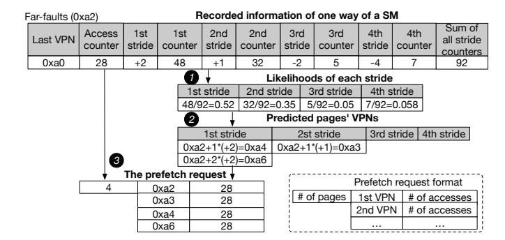
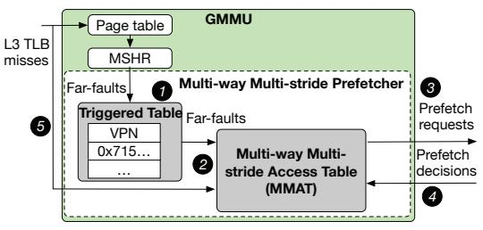
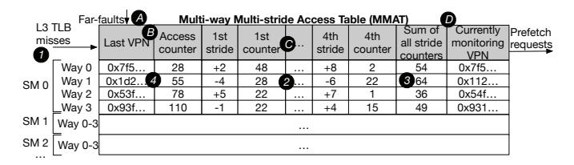

# *B. Multi-way Multi-stride Prefetcher*

Based on Takeaway 2, we propose the Multi-way Multistride Prefetcher (MMP) to learn page access patterns and generate prefetching requests guided by three design principles derived from multi-GPU program behaviors: (1) Per-Way and Per-SM Basis: Individual learning and prediction at a perway and per-SM granularity enhances accuracy, as merging accesses across ways or SMs obscures ordering due to GPU parallelism. (2) Multiple Ways: Maintaining multiple ways per SM captures diverse access patterns within each SM. (3) Multiple Strides: Supporting multiple strides per way captures concurrent strides and accommodates stride variations.

*1) Dynamic-Depth Prefetching:* To further improve prefetching accuracy, we propose dynamic-depth prefetching for multiple strides within each way of an SM. Given that a single way within an SM may exhibit multiple concurrent strides, we introduce a Dynamic-Depth prefetching strategy, wherein the number of pages prefetched per stride dynamically adjusts according to its recent frequency. Specifically, we maintain counters for the four most frequent strides, and prefetching more pages to strides that have recently occurred more frequently, improving predictive accuracy. While optimization of the exact increment of predicted pages per likelihood level is reserved for future exploration, in this paper, we conservatively prefetch one additional page for each 25% increase in stride occurrence likelihood.

$$stride\_likelihood = \frac{the\_counter\_of\_this\_stride}{the\_sum\_of\_all\_stride\_counters} \tag{1}$$

Figure 8 illustrates the dynamic-depth prefetching process and the intermediate values involved. The upper table shows the recorded data for a way in a SM, including the last VPN that triggered far-faults, the access count for a page in this way, four strides and their associated counters, and the total of all stride counters. A far-fault with VPN 0xa2 initiates the prediction process, during which the prefetcher calculates the likelihood of each stride using Equation 1 1 . It then predicts a strided pattern for each stride based on the VPN of

Fig. 8. Dynamic-depth prefetching

the initiating far-fault. We propose dynamic-depth prefetching, which determines the number of pages to prefetch for each stride based on its likelihood. For instance, the first stride (+2) with a likelihood of 0.52 results in the prefetching of two pages (0xa2+1\*(+2),0xa2+2\*(+2)) 2. The prefetch request is formulated, includes the VPNs of four pages and an estimated number of future accesses derived from the table 3. Upon the appearance of a fifth stride, the least frequent stride is removed.

2) Prefetcher Components and Workflow: To efficiently materialize the Multi-way Multi-stride Prefetcher (MMP) using dynamic-depth, we design the prefetcher that comprises two components: the Triggered Table and the Multi-way Multi-stride Access Table (MMAT), as illustrated in Figure 9. The Triggered Table, indexed by VPN, caches recent farfaults that trigger prediction to avoid redundant predictions from multiple SMs. The entries in the triggered table are periodically cleared. The MMAT maintains each SM's multi-way, multi-stride access patterns in a compressed format to generate high-accuracy and cost-aware prefetch requests.

Fig. 9. Multi-way multi-stride prefetcher design

The prefetcher workflow operates as follows: Upon a far-fault, the VPN is first checked against the Triggered Table ①. If the VPN exists, no further action is taken as this VPN is in the process of prefetching. Otherwise, the VPN is added to the Triggered Table and routed to the MMAT, which generates a prefetch request containing one or more pages ②. The prefetch request is then sent to the Page Prefetching Coordinator ③. The coordinator's decision is returned to the GMMU to resolve the original far-fault and migrate all, some, or none of the requested pages ④. Additionally, L3 TLB misses are forwarded to the MMAT, which learns these accesses using a compressed representation to maintain multi-way multi-stride

access patterns for each SM **⑤**. Finally, the access counts of the selected pages are periodically provided to update MMAT.

3) Multi-way Multi-stride Access Table (MMAT): We propose MMAT, illustrated in Figure 10, to efficiently learn and predict access patterns in a compressed format. MMAT comprises four rows corresponding to the four ways of each SM. Each row contains a 36-bit last VPN indicating the most recent VPN accessed, an 8-bit access counter tracking accesses to a previously accessed page in this way, four 6-bit strides with associated 6-bit occurrence counters, an 8-bit sum representing the total of all stride counters, and a 36-bit currently monitoring VPN. When the runtime provides access counts, the monitoring VPNs determine which way will be updated, as a way may be evicted if a fifth way appears in a SM.

Fig. 10. Multi-way Multi-stride Access Table

The access pattern learning process from L3 TLB misses is as follows. An L3 TLB miss is forwarded to the corresponding ways of the SM that initiate the miss **1**. Based on prior work describing the default mechanism in NVIDIA GPUs [33], [65], whether a TLB miss carries the source SM information is not specified. LIBRA extends the TLB-miss metadata to include the source SM information. The VPN of the miss is compared with the last VPNs across four ways; if the difference between this VPN and any last VPN is less than a threshold, the TLB miss is regarded as that way. In cases where multiple ways meet this criterion, the way with the smallest difference is selected. If no matches meet this criterion, a new way is created, replacing the existing way with the lowest access counter if the SM already records four ways **2**. This L3 TLB miss then updates the content in the matched way: the difference between the miss's VPN and the last VPN represents the stride. If this stride already exists, its counter is incremented; otherwise, it replaces the least frequent stride. Subsequently, the sum of all stride counters is adjusted, and the last VPN of this way is updated to the VPN of the current miss **3**.

The prediction procedure for handling a far-fault in MMAT is detailed as follows. Upon its occurrence, a far-fault is routed to the corresponding ways within the SM that initiated the miss **A**. The VPN associated with the far-fault is compared against the most recent VPNs stored across four ways. If the VPN difference is below a threshold (set to 512 in our design; optimization of this parameter is reserved for future work), the far-fault is attributed to that way. If multiple ways satisfy this criterion, the way with the minimal VPN difference is selected **B**. Subsequently, the prefetcher employs historical access patterns from the chosen way to generate prefetch re-

quests, following the algorithm described in Section IV-B1 and depicted in Figure 8 **©**. Prefetch requests with predicted future accesses are forwarded to the page prefetching coordinator **D**.

Fig. 11. Access counter update logic

4) Access Counter Update: We extend existing NVIDIA GPU mechanisms [22], [38], which record per-page local memory access counts, to update the monitored VPN's access count in MMAT.

Figure 11 illustrates the procedure for updating access counters in MMAT, extending the existing mechanism with modifications only to step **4**. Existing mechanisms maintain per-page access counters using registers automatically updated by the GMMU during TLB lookups upon every local memory access [22], [38] **①**. When a page's access counter reaches a predefined threshold, GPU hardware triggers an interrupt and records the event information in a ring buffer. The per-GPU-side UVM support continuously processes these interrupts **2**, retrieving entries from the ring buffer by invoking fetch\_access\_counter\_buffer\_entries(.), thus obtaining one or more access-counter buffer entries **3**. Each entry contains metadata (e.g., virtual addresses) identifying pages whose counters have reached the threshold. We modified fetch\_access\_counter\_buffer\_entries(.) to compare each reported page's virtual address against MMAT's monitored pages. Upon finding a match, the corresponding MMAT entry is updated by incrementing its counter by the threshold value **4**. After this update, the runtime proceeds to clear the hardware access-counter buffer **5**.

#### C. Page Prefetching Coordinator (PPC)

Without coordinated page prefetching across multiple GPUs, existing solutions incur a substantial number of migrations whose overheads outweigh their performance benefits, leading to migration such as ping-pong effects (see Section III-B).

We introduce the Page Prefetching Coordinator (PPC), designed to manage prefetch requests along with estimated accesses from our MMP. PPC is implemented as a software module within the CPU-side UVM runtime, avoiding any additional hardware changes. The main goal of the PPC is to allow a page migration only when its benefits exceed the overhead based on anticipated accesses for this page; otherwise, it proactively creates PTEs in response to the prefetch request. The PPC supports both CPU-GPU and GPU-GPU migrations. Given the lower memory bandwidth and higher latency of CPU memory compared to GPU memory, our

PPC implements first-touch CPU-GPU migration and quantitatively coordinated GPU-GPU migration. LIBRA follows the default first-touch CPU-GPU migration policy used in existing UVM systems [21] for initial page placement due to high CPU access latency. For GPU-GPU migrations, PPC records previous prefetch requests and their estimated future accesses. Migration decisions are based on this table, which determines whether and to which GPU a page should be migrated.

Fig. 12. Coordination logic

1) PPC Logic: Figure 12 illustrates the coordination logic of PPC. Upon receiving a prefetching VPN, PPC first checks whether the page resides in a GPU ①. If not, PPC migrates it to the requesting GPU as it is the first GPU access to this page ②. If this page is in GPU, PPC estimates whether the migration overhead is lower than the total latency reduction from migrating the page from one GPU to another with the highest estimated access count, based on Equation 2 ③. If the estimated benefit exceeds the overhead, PPC performs the migration to the GPU with the highest estimated access count and prefetches the PTE for the requesting GPU ④. Otherwise, no migration is performed, and only the PTEs are prefetched ⑤.

$$lat_{remote} * (acc_{highest} - acc_{source}) > page\_migration\_overhead$$
 (2)

Equation 2 defines the cost-benefit estimation of migrating a page among GPUs. Here,  $acc_{highest}$  denotes the highest estimated access count among all GPUs for the requested page, and  $acc_{source}$  represents the estimated access count of the GPU currently holding the page. The term  $lat_{remote}$  refers to the average latency of remote memory accesses across GPUs, while  $page\_migration\_overhead$  captures the total latency incurred during migration. In our experiments, we measure the average values of these components to estimate both the migration overhead and the potential performance benefit.

2) PPC Design: We design the PPC as a lightweight runtime module for coordinating prefetch decisions, as depicted in Figure 13. The PPC comprises a runtime component and a PPC hash table indexed by hashed VPN values in the CPU-side UVM runtime. Upon receiving a prefetch request, if the corresponding VPN is not present, the PPC runtime dynamically creates a new PPC hash table entry indexed by the hashed VPN value, initializing all fields to zero and recording the actual VPN. Each PPC table entry has a 36-bit actual VPN,

a recent-migration flag (1 bit), a recent-use flag (1 bit), the current GPU ID indicating the GPU where the page resides (3 bits), and eight access counters (8 bits each) that estimate access intensity across GPUs.

Fig. 13. Page prefetching coordinator design

For each prefetch request, the PPC runtime hashes each VPN within the request and retrieves the corresponding entry matching the hashed VPN value from PPC hash table **①**. If an entry is found, the estimated access count for the requesting GPU is updated based on the received value, and the recent-use bit is set **2**. If the recent-migration bit is already set, indicating a recent migration, no further action is taken 3. Otherwise, the PPC runtime applies Equation 2, using the updated estimated access counts and the current GPU ID, to decide whether the migration should occur. If migration is warranted, the recent-migration bit is set **4**, and the migration is executed by invoking the existing CPU-side UVM runtime function **⑤**. Specifically, the function uvm\_api\_migrate(.) is utilized for actual migrations, whereas uvm\_va\_block\_map(.) is employed to obtain only the translated PTE without migration. If no entry is found at step **2**, the PPC runtime creates a new entry. For pages residing in CPU memory, migration is permitted by default; for pages on other GPUs, migration decisions are made according to Equation 2 **6**.

The PPC runtime periodically performs a global maintenance operation on the PPC table . First, it right-shifts all access counters to decay historical access estimates, ensuring that the counters more accurately capture future access behaviors . Next, all recent-migration bits are cleared to enable subsequent migrations . and all recent-use bits are reset to facilitate more effective eviction decisions. Entries whose recent-use bits are already unset are reclaimed to free table capacity . The PPC hash table employs existing hashtable management techniques, including conflict resolution and dynamic resizing [54].

