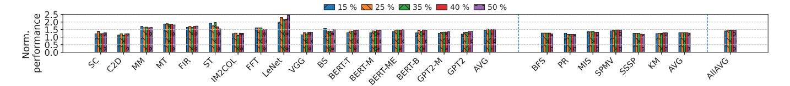
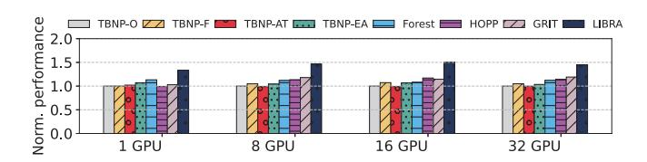
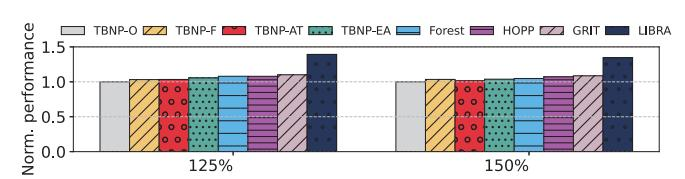
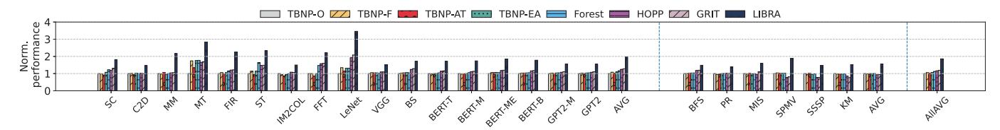

# *C. Irregular Benchmark Analysis*

Figure 18 shows the accuracy and coverage for irregular benchmarks. The results indicate that LIBRA conceals over 82% of migration latency from the critical path due to its access-pattern-aware design, achieving an accuracy of 79%. In contrast, TBNP-based methods provide 62% prefetch coverage, hiding about 62% of page migration latency from the critical path, but at the cost of a large number of unnecessary page prefetches, resulting in an accuracy of only 40%. These results demonstrate that LIBRA remains effective for irregular benchmarks and continues to outperform TBNP-based approaches.

## *D. Ablation Study*

We conducted an ablation study to assess the contributions of cost-awareness and multi-GPU coordination. "LIBRA w/o cost estimation & coordination" removes both features, while "LIBRA w/o coordination" removes only the multi-GPU coordination. Figure 19 and Figure 20 illustrate the impact of each LIBRA design component on page prefetching decisions and overall performance normalized to TBNP-O, respectively. Without cost estimation and coordination, LIBRA issues an average of 24K page migrations, of which 7% are unnecessary—resulting in increased remote accesses—and

Fig. 21. Performance with 15%, 25%, 35%, 40% and 50% Threshold (left: regular benchmarks, middle: irregular benchmarks, right: overall average)

Fig. 22. Performance with 200 GB/s, 300 GB/s, and 400 GB/s NVLink Bandwidth (Left: Regular benchmarks Middle: Irregular benchmarks Right: Overall Average Results)

55% are inefficient, where the reduction in remote access does not justify the migration cost.

With cost estimation, LIBRA can assess the trade-off between migration cost and benefit, reducing total page migrations by 16%, unnecessary migrations by 31%, and inefficient migrations by 36%, leading to a 12% performance improvement. Adding multi-GPU coordination further eliminates pingpong migrations and selects the optimal destination GPU, reducing total migrations by an additional 13%, unnecessary migrations by 35%, and inefficient migrations by 45%, with an 6% performance gain. These two designs work synergistically to enhance overall performance.

## *E. Sensitive Study*

- *1) Performance with Different Prefetching Threshold:* Figure 21 shows the performance under different prefetching thresholds. While some benchmarks, such as LeNet, benefit from a higher threshold—where a 50% threshold improves performance by 5%—others, such as Bitonic Sort, prefer more conservative prefetching; using a 15% threshold yields a 13% performance improvement. Overall, a 25% threshold provides the best performance on average, outperforming thresholds of 15%, 35%, 40%, and 50% by 3%, 2%, 1%, and 1%, respectively. We leave the dynamic tuning of the threshold as future work.
- *2) Performance with Different Network Bandwidth:* Figure 22 shows the performance under different bandwidth settings. At 200 GB/s, LIBRA outperforms TBNP-o by 64.7%; at 300 GB/s, the improvement is 46%; and at 400 GB/s, it is 36.8%. These results demonstrate LIBRA's effectiveness across different bandwidth conditions, with smaller gains at higher bandwidth because page migration overhead accounts for a smaller fraction of execution time.
- *3) Performance with Different Numbers of GPUs:* We evaluate our approach using systems equipped with 1, 8, 16 and 32 GPUs to demonstrate LIBRA's generality. The multi-GPU simulator is scaled down in all components, including compute units, cache, memory, NVLink, etc. The scaled down simulator can accurately model recent GPU performance [55]. We adopt memory footprints consistent with prior multi-GPU studies [11], [32], [34], [60]; despite their relatively small

absolute values, these footprints are sufficiently large within the scaled-down simulator to effectively evaluate page migration. In the 1 GPU setup, LIBRA still achieves performance improvements, 25%, 18%, 35%, 30% over TBNP-EA, Forest, HOPP, and GRIT, respectively. We proportionally increase the workload size to scale up to 8 16 and 32 GPUs. [61] As shown in Figure 23, LIBRA achieves significant performance improvements, 40%, 31%, 29%, 24% over TBNP-EA, Forest, HOPP, and GRIT, respectively, in the 8-GPU configuration. In the 16-GPU setup, the gains remain substantial at 41%, 39%, 28%, 31%, respectively. In the 32-GPU setup, LIBRA still prevail other methods, 40%, 29%, 27%, 22% over TBNP-EA, Forest, HOPP, and GRIT. These results demonstrate LIBRA's effectiveness across environments with more GPUs.

Fig. 23. Average performance with 1, 8, 16, and 32 GPUs

Fig. 24. Memory oversubscription performance

*4) Memory oversubscription:* To evaluate LIBRA under memory oversubscription, we keep the application working sets the same and reduce each GPU's memory capacity. Following prior work [61], we evaluate 125% and 150% memory oversubscription, where total application data exceeds total GPU memory by 25% and 50%, respectively, with excess data placed in CPU memory. As shown in Figure 24, LIBRA achieves performance gains of 32%, 29%, 29%, 27% over TBNP-EA, Forest, HOPP, and GRIT at 125% oversubscription, and 30%, 28%, 26%, 24% at 150%. These results demonstrate LIBRA's effectiveness under memory oversubscription.

Fig. 25. End-to-end performance results normalized to TBNP-O in multi-rack environment (left: regular benchmarks, middle: irregular benchmarks, right: overall average)

