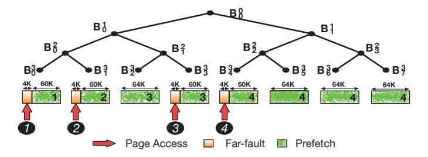
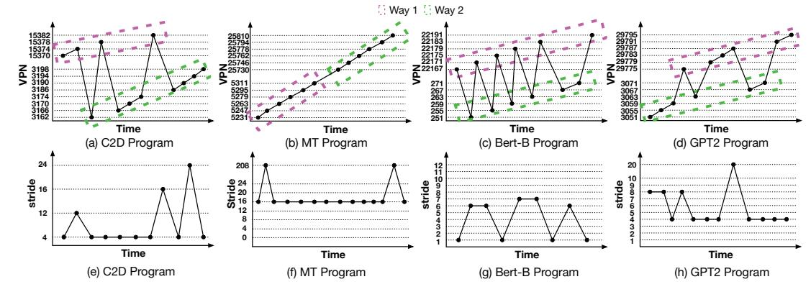

# II. BACKGROUND

## *A. UVM-Enabled Multi-GPU System*

This paper targets Unified Virtual Memory (UVM)-managed discrete multi-GPU systems, where GPUs are interconnected via high-bandwidth links such as PCIe [45] and NVLink [19]. Figure 1 shows the baseline architecture. Each GPU contains multiple streaming multiprocessors (SMs).

Modern GPUs use hierarchical Translation Lookaside Buffers (TLBs) to accelerate address translation. Each Texture Processing Cluster (TPC) contains an L1 TLB shared by two Streaming Multiprocessors (SMs), while an L2 TLB covers

Fig. 1. UVM-managed Multi-GPU overview

all SMs within a GPU Processing Cluster (GPC). An L3 TLB serves all GPCs in the GPU. Each discrete GPU manages its own memory and page tables, with translation handled by the GPU Memory Management Unit (GMMU). In UVM systems, the CPU-resident UVM driver maintains a unified page table and coordinates page faults across GPUs.

Figure 1 illustrates the translation flow. On a memory access, the L1 cache and L1 TLB are accessed in parallel using a virtually indexed, physically tagged cache 1 . On an L1 TLB miss, the request checks the Miss Status Holding Register (MSHR); if unresolved, it proceeds to the L2 TLB 2 and then the L3 TLB 3 . If no translation is found, the request is forwarded to the GMMU 4 , which performs a multi-level page-table walk, often aided by a page-walk cache. If the mapping is still missing, a far-fault is generated and recorded in the GMMU MSHR, triggering an interrupt to the UVM driver 5 . The driver resolves the fault using its unified page table and updates mappings across CPU and GPU memories.

## *B. Predictive Page Migration*

Previous studies have explored page prefetching (i.e., predictive page migration), in CPU-GPU systems using UVM [21]–[23], [38] and in disaggregated memory environments [7], [36].

Fig. 2. NVIDIA tree-based neighborhood prefetcher [21]

A recent study [21] shows that NVIDIA GPUs use Tree-Based Neighborhood Prefetching (TBNP) in CUDA drivers for CPU–GPU page migration under UVM. Allocated UVM memory is first divided into 2MB large pages, which are further partitioned into 64KB logical blocks forming a complete binary tree (Figure 2). Each non-leaf node maintains metadata recording the number of total and migrated child nodes. TBNP migrates data at the leaf level, transferring the entire 64KB block upon a far-fault. It further prefetches remaining leaf nodes of a subtree once more than 50% of its leaf nodes have migrated, assuming strong spatial locality.

Figure 2 illustrates the process with four far-faults. The first two faults  $\P^0$  migrate blocks  $B_0^3$  and  $B_1^3$ , updating the valid sizes of  $B_0^2$ ,  $B_0^1$ ,  $B_0^0$  to 128KB. The third fault  $\P^0$  migrates  $B_3^3$ , increasing  $B_0^1$  and  $B_1^2$  to 192KB and 64KB, respectively; since  $B_0^1$  exceeds 50% of 256KB, node  $B_2^3$  is prefetched. The fourth access  $\P^0$  migrates  $B_4^3$ , increasing  $B_0^0$  to 320KB and triggering prefetches of  $B_5^3$ ,  $B_6^3$ , and  $B_7^3$ .

## C. Reactive Multi-GPU Page Migration

Prior work explores reactive page migration for UVM-managed multi-GPU systems, where migration is triggered after remote accesses. Existing approaches mainly include: (i) on-touch migration [11], (ii) access counter-based migration [53], and (iii) page duplication [43]. On-touch migration moves a page to the requesting GPU upon the first remote access, which may cause frequent migrations and ping-pong effects when multiple GPUs access the same page. Access counter-based migration delays migration until a threshold number of remote accesses occurs, reducing migration frequency but increasing initial access latency. Page duplication replicates read-only pages across GPUs to enable local reads, but requires invalidations when writes occur. The SOTA approach, GRIT [60], dynamically selects the most suitable strategy on a per-page basis to improve performance.

#### III. MOTIVATION

## A. Qualitative Discussion of Prior Work

GRIT [60] and OASIS [61] employ reactive page migration for multi-GPU scenarios, which is less effective than predictive methods because all migrations occur on the critical path. TBNP-EA [23] and Forest [38] are predictive spatial locality prefetchers based on TBNP [21], designed for CPU-GPU page migration. TBNP-EA dynamically adjusts prefetch thresholds according to page fault counts, whereas Forest adaptively modifies prefetch block sizes and tree depth based on access patterns. However, these GPU page prefetchers all suffer from limitations associated with relying solely on spatial locality. Moreover, none of these methods considers the cost-benefit trade-offs of migration or multi-GPU coordination, rendering them ineffective for multi-GPU page prefetching, as summarized in Table I.

TABLE I COMPARISON OF RELATED WORK

| Work Name    | Context   | Migration method              | High prefetching accuracy | Cost benefit analysis | Multi-GPU coordination |
|--------------|-----------|----------------------------------|---------------------------------|-----------------------------|---------------------------|
| TBNP-EA [23] | CPU-GPU   | Predictive (spatial locality) | ×                               | Х                           | Х                         |
| Forest [38]  | CPU-GPU   | Predictive (spatial locality) | ×                               | Х                           | ×                         |
| GRIT [60]    | Multi-GPU | Reactive                         | N/A                             | Х                           | X                         |
| LIBRA (ours) | Multi-GPU | Predictive (stride-based)     | 1                               | 1                           | 1                         |

#### B. Quantitative Evaluation of Prior Work

We quantitatively evaluate two state-of-the-art prefetchers, TBNP-EA and Forest, using the industry-validated MGPUsim simulator [55]. We simulate a 4-GPU system, with each GPU maintaining its own local page table and GMMU. Following prior studies on multi-GPU systems [11], [32], [34], [38], [60], we evaluate eight applications with diverse access patterns: Convolution 2D (C2D), Matrix Multiplication (MM), Matrix Transpose (MT), Image To Column (IM2COL), BERT Mini (BERT-M), BERT Base (BERT-B), GPT 2 Mini (GPT2-M), and GPT 2 (GPT2). Details of our evaluation methodology are presented in Section V.

#### **Evaluation Metric Definitions:**

- **Prefetch accuracy:** The percentage of prefetched pages accessed by the destination GPU.
- Prefetch coverage: The percentage of accessed pages that were prefetched and reside in local memory at the time of access.
- Page migration overhead: The critical-path latency introduced by page migration, including TLB invalidations, SM pipeline flushes, cache flushes, and data transfers. Only the initial far-fault-triggered page migration is counted as overhead; subsequent prefetches are excluded.
- Remote access overhead: The execution time incurred by remote memory accesses.
- Translation overhead: The execution time incurred by far-faults, excluding page migration and prefetching.
- Remote access changes: The total number of remote access changes incurred by performing a page migration, compared to eliminating this migration until the next migration event for the same page, aggregated across all GPUs' accesses to this page.

**Prefetching Accuracy and Coverage:** Table II presents the prefetching accuracy and coverage of these two methods.

TABLE II
PREFETCHING ACCURACY AND COVERAGE

|             |         | C2D | MM | MT | IM2COL | BERT-M | BERT-B | GPT2-M | GPT2 | AVG |
|-------------|---------|-----|----|----|--------|--------|--------|--------|------|-----|
|             | TBNP-EA | 18  | 31 | 36 | 37     | 30     | 33     | 34     | 34   | 32  |
| Accuracy(%) | Forest  | 29  | 49 | 59 | 36     | 39     | 38     | 44     | 44   | 42  |
|             | TBNP-EA | 18  | 28 | 45 | 36     | 31     | 34     | 35     | 35   | 33  |
| Coverage(%) | Forest  | 30  | 50 | 60 | 37     | 35     | 38     | 41     | 41   | 42  |

TBNP-EA and Forest, both based on TBNP, achieve limited prefetching coverage (33% and 42%), providing insufficient reduction of page migration overhead on the critical path. Their low prefetching accuracy (32% and 42%) also introduces substantial unnecessary inter-GPU traffic and contention. The low prefetching accuracy and coverage stems from the multi-GPU context, which differs from the single-GPU CPU-GPU setting for which TBNP was designed: workloads are partitioned across GPUs so each GPU accesses only a fraction of the data, reducing spatial locality, while concurrent accesses to the same pages across GPUs cause contention and frequent page migrations (ping-pong behavior), further degrading prefetching accuracy and coverage.

Fig. 3. Four SMs' access patterns of (a) C2D, (b) MT, (c) BERT-B and (d) GPT2

Fig. 4. VPN accesses of a SM: (a) C2D, (b) MT, (c) BERT-B, (d) GPT-2. VPN access strides of a way of a SM: (e) C2D, (f) MT, (g) BERT-B, (h) GPT-2.

Fig. 5. Performance breakdown normalized to TBNP-EA

Page Migration Overhead: Figure 5 presents the performance breakdown of these two methods, illustrating that page migration and remote accesses constitute a substantial portion of the total execution time. Specifically, page migration and remote accesses collectively account for an average of 43% of the total access time in TBNP-EA (migration: 20%, remote access: 23%) and 45% in Forest (migration: 19%, remote access: 26%). The high page migration overhead results from low prefetching coverage, which ineffectively hides migration latency on the critical path. Remote accesses primarily occur when handling page migration. The significant remote access overhead also stems from limited prefetching coverage, which insufficiently converts remote accesses into local accesses.

Remote Access Changes: We evaluate remote access changes across all GPUs for each page migration or prefetching event. Figure 6 illustrates the results, categorizing migrations into three groups based on their total remote access changes: fewer than 0, between 0 and 200, and greater than 200. According to our simulator, a page migration incurs overhead roughly equivalent to 200 remote GPU accesses; thus, only migrations reducing more than 200 remote accesses are considered beneficial. The beneficial criterion that more than 200 remote accesses justify the page migration overhead may vary depending on system parameters, such as NVLink latency and page migration size. Additionally, we note that NVIDIA

UVM adopts an access-counter-based migration policy option, initiating migration when remote accesses exceed a threshold of 256 [49], which aligns with our findings and analysis.

Fig. 6. Total remote access changes for all migrated/prefetched pages.

Due to the lack of cost-benefit analysis and multi-GPU coordination, page migrations may increase remote accesses at the source GPU without sufficiently reducing them at the destination, increasing total remote accesses. Specifically, 53% of migrations in TBNP-EA and 51% in Forest result in higher total remote accesses across all GPUs, introducing additional overhead. Furthermore, without quantitatively balancing migration costs against the benefits of reduced future remote accesses, only 7% of migrations in TBNP-EA and 10% in Forest yield benefits, highlighting the importance of considering cost-benefit trade-offs and multi-GPU coordination for each page migration and prefetching.

**Takeaway #1:** Spatial-locality prefetchers designed for CPU–GPU systems are ineffective in multi-GPU environments, as they exhibit low accuracy and coverage, incur substantial migration and remote-access overheads, and generate a large volume of migrated or prefetched pages whose benefits do not justify the associated costs.

## C. Multi-GPU Page Access Patterns

We conduct experiments to better understand GPU access patterns and derive insights for designing a high-accuracy stride-based page prefetcher for multi-GPU scenarios. Specifically, we analyze the Virtual Page Numbers (VPNs) accessed by each SM across multiple applications, presenting some examples due to space limitations.

Figure 3 illustrates the memory accesses of four SMs across four programs. Although the four SMs within each program exhibit identical strides (e.g., stride of 16 in MT, BERT-B, and GPT-2, and stride of 1 in C2D), the extensive parallelism inherent in GPUs results in these accesses occurring nonsequentially across SMs. TBNP-EA and Forest experience reduced accuracy and coverage due to non-adjacent accesses. Thus, an effective prefetcher should individually learn each SM's access pattern to enhance prefetching accuracy and coverage.

Figure 4 (a–d) present the VPN accesses of a single SM for four different programs, showing multiple ways with strided access patterns within each SM. A way represents an independent memory access stream originating from one or more SMs. Accesses are grouped into different ways based on an address-distance threshold separating memory regions. Figure 4 (e–h) depict the VPN access strides within one way of a SM, demonstrating that even a single way can exhibit stride shifts (e.g., from stride 8 to 4 in Figure 4 (h)) and multiple concurrent strides (e.g., strides 1, 6, and 7 in Figure 4 (g)).

Takeaway #2: An effective stride-based prefetcher should individually learn each SM's access pattern and accommodate its multi-way and multi-stride characteristics to improve prefetching accuracy and coverage.

