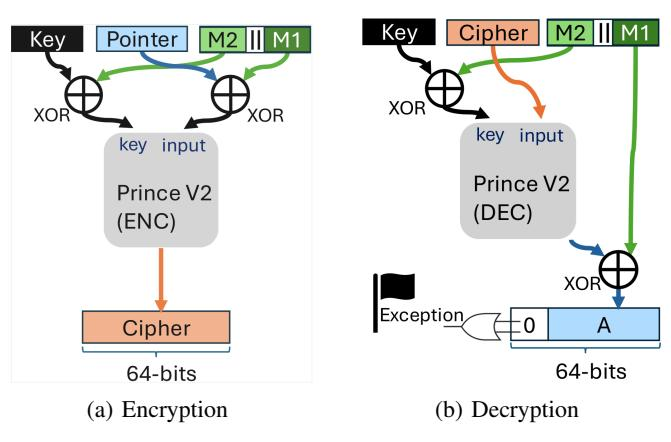

# *A. Design Goals*

LIPPEN is designed to ensure robust pointer integrity while maintaining practicality and efficiency in both conventional and speculative execution. The key design goals are:

- G1: Comprehensive Pointer Integrity Coverage. Protect all pointer types, including both data pointers and code pointers (e.g., return addresses).
- G2: Zero Metadata Overhead. Eliminate auxiliary data structures, shadow memory, or tag tables to avoid memory overhead and access latency.
- G3: High Security Strength. Provide strong protection against pointer corruption, reuse, and brute-force attacks by maximizing cryptographic entropy within the pointer representation.
- G4: Low Performance Overhead. Use lightweight, hardware-assisted encryption to achieve near-PAC runtime overhead, enabling deployment in performance-sensitive systems.
- G5: Flexible Hardware Support for Various Security Policies. Support multiple protection policies and

- context-binding schemes under user or compiler control, e.g., modifier in PAC, enabling flexible trade-offs between performance, security, and compatibility.
- G6: Reuse of the Existing Toolchain for Easy Deployment of Defenses Preserve existing compiler instrumentation, ABI conventions, and runtime interfaces so that PAC-enabled software can run on LIPPEN without modification, ensuring drop-in integration into existing software and toolchains.

#### *B. Design Space Discussion*

A wide range of mechanisms have been developed to defend against memory corruption and control-flow attacks. Table I compares representative designs across four axes: brute-force space, memory footprint overhead, deployment requirements, and context granularity within each domain. We analyze their trade-offs and how they align with our design goals. Broadly, these mechanisms fall into two primary categories: *address layout randomization* and *metadata augmentation*.

*a) Address Layout Randomization:* Addressrandomization defenses [41], [84] increase attacker uncertainty by randomizing the placement or representation of code and data objects. Conventional ASLR is practical and widely deployed because it requires no changes to program binaries or pointer formats, but it provides only probabilistic protection: once layout entropy is disclosed or guessed, leaked pointers can be reused to construct code-reuse or control-flow hijacking attacks. Prior work [70] further shows that such secret offsets can be inferred through speculative probing attacks [42]. Morpheus [41] strengthens this class of defenses with hardware-supported moving-target defenses and runtime churn. It applies a random displacement to code and data pointers by adding a secret offset to their values, and periodically changes these offsets during execution (e.g., every 50 ms in the evaluated configuration) so leaked or bruteforced information becomes stale. This stronger protection, however, requires substantial architectural support, including 2-bit runtime domain tags per 64-bit word, additional tag storage/cache structures, and specialized hardware for churning, pointer translation, and attack detection. Thus, while address randomization is an effective baseline defense, conventional ASLR does not provide pointer integrity (G1), and stronger variants such as Morpheus achieve higher security only with nontrivial hardware and metadata complexity, falling short of our goals for comprehensive coverage (G1) and zero metadata overhead (G2).

*b) Metadata Augmentation:* A second family of techniques strengthens pointer integrity by associating pointers with auxiliary integrity or capability metadata [33], [43], [58], [62], [67], [73], [78], [92], [94]. Depending on where metadata is maintained, these defenses can be grouped into two categories:

Protection with external auxiliary metadata structures. Systems such as CCFI [67], ZeRØ [94], Star [43], and capability-based architectures like CHERI [92] associate pointers with auxiliary metadata structures or tagged memory that

| TADILI   | <i>-</i>   | C     | 4 4.         | • ,     | • , •,    | 1 C        |
|----------|------------|-------|--------------|---------|-----------|------------|
| IABLE    | Comparison | of re | nrecentative | nointer | integrity | detenses   |
| TADLL I. | Comparison | 01 10 | presentative | pomici  | IIIICZIII | uciciiscs. |

| Category               | Defense       | Brute-force Resilience                 | Memory Footprint     | Required Modification                                         | Context(Permission)     |  |
|------------------------|---------------|----------------------------------------|----------------------|---------------------------------------------------------------|-------------------------|--|
|                        |               |                                        | Overhead             |                                                               | / pointer               |  |
| Address Randomization  | ASLR [83]     | 19–28 bits a                | None                 | OS                                                            | No                      |  |
| Address Kandonnization | Morpheus [41] | 60 bits a                   | 2 bits/word          | Crypto Engine +                                               | No                      |  |
|                        |               |                                        |                      | Churn-Unit + OS                                               |                         |  |
| External Metadata      | CHERI [92]    | 36 . 1                                 | 256 bits/pointer     |                                                               |                         |  |
|                        | ZeRØ [94]     | Metadata not accessible                | 2 bits/word          | Instructions + compiler                                       | Included in tops        |  |
|                        | PUMP [37]     | in user space.  Cannot be brute forced | word-size bits/word  | + memory hierarchy                                            | Included in tags        |  |
|                        | Star [43]     | Cannot be brute forced                 | (2,6) bits/word for  |                                                               |                         |  |
|                        |               |                                        | (Data, Instructions) |                                                               |                         |  |
|                        | CCFI [67]     | 128 bits                               | 128 bits/pointer     | Compiler b                                         | 80 bits                 |  |
|                        | FRP [73]      | 52 bits                                | 16 bytes/object      | OS + memory hierarchy                                         | No                      |  |
| In-pointer Metadata    | PAC [62]      | 7–16 bits                              |                      | Instructions   Committee                                      | 64 bits                 |  |
|                        | C3 [58]       | 24 bits                                | None                 | Instructions + Compiler c + Hardware Crypto Engine | Yes                     |  |
|                        | LIPPEN (ours) | 64 bits                                |                      | Traitiwate Crypto Eligine                                     | Adjustable d |  |

&lt;sup>a This entropy accounts for the whole system's security and is different from per pointer entropy.

encode authentication codes, bounds, or permissions. Such schemes provide robust protection, comprehensive coverage (G1), and strong security guarantees (G3) by maintaining precise, per-pointer metadata. However, they incur nontrivial memory, lookup, and synchronization overheads. Their reliance on external structures complicates hardware design and violates the **zero-metadata** principle (G2), making them less practical for lightweight or commodity environments.

In-Place Protection. Several works, such as Arm Pointer Authentication (PAC) [25] and C3 [58], embed integrity metadata directly into the pointer representation by repurposing unused high-order address bits. Such approaches have zero metadata overhead and are adopted by industry [25]. However, subsequent analyses have demonstrated that such schemes are vulnerable to brute-force or collision-based attacks: PAC is compromised by PACMAN [76], and C3 is bypassed by Na et al. [70]. The underlying reason is that the number of authentication bits embedded within the pointer is limited; PAC uses only 11–15 bits, and C3 employs a 24-bit cipher, significantly constraining the available integrity space. Similarly, FRP [73] encodes 52 bits of the pointer, including the unused high order bits; however, its encoding/decoding uses table (map) lookup instead of cryptography, introducing extra indirection and performance overhead. Without new instructions, it relies on malloc to manage the map and supports only heap objects.

**Pointer Authentication.** Current in-place schemes, such as Arm PAC [62], retain most pointer bits for the raw address and dedicate only a small fraction of high-order unused bits to the authentication code. This design choice stems from two considerations by Arm [75]: (i) preserving the full address value allows pointers to participate in branch prediction without authentication, and (ii) maintaining meaningful address values simplifies software debugging and crash analysis. These choices, however, dramatically reduce the number of bits available for authentication—typically to fewer than two dozen bits (16 bits on the Apple M1 [76]), depending on the virtual

address space layout. As demonstrated by the PACMAN attack [76], such limited entropy enables practical brute-force and oracle-based attacks that can recover valid authentication codes within a few minutes on commodity hardware.

One benefit of keeping the raw pointer value is that it leaves room for micro-architectural optimizations, such as using the pointer speculatively before the authentication completes, hiding the authentication latency. e.g., Arm also provides the fused instruction for authentication and load (LDRAA and LDRAB) and authentication and return (RETAA and RETAB). However, in practice, as shown in the PACMAN [76] attack, the authentication result impacts the execution result of the follow-up instruction consuming the pointer, indicating limited overlap between the load or return operation and authentication. Otherwise, if a data pointer is used speculatively before authentication, the TLB must be updated regardless of the authentication result, since it lies on the critical path. This prevents the PACMAN attack from succeeding on data pointers. Additionally, PARTS [62] uses additional instructions to emulate the 4-cycle authentication delay for end-toend performance evaluation, showing reasonable performance without speculation. We corroborate this with Apple M1 measurements, where PAC-protected data pointer accesses in a pointer-chasing scenario incur overhead comparable to encryption where no raw pointer bit exists.

Arm also provides the XPAC instruction set (e.g., XPACI, XPACI, and XPACLRI) to strip the PAC from a pointer and recover its original address [13]. However, XPAC operations are typically invoked only in specialized contexts where security is not a concern, such as specific pointer arithmetic, low-level runtime code, or debugging, and are rarely executed in normal application paths.

This paper: Full Pointer Encryption. These findings suggest that preserving full raw address bits in authenticated pointers may not be necessary in practice while severely constraining available entropy. LIPPEN leverages this insight to address the core limitations of prior designs. By repurposing all 64 bits of the pointer for cryptographic protection, LIPPEN

&lt;sup>b They use Intel AES-NI engine for encryption.

&lt;sup>c Our work (LIPPEN) uses the same Instructions and Compiler support as Arm PAC.

&lt;sup>d up to 192 bits, maximum level of security is achieved if we keep context size as large as the unused bits.

achieves comprehensive coverage across all pointer types (G1), eliminates external metadata to meet the zero-overhead requirement (G2), and maximizes entropy to provide strong cryptographic protection against brute-force and reuse attacks (G3). This full-pointer encryption approach removes the entropy bottleneck inherent to truncated MACs and transparently restores a valid address upon dereference, providing robust integrity and confidentiality without additional memory or hardware state.

However, full pointer encryption still faces challenges in finding a suitable cipher, conducting a security evaluation, and providing debugging support when needed.

#### *C. Choice of Cipher*

A central requirement in LIPPEN's design is to achieve strong cryptographic protection with minimal performance impact (G4). As pointer unsealing and sealing occur frequently along critical execution paths, the encryption primitive must be "light" enough in terms of operation latency, area, and power. Since LIPPEN aims to protect the pointers in 64-bit machines without adding additional memory footprint (G2), we consider ciphers that operate on a message size of 64-bit or less. Over nearly two decades, the cryptographic community has proposed numerous 64-bit lightweight block ciphers targeting low-area or low-power implementations, and Table II summarizes the intended design goals, security levels (key sizes), block sizes, and expected latency and area characteristics of the widely-used ciphers among these proposals.

Early proposals such as KATAN and KTANTAN [28], LED [45], Piccolo [85], TWINE [88], and KLEIN [44] demonstrate this direction of design clearly. Prominent lightweight block ciphers such as the ISO-standard PRESENT [22], the NIST lightweight authenticated encryption standard AS-CON [38], and the NSA's SIMON family [18] follow similar principles. However, while these designs offer small roundbased hardware footprints, their large number of rounds renders them impractical for unrolled implementations, where the full datapath is required in a single cycle. Their corresponding critical paths are too long for tightly integrated pointer authentication on the processor's load–use path (see Table II).

For LIPPEN, which performs a pointer integrity check (i.e., decryption) on all protected pointers before use, the decryption latency directly influences the critical path of the program. This requirement moves the design space away from classical lightweight designs and toward *low-latency* block ciphers explicitly engineered for unrolled hardware implementations. Examples include K-Cipher [55], BipBip [19], QARMA [16], PRINCE [23], and PRINCEV2 [24], all of which target ultrashort critical paths. Designs such as K-Cipher and BipBip offer deeply pipelined low-latency modes (e.g., depth-3 pipeline at around 4-4.5 GHz in 10 nm technology for both ciphers [19], [55]), which are useful for high-throughput applications. However, the security level of BipBip is aligned for encrypting 24-bit blocks in every encryption, which is not suitable for LIPPEN's encryption of 64-bit blocks requirement for pointer protection [19]. Furthermore, K-Cipher's parameterizable structure and few rounds do not provide the same level of publicly scrutinized provable security margins as PRINCE-family ciphers [66]. In terms of area, cost, and security level trade-off, PRINCE-family ciphers still perform better. This is best reflected in the results table presented in the original PRINCEv2 cipher manuscript (Table 6, [24]), where the authors provide the latency and area results for both PRINCE and PRINCEv2 in NanGate 15 nm Open Cell Library (see Table II for details): the results presented here are comparable to K-Cipher; especially when the area cost of unrolling is taken into account. In the best latency setting (401 ps) for PRINCE, the area consumption in µm2 is more than K-Cipher (when the numbers in Table 6 in [24] are translated back to µm2 according to the NanGate 15 nm Open Cell Library Databook); however, the area cost for PRINCE with a latency of 600 ps is comparable to K-Cipher with the same calculation.

In contrast, QARMA, PRINCE and PRINCEV2 are explicitly optimized for one-cycle unrolled datapaths under reasonable area budgets. QARMA [17] offers a 64-bit tweak, which can encode context for pointer protection; however, it demands significantly larger area and suffers from longer logic depth in unrolled mode than PRINCE. The PRINCE-family provides strong built-in support for "encryption = decryption" with minimal overhead and constant-time structure design. PRINCEv2 offers a more suitable balance of latency, area, and security margins for pointer integrity. However, without a tweak structure like QARMA, a scheme is needed to incorporate the context for pointer protection.

As the values in Table II are collected from each individual paper and are not normalized across works, it only provides an approximate comparison of design complexity. For the ciphers considered in LIPPEN, we implemented representative designs on an AMD/Xilinx VCU118 FPGA platform with a Virtex UltraScale+ device and report postimplementation area and timing in Table III. We use publicly available HDL implementations as baselines: the QARMA Verilog implementation is adapted from the corresponding VHDL design, while the PRINCE and PRINCEv2 implementations are adapted from [23]. The results show that the unrolled PRINCE-family implementations are the best fit for LIPPEN's latency and area requirements. Relative to unrolled QARMA, PRINCEv2 requires fewer LUTs and achieves a slightly higher maximum frequency, while maintaining singlecycle latency. The +mod variants add the XOR logic needed to inject a design-specific tweak into the PRINCE datapath. Although this modification increases area relative to the unmodified PRINCE-family designs, PRINCEv2+mod remains substantially smaller and faster than unrolled QARMA. We therefore use PRINCEV2+MOD as the pointer-sealing cipher in LIPPEN, as it provides single-cycle sealing with low area overhead and directly supports the tweak integration required by our design.

TABLE II: Lightweight cipher candidates for LIPPEN. Area values are representative gate equivalents (GE) as reported in the original cipher publications or widely cited hardware implementation studies for compact round-based implementations. Cycle counts correspond to typical round-based hardware implementations.

| Cipher                                                                                                             | r Block Size k (bits) (b |                | tweak Rounds (bits) |                | Area (GE)      | Latency (cycles or ps) | Notes relevant for LIPPEN                   |  |  |
|--------------------------------------------------------------------------------------------------------------------|--------------------------|----------------|---------------------|----------------|-------------------|------------------------|---------------------------------------------|--|--|
| Early lightweight / area-optimized ciphers (not latency-optimized, area = $\sim$ listed area cost X no. of rounds) |                          |                |                     |                |                   |                        |                                             |  |  |
| KATAN/KTANTAN [28]                                                                                                 | 64                       | 80-bit         | _                   | 254            | ~3200/~3000       | ~254 cyc               | Bit-serial, ultra-low-area, long latency.   |  |  |
| LED-64 [45]                                                                                                        | 64                       | 64/128-bit     | _                   | 32/48          | $\sim 1200$       | 32 cyc                 | Compact SPN; unrolled path too deep.        |  |  |
| Piccolo-80/128 [85]                                                                                                | 64                       | 80/128-bit     | _                   | 25/31          | 683/758           | 432/528 cyc            | Very small area; serialized 4-bit datapath. |  |  |
| TWINE-80 [88]                                                                                                      | 64                       | 80-bit         | _                   | 36             | 1503              | 36 cyc                 | Round count too large for 1-cycle use.      |  |  |
| KLEIN-64/80/96 [44]                                                                                                | 64                       | 64/80/96-bit   | _                   | 12/16/20       | 1981/2097/2213    | 105/107/109 cyc        | Compact SPN; Not optimized for unrolling    |  |  |
| PRESENT-80 [22]                                                                                                    | 64                       | 80-bit         | _                   | 31             | 1570              | 32 cyc                 | ISO lightweight cipher; unrolled area large |  |  |
| SIMON64/128 [18]                                                                                                   | 64                       | 128-bit        | _                   | 44             | $\sim$ 1200–1400  | 44 cyc                 | Hardware-oriented Feistel; too many rounds  |  |  |
| ASCON (perm.) [38] 32                                                                                              | 20 (rate 64/1            | 28) 128-bit    | _                   | 6/8 perms      | 27280             | 6 сус                  | AEAD permutation; not a 64-bit block ciphe  |  |  |
|                                                                                                                    | Low-late                 | ency ciphers ( | suitable            | candidates for | pointer authentic | cation, e: encryptic   | on, d: decryption)                          |  |  |
| K-Cipher [55] a                                                                                         | var.                     | param.         | _                   | 10–14          | 42552(e)          | 767ps/2-3 cyc          | High-throughput low-latency via pipelining  |  |  |
| BipBip [19] a                                                                                           | 24                       | 128-bit        | 128-bit             | 7 (stages)     | 5741(d)           | 622(d) ps/3 cyc        | Depth-3 pipeline; block size too small.     |  |  |
| QARMA-64 [16] b                                                                                                    | 64                       | 128-bit        | 64-bit              | 11             | 22131(e/d)        | 553 ps                 | Critical path larger than PRINCE-family.    |  |  |
| PRINCE [23] b                                                                                           | 64                       | 128-bit        | _                   | 12 (5+mid+5)   | 13468(e/d)        | 401 ps                 | Designed for single-cycle unrolled latency. |  |  |
| PRINCEv2 [24]b                                                                                                     | 64                       | 128-bit        |                     | 12             | 14181(e/d)        | 404 ps                 | Best latency/area trade-off for LIPPEN.     |  |  |

&lt;sup>a The numbers for K-Cipher and BipBip are taken from the original publications [19], [55]. Note that we normalized the area result for K-Cipher as GE based on Intel 10 nm library characteristics provided in [15], it is originally reported as  $1875\mu\text{m}^2$ . We report decryption-only numbers for BipBip as highlighted also in the original work.

TABLE III: Cipher area and timing (post-implementation).

| Cipher                        | LUTs | FFs | Latency (cycles) | Fmax (MHz) |
|-------------------------------|------|-----|------------------|---------------|
| QARMA-vhd [47]                | 1670 | 65  | 2                | 67            |
| PRINCE-vhd [47]               | 1233 | 65  | 2                | 84            |
| PRINCE-vhd+mod                | 1250 | 65  | 2                | 72            |
| QARMA-unrolled-verilog        | 1794 | 0   | 1                | 40            |
| PRINCE-unrolled-verilog [23]  | 1378 | 0   | 1                | 41            |
| PRINCEv2-unrolled-verilog     | 1378 | 0   | 1                | 44            |
| PRINCEv2-unrolled-verilog+mod | 1522 | 0   | 1                | 42            |

#### D. ISA and Programming Interface Design

LIPPEN aims to introduce strong pointer protection, while trying to reuse existing software infrastructures rather than redesigning them. Thus, LIPPEN tries to realize full-pointer encryption in a way that preserves PAC's practical advantages (compact representation, compiler and ABI compatibility, context binding, and in-line hardware operation) while fundamentally elevating its security guarantees. In PAC, the use of context (modifier) is essential to security: it cryptographically ties each pointer to its creation environment, such as a stack frame, privilege level, or protection domain, so that even if a pointer is leaked or copied, it cannot be validly reused in another context (cross-domain pointer reuse attack). LIP-PEN keeps a similar protection mechanism and is compatible with existing compiler instrumentation, while establishing the foundation for the subsequent goals of performance efficiency (G4), configurability (G5), and seamless deployability (G6).

In the pointer encryption design, LIPPEN treats every pointer as an encrypted capability. The encrypted pointer will be similar PAC-protected pointers in Arm. Each pointer is encrypted with a context when generated or stored and decrypted only at the point of dereference, ensuring integrity and confidentiality throughout its lifetime.

To achieve **G6** (Seamless Deployability), LIPPEN integrates full-pointer encryption into the instruction set architecture with minimal disruption to existing software and toolchains. The design extends the ISA with a small set of new instructions that provide efficient hardware interfaces for pointer encryption and decryption. The system manager or operating system configures these settings using the SET\_KEY and SET\_M\_SIZE instructions. Here, SET\_KEY assigns the 128-bit encryption key to the current security domain, while SET\_M\_SIZE specifies the configurations of the modifier components.

Applications can use the PTR\_SEAL and PTR\_UNSEAL instructions, which provide an efficient interface for encrypting and decrypting pointers. Their semantics closely mirror PAC's PAC\* and AUT\* instructions, allowing direct reuse of existing compiler instrumentation, APIs, and ABI conventions without modification. Table IV summarizes their functionality. Also, for debugging purposes, the protection can be turned off.

#### E. Modifier Design

To address **G5** (*Configurable Protection Modes*) and **G6** (*Reusing Existing PAC Toolchain*), LIPPEN introduces a flexible modifier design that enables fine-grained control over how pointers are cryptographically bound to their execution context. A key principle in pointer encryption is that each *encrypted pointer* must depend on three components: (i) a secret key managed by the system and isolated from software control,

b The results for QARMA, PRINCE, and PRINCEv2 are taken from the original PRINCEv2 work [24], as all ciphers were implemented in NanGate 15 nm technology setting, which provided us with a fairer comparison. Note that, according to our calculations based on NanGate 15 nm Open Cell Library Databook, 13468 GE translates to 3391μm² for PRINCE and 14181 GE translates to 3570μm² for PRINCEv2. We report only the results for e/d shared datapath architectures in the table, encryption-only results are slightly smaller/faster than these.

TABLE IV: Pointer Encryption ISA Extensions

| Instruction          | Description                                        |  |  |  |  |
|----------------------|----------------------------------------------------|--|--|--|--|
| SET_KEY(K1, K2)      | Assigns the 128-bit encryption key by              |  |  |  |  |
|                      | concatenating K1 and K2.                           |  |  |  |  |
| SET_M_SIZE(conf)     | Sets the configurations for modifier use.          |  |  |  |  |
| PTR_SEAL(ptr, mod)   | Encrypts a 64-bit pointer using the |  |  |  |  |
|                      | system-managed secret key and an op                |  |  |  |  |
|                      | tional modifier. Invoked when a pointer is         |  |  |  |  |
|                      | created or stored.                                 |  |  |  |  |
| PTR_UNSEAL(ptr, mod) | Decrypts and validates an encrypted    |  |  |  |  |
|                      | pointer before dereference.                        |  |  |  |  |

Fig. 3: Pointer encryption and decryption design with PRINCEv2. Key has 128 bits, input/output 64 bits, and M1 and M2 sizes are user defined. After decryption completes, we expect the unused bits of the resulting plaintext to be all zeros, otherwise an exception flag will be raised.

- (ii) the pointer value itself, and (iii) a context-dependent modifier that ties the encrypted pointer to specific execution conditions, preventing its reuse in unauthorized domains.
- *1) Design Challenges:* As shown in Table II and III, PRINCEv2 has the best latency among the 64-bit block ciphers. Ciphers with tweaks incur higher latency and area to process the tweaks. Can we co-design system and cipher to reduce the need for tweaks and lower the protection latency?
- *2) Design Approach.:* PRINCE encryption has plaintext message and key as the input. So the design options are to mix the modifier into the plaintext or key. Specifically, we define the encryption and decryption as:

$$cipher = \mathsf{seal}(k, ptr, m) = \mathsf{Enc}_{k \oplus m_2}(plain \oplus m_1)$$

$$plainptr = \mathsf{unseal}(k, cipher, m) = \mathsf{Dec}_{k \oplus m_2}(cipher) \oplus m_1$$

Here, m = m1||m2 represents modifier components derived from the execution context (e.g., privilege level, address-space identifier, or control-flow epoch), as illustrated in Figure 3. The lengths of m1 and m2 can be configured by the system manager using the SET\_M\_SIZE(m1, m2) instruction, as described in Table IV. We modified the PRINCE and PRINCEv2 source codes to incorporate the XOR logic for m1 and m2 and compared their maximum frequency and area with QARMA, as shown in +mod rows in Table III, PRINCEv2 continues to deliver the best performance.

#### *3) Modifier Design Security Analysis:*

*a) Attacker Assumptions:* Based on our threat model, the attacker may exploit software vulnerabilities to overwrite *protected pointer* and *modifier* values at runtime. However, the attacker does *not* have access to or control the key K for the victim process. We also assume the attacker may have access to a set of observed tuples T = {(mi , pi , ci) | ci = EncK(pi) potentially by observing the victim program. The goal of the attacker is to forge an encrypted pointer that dereferences to a target memory location pa, thereby violating pointer integrity. That means a successful attacker can create a valid tuple (ma, pa, ca) such that ca decrypts correctly under modifier ma to an attacker-chosen pointer pa, i.e., pa = DecK⊕m2,a (ca) ⊕ m1,a.

