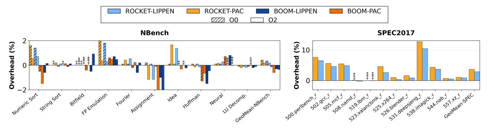
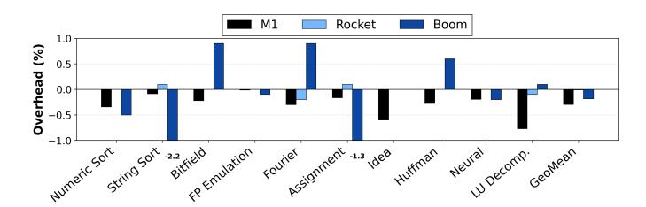

# End-to-end evaluation.

We first evaluate LIPPEN using the nbench suite to characterize overhead on lightweight compute kernels. These benchmarks stress arithmetic and memory subsystems in isolation, enabling controlled measurement of pointer-protection cost without full-application complexity.

We then evaluate LIPPEN on the SPEC CPU2017 rate suite, covering diverse compute- and memory-intensive workloads representative of modern systems. Our study includes C and C++ benchmarks compiled with LLVM-based instrumentation, spanning integer workloads (e.g., perlbench\_r, gcc\_r, xalancbmk\_r) and floating-point workloads (e.g., lbm\_r, namd\_r), thereby capturing varied control-flow and memoryaccess behaviors. Certain SPEC benchmarks are excluded due to interactions with the C++ exception-handling runtime. During stack unwinding, sealed pointers may be dereferenced without prior unsealing, causing incorrect control flow. Supporting this would require modifications to system libraries (e.g., recompiling GCC runtime components to insert unsealing), which is orthogonal to LIPPEN 's architectural design and left to future work.

#### *C. Performance Results*

#### Micro-benchmark results.

*(a) Return address protection.* The left side of Figure 4 reports the overhead of return-address protection. Overall, LIPPEN on BOOM is comparable to Apple's M1 in most cases, and LIPPEN has a slightly smaller overhead than PAC on the FPGA platforms. The dominant factor influencing performance is return prediction rather than the protection primitive itself. For example, in the looped nested-function call benchmark, both BOOM and Apple M1 show negligible overhead or even small performance improvements. Disabling the RAS on BOOM significantly increases overhead. For looped single function calls, the overhead varies across architectures and function body sizes. The extremely small function body (looped function-S) increases misprediction frequency on BOOM, leading to substantially higher overhead compared to looped function-L, while M1 has the opposite behavior. For deep recursive returns, where the BOOM RAS capacity is exceeded, disabling both the RAS and BTB on BOOM can reduce overhead, as repeated mispredictions and recovery penalties otherwise amplify authentication latency. Meanwhile, Apple M1 shows negligible overhead because M1's predictor can still make correct return predictions. Deep recursion entry operations, however, show relatively low sensitivity to prediction structures, since signing occurs prior to controlflow resolution and Rocket, BOOM, and M1 show similar overheads. When prediction mechanisms are effective, BOOM achieves overhead comparable to commercial M1 implementations while preserving the protection guarantees of LIPPEN.

*(b) Data pointer protection.* The right side of Figure 4 reports the overhead of data-pointer protection due to authentication. The overhead of LIPPEN in BOOM is comparable to that of Apple's M1. On FPGA, LIPPEN consistently tracks QARMA-based PAC implementations. Interestingly, introducing an additional load for the modifier does not significantly affect performance across architectures. Although a non-zero modifier requires additional load to fetch its value, this load is typically independent of the critical load-use chain and can overlap with other in-flight operations and in our benchmark the load of modifier will always hit in L1. Finally, we attribute the difference between looped and unrolled 32× configurations to the differences in how the pipelines handle loops, e.g., branch prediction. The unrolled 32× amortized the effect of loops. These results demonstrate that full pointer encryption is not more expensive than pointer authentication in commercial processors while providing a much stronger security level.

#### End-to-end evaluation results.

Figure 5 reports the runtime overhead of LIPPEN relative to PAC across nbench and SPEC2017, normalized to the uninstrumented baseline. On nbench, both LIPPEN and PAC incur only 0.2% additional dynamic instructions and a 0.2% geometric mean overhead on Rocket under O2 optimization, while BOOM overhead is effectively 0%. Under O0, overheads remain comparably low, with geometric means of 0.35% and 0.42% for LIPPEN and PAC on Rocket, and near-zero on BOOM. These results are consistent with prior reports for return-address protection on nbench (e.g., 0.5% in PARTS [62] and 0.11% in Rettag [91]), confirming negligible cost when call density is low. Across SPEC on Rocket, return-address protection increases dynamic instructions by 1% on average, yielding geometric mean overheads of 2.9% for LIPPEN and 3.6% for PAC. Control-flow-intensive workloads (e.g., perlbench\_r, leela\_r, deepsjeng\_r) exhibit higher overheads (6–12%), whereas compute- and memory-bound applications (e.g., namd\_r, lbm\_r, nab\_r) remain near baseline. Overall, LIPPEN matches, and occasionally slightly outperforms PAC while providing stronger integrity and confidentiality guarantees. Overheads remain modest and are driven primarily by control-flow intensity rather than by full-pointer encryption.

#### *D. Compatibility with Prior Work*

PacTight [49] enforces pointer integrity using strong, unique modifiers to protect sensitive pointers and provide spatial and temporal memory safety. It instruments programs via an LLVM IR pass that inserts PAC signing and authentication instructions. To evaluate compatibility, we integrated LIPPEN

TABLE VI: FPGA area and power comparison on Rocket.

| Config                                              | Chip |    | Core                                    | ROCC |        | Max Freq. Power |       |       |
|-----------------------------------------------------|------|----|-----------------------------------------|------|--------|-----------------|-------|-------|
|                                                     | LUT  | FF | LUT                                     | FF   | LUT FF |                 | (MHz) | (W)   |
| Rocket-base                                         |      |    | 56,311 41,856 28,942 14,570             |      | —      | —               | 150   | 3.935 |
| Rocket-RoCC                                         |      |    | 56,498 41,911 29,120 14,607             |      | 47     | 3               | 110   | 3.934 |
| Rocket-LIPPEN 58,137 42,100 30,837 14,793 1,034 131 |      |    |                                         |      |        |                 | 99    | 4.035 |
| Rocket-PAC                                          |      |    | 58,519 42,110 31,212 14,791 2,071 132   |      |        |                 | 89    | 4.031 |
| BOOM-base                                           |      |    | 241,340 97,455 227,187 91,609           |      | —      | —               | 93    | 5.389 |
| BOOM-RoCC                                           |      |    | 248,914 98,245 234,783 92,392           |      | 48     | 3               | 86.5  | 5.532 |
| BOOM-LIPPEN 248,416 98,674 234,289 92,819 862 193   |      |    |                                         |      |        |                 | 90.6  | 5.625 |
| BOOM-PAC                                            |      |    | 251,299 97,919 236,953 92,074 2,054 131 |      |        |                 | 73.5  | 5.606 |

into PacTight's compilation flow by replacing the original Arm pacia and authia instructions with our RISC-V seal and unseal instructions. This required only minor modifications to the IR pass (fewer than 50 lines of code), indicating minimal integration effort and no structural changes to the underlying protection model. While small ISA-specific differences exist in the IR representation between Arm and RISC-V, the resulting binaries are instrumented equivalently to the original PacTight design (Complete similarity in the PacTight's provided example code and nbench). As presented in Figure 6, compiling and running nbench with the adapted PacTight infrastructure on Apple M1, Rocket, and BOOM results in negligible performance overhead, typically under 1%. Notably, the Apple M1 and BOOM consistently exhibit slight performance improvements (negative overhead). These results demonstrate that LIPPEN composes cleanly with prior PAC-based defenses while preserving their low cost profile across different microarchitectures.

As presented in Figure 6, running nbench with the adapted PacTight infrastructure on Apple M1, Rocket, and BOOM incurs negligible overhead under -O0, demonstrating that LIPPEN composes cleanly with prior PAC-based defenses while preserving their expected behavior and cost profile. Under -O2, M1 overhead remains near-zero, while Rocket and BOOM increase to 7.50% and 2.88%, respectively. We attribute this to the compiler treating LIPPEN instructions as opaque barriers, preventing code motion and scheduling optimizations around them.

#### *E. Hardware Cost and Power Results*

Table VI summarizes FPGA resource utilization, maximum frequency, and power (measured at 100,MHz) across all configurations on both cores, where Rocket-RoCC and BOOM-RoCC instantiate the ROCC interface without any cipher, Rocket-LIPPEN and BOOM-LIPPEN add the PRINCEv2-based encryption accelerator, and Rocket-PAC and BOOM-PAC add the QARMA-based authentication accelerator. For both cores, the QARMA configuration incurs slightly more logic than PRINCEv2 due to its more complex cipher datapath. The RoCC-only variants reveal that the ROCC interface itself accounts for the majority of the frequency reduction, with the cipher contributing only marginally on top for Rocket; on BOOM, however, the cipher datapath plays a more significant

Fig. 5: Overhead across NBench (left) and SPEC CPU2017 (right). Purple bars indicate dynamic instruction count increase, while other bars show runtime overhead, all normalized to the corresponding unprotected baseline on the same processor.

Fig. 6: Performance comparison of PacTight on different cores

role in degrading the maximum frequency. Power overhead remains marginal across all configurations on both cores. Overall, LIPPEN achieves full-pointer encryption at hardware and power costs commensurate with cipher complexity, confirming its practicality for integration into modern processor pipelines.

#### VII. DISCUSSION

#### *A. Secure Key Management*

Secure key management is essential to prevent key exposure and cross-domain forgery. While Arm Pointer Authentication (PA) provides hardware key registers [9], sharing keys across exception levels can enable cross-domain attacks [27]. Recent designs, such as Apple's M-series processors, address this via per-VM, per-EL, and per-boot key isolation using hardwarebacked diversification and internal key derivation [27]. LIPPEN can use the same mechanisms. Because sealing and unsealing are keyed primitives analogous to PAC instructions, domainspecific keys and hierarchical derivation apply directly. Thus, PAC-style key isolation extends to LIPPEN without architectural changes, keeping key management orthogonal to the encryption mechanism while leveraging existing secure hardware deployments.

## *B. Pointer Arithmetic*

A potential concern when protecting pointers is the cost of pointer arithmetic. In C and C++, pointers can be incremented or adjusted (e.g., during array traversal), and pointer authentication and encryption will complicate the arithmetic by requiring an authentication/decryption before the pointer arithmetic. However, pointer arithmetic without a subsequent memory access is rare in practice. Most arithmetic operations on pointers are immediately followed by pointer dereference, and one can optimize the order of decryption and arithmetic (in the compiler). Implementations of prior PAC-based systems that protect all pointers, such as RSTI [48] and AOS [53], show that pointer arithmetic is not the main bottleneck, and the main bottleneck is still the authentication (decryption) itself.

#### VIII. RELATED WORK

We have so far discussed mitigation techniques that ensure pointer integrity, focusing primarily on approaches with zero memory footprint and straightforward deployability on existing hardware. In this section, we broaden the discussion to include other methods that aim to provide general memory safety.

