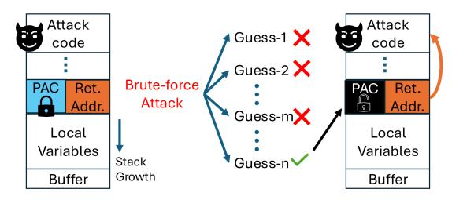

# LIPPEN: A Lightweight In-Place Pointer Encryption Architecture for Pointer Integrity

*Virginia Tech Virginia Tech Virginia Tech Virginia Tech*

Erfan Iravani Lalit Prasad Peri Mohannad Ismail Charitha Tumkur Siddalingaradhya

erfani@vt.edu lalitprasad@vt.edu imohannad@vt.edu charitha24@vt.edu

Changwoo Min Elif Bilge Kavun Wenjie Xiong *Igalia Barkhausen Institut & TU Dresden Virginia Tech*

changwoo@igalia.com elif.kavun@barkhauseninstitut.org wenjiex@vt.edu

*Abstract*—Memory-safety violations in C and C++ programs continue to enable sophisticated exploitation techniques such as control-flow hijacking and data-oriented attacks. Existing hardware defenses either rely on address space layout randomization (ASLR) or attach explicit metadata to pointers to verify their integrity. External metadata schemes provide strong guarantees, but incur additional memory accesses and memory footprint overhead. In-place authentication mechanisms, such as ARM Pointer Authentication (PAC), achieve low overhead at the cost of limited entropy and susceptibility to brute-force and reuse attacks. This paper presents LIPPEN, a hardware–software codesign for *full-pointer encryption* that provides strong pointer integrity and confidentiality with zero metadata overhead. LIP-PEN treats every pointer as an encrypted block, cryptographically binding it to its execution context and decrypting it transparently at dereference time. By re-purposing the entire 64-bit pointer field for encryption rather than preserving raw address bits, LIPPEN maximizes entropy, eliminates the brute-force weaknesses of truncated authentication codes, and maintains binary compatibility with existing PAC-enabled software. We prototype LIPPEN on FPGA using 64-bit RISC-V Rocket and BOOM cores, and evaluate it with microbenchmarks, nbench, and SPEC CPU2017. We compare against both an in-house RISC-V PAC implementation and Apple's PAC on the M1 processor. Across these workloads, LIPPEN provides comprehensive pointer protection with runtime overhead comparable to PAC-based schemes, while incurring negligible area and power overhead. These results show that LIPPEN is a practical design point for deploying strong pointer protection in real processors.

#### I. INTRODUCTION

Modern software systems remain vulnerable to increasingly sophisticated memory corruption exploits. Among the most prevalent and powerful are *control-flow hijacking* and *data-oriented* attacks, which continue to endanger critical infrastructure—from kernels and hypervisors to browsers and database engines. Control-flow hijacking exploits corrupted code pointers such as return addresses, function pointers, or virtual table entries to redirect execution toward attackercontrolled instructions or gadgets. In contrast, data-oriented attacks manipulate data pointers and non-control data to steer legitimate computations toward malicious outcomes without violating the program's control-flow graph. Together, these attack classes enable arbitrary code execution, privilege escalation, and logic subversion even in hardened environments.

Recent research has explored a wide range of defenses against the pointer forgery attacks. Broadly, these efforts fall into two categories: *address layout randomization* and *metadata augmentation for integrity*. Address layout randomization schemes, such as ASLR [83], introduce spatial and temporal unpredictability to memory layouts and thus pointers will be shuffled with memory layout randomization. While effective at increasing attack complexity, these defenses rely on a single random offset for each domain's address space, providing only limited entropy; once the layout is disclosed, the protection collapses.

Alternatively, metadata can serve either as a cryptographic Message Authentication Code (MAC) checked on pointer use [62], [67], or as a capability/permission that prevents unauthorized pointer modification [58], [92], [94]. Most defenses [67], [92], [94] store this metadata in auxiliary structures, providing strong protection but incurring substantial memory overhead or added hardware/ISA management complexity. In contrast, in-place mechanisms [58], [62] reuse the 64-bit word containing the pointer itself, eliminating metadata memory overhead. A prominent realization of in-place pointer integrity protection is the *Pointer Authentication Code* (PAC) mechanism introduced in ARMv8.3-A and later architectures [75]. PAC leverages the unused high-order bits of 64-bit virtual addresses (7-16 bits [57]) to store a MAC alongside the pointer, incurring no additional memory overhead [62]. It uses a lightweight block cipher to generate a short MAC over a pointer, combining a secret key with a contextual modifier. On dereference, hardware verifies the MAC before use, preventing straightforward pointer corruption and cross-context pointer reuse. PAC has been extensively leveraged in the research community to enforce control-flow integrity, type safety, and memory safety [40], [49], [53], [59], [62], serving as the foundation for numerous hardware-assisted pointer-protection schemes. In practice, PAC is widely deployed across Armbased systems to protect return addresses, function pointers, and virtual tables. It secures kernel and user-space control flow on platforms such as Apple *arm64e*, Android, and Windows on Arm [5], [7], [64], [68], [89]. These uses make PAC the most prevalent hardware mechanism for enforcing pointer integrity in both commodity and experimental systems.

```
int VulnFunction(char *p)
{
    char buf[40];
    strcpy(buf, p);
    return 0;
}
```

(a) Vulnerable function (b) Unprotected stack

Fig. 1: Memory safety exploitation.

However, because the authentication code must fit within these unused bits, the effective entropy is small (usually < 24 bits), making brute-force guessing of valid codes feasible for attackers. Other in-place schemes [11], [58] are also susceptible to brute-force due to low entropy [52], [70]. A pointer has 64 bits, and thus, in theory, a protection scheme can raise the brute-force space to 2 <sup>64</sup> without additional memory. In the meantime, the information of the pointer value should still be stored in the 64 bits. In PAC, pointer values are directly kept in the 64 bits, limiting the brute-force space. On the other hand, PAC-protected pointer values are not valid for ordinary use until authentication strips the PAC; arithmetic on the raw pointer value will corrupt the authentication state and cause subsequent checks to fail.

We propose LIPPEN, an architecture that uses a lightweight block cipher in the Electronic Code Book (ECB) mode to *fully* encrypt the 64-bit pointers for integrity protection. By replacing each 64-bit pointer with its encrypted representation, the architecture can still retrieve the original value when a pointer is dereferenced. Fully encrypting the pointer removes the entropy limitation of PAC and prevents attackers from forging valid pointer values through brute-force attacks. Still, LIPPEN's encryption primitive and ISA design provide a similar programming interface to Arm PAC, supporting all protection policies built upon PAC.

In general, encryption alone does not guarantee integrity. Prior work [33], [65] proposed CTR-mode encryption for pointer protection, but CTR remains vulnerable to targeted bitflip attacks. C3 [58] uses partial pointer encryption to detect corrupted pointers, but provides limited security, targeting a 1/16 bypass probability under its threat model. To the best of our knowledge, we are the first to evaluate the security and performance of fully encrypting the 64-bit pointer for integrity.

Although encryption and decryption introduce latency overhead, lightweight block ciphers such as PRINCEv2 make full pointer encryption practical with a smaller performance overhead than Arm PAC. Compared to MAC-based authentication like PAC, full-pointer encryption delivers much stronger integrity guarantees in both conventional and transient execution, closing the brute-force gap inherent in in-place authentication codes while preserving PAC's compatibility advantages. We make the following contributions:

• Design of LIPPEN. We propose LIPPEN, a cryptography-

based pointer encryption architecture that provides bruteforce-resilient protection with lower latency overhead than existing pointer authentication mechanisms. LIPPEN introduces a compatible ISA that leverages existing PAC compiler infrastructure across protection policies.

- Co-design system and cipher, Security analysis. By considering how contextual modifiers are used in practice, we co-design the system and the cipher to avoid using a more expensive tweakable cipher while still providing enough modifier bits. We formally show that if an attacker were able to forge a valid encrypted pointer, one could construct a proxy adversary capable of launching a chosen-ciphertext attack on the underlying block cipher.
- Implementation and evaluation. We implement LIPPEN and a baseline PAC design on RISC-V Rocket and BOOM cores on an FPGA prototype, and additionally examine Apple M1 as a real-world PAC deployment. We evaluate using targeted microbenchmarks, nbench, and SPEC CPU2017, analyzing data-pointer and returnaddress protection, speculation effects, and compatibility with prior PAC-based compiler passes. Results show that LIPPEN achieves performance comparable to or better than PAC while providing substantially stronger security guarantees. Our implementation and compiler are opensourced at https://github.com/bearhw/LIPPEN.

#### II. BACKGROUND

#### *A. Control Flow Hijacking and Data-Oriented Attacks*

C and C++ underpin kernels, hypervisors, browsers, and high-performance libraries since they offer tight control over layout and performance. The same low-level control, however, exposes programs to *memory safety* violations: *spatial* errors (out-of-bounds reads/writes, type confusion) and *temporal* errors (use-after-free, double free, dangling pointers). These defects arise from unchecked pointer arithmetic, manual lifetime management, and implicit casts, and they commonly yield *arbitrary read/write* primitives after exploitation [31], [74].

Once an attacker can corrupt memory, the next step is often *control-flow hijacking*—diverting the program's execution to attacker-chosen code or gadgets. Classic stack-based overflows overwrite return addresses or saved frame pointers (*stack smashing*) [20], as shown in Figure 1, while heap-based corruptions target function pointers, C++ vtable pointers, longjmp buffers, PLT entries, or indirect branch targets [50]. Modern exploits prefer code reuse, chaining short instruction sequences to build *Return/Jump/Call*-oriented programming payloads [21], [80], [82]. Memory-safety bugs thus routinely evolve into pointer-forgery primitives that enable both classic and modern exploitation techniques.

Return-Oriented Programming (ROP) [30], [82] exemplifies how overwriting code pointers or return addresses yields full control of execution without code injection. To counter ROP, Control-Flow Integrity (CFI) [2] was proposed to ensure that execution follows only legitimate paths derived from the program's control-flow graph, preventing hijacking through corrupted control data such as return addresses or function point-



Fig. 2: PAC defense and brute-force attack on PAC

ers. However, numerous bypasses have been demonstrated. Counterfeit Object-Oriented Programming (COOP) [80] and other CFI-bypass attacks [34] show how virtual-table and object-pointer corruption can subvert C++ dispatch even when coarse-grained CFI is present, using techniques such as control-flow bending [29]. More advanced attacks, including Control Jujutsu [39], NEWTON [90], and AOCR [77], exploit dynamic analysis to bypass even fine-grained CFI protections.

Even when direct control flow is guarded, attackers can compromise program behavior through *data-oriented* and *data-flow* attacks [32], [46]. Data-Oriented Programming (DOP) [46] shows that corrupting data pointers or non-control data can achieve powerful, semantics-preserving computation without altering branch targets. These works show that protecting only control-flow or data values in isolation is insufficient. To substantially raise the bar against modern exploitation, defenders must ensure the integrity of both *code pointers* and *data pointers*, providing comprehensive protection against control-flow hijacking, data-oriented manipulation, and emerging attacks on pointer-authentication schemes.

Recent advances in memory-safe languages such as *Rust* significantly reduce vulnerabilities by enforcing strong ownership and lifetime semantics at compile time. However, Rust cannot eliminate all memory-safety risks: interoperability with legacy C/C++ code, the use of unsafe blocks, and lowlevel system interfaces can still reintroduce pointer corruption. Moreover, large existing software ecosystems written in C and C++ cannot be easily rewritten in Rust. Consequently, complementary hardware mechanisms that ensure pointer integrity remain essential to securing modern systems end-to-end.

