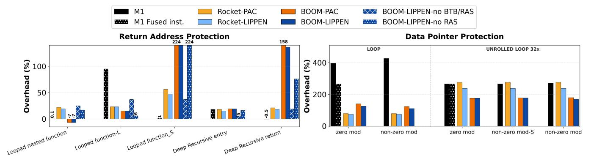

# V. IMPLEMENTATION

*a) Hardware:* We prototype LIPPEN on a 64-bit RISC-V platform implemented on an AMD/Xilinx VCU118 (Virtex UltraScale+) FPGA booting a FireMarshal-managed Linux image [72]. The system is built using Chipyard [4] v1.8 and synthesized with Xilinx Vivado 2021.2. Our design extends both the in-order Rocket and out-of-order BOOM cores [14] with a custom cryptographic accelerator for PRINCEv2 connected via the Rocket Custom Coprocessor (RoCC) interface. The accelerator operates on 64-bit pointers and communicates with the core through tightly coupled request and response queues. We also implement QARMA in RoCC on the FPGA platform to use as an authentication-based PAC baseline. We configure LIPPEN with M1 = 16 bits and M2 = 0, as 16 bits suffice to uniquely distinguish all pointer contexts. Our Rocket and Large Boom cores are configured with default settings.

*b) Compiler Support:* For return address protection, we use the stack pointer as the modifier input, which is similar to RETAA for PAC, and our compiler support is implemented in LLVM [56] v18.1 by extending the RISC-V backend to instrument call and return sites with LIPPEN sealing and unsealing instructions.

To demonstrate compatibility, we leverage PacTight [49] and its LLVM-based compiler framework, making minor modifications to its IR pass to target the RISC-V architecture.

#### VI. EVALUATION

## *A. Evaluation Method*

Evaluation Setup. We evaluate on both Rocket (in-order) and BOOM (out-of-order) cores on our FPGA platform running at 100,MHz. LIPPEN provides pointer protection via PRINCEv2-based encryption, while our PAC implementation does authentication using our QARMA implementation; we additionally compare against Apple's PAC on the commercial M1 processor.

Performance Overhead. We evaluate runtime overhead and the number of instructions retired relative to uninstrumented baselines across our benchmark suites. These metrics capture the execution cost introduced by the added instructions (e.g., fetching, decoding in the pipeline) and pointer sealing and unsealing operations in LIPPEN, reflecting both time and instruction-level overheads. Each experiment is repeated at least twice to ensure it is not affected by significant noise.

Compatibility. To demonstrate compatibility with prior PAC-based protection in the compiler, we adopt PacTight [49] from Arm PAC to LIPPEN in RISC-V, to evaluate the migration complexity.

Hardware Cost. We report FPGA resource utilization (LUTs and flip-flops) for our Rocket and BOOM core with and without the encryption accelerator. This metric evaluates the hardware footprint of the pointer encryption logic.

Power Consumption. Power estimates are obtained from post-synthesis analysis on the VCU118 board. This metric complements area evaluation and quantifies the energy efficiency of the encryption accelerator.

#### *B. Benchmarks*

Fig. 4: Microbenchmark results for return-address (left) and data-pointer (right) protection. Runtime slowdowns are normalized to the unprotected baseline on the same processor and configuration.

Micro-benchmarks. We design a set of targeted microbenchmarks to isolate the runtime overheads of data pointer and return address protection.

*Return address protection.* To isolate signing and authentication costs under different call-stack behaviors, we design four microbenchmarks: (1) Looped nested function calls: a loop of nested function calls with a depth of 8 to represent common user programs with nested function calls. (2) Looped function calls: a function repeatedly invoked in a tight loop. We implement two variants: function\_S, containing a single xor, and function\_L, containing three xors and one memory access. Timing measurements include both signing and authentication, capturing the combined per-call overhead. (3) Deep Recursive entry-only: a very deep recursive function (depth=4096) that measures only function entry (and signing). (4) Deep Recursive return-only: a very deep recursive function (depth=4096) that measures only function return (and authentication). All benchmarks are automatically instrumented: on RISC-V using our LLVM-based compiler pass, and on Arm using the arm64e compilation flag. Together, these microbenchmarks measure the performance of function entry and return in different return address prediction scenarios, enabling precise characterization of LIPPEN 's protection overhead.

*Data pointer protection.* We implement a pointer-chasing benchmark that forms a strictly serialized load chain, ensuring authentication lies on the critical path. Two variants are evaluated: (1) *Loop*, with a single dependent load per iteration, and (2) *Unrolled*, with 32 dependent loads per iteration to amortize the impact of loop instructions. For each, we test authentication with (a) zero modifier, (b) a shared non-zero modifier for all accesses per iteration, and (c) a non-zero modifier loaded per access. We manually insert load and authentication instructions at the assembly level to ensure precise control over the execution sequence. We additionally evaluate Apple M1's fused load-and-authenticate instruction. These configurations isolate intrinsic authentication latency, modifier-fetch overhead, and fusion benefits.

