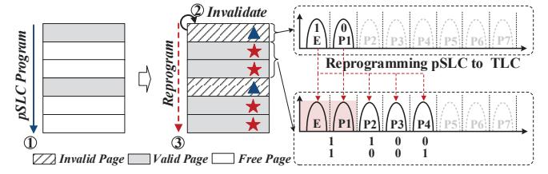
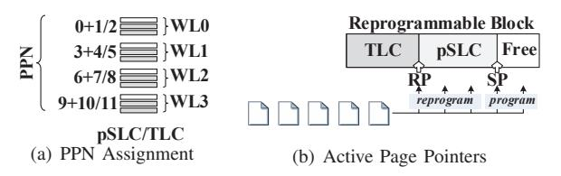

# A. GC-Oriented Optimization

Prior works leverage the performance benefits of SLC programming to accelerate valid page movement during GC, thereby reducing GC's time cost [38], [54]. This approach, termed SLC-Program GC (SP-GC), comes at a cost: blocks programmed in SLC mode retain only one-third of their original TLC capacity, resulting in significant capacity loss. Since the remaining two-thirds of the block's capacity becomes unusable, additional compensatory GCs are required to reclaim the wasted space, introducing further time overhead. In our preliminary study (corresponding figures are omitted due to the page limit), SP-GC reduces total GC time by 21% compared to the baseline due to the accelerated valid page movement per GC. However, this comes at a cost: the number of GC operations and valid page movements increase by 1.25 times and 1.48 times, respectively. This inefficiency in GC optimization occurs because compensatory GCs must migrate additional valid pages back to TLC blocks. Experiment details are provided in Section VI. To address this issue, we propose pSLC-Program GC (pSP-GC). Unlike SP-GC, pSP-GC leverages LOONG to preserve the performance benefits of pSLC programming without sacrificing block capacity and triggering additional compensatory GCs.

In detail, we use the pSLC program operation in LOONG to speed up valid page movement, and then use long-stride reprogram operation to restore capacity by converting SLC mode back to TLC mode. Figure 9 illustrates an example of the entire process. Initially, a block is chosen for GC, and its valid pages are sequentially read out and written to a free block using pSLC program operations, as depicted by step ① and step ②. Once the valid page movement is completed, the victim block is erased, as indicated by step ③. Finally, the cells programmed in pSLC mode are reprogrammed with another two pages from the host or background-GC (bg-GC), thereby restoring the lost capacity, delineated as step ④.

The design of pSP-GC is straightforward, yet a challenge remains: capacity loss can occur if pSP-GC is frequently triggered without timely reprogramming pSLC pages. To address this issue, we introduce constraints in both the temporal and spatial domains for triggering pSP-GC. Within the temporal domain, pSP-GC operates exclusively during foreground GC to minimize its time cost and thereby reduce blocking of host

Fig. 9. GC-Oriented Optimization with LOONG.

Fig. 10. Program-Oriented Optimization with LOONG.

I/Os. Spatially, each pSP-GC instance is constrained to using only one block for storing valid pages in pSLC mode. This design choice stems from experimental findings indicating that over 71.5% of blocks contain fewer than one-third valid pages. That is, in most cases, a single block is enough to hold all valid pages from reclaimed block. For blocks holding a substantial number of valid pages, reprogram operations occur only after all WLs within the block have been programmed via pSLC writes. Crucially, this process introduces no significant additional overhead for valid page movement compared to the baseline. This is because, as evaluated in Section IV, the latency of LOONG (pSLC programming + pSLC read + reprogramming) is comparable to that of a standard OSP. Furthermore, since the data stored in pSLC pages originates from reclaimed blocks and is typically cold, we utilize cold data, either from bg-GCs or directly provided by the host, for the reprogramming step. This ensures all pages within the reprogrammed block exhibit similar hotness characteristics.

#### B. Program-Oriented Optimization

With the aid of LOONG, the separation distance between two programming steps can be extended to the entire block. When executing the second reprogram operation, there may exist more pages that have been invalidated. Therefore, for the invalid page, its coupled two pages sharing the same WL can be reprogrammed with fewer voltage states.

Figure 10 illustrates an example of this process. Initially, a block is programmed sequentially using the pSLC program operations, as shown in step ①. During this phase, some pages may be invalidated by update operations, indicated in step ②. For WLs containing invalid pages (identified by modified FTL, discussed in Section V-C), the reprogram operation uses only the first five voltage states to represent the two additional pages, with the first two states encoded as "11", as shown in step ③. In this scenario, the reprogram operation shifts the voltage state from E to at most P4, effectively reducing the reprogram latency to approximately 4/7 of the one-shot programming operation (around 710 µs based on the evaluation). To realize this, we have to configure two types of reprogramming mechanisms, where the first type only

Fig. 11. FTL Modification.

reprograms the first two states to the first five states while the second type reprograms the first two states to the all states.

To differentiate the voltage distributions after two types of reprogramming mechanisms, an additional 1-bit is added to the FTL to indicate whether the WL is encoded with a reduced number of states. Before reading, this bit is checked. If the bit is set, it indicates that the data is encoded with fewer states, and the MLC read is applied. Otherwise, the TLC read is used to retrieve data. As specified in Section VI, this approach incurs a space overhead of approximately 1.35 MB.

#### C. FTL Modification

The Flash Translation Layer (FTL) requires additional modification, which can be realized by updating controller firmware. FTL records the mapping between logical page number (LPN) and physical page number (PPN) to facilitate address translation from the host to the SSD. To support the address mapping of LOONG, as shown in Figure 11(a), we assume that a specific block comprises several WLs, identified by a number i. Consequently, physical TLC page addresses are assigned as  $i \times 3$ ,  $i \times 3 + 1$ , and  $i \times 3 + 2$ . During pSLC program operation, unused pages with PPNs  $i \times 3 + 1$  and  $i \times 3 + 2$  are skipped, while only the PPN of the pSLC page, which is  $i \times 3$ , is recorded in the address mapping. These unused PPNs are subsequently utilized when the corresponding pSLC pages are reprogrammed. In addition to address mapping management, the modified FTL incorporates an additional Reprogrammable Block Pointer (RBP) that tracks the current location of the reprogrammable block within each plane. Before initiating a reprogram operation, the modified FTL checks the value of RBP to locate the reprogrammable block. As illustrated in Figure 11(b), within each reprogrammable block, two active page pointers exist: the pSLC Page Pointer (SP) and the Reprogrammable Page Pointer (RP). These pointers identify the active programmable free page location and the active reprogrammable pSLC page location for the block, enabling precise execution of subsequent reprogram operations. Specifically, the reprogram operation begins from the RP location and continues until the SP location. Based on the evaluation settings in Section VI, these two additional data structures, an extra Reprogrammable Block Pointer and two additional Active Page Pointers per Reprogrammable Block, introduce a space overhead of approximately 192 bytes.

When implementing the modified FTL, the GC-oriented optimization operates as follows: Upon triggering pSP-GC, a free block is selected and its address is assigned to the RBP. Valid pages are programmed in either pSLC or TLC mode, depending on the number of valid pages; simultaneously,

the RP and SP are updated to new locations. After pSP-GC completes, host writes or bg-GC resumes programming this block starting from the updated RP. For program-oriented optimization, address mapping follows the modified FTL. Before reprogram operation, the validity table is checked to determine if fewer state shifts are required. Additionally, 1 bit per page records whether the current WL uses reduced voltage-state encoding, as discussed in Section V-B.

#### D. Discussion

Different TLC Encoding Rules: TLC flash uses Gray coding to store data. In a Gray code, neighboring voltage states differ by only one bit. This ensures that if a voltage shift occurs, it only causes a single-bit error, which is easy to fix [43]. Gray codes are usually described by an a-b-cformat, representing how many sensing operations are needed to read the LSB, CSB, and MSB pages. In this paper, we use the common 1-2-4 Gray code. As shown in Figure 2(a), the E state (111) and the P1 state (110) differ only in the third bit. Because of this, LOONG can use that third bit during the first programming step to tell the difference between a "1" and a "0". Other Gray codes, like 2-3-2, follow the same rule: only one bit changes between neighboring states. For example, if the E state is "111" and the P1 state is "011", LOONG simply uses the first bit to represent the data during the first programming step.

**Extend to QLC:** We also implement LOONG on QLC, which involves programming the first two states initially, followed by reprogramming from the E and P1 states to higher states. Note that due to the high density of QLC flash memory, the time gap between two programming steps can be longer than in TLC-based reprogramming. As a result, more data may become invalid during the interval between these steps. Nevertheless, the reprogramming operation can still proceed by reading the invalid data, which persists until the entire block is erased, and then carrying out the subsequent reprogramming. This process aligns with the standard TSP approach in QLC flash memory, where the second programming step must read the data written during the first step, regardless of whether that data remains valid or has since become invalid. Our evaluation results indicate that the pSLC program latency is approximately 86 us, marginally lower than standard SLC programming due to QLC's narrower voltage margin. The reprogramming latency is about 4.8 ms, slightly higher than the total program latency of QLC (4.2 ms). In terms of reliability under 1K P/E cycles and a 1-year retention period, pSLC pages exhibit about 100~200 bit errors per page, which remains within correctable limits. Reprogrammed OLC cells show 1537.2 bit errors per page, a reduction over the 1620.8 errors per page in standard QLC programming, attributable to the mechanisms discussed in Section IV-B2. While these results demonstrate LOONG's potential in QLC, this work primarily uses TLC to maintain a direct comparison with [19], which was also implemented on TLC.

**Potential Scenarios:** GC optimization and programming optimization are a classic and critical target for SSD per-

formance, which is why it serves as a primary case studies in this work. Besides these, LOONG can also be adopted in several potential scenarios. (1) SLC Caching. Traditional SLC caching accelerates write performance but inevitably encounters a write cliff when the cache is exhausted, triggering high-latency data migrations to TLC space. LOONG mitigates this by operating flash in pSLC mode and leveraging its unique ability to reprogram cells once the initial pSLC capacity is full. This strategy maintains high-performance write speeds longer and avoids the immediate performance degradation typically caused by premature data folding and migration. (2) Dynamic Space Configuration. LOONG enables the SSD to dynamically balance the trade-off between performance and capacity based on real-time application requirements. Under bursty workloads, LOONG aggressively allocates more flash blocks to pSLC mode to sustain peak throughput. Conversely, when storage density is prioritized, the system can transition flash cells back to TLC mode after the pSLC stages are programmed. This architectural flexibility allows the SSD to adapt its physical storage characteristics to the specific demands of diverse applications. (3) Multi-stream Priority Isolation. LOONG exploits the performance hierarchy of pSLC, reprogramming, and standard TLC programming to enforce strict isolation among heterogeneous data streams. For performance-critical streams, LOONG prioritizes pSLC programming to ensure minimal latency and high throughput. Conversely, lower-priority streams are serviced via reprogramming or standard TLC operations, effectively sequestering their resource consumption and preventing background traffic from interfering with the service-level objectives (SLOs) of foreground applications.

**Firmware Implementation:** LOONG's implementation mirrors the approach of existing technologies like Samsung Turbo Write. These products support dual programming modes by burning two distinct programming logics into the controller and toggling between them via a mode register. Similarly, our solution is realized through a firmware-level modification that burns LOONG's programming logic into the controller and leverages the same register mechanism to enable its strategy.

Crash Consistency: SSDs ensure data integrity by periodically persisting the mapping table and leveraging Out-of-Band (OOB) metadata for reconstruction. Since mappings are maintained at page granularity, each programming step independently commits the LPN alongside the data to the OOB area [51]. In the event of a crash, LOONG scans physical pages to retrieve these LPNs and rebuild the mapping table. Because each step persistently commits both data and its associated LPN, any page completed before a crash remains fully recoverable. This provides robust crash consistency for LOONG without requiring additional hardware overhead.

