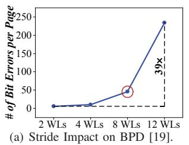
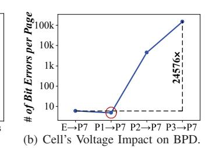

# III. DESIGN

In this work, we aim to develop a novel programming mechanism, LOONG, that pushes this stride to the block scale. LOONG builds upon the standard OSP and is integrated into the SSD as an optional programming policy. Under normal conditions, the SSD uses a standard OSP, while LOONG is employed in specific optimization scenarios.

Key Challenges of LOONG involve two aspects: The first is mitigating the reliability issue, which is primarily caused by BPD, while maintaining its performance advantage. The second is avoiding hardware modification while both standard OSP and LOONG are supported concurrently. Standard SSDs typically avoid implementing dual programming mechanisms, as switching between them while dynamically adjusting ΔVpp introduces significant complexity to the program engine. Therefore, we should ensure implementing LOONG within the existing program engine, requiring no hardware alterations.

Solution 1: To address the first challenge, we first quantitatively analyze the impact of two key BPD factors, the stride length and the programmed cell's voltage, by systematically varying both factors and measuring the resulting bit errors per page. We conduct two evaluations. First, for the stride length, we configure each reprogram operation to transition cell voltages from state P3 to P7, consistent with prior work [19], while varying the stride length from 2 to 12 WLs. Second, to evaluate the impact of the programmed cell's voltage level, we fix the stride length to encompass all WLs within a block, where cells are initially programmed to intermediate state (E, P1, P2 and P3), and subsequently transitioned to P7 during the reprogramming step. The results are shown in Figure 4(a) and Figure 4(b), respectively.

Fig. 4. The Impact Factors of BPD.

The results in Figure 4(a) demonstrate that increasing the stride length to 12 WLs causes a dramatic 39-fold increase in bit errors compared to the standard TSP (2 WL stride). This exponential growth highlights stride length's significant impact on BPD. Since bit errors were measured immediately after the first programming step (isolating other error sources impact), the prior work cautiously selected an 8-WL stride as optimal (indicated by the red circle in this figure). In contrast, Figure 4(b) shows that the programmed cell voltage poses a more severe reliability challenge than stride length, further confirming that the channel pinch-off effect contributes to a significantly higher resistance increase than the stride-induced series resistance effect. The channel pinch-off effect exhibits a threshold behavior, where its impact abruptly intensifies once a critical point is reached. Specifically, reprogramming cells from state P1 to P7 maintains error rates close to baseline levels, comparable to reprogramming from state E to P7. However, when reprogramming starts from state P2 or beyond, it triggers a sharp, nonlinear surge in errors (e.g., a 24,576fold error surge over the baseline when reprogramming from state P3 to P7). Therefore, to mitigate reliability impacts when extending stride length across all WLs within a block, the initial programmed state should be restricted to P1. Motivated by this, LOONG limits cells' voltage to the first two states in the first programming step, enabling stride extension across all WLs within the block. Additionally, by leveraging lower programmed states, the required ISPP cycles are reduced, thereby decreasing the latency of the first step.

Solution 2: To address the second challenge, LOONG employs a coding-based method without introducing hardware modifications. As shown in Figure 5, LOONG (1) sequentially programs all WLs at reduced voltage (i.e., pseudo-SLC (pSLC) mode, storing 1 bit per cell by utilizing only the first two states), followed by (2) performs long-stride reprogramming that encodes transitions from state E to the first four states or from P1 to the last four states. This coding-based method is implemented using standard OSP. First, LOONG pads the user page with two dummy pages to form a three-page group, encoding cells into the first two voltage states and performing a single OSP as the first programming step. Next, the stored page is retrieved and combined with two new user pages to form another three-page group. A reprogramming step is then performed via a single OSP as the second step of LOONG.

**LOONG's contributions**: First, we provide a new physical insight into 3D flash memory reliability by identifying programmed cell voltage as the primary determinant. While prior work [16] attributed reprogramming failures to spatial

Fig. 5. Coding Based LOONG.

TABLE I
THE LATENCY OF DIFFERENT PROGRAM TYPES.

|              | pSLC Program | SLC Program | Reprogram | One-shot Programming |
|--------------|--------------|-------------|-----------|----------------------|
| Latency (µs) | 114          | 96          | 955       | 1100                 |

constraints (i.e., narrow WL strides), our deep characterization reveals that the reliability bottleneck is fundamentally voltage-driven. We demonstrate that maintaining cells in a low-voltage state effectively mitigates the Channel Pinch-off Effect, thereby minimizing the BPD effect. This discovery redefines the physical reliability model of 3D NAND and provides the theoretical foundation for breaking the rigid sequential programming constraints.

Second, we propose LOONG, a novel programming architecture that achieves full-block reprogramming through spatio-temporal decoupling. Leveraging our physical insights, LOONG separates the high-speed pSLC programming from the high-density TLC programming across an entire block. Unlike traditional coupled programming that requires localized completion of all programming steps, LOONG allows the SSD to defer high-latency TLC programming penalties across a much larger temporal and spatial window. This architectural decoupling enables a reconfigurable programming that can be deployed via firmware without hardware modifications.

Third, our work establishes a generalized quantitative framework for identifying voltage range for the first programming step across different flash memory (e.g., QLC). This serves as a blueprint for future workload-aware SSD architectures, allowing for a fine-grained, runtime trade-off between reliability, capacity, and system performance.

