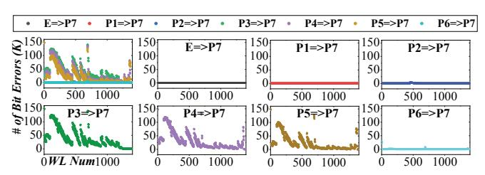

# IV. REAL DEVICE VERIFICATION

We independently verify the capabilities required for pSLC programming and long-stride reprogramming.

#### A. pSLC Programming Characteristics

We utilize an FPGA-based testbed and employ multiple 3D TLC NAND flash chips, each containing 232 layers per block and 16 KB per page. For the pSLC programming, it begins with an OSP that writes data to the first page while padding the next two pages with '1's as temporary dummies. Then, data written after pSLC programming is read back and compared to the original page to quantify bit errors. We conduct each evaluation multiple times and average the results.

1) Reliability of pSLC Programming: We measure bit error number under varying retention times and P/E cycles, two primary error sources in flash memory [2]–[5]. The retention time for pSLC data is set by baking the chip at 120°C for three hours, a process equivalent to extending the retention time

TABLE II THE AVERAGE AND MAXIMUM NUMBERS OF BIT ERRORS PER PAGE.

|     | E→P7  | P1→P7 | P2→P7  | P3→P7    | P4→P7    | P5→P7    | P6→P7  |
|-----|-------|-------|--------|----------|----------|----------|--------|
| Ave | 0.068 | 0.083 | 155.75 | 36929.98 | 30154.68 | 22518.19 | 231.84 |
| Max | 6     | 5     | 4570   | 147456   | 147455   | 147412   | 27943  |

to one year under normal conditions, according to Arrhenius Law [1]. For P/E cycles, we adopt 1K cycles, consistent with the most-related work [19]. The results show that the number of bit errors is within the range of several dozen per page, which remains well within the correction capability of the ECC (1280-bit/page). Our pSLC programming minimizes the error increase by using a OSP. In this process, only the first page is filled with user data, and the rest are populated with dummy '1's, which prevents the open block issue.

2) Latency of pSLC Programming: We use the same testbed to evaluate the pSLC program latency, with the results presented in Table I. For comparison, the standard SLC program operation is enabled by the SLC Enable Command [38], [54], which uses TLC as SLC by charging electrons with a larger  $\Delta V_{pp}$ . The results show that pSLC and standard SLC program operations have comparable latencies, averaging approximately 114  $\mu$ s and 96  $\mu$ s, respectively. This is because the program latency is determined by both  $\Delta V_{pp}$  and the number of ISPP cycles. Flash cells in standard SLC mode utilize a large  $\Delta V_{pp}$  in each ISPP cycle to speed up the program operation. Conversely, flash cells in pSLC mode can achieve a fast pSLC program operation with fewer ISPP cycles while only the first two states are programmed.

Takeaway #1: Data programmed using the pSLC program operation can achieve SLC-like program latency without compromising data reliability.

### B. Long-Stride Reprogramming Characteristics

We require reprogram operations to be executed sequentially with a block-scale stride. To ensure our evaluation accounts for the worst-case scenario, we adopt a two-fold methodology. First, to maximize the BPD effect, we utilize a block-scale stride where reprogramming begins from the first WL only after the entire block has completed pSLC programming. Second, we conduct extensive empirical testing across multiple flash chips, randomly selecting three blocks per chip and repeating each test three times. Consequently, the results in Table II represent the maximum bit error number derived from the evaluations. While we cannot guarantee the success of every operation due to other process issues, commodity SSDs can inherently detect such failures via ISPP verify operations and re-issue commands to alternative physical locations.

1) Reliable Long-Stride Reprogramming: To validate the feasibility of long-stride reprogramming, we extend Figure 4(b)'s evaluation by varying the initial programmed state from E to P6, then reprogramming each to the final P7 state. Each reprogramming is configured with the block-scale stride. Reprogramming from state E serves as the baseline, mirroring a standard OSP. We present both average and maximum bit

Fig. 6. Bit Error Distribution under Different Reprogrammings.

error numbers per page in Table II, while Figure 6 illustrates the distribution of bit errors per page across different WLs.

In Table II, two observations emerge. First, when the cell is reprogrammed from state P1, its reliability demonstrate a resemblance to those observed in standard OSP, transitioning from state E to P7. This phenomenon arises because the cell is programmed into state P1 with minimal voltage, thereby minimizing the impact of BPD. Second, when the pre-programmed state changes from P2 to P6, the number of bit errors initially increases and then decreases. In the case of the rising trend (P2 $\rightarrow$ P7 to P3 $\rightarrow$ P7), as the voltage before reprogram operation increases, the impact of BPD exacerbates, resulting in more failed reprogram operations due to the maximum ISPP cycle limitation (typical 15-30). As demonstrated in Figure 6, more reprogram operation failures occur in WLs closer to the top of the block (i.e., lowernumbered WLs), which experience a more severe BPD impact. Conversely, in cases showing decreasing bit errors (P4 $\rightarrow$ P7 to  $P6 \rightarrow P7$ ), while reliability issues from BPD persist, the cell can still be successfully reprogrammed to state P7 within the ISPP cycle constraints. These two observations indicate that only reprogramming cells from the first two states to higher states does not introduce significant reliability issue. To further verify this, we examine the threshold voltage distributions during the reprogramming of states P4 to P7 as a representative case. As illustrated in Figure 7, when the first programming step is completed (reaching state P4), the impact of the WL position becomes evident. When reprogramming occurs on WLs closer to the top of the block (e.g., WL #100 in Figure 7(a)), the voltage distribution exhibits a significant left-shift. This results in significant overlap between state distributions. In some cases, the threshold voltage fails to reach the target state altogether because the ISPP cycle limit is exhausted, thereby substantially increasing the bit errors. In contrast, for WLs closer to the bottom of the block (e.g., WL #1200 in Figure 7(b)), the distributions remain more distinct and wellseparated. This is because the BPD impact on WL #1200 is marginalized by the reduced cumulative resistance, allowing for a more stable and reliable programming window.

Besides, the latencies of reprogramming and standard OSP are presented in Table I. The results show average latencies of approximately 955 µs for the former (from P1 to P7 as the worst case) and 1100 µs for the latter (from E to P7). This difference occurs because reprogramming requires less voltage charging than standard OSP, needing at most 6/7 of the maximum voltage. Due to additional overhead from read and channel transfers during the second step, LOONG introduces slight latency increase compared to standard OSP (under 2%).

Fig. 7. Distribution of Reprogramming P4 to P7 at Different WLs.

