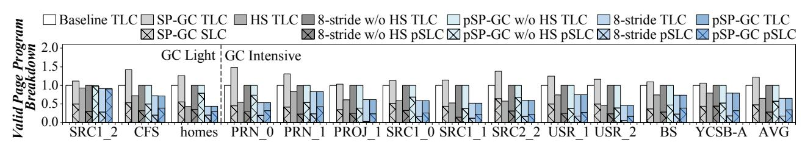
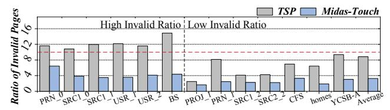

# VI. EXPERIMENT

#### A. Experimental Setup

A workload-driven flash simulator is used in this work [23], [52], [56]. We have significantly enhanced the original version of this simulator to support state-of-the-art SSD devices,

incorporating advanced hardware configurations and essential functionalities. The simulator is extended based on a real TLC chip [27] and organized as an SSD with 520 GB in size. The latency values are set based on our tested flash chips. Note that, the reprogram overhead (specifically the reading of pre-programmed data) is already factored into the reprogram latency. More parameters can be found in Table IV.

Four types of workloads are adopted, including Microsoft Research Cambridge (MSRC‡) [32], [34], [49], Microsoft Production Server (MSPS†) [26], [32], [34], Florida International University (FIU\*) [32]-[34] and Yahoo! Cloud Serving Benchmark (YCSB) [13]. All I/O workloads are opensource and collected from production servers, such as the open-source MSRC gathered from Microsoft's servers using blktrace. These workloads contain essential request characteristics, including arrival timestamp, type, logical address, and size, which represent the same inputs processed by real SSDs when the system converts host requests into device commands. These workloads have been renewed in modern SSD based storage servers, and also been widely used in prior works to verify the design efficiency of SSD optimizations. The characteristics of workloads are presented in Table V. Note that, RV, WV, RS, WS, R Pct, and W Pct indicate total read/write data volume, average read/write request size, and the percentages of read/write requests.

Metrics include: **Average Latency:** We measure end-to-end latency from request issuance to completion. Since our simulator is event-driven, this metric inherently includes queuing delays and GC blocking time, serving as the primary indicator of scheme efficiency. **GC Frequency & Overhead:** We track the total number of GC events and the time spent on page migration and erasure. These metrics, along with the average cost per GC, quantify the effectiveness of our GC optimizations. **Tail Latency (QoS):** We derive the 95th and 99th percentile latencies for read and write operations to assess the Quality of Service (QoS) across different schemes.

#### B. GC-Oriented Optimization Results

1) Evaluated Schemes.: We evaluate five schemes. Baseline: The warmed SSD serves as the baseline, where GC is initiated, and its valid pages are sequentially migrated within the same plane using an OSP. Conventional SLC-**Programming based GC (SP-GC):** SP-GC [38] is selected as the comparison method. This approach leverages SLCs to accelerate the movement of valid pages from the victim TLC block. Hotness Separation (HS): This scheme partitions write requests into hot and cold categories and directs them to different blocks accordingly. The threshold for determining hotness is set to 1 minute, as more than 60% of write requests are updated within this timeframe [19]. 8-stride: This scheme integrates reprogramming and SP-GC, but the distance between pSLC and reprogramming is limited to 8 WLs [19]. This scheme is implemented both with and without hotness separation to distinguish the benefit achieved by HS. **pSP-GC:** The proposed pSP-GC integrates LOONG with SP-

TABLE IV PARAMETERS OF SIMULATED SSD.

| Parameters         | Value  | Parameters        | Value    |  |
|--------------------|--------|-------------------|----------|--|
| Number of Channels | 8      | TR LSB (in Page)  | 25 us    |  |
| Chips per Channel  | 2      | TR CSB (in Page)  | 50 us    |  |
| Planes per Chip    | 2      | TR MSB (in Page)  | 100 us   |  |
| Blks per Plane     | 278    | TW SLC (in Page)  | 96 us    |  |
| WLs per Blk        | 1280   | TW T LC (in Page) | 1.1 ms   |  |
| Layer Number       | 320    | TErase (in Blk)   | 3.0 ms   |  |
| Page Size          | 16 KB  | Transfer Rate     | 1.2 GB/s |  |
| Program pSLC       | Value  | ReProgram TLC     | Value    |  |
| TW (in Page)       | 114 us | TW (in Page)      | 955 us   |  |

TABLE V THE CHARACTERISTICS OF WORKLOADS.

| Workloads RV(GB) WV(GB) RS(KB) WS(KB) |        |        |      |      | R Pct  | W Pct         |
|---------------------------------------|--------|--------|------|------|--------|---------------|
| PRN 0‡                                | 26.2   | 91.9   | 46   | 19   |        | 10.79% 89.21% |
| PRN 1‡                                | 362.7  | 61.6   | 45   | 23   |        | 75.34% 24.66% |
| PROJ 1‡                               | 1500.7 | 51.2   | 74   | 21   |        | 89.44% 10.56% |
| SRC1 0‡                               | 1458.4 | 1618.3 | 72   | 104  |        | 56.43% 43.57% |
| SRC1 1‡                               | 2971.3 | 60.7   | 72   | 29   | 95.26% | 4.74%         |
| SRC1 2‡                               | 2.48   | 35.81  | 16.9 | 44.9 | 15.5%  | 84.5%         |
| SRC2 2‡                               | 45.6   | 78.6   | 136  | 102  |        | 30.33% 69.67% |
| USR 1‡                                | 1156.3 | 19.0   | 103  | 21   | 92.67% | 7.33%         |
| USR 2‡                                | 830.6  | 52.9   | 102  | 28   |        | 81.13% 18.87% |
| BS†                                   | 142.4  | 253.7  | 42   | 57   |        | 43.52% 56.48% |
| CFS†                                  | 44.6   | 23.2   | 17   | 25   |        | 73.79% 26.21% |
| Homes∗                                | 17.7   | 46.8   | 81   | 16   | 6.92%  | 93.08%        |
| YCSB                                  | 584.9  | 877.3  | 24   | 24   |        | 40.00% 60.00% |

GC. Additionally, pSP-GC is also implemented both with and without hotness separation.

*2) Performance Improvement:* Figure 12 shows the average latency, total GC number, average GC time cost and read/write tail latency of different schemes, with the results of SP-GC, HS, 8-stride w/o HS, pSP-GC w/o HS, 8-stride and pSP-GC normalized to the baseline. The workloads are further divided into GC-light and GC-intensive group based on the number of pages migrated per GC. For example, SRC1\_2 migrates only tens of pages per GC under the baseline, whereas GCintensive workloads such as SRC1\_1 require migrating around 2,000 valid pages per GC. Firstly, as shown in Figure 12(a), SP-GC struggles to achieve lower latency than the baseline, whereas HS consistently demonstrates lower latency than the baseline. On average, SP-GC increases latency by 1.05 times compared to the baseline, while HS reduces latency by 25.0% relative to the baseline. The poorer performance of SP-GC is due to the increased number of GCs, some of which are needed to reclaim SLC blocks for capacity saving. As shown in Figure 12(b), SP-GC increases the number of GCs by 1.25 times compared to the baseline. However, HS clusters data with similar hotness into the same block, allowing more pages in the block to be invalidated simultaneously. This results in GCs being triggered with lower cost for valid page movement, reclaiming more space at once. Consequently, HS demonstrates better performance and a lower number of GCs compared to the baseline. Figure 12(b) and Figure 12(c) indicate that HS reduces the number of GCs and the average GC time cost by 16.7% and 21.3% compared to the baseline.

Secondly, both 8-stride w/o HS and pSP-GC w/o HS can reduce the average latency compared with the baseline and SP-GC. Specifically, 8-stride w/o HS reduces the average latency of 8% and 12.8% compared to the baseline and SP-GC, while pSP-GC w/o HS reduces the average latency of 24.0% and 27.8%, respectively. The latency reduction relative to the baseline is due to the advantage of programming valid pages to pSLC pages, while the reduction relative to SP-GC is attributed to the decreased impact of GCs, as the number of GCs is reduced by 20.0%. However, due to the difference in WL stride, the performance improvement achieved by 8-stride w/o HS is significantly smaller than that of pSP-GC w/o HS.

Thirdly, both 8-stride and pSP-GC can further reduce latency on top of HS, with pSP-GC exhibiting the most significant improvement. On the one hand, HS strategy can reduce the number of migrated pages and the number of GCs. As shown in Figure 12(b), pSP-GC has a similar number of GCs as HS. On the other hand, the pSLC program operation further lowers the cost of valid page movement, while the reprogram operation prevents performance penalty from additional compensated GCs. According to the result in Figure 12(a), 8-stride decreases the latency of 10.8% compared to HS, whereas pSP-GC can achieve a 20.7% latency reduction. There are also several notable workloads. For read-dominate workloads, USR\_1 and SRC1\_1 are highly sensitive to GC impact. As shown in Figure 13(b), applying the hotness separation scheme significantly reduces GC frequency, by 20.3% for USR\_1 and 27.9% for SRC1\_1, thereby minimizing host I/O blocking. Furthermore, Figure 13(c) illustrates that integrating reprogramming (pSP-GC) further lowers average GC overhead by 22.2% and 40.5%, respectively, further reducing blocking time. These two factors are the primary drivers of the observed latency reduction. For write-dominate workloads, such as SRC1\_2, its limited gains stem from two factors. First, its GC operations migrate only 14 pages on average, causing minimal blocking impact compared to other workloads that migrate thousands of pages. Second, most pages within the block exhibit similar hotness; thus, the hotness separation scheme reduces GC frequency by only 2%. Consequently, while it reduces average latency by 9.1% relative to the baseline, it achieves less than a 1% improvement over alternative reprogramming schemes. Overall, pSP-GC consistently outperforms other schemes and delivers the best performance across all workloads, and achieves 37.5% average latency reduction compared to baseline.

Fourthly, pSP-GC can also achieve improvement in other metrics like tail latency and IOPS, compared with baseline. In Figure 12(d) and Figure 12(e), pSP-GC reduces the 99th percentile read tail latency by 20% and write tail latency by 18% on average. We observe similar improvements for the 95th percentile tail latency. In terms of IOPS, pSP-GC can get an average improvement of 1.8, achieving up to 2.9. These results above demonstrate that our scheme delivers significant improvements in GC-oriented optimization.

Fig. 12. Performance Comparison among Baseline, SP-GC, HS, 8-stride w/o HS, pSP-GC w/o HS, 8-stride and pSP-GC.

Fig. 13. The Breakdown of Valid Pages Programmed in TLC/SLC/pSLC.

*3) Programming and Reprogramming During GC:* As we have presented above, the main performance benefit of pSP-GC results from programming valid pages in pSLC mode and restoring capacity through reprogram operations. Figure 13 illustrates the ratios of valid pages programmed or reprogrammed in different modes. First, the reduction in valid pages is primarily attributed to the HS strategy, allowing 8-stride and pSP-GC to maintain a similar valid page number to HS while reducing the total number by 32.4% compared to the baseline. Second, SP-GC migrates valid pages in SLC mode which can reduce GC time cost. However, these pages in SLC mode can trigger additional GCs to reclaim space, whereas in pSP-GC, they stem from reprogram operations. Third, while the HS strategy reduces the number of valid pages during GC, 8-stride and pSP-GC further accelerate valid page migration. This approach enhances performance and makes GC more efficient than HS alone. On average, 8-stride allows 26% of valid pages benefit from the pSLC program operation. Further, pSP-GC enables 51.9% of valid pages to benefit during valid page movement due to longer WL distance.

*4) Reprogrammed by Host Writes:* pSP-GC employs cold host write requests to reprogram underutilized blocks that have been programmed in pSLC mode. However, if there are too many valid pages during each GC, the benefits of pSLC program operations could be reduced. Specifically, if the number of valid pages exceeds one-third of the pages per block, cold write requests or valid pages from bg-GC should be included in the reprogram operation. To evaluate this impact, we first evaluate the average number of valid pages during each GC. The results indicate that, on average, 37.3% of valid pages in pSP-GC are moved, which is slightly more than one-third of the total pages per block (i.e., 1280). Across all workloads, three workloads have valid pages that amount to nearly two-thirds of the total pages per block. This means that in most cases, pSP-GC can still improve GC efficiency by programming most valid pages in pSLC mode without the reprogram operations. On the other hand, if too many host write requests are needed to reprogram pSLC pages, performance could also be affected. We calculate the ratio of write requests used to reprogram pSLC pages. Since all write requests for reprogramming pSLC pages originate from cold write requests, the ratio of cold write requests to total write requests is also collected. The results indicate that, on average, pSP-GC uses about 23.7% of host write requests to reprogram pSLC pages, which accounts for 74% of total cold write requests. That is, the negative performance impact of the reprogram operation is not significant.

- *5) The Case without Cold Data:* In this section, in order to reveal the performance of pSP-GC in the worst-case scenario, where no cold data is present from either bg-GC or the host, we set all incoming data as the hot data. Consequently, the reprogrammable block must be reprogrammed with valid pages from subsequent pSP-GC. We collect and normalize the average latency, GC count, GC time cost, and the number of valid pages for both HS and pSP-GC relative to the baseline. On average, when no cold data is used for reprogramming, pSP-GC reduces latency by 21.8% compared to the baseline and by 1.2% compared to HS. The results indicate that, in the worst-case scenario, pSP-GC still can degenerate into the HS, without causing performance decrease while adopting reprogram operation within SSDs.
- *6) GC-insensitive Workloads:* We category GC-insensitive workloads into two categories. The first category consists of workloads that are inherently small in size or with fewer update operations, and therefore rarely trigger GC operations. This group includes CFS from the MSPS set, SRC1\_2 from the MSRC set, as well as homes from the FIU dataset, which we refer to as GC-light workloads, as shown in Figure 12. The second category is constructed by reducing the warm-up ratio of the workloads used in the previous experiments, thereby lowering the frequency of GC operations during evaluation, names synthetic GC-insensitive workloads. The experimental results show that, in the first case, GC-light workloads achieve only a 3% reduction in average latency, while the the second case achieves a 3.6% reduction. It is important to note that GC-oriented optimization is fundamentally designed to optimize GC operations; therefore, its performance benefits are inherently limited in GC-insensitive scenarios. Nevertheless, in terms of Program-oriented Optimization, these workloads can still obtain noticeable performance gains.

### *C. Program-Oriented Optimization Results*

- *1) Evaluated Schemes:* We evaluate four schemes. Baseline: The baseline uses OSP to write three pages simultaneously. TSP: This scheme uses program-oriented optimization proposed in this work. But its stride is limited to two WLs that persist with the default setting. Midas-Touch [37]: This scheme selects different second programming strategies based on the number of invalid pages generated after the first programming step. TSP-LOONG: This scheme extends the stride and enables more pages being invalidated during the interval between two programming steps.
- *2) Performance Improvement:* Figure 14 showcases the average write and read latency reduction of different schemes, with the results of TSP, Midas-Touch and TSP-LOONG normalized to the baseline. First of all, the reductions in both write and read latency stem from the fewer voltage states that need to be encoded into the cell.For write requests, having fewer voltage states means that fewer ISPP iterations are necessary to increase the cell's voltage to the desired level.In the case of read requests, fewer voltage states require fewer sensing operations to distinguish the stored bits.

Firstly, Figure 14(a) shows the results of write latency reduction, where TSP and Midas-Touch can achieves slight write latency reduction while TSP-LOONG can further decrease the latency. On average, TSP reduces the write latency to 95.1% and Midas reduces the write latency to 91.4% compared to the baseline, while TSP-LOONG reduces latency to 81.3% relative to the baseline. The improved write performance of TSP-LOONG is due to the increased number of pages being invalidated during the two programming steps. This allows the reprogram operations targeting the wordline containing these invalid pages to shift the current voltage state to a lower level, resulting in reduced write latency. Secondly, as shown in Figure 14(b), the read latency reduction has a similar results with that of the write latency reduction. This is because, fewer voltage states contributes to both write and read latency reduction. Compared to the baseline, TSP and Midas-Touch reduce average read latency to 93.1% and 89.7%, respectively. While TSP-LONG can reduce average read latency to 80.4%. At most, for PRN\_0, TSP-LOONG reduces the average read latency to 57.7%, 64.7% and 68.9%, compared with the baseline, TSP and Midas-Touch. Averagely, TSP-LOONG achieves latency reductions of 81.9% , 86.4% and 88.7%, compared to the baseline, TSP and Midas-Touch.

*3) The Ratio of Invalid Pages:* In this section, we collect the number of pages being invalidated during two programming steps and then normalize the results of TSP-LOONG to TSP and to Midas-Touch.The results are presented in Figure 15. Furthermore, we categorize the workloads into High Invalid Ratio and Low Invalid Ratio. Specifically, a workload is classified as High Invalid Ratio if the normalized invalid page count of TSP-LOONG relative to TSP exceeds 10. We can see that TSP-LOONG can greatly increase the number of pages being invalidated during two programming steps. This is because the stride of reprogram operation is the entire block, thus giving

Fig. 14. Performance Comparison among Baseline, TSP and TSP-LOONG.

Fig. 15. The Ratio of Increased Number of Invalid Pages.

more chances to invalidate programmed data. Overall, TSP-LOONG increases the number of invalid pages by a factor of 8.8 and 3.3 compared to TSP and Midas-Touch. Additionally, the ratio of the increase in the number of invalid pages is not directly correlated with the latency reduction achieved. This is because latency reduction is influenced by multiple factors, including request size [14] and access patterns [31] and so on. However, the reduced voltage states still contribute to latency reduction, as read and write operations can be performed in MLC-like cells instead of TLC.

