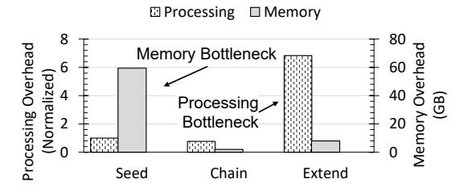
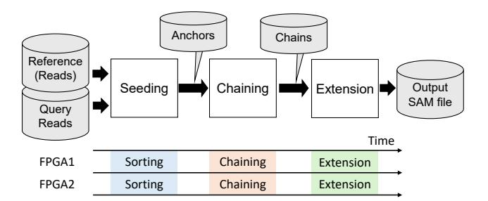

# I. INTRODUCTION

The cost and throughput of genome sequencing have been enjoying exponential reduction, but the cost of computation and memory continues to be one of the primary challenges facing their analysis. Beyond relatively simple algorithms such as mutation calling against a known reference genome, there are myriad more powerful and precise approaches that require deeper analysis of more genomic data. For example, de novo assembly of long-read genome sequences can better reconstruct complex structures in the genome [5], whole-genome alignment between oranisms can discover orthologous genes and evolutionary relationships [9], and Genome-Wide Association Studies (GWAS) can discover complex associations between genes and diseases by analyzing large populations of genomes [77]. Such tools are expected to enable accurate, personalized medical interventions via finer-grained categorization of tumor subgroups and medical dosage planning [4], as well as better understanding of rare diseases [58], [62] and aging [56]. In agriculture, high-quality assemblies are expected to facilitate better management of livestock, crops, and weeds, and contribute to the design of resilient future crop varieties [28], [39], [46].

However, powerful algorithms require more complex analytics of larger datasets, leading to high computational and memory costs prohibitive for widespread application. For example, accurate de novo assembly requires much deeper genome sequencing depth (e.g., 50+) to overcome the inherent errors in sequence reads, compared to reference alignment (e.g., 10+) [21], [30], [49], [54]. Furthermore, both de novo assembly and whole-genome alignment also require so-called *all-to-all* alignment between all pairs of long reads instead of against a single pre-assembled reference. The vast data coupled with the algorithm complexity results in an order of magnitude higher resource requirements, where accurate alignment tools take hundreds to thousands of CPU hours and hundreds of gigabytes to terabytes of memory [13], [49]. These problems are further compounded by the rapidly increasing size of collected genomic data. Not only does the size of population-scale collection of human genomes require correspondingly large and powerful systems for workloads such as GWAS [82], genomes of crop plants such as onions include numerous repeated regions result in multi-fold larger genomes than humans [18].

Unfortunately, it is unclear whether conventional sources of scalability will be helpful in solving this problem. Not only do existing software genome assembly tools demonstrate sublinear scalability with more parallel cores [13] primarily due to Amdahl's law constraints, the performance gains from general-purpose CPUs are expected to stagnate [38], and the future scalability of memory capacity is uncertain [40], [67]. Existing attempts of using computation accelerators such as Graphics Processing Units (GPUs) and Field-Programmable Gate Arrays (FPGAs) have only resulted in marginal success in terms of *cost-efficiency*. In our experiments, we show that when normalized to cost, no state-of-the-art alignment accelerator definitively beats a baseline software implementation of a state-of-the-art genome alignment tool, Minimap2, running on 64 cores.

Genome alignment is a valuable target for acceleration because it accounts for the vast majority of runtime and memory consumption of workflows such as whole-genome alignment [6] and de novo assembly. For example, our experiments with the popular NextDenovo [27] tool for the human genome shows that 76% of the total runtime is spent performing all-to-all alignment between long reads using Minimap2, while consuming an order of magnitude more memory compared to any other component.

Fig. 1: Variability in memory and computational overhead.

We present Lembas, which introduces two novel subsystems to reduce both memory and computational cost of genome alignment. Figure 1 illustrates our measurement of the memory and computational overhead of Minimap2 during all-to-all alignment of the PacBio long reads of the human genome. Minimap2 consists of three sub-steps, where the seed step has the highest memory requirement by far, and the extend step has the highest processing overhead. These results are consistent with published results using the same technology [71]. Lembas addresses both challenges with two novel FPGA accelerators: First, a seeding accelerator which removes the need for a memory-resident hash table via an external-memory columnsort accelerator coupled with NVMe SSDs. Second, an extend accelerator which implements a tiled Smith-Waterman-Gotoh algorithm capable of high-performance traceback despite the low clock speed of FPGAs. These two novel subsystems are coupled with a state-of-the-art chaining accelerator inspired by a published design [23]. We do not claim novelty for this subsystem. These three accelerators time-share each FPGA instead of requiring three FPGAs, since they are executed in a temporally disjoint manner.

We constructed a prototype Lembas appliance using a desktop-class machine with 16 GB of DRAM and 12 x86 cores, augmented with two mid-range Xilinx U50 FPGAs and four M.2 NVMe SSDs. This affordable prototype, which is made possible by the 7× reduction in memory and vastly reduced CPU overhead, was evaluated against conventional Minimap2 running on the CPU, as well as GPU and FPGA-accelerated systems, each of which require significantly costlier hardware. As we detail below, as well as in Section VII, Lembas achieves superior cost and power efficiency compared to all evaluated systems. The details about

the GPU and FPGA-accelerated system configurations and cost analysis (for both on-premise and cloud) are presented in Section VII-A. Each system was evaluated using synthetic long reads generated from real pre-assembled reference genomes of various sizes and sequencing depth [64].

First, Lembas delivers almost  $3\times$  the cost-efficiency compared to state-of-the-art GPU-accelerated system  $G^3SA$  [25], and over  $5\times$  compared to a beta version of NVIDIA's official implementation of accelerated Minimap2 [63], when aligning PacBio human long reads to a reference. The GPU-accelerated systems were evaluated with up to 128 CPU cores, 128 GB of DRAM, and either an NVIDIA A6000 or A100 GPU, requiring up to  $3\times$  the cost to purchase or rent compared to the Lembas prototype. Despite the cost difference, Lembas performs on-par with  $G^3SA$ , and almost  $2\times$  faster than the NVIDIA implementation, resulting in superior cost-efficiency.

Second, Lembas delivers over  $2\times$  cost-efficiency compared to state-of-the-art FPGA-accelerated systems [8]. The comparison FPGA system reports performance using a Xilinx Kintex Ultrascale FPGA and 40 host threads, requiring  $1.44\times$  the cost to purchase or rent compared to the Lembas prototype. The Lembas system achieves about 60% higher performance compared to this system, primarily thanks to the tiled extension accelerator, resulting in over  $2\times$  superior cost-efficiency. We also present superior performance and efficiency against published FPGA accelerators implementing subsets of Minimap2.

The primary contribution of Lembas is dramatically reducing both capital and operational costs of scalable genome alignment targeting more complex analysis approaches, such as population-wide genomic analysis, de novo assembly, and organisms with larger genomes. This contribution is enabled by its sub-contributions:

- FPGA-optimized Smith-Waterman-Gotoh algorithm using tiled traceback.
- Memory-efficient seeding using an FPGA-accelerated external-memory columnsort algorithm.
- Detailed cost and power efficiency analysis compared to state-of-the-art systems.

We emphasize that Lembas does not introduce any new optimizations or approximations which trade accuracy for performance, and implements the first algorithmic principles as presented by Minimap2 [42]. Since the Minimap2 software package implements many undocumented heuristic optimizations that do reduce the search space, Lembas often ends up doing more work to arrive at its results. As a result, the results of Lembas will always include all results Minimap2 would have discovered, under the same configurations. For example, Lembas avoids Minimap2's quality degradation caused by its memory chunking behavior when working with genomes larger than available memory, since Lembas always works with the whole genome using external memory NVMes.

The remainder of this paper is organized as follows: We present some background and related works in Section II. We present the architecture of Lembas, including three accelerators for the stages of Minimap2, in Sections III, IV V, and

VI. We provide in-depth evaluation results in Section VII, and conclude with discussions in Section VIII.

### II. BACKGROUND AND RELATED WORKS

### *A. Sequence Alignment and Genome Assembly*

Sequence alignment is a fundamental computational kernel that underlies modern genomics, enabling tasks such as read mapping, variant detection, as well as reference-based or de novo genome assembly [20], [43], [51], [73]. Given two sequences, alignment determines the best possible correspondence between them by allowing edits such as insertions, deletions, and substitutions, while considering the biological probability of each type of edit.

Because discovering a globally optimal alignment is computationally prohibitive, many techniques have been proposed to target an attractive balance of accuracy and performance [3], [25], [31], [32], [47], [83]. Two de facto standard alignment tools are Minimap2 [42] and BWA-MEM [41], and their specific accuracy configuration is taken as gold standard in many situations [31], [52], [63], [71].

We note that while BWA-MEM is an important software reference for sequence alignment, Lembas targets Minimap2 based long-read workflows, especially due to its support for the all-to-all alignment feature used by de novo assemblers and whole-genome alignment [6], [27], [35], [36], [85]; therefore, Minimap2 is the direct baseline in our evaluation, while BWA-MEM is discussed as a broader context.

De novo genome assembly, instead of aligning against a reference, is a particularly important example of computationally expensive genomics [4]. De novo achieves high accuracy by avoiding reference bias [7], [11], but because it treats the entire read dataset as both reference and query, in a so-called all-toall alignment, its quadratic computational overhead is often prohibitively high. Assembling even a modest genome such as Arabidopsis thaliana (∼140 Mb) can take hours on 32-core systems with hundreds of gigabytes of DRAM, while humanscale genomes may require terabytes of memory and multiweek runtimes [74]. Typical de novo assemblers internally use Minimap2 for all-to-all alignment [35], [36], [74], and Minimap2 represents the dominant computation and memory capacity overhead of these application. As such, Minimap2 is a valuable target of optimization.

### *B. Minimap2 Overview*

Minimap2 [42] implements a popular *seed*, *chain*, *extend* alignment approach. Seeding discovers small, exact matches between the two sequences in a resource-efficient, but accurate manner using *minimizers* [69], which are the lexicographically smallest k-mers within a sliding window. Matching pairs of minimizers are typically discovered using hash tables, and referred to as *anchors*. Chaining processes the anchor list to discover long, matching chains of anchors by linking them whenever possible. This is done through a dynamic programming approach, which assigns a chaining score to each anchor by rewarding overlaps between anchors and penalizing gaps, as well as with some heuristic adjustments. Once anchor chains are established, an approximate matching algorithm such as Smith–Waterman–Gotoh (SWG) is used on each chain to finally determine the alignments between the reference and query. SWG is a dynamic programming algorithm that computes an O(N2 ) score matrix between the two chains, and then performs a traceback of the optimal path to determine the alignment. Various configurations for SWG exist to balance accuracy and performance. One example is a gap penalty, which can assign different penalties for insertion and deletion, at a specific location. Minimap2 uses the Affine gap penalty by default. Another example is banded and adaptive banded Smith Waterman algorithms, which ignore the unlikely edges of the score matrix [15], [26], [34], [45], [48], [72].

### *C. Acceleration Landscape and Limitations*

Various attempts have tried to mitigate the performance overhead of alignment using acceleration, to varying success. To the best of our knowledge, we demonstrate that (1) no accelerated system focused on minimizing memory capacity overhead, and (2) even high-performance accelerated systems do not significantly improve end-to-end cost efficiency.

Designs optimized for modern general-purpose CPUs pair mature software stacks with wide SIMD (SSE/AVX/AVX-512). Optimizations include learned indexes for faster seeding, SIMD-vectorized chaining, and wider-vector SWG, which yield notable end-to-end speedups [14], [33], [80], [81]. Nevertheless, chaining remains difficult to vectorize due to its tight dependency and control-heavy nature, and throughput can be limited by cache capacity and vector width [22], [76].

GPUs offer massive data-level parallelism and excel on regular inner loops (e.g., DP cell updates) [16], [59], [68], leading to many accelerated alignment systems [12], [17], [71]. In fact, NVIDIA has released a beta version of its GPU-accelerated Minimap2 replacement [63]. However, many of these systems only focus on a subset of stages, due to limited GPU memory capacity and data movement overhead. Examples include chaining [12], [23], [71] and score matrix computation [12], [66], [84] but not traceback [26], [44], [70], leading to limited end-to-end improvements. One recent work has targeted GPU acceleration of all three stages [25], and achieves over 2× performance improvement over 128 thread software. Unfortunately, we demonstrate that even this system does not significantly improve cost-efficiency after accounting for GPU cost. Urgent limitations to GPU acceleration include warp divergence, irregular memory access, and dynamic termination caused by following the exact behavior of Minimap2 [71], prompting numerous research efforts to address these issues [66], [84].

FPGAs provide attractive performance and power efficiency while avoiding issues like warp divergence, often leading to superior performance and power efficiency compared to GPUs [23]. Many FPGA-accelerated systems have been proposed [23], [53], [57]. However, due to PCIe data movement overhead and capacity limitations of accelerator memory, most published systems accelerate only a subset of the algorithm: either the *chaining* step [12], [17], [23], [57], [71], or the alignment score generation [12], [66], [84]. Unfortunately, focusing on these subsets is often insufficient to ensure overall scalability. For example, many systems accelerate banded or adaptive banded Smith–Waterman [8], [15], [48], [70], [72], yet often omit traceback or provide only marginal gains over software [8], [48], [61]. This is because unlike the score matrix computation which is readily parallelizable, traceback has a tight dependency between steps, leading to low performance on lower clock speeds of FPGAs. We describe this limitation in more detail in Section VI.

Some systems have proposed specialized hardware, either as standalone ASICs [19], [24], [79], near-storage and nearmemory accelerators [55] or as CPU extensions [10], [60]. These systems often overcome many limitations of existing processing and memory systems, but producing custom designs is costly.

## III. OVERALL LEMBAS ARCHITECTURE

Figure 2 describes the overall architecture of a Lembas system, which incorporates multiple FPGAs and NVMe SSDs. As we describe in Section VII-A, the default configuration for our prototype includes two Xilinx Alveo U50 FPGAs and four 1 TB M.2 NVMe SSDs. A software orchestrator is responsible for programming appropriate bitfiles into each FPGA, data movement, and a minimal amount of computation.

We choose FPGAs instead of GPUs for Lembas, because existing work has shown that GPU chaining implementations using general-purpose warp processors are inefficient compared to reconfigurable FPGA acceleration [23], [53].

The two-FPGA system is our default configuration because it is the cheapest configuration which outperformed both stateof-the-art GPU and FPGA-accelerated systems, as we describe in Section VII. Four NVMe SSDs were used to provide sufficient bandwidth for the two FPGAs. More FPGAs and NVMe devices will improve performance at a marginal cost increase. We present scalability analysis with more FPGAs in Section VII-H.

Fig. 2: A Lembas system with multiple FPGAs and SSDs.

Figure 3 illustrates the typical three-step seed-chain-extend approach to genome alignment, and how accelerators for each step time-share multiple FPGAs in a Lembas system. Input to the system is a database of query reads and a reference. The reference can be a pre-assembled reference (for referencebased alignment), or another database of reads (for all-to-all alignment). Output of the system is the alignment results in a SAM file format. All FPGAs in the system are programmed with an identical bitfile at any given time, and the whole system is working on one of the three steps at any given time. Both input and output of the system, as well as the intermediate data between each step (anchors, chains) are stored in the NVMe storage. The programming of the FPGAs and orchestration of the data movement back and forth over the PCIe is managed by the software orchestrator. NVMe is used as persistent intermediate storage between stages rather than as an accelerator cache, allowing the seeding stage to exceed both host DRAM and FPGA HBM capacity while still feeding later stages through sequential streams.

Fig. 3: Accelerators time-share all FPGAs in lockstep.

Each of the accelerated steps focuses on either improving performance (chaining, extension) or minimizing memory footprint without sacrificing performance (seeding). This way, Lembas mitigates the resource bottlenecks described in the Introduction. The details about each accelerated step are presented in the following sections.

