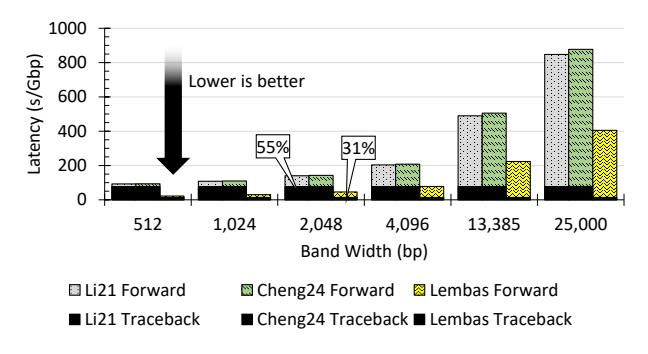
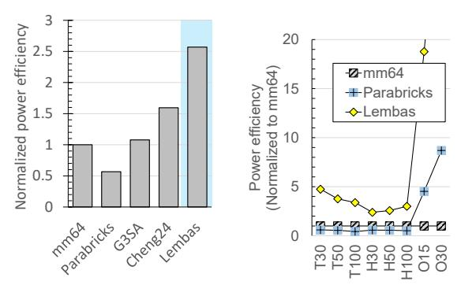

# I. Stepwise performance breakdown

In this section, we provide a performance breakdown of Lembas across the three steps and analyze their performance improvements compared to other systems. Figure 15 illustrates the performance breakdown of Lembas, mm64, Parabricks, G3SA, and Cheng24 across the three steps, while performing reference-based alignment on the human genome with coverage of 50. Only mm64 and Lembas report breakdown across all three steps. First, the breakdown of mm64 matches the chaining overhead for the PacBio long read human datasets as reported in existing work [13]. Meanwhile, the Parabricks and Cheng24 systems pipeline chaining and extension, making it difficult to separate them. On the other hand, G3SA reports the relative performance improvements of the two latter steps compared to software. However, its GPU-optimized seeding algorithm appears to increase the amount of work for the latter stages, making it difficult to reason about the accurate breakdown ratios. For example, G3SA reports 4× and 10× improvement in the chaining and extensions stages, respectively, but the overall system improvement is about 2×, suggesting that more work was created at the seeding stage compared to baseline Minimap2. This is a similar behavior to our own Lembas due to some design decisions of seeding, which we detail below.

Fig. 15: Stepwise performance

*1) Seeding performance evaluation:* As illustrated in Figure 15, Lembas demonstrates competitive seeding performance. It is faster than mm64 by 70%, and is slower than G 3SA by 15%. We note that our measured seeding performance matches the numbers presented in existing work [23]. We also note that since Cheng24 did not accelerate seeding and did not separately report seeding performance, we use the seeding performance from our mm32 results.

We argue that such competitive performance is an excellent result, since the goal of our seeding accelerator is not to improve performance, but to minimize memory requirements. Figure 13 shows that Lembas reduced overall memory requirements by 7×, resulting in a dramatic reduction in system cost, without significant performance overhead.

*2) Chaining performance evaluation:* As Lembas implemented an FPGA-optimized chaining accelerator inspired by [23], it demonstrates similarly high performance, only limited by the available PCIe bandwidth. The Lembas chaining accelerator, using one FPGA, achieves 2.21× performance compared to mm64. This is an improvement to what was achieved by existing work using the AWS EC2 F1 [23], which is subject to similar PCIe limitations. The PCIe bandwidth limitation is the primary reason we did not instantiate more kernels for the chaining accelerator despite low chip resource utilization (Table IV), and also why we observe near-linear performance scalability with more FPGAs in Section VII-H.

Figure 15 appears to show *slower* chaining performance compared to mm64, although our chaining accelerator is much faster than software. The competitive performance of seeding is due to the high performance of hardware-accelerated sorting. Meanwhile, the chaining performance exhibits a similar behavior to G3SA, caused by different heuristic optimizations in the seeding stage. The off-the-shelf Minimap2 incorporates many heuristics for filtering out unlikely anchors during the seeding step to reduce downstream computation; we chose not to include them in favor of exact minimizer matches, as described in Section IV. As a result, 7.06× more chains were generated for the chaining accelerator.

*3) Extension performance evaluation:* The extension accelerator achieves about 48 GCUPS (Giga Cells Updated Per Second) per FPGA, adding up to 96 GCUPS across the two FPGAs in our default configuration. This is almost 4× the performance of mm64 (27.21 GCUPS). However, the breakdown in Figure 15 doesn't appear that much faster, again due to the increased number of data generated by our seeding implementation.

Fig. 16: Extension step breakdown.

Figure 16 compares the performance of our extension accelerator against two state-of-the-art FPGA aligners, Cheng24 [8] and Li21 [45]. We note that this figure only reports the results of one FPGA in Lembas, and that Cheng24 uses a larger FPGA, as illustrated in Section VII-A. The figure evaluates various configurations of *banded* Smith-Waterman, with band width spanning from 512, to 13K (average length of PacBio HG002) to 25K (near-maximum read length in PacBio HG002). For reference, recent studies have used W=1024 as a good balance between accuracy and performance [42], [75], but the default Minimap2 implementation uses a much wider, 20kbp band. The figure separates the latency into the forward path (score matrix calculation) and the traceback path. Thanks to an efficient forward engine and our novel tiled traceback scheme, Lembas delivers the lowest total latency across all evaluated W. At W=2048, Lembas reduces traceback overhead by 1.77× relative to the next-best design. While the overhead of traceback becomes somewhat negligible with larger bands, it is a significant benefit for the popular, narrower bands [42], [75].

Figure 17 compares Lembas against a broader set of stateof-the-art FPGA aligners, which are Liao18 [48], Turakhia18 [79], Teng23 [78], Li21 [45], and Cheng24 [8], under a fixed band width of W=1024, which was the configuration commonly available in the respective publications.

Figure 18 compares our extension accelerator to G3SA, and shows we deliver competitive cost-efficiency. G3SA reports roughly 8× improvement of extension performance compared to mm2-fast [33], which reports 1.65× improvement over

Fig. 17: Extension step breakdown for band width 1024.

default Minimap2. Using this number as a proxy, we discover that while Lembas delivers lower extension performance, it achieves competitive cost efficiency thanks to lower hardware requirements. We do note, however, it is difficult to do accurate comparisons based on published performance relationships because G3SA does not report its band width configuration. Default Lembas uses a 20 kbp band according to the default Minimap2 configuration.

Fig. 18: Cost-efficiency of the extension accelerator.

#### J. Power efficiency analysis

Figure 19 presents the power efficiency evaluations of reference-based alignment using Lembas and other compared systems, normalized to mm64. We used measured average power consumption numbers from Lembas, mm64, and Parabricks, rounded to the nearest 10 W. The numbers were 230 W, 320 W, and 420 W, respectively. G³SA and Cheng24 systems assumed the same power consumption as Parabricks and Lembas, which is a conservative estimate considering their higher resource requirements.

We make two observations from these results. First, Lembas achieves superior power efficiency compared to all evaluated systems, thanks to the reduced power consumption of fewer threads, smaller memory, as well as power efficiency of the FPGA accelerator. Lembas always achieves more than 2.3× efficiency compared to mm64, and over 2× compared to G³SA. Second, the power efficiency of Parabricks is typically *lower* compared to mm64 due to the added power consumption of the A100 GPU, despite the smaller number of CPU cores kept busy (32 vs. 64). Furthermore, while we do not present a chart for all-to-all alignment results, Lembas also achieves

superior power efficiency on all-to-all alignment, achieving between 2.2× to 3.9× power efficiency compared to mm64.

- (a) Human+reference (50x).
- (b) Alignment to reference.

Fig. 19: Power efficiency evaluations.

#### VIII. CONCLUSION

Lembas is a genome alignment appliance that achieves  $7\times$  reduction of memory requirements and minimizes CPU overhead, through heterogeneous FPGA acceleration and external-memory algorithms. Lembas achieves competitive performance with  $3\times$  costlier state-of-the-art systems, aiming to make future genomic workloads feasible even as Moore's law faces its end. We are making all aspects of Lembas open source, so that the benefits of affordable and scalable sequence alignment can reach beyond our collaborators.

## ACKNOWLEDGMENT

This research is partially supported by the PRISM (000705769) center under the JUMP 2.0 program by DARPA/SRC. This work was also supported by the Institute of Information & Communications Technology Planning & Evaluation(IITP) grant funded by the Korea Government(MSIT) (No.RS-2025-02219317, AI Star Fellowship(Kookmin University)).

#### REFERENCES

- [1] N. Ahmed, J. Lévy, S. Ren, H. Mushtaq, K. Bertels, and Z. Al-Ars, "Gasal2: a gpu accelerated sequence alignment library for high-throughput ngs data," *BMC bioinformatics*, vol. 20, no. 1, p. 520, 2019.
- [2] N. Ahmed, T. D. Qiu, K. Bertels, and Z. Al-Ars, "Gpu acceleration of darwin read overlapper for de novo assembly of long dna reads," BMC bioinformatics, vol. 21, no. Suppl 13, p. 388, 2020.
- [3] M. Alser, T. Shahroodi, J. Gómez-Luna, C. Alkan, and O. Mutlu, "Sneakysnake: a fast and accurate universal genome pre-alignment filter for cpus, gpus and fpgas," *Bioinformatics*, vol. 36, no. 22-23, pp. 5282– 5290, 2020.
- [4] E. A. Ashley, "Towards precision medicine," *Nature Reviews Genetics*, vol. 17, no. 9, pp. 507–522, 2016.
- [5] M. J. Chaisson, R. K. Wilson, and E. E. Eichler, "Genetic variation and the de novo assembly of human genomes," *Nature Reviews Genetics*, vol. 16, no. 11, pp. 627–640, 2015.
- [6] G. Chandra, M. Vasimuddin, S. Misra, and C. Jain, "Accelerating minimap2 for whole-genome alignment," *Bioinformatics*, vol. 42, no. 3, p. btag083, 2026.
- [7] N.-C. Chen, B. Solomon, T. Mun, S. Iyer, and B. Langmead, "Reference flow: reducing reference bias using multiple population genomes," *Genome biology*, vol. 22, pp. 1–17, 2021.

- [8] J. Cheng, L. Hu, W. Xu, H. Chen, and T. Xia, "Hardware acceleration of minimap2 genomic sequence alignment algorithm," in *Proceedings of the 53rd International Conference on Parallel Processing*, 2024, pp. 887–897.
- [9] A. L. Delcher, S. Kasif, R. D. Fleischmann, J. Peterson, O. White, and S. L. Salzberg, "Alignment of whole genomes," *Nucleic acids research*, vol. 27, no. 11, pp. 2369–2376, 1999.
- [10] M. Doblas, P. J. Shih, O. Lostes-Cazorla, M. Moreto, C. Batten, and S. Marco-Sola, "Smx: Heterogeneous architecture for universal sequence alignment acceleration," in *Proceedings of the 58th IEEE/ACM International Symposium on Microarchitecture®*, 2025, pp. 1656–1671.
- [11] S. Dolenz, T. van der Valk, C. Jin, J. Oppenheimer, M. B. Sharif, L. Orlando, B. Shapiro, L. Dalen, and P. D. Heintzman, "Unravelling ´ reference bias in ancient dna datasets," *Bioinformatics*, vol. 40, no. 7, p. btae436, 2024.
- [12] J. Dong, X. Liu, H. Sadasivan, S. Sitaraman, and S. Narayanasamy, "mm2-gb: Gpu accelerated minimap2 for long read dna mapping," in *Proceedings of the 15th ACM International Conference on Bioinformatics, Computational Biology and Health Informatics*, 2024, pp. 1–9.
- [13] E. Espinosa, R. Bautista, I. Fernandez, R. Larrosa, E. L. Zapata, and O. Plata, "Comparing assembly strategies for third-generation sequencing technologies across different genomes," *Genomics*, vol. 115, no. 5, p. 110700, 2023.
- [14] M. Farrar, "Striped smith–waterman speeds database searches six times over other simd implementations," *Bioinformatics*, vol. 23, no. 2, pp. 156–161, 2007.
- [15] Y. Feng, Z. Li, G. Gudukbay Akbulut, V. Narayanan, M. T. Kandemir, and C. R. Das, "Fpga-based accelerator for adaptive banded event alignment in nanopore sequencing data analysis," *BMC bioinformatics*, vol. 26, no. 1, p. 83, 2025.
- [16] Z. Feng, S. Qiu, L. Wang, and Q. Luo, "Accelerating long read alignment on three processors," in *Proceedings of the 48th International Conference on Parallel Processing*, 2019, pp. 1–10.
- [17] ——, "Accelerating long read alignment on three processors," in *Proceedings of the 48th International Conference on Parallel Processing*, 2019, pp. 1–10.
- [18] R. Finkers, M. van Kaauwen, K. Ament, K. Burger-Meijer, R. Egging, H. Huits, L. Kodde, L. Kroon, M. Shigyo, S. Sato *et al.*, "Insights from the first genome assembly of onion (allium cepa)," *G3*, vol. 11, no. 9, p. jkab243, 2021.
- [19] D. Fujiki, A. Subramaniyan, T. Zhang, Y. Zeng, R. Das, D. Blaauw, and S. Narayanasamy, "Genax: A genome sequencing accelerator," in *2018 ACM/IEEE 45th Annual International Symposium on Computer Architecture (ISCA)*. IEEE, 2018, pp. 69–82.
- [20] L. Gonzalez-Garcia, D. Guevara-Barrientos, D. Lozano-Arce, J. Gil, J. D´ıaz-Riano, E. Duarte, G. Andrade, J. C. Bojac ˜ a, M. C. Hoyos- ´ Sanchez, C. Chavarro *et al.*, "New algorithms for accurate and efficient de novo genome assembly from long dna sequencing reads," *Life Science Alliance*, vol. 6, no. 5, 2023.
- [21] D. Gordon, J. Huddleston, M. J. Chaisson, C. M. Hill, Z. N. Kronenberg, K. M. Munson, M. Malig, A. Raja, I. Fiddes, L. W. Hillier *et al.*, "Longread sequence assembly of the gorilla genome," *Science*, vol. 352, no. 6281, p. aae0344, 2016.
- [22] L. Guo, X. Qiu, and J. Cong, "Hardware acceleration of long read pairwise overlap for genome assembly," in *Proc. FPGA*, 2020, analyzes loop-carried dependencies and critical path in Minimap2 chaining DP.
- [23] L. Guo, J. Lau, Z. Ruan, P. Wei, and J. Cong, "Hardware acceleration of long read pairwise overlapping in genome sequencing: A race between fpga and gpu," in *2019 IEEE 27th Annual International Symposium on Field-Programmable Custom Computing Machines (FCCM)*. IEEE, 2019, pp. 127–135.
- [24] A. Haghi, L. Alvarez, J. Front, J. M. de Haro Ruiz, R. Figueras, M. Doblas, S. Marco-Sola, and M. Moreto, "Wfasic: a high-performance asic accelerator for dna sequence alignment on a risc-v soc," in *Proceedings of the 52nd International Conference on Parallel Processing*, 2023, pp. 392–401.
- [25] Y. Han, S. Kim, S. Park, and J. Lee, "Gˆ 3sa: A gpu-accelerated gold standard genomics library for end-to-end sequence alignment," in *Proceedings of the 39th ACM International Conference on Supercomputing*, 2025, pp. 173–188.
- [26] B. Harris, A. C. Jacob, J. M. Lancaster, J. Buhler, and R. D. Chamberlain, "A banded smith-waterman fpga accelerator for mercury blastp," in *2007 International Conference on Field Programmable Logic and Applications*. IEEE, 2007, pp. 765–769.

- [27] J. Hu, Z. Wang, Z. Sun, B. Hu, A. O. Ayoola, F. Liang, J. Li, J. R. Sandoval, D. N. Cooper, K. Ye *et al.*, "Nextdenovo: an efficient error correction and accurate assembly tool for noisy long reads," *Genome Biology*, vol. 25, no. 1, p. 107, 2024.
- [28] M. Iorizzo, D. A. Senalik, D. Grzebelus, M. Bowman, P. F. Cavagnaro, M. Matvienko, H. Ashrafi, A. Van Deynze, and P. W. Simon, "De novo assembly and characterization of the carrot transcriptome reveals novel genes, new markers, and genetic diversity," *BMC genomics*, vol. 12, pp. 1–14, 2011.
- [29] S. Jayaraman, B. Zhang, and V. Prasanna, "Hypersort: High-performance parallel sorting on hbm-enabled fpga," in *2022 International Conference on Field-Programmable Technology (ICFPT)*. IEEE, 2022, pp. 1–11.
- [30] H. Jung, C. Winefield, A. Bombarely, P. Prentis, and P. Waterhouse, "Tools and strategies for long-read sequencing and de novo assembly of plant genomes," *Trends in plant science*, vol. 24, no. 8, pp. 700–724, 2019.
- [31] Y. Jung and D. Han, "Bwa-meme: Bwa-mem emulated with a machine learning approach," *Bioinformatics*, vol. 38, no. 9, pp. 2404–2413, 2022.
- [32] S. Kalikar, C. Jain, M. Vasimuddin, and S. Misra, "Accelerating minimap2 for long-read sequencing applications on modern cpus," *Nature Computational Science*, vol. 2, no. 2, pp. 78–83, 2022.
- [33] ——, "Accelerating minimap2 for long-read sequencing applications on modern cpus," *Nature Computational Science*, vol. 2, no. 2, pp. 78–83, 2022.
- [34] K. Koliogeorgi, D. Soudris, and S. Xydis, "Profile-driven banded smith-waterman acceleration for short read alignment," in *2023 60th ACM/IEEE Design Automation Conference (DAC)*. IEEE, 2023, pp. 1–6.
- [35] M. Kolmogorov, D. M. Bickhart, B. Behsaz, A. Gurevich, M. Rayko, S. B. Shin, K. Kuhn, J. Yuan, E. Polevikov, T. P. Smith *et al.*, "metaflye: scalable long-read metagenome assembly using repeat graphs," *Nature Methods*, vol. 17, no. 11, pp. 1103–1110, 2020.
- [36] S. Koren, B. P. Walenz, K. Berlin, J. R. Miller, N. H. Bergman, and A. M. Phillippy, "Canu: scalable and accurate long-read assembly via adaptive k-mer weighting and repeat separation," *Genome research*, vol. 27, no. 5, pp. 722–736, 2017.
- [37] T. Leighton, "Tight bounds on the complexity of parallel sorting," in *Proceedings of the sixteenth annual ACM symposium on Theory of computing*, 1984, pp. 71–80.
- [38] C. E. Leiserson, N. C. Thompson, J. S. Emer, B. C. Kuszmaul, B. W. Lampson, D. Sanchez, and T. B. Schardl, "There's plenty of room at the top: What will drive computer performance after moore's law?" *Science*, vol. 368, no. 6495, p. eaam9744, 2020.
- [39] T. Leslie and R. S. Baucom, "De novo assembly and annotation of the transcriptome of the agricultural weed ipomoea purpurea uncovers gene expression changes associated with herbicide resistance," *G3: Genes, Genomes, Genetics*, vol. 4, no. 10, pp. 2035–2047, 2014.
- [40] P. Levis, "It's the end of dram as we know it." 2023, accessed: 2025-04-09. [Online]. Available: https://www.irtf.org/anrw/2023/slides-117-anrw-sessa-keynote-its-the-end-of-dram-as-we-know-it-02.pdf
- [41] H. Li, "Aligning sequence reads, clone sequences and assembly contigs with bwa-mem," *arXiv preprint arXiv:1303.3997*, 2013.
- [42] ——, "Minimap2: pairwise alignment for nucleotide sequences," *Bioinformatics*, vol. 34, no. 18, pp. 3094–3100, 2018.
- [43] H. Li and R. Durbin, "Genome assembly in the telomere-to-telomere era," *Nature Reviews Genetics*, vol. 25, no. 9, pp. 658–670, 2024.
- [44] I. T. Li, W. Shum, and K. Truong, "160-fold acceleration of the smithwaterman algorithm using a field programmable gate array (fpga)," *BMC bioinformatics*, vol. 8, pp. 1–7, 2007.
- [45] L. Li, J. Lin, and Z. Wang, "Pipebsw: A two-stage pipeline structure for banded smith-waterman algorithm on fpga," in *2021 IEEE Computer Society Annual Symposium on VLSI (ISVLSI)*. IEEE, 2021, pp. 182– 187.
- [46] T.-T. Li, T. Xia, J.-Q. Wu, H. Hong, Z.-L. Sun, M. Wang, F.-R. Ding, J. Wang, S. Jiang, J. Li *et al.*, "De novo genome assembly depicts the immune genomic characteristics of cattle," *Nature Communications*, vol. 14, no. 1, p. 6601, 2023.
- [47] Y. Li, J. M. Patel, and A. Terrell, "Wham: a high-throughput sequence alignment method," *ACM Transactions on Database Systems (TODS)*, vol. 37, no. 4, pp. 1–39, 2012.
- [48] Y.-L. Liao, Y.-C. Li, N.-C. Chen, and Y.-C. Lu, "Adaptively banded smith-waterman algorithm for long reads and its hardware accelerator," in *2018 IEEE 29th International Conference on Application-specific*

- *Systems, Architectures and Processors (ASAP)*. IEEE, 2018, pp. 1– 9.
- [49] Y. H. Liu, C. Luo, S. G. Golding, J. B. Ioffe, and X. M. Zhou, "Tradeoffs in alignment and assembly-based methods for structural variant detection with long-read sequencing data," *Nature communications*, vol. 15, no. 1, p. 2447, 2024.
- [50] Y. Liu and B. Schmidt, "Gswabe: faster gpu-accelerated sequence alignment with optimal alignment retrieval for short dna sequences," *Concurrency and Computation: Practice and Experience*, vol. 27, no. 4, pp. 958–972, 2015.
- [51] Y. Liu, X. Shen, Y. Gong, Y. Liu, B. Song, and X. Zeng, "Sequence alignment/map format: a comprehensive review of approaches and applications," *Briefings in Bioinformatics*, vol. 24, no. 5, p. bbad320, 2023.
- [52] K. Liyanage, H. Samarakoon, S. Parameswaran, and H. Gamaarachchi, "Efficient end-to-end long-read sequence mapping using minimap2 fpga integrated with hardware accelerated chaining," *Scientific Reports*, vol. 13, no. 1, p. 20174, 2023.
- [53] ——, "Efficient end-to-end long-read sequence mapping using minimap2-fpga integrated with hardware accelerated chaining," *Scientific Reports*, vol. 13, no. 1, p. 20174, 2023.
- [54] G. A. Logsdon, M. R. Vollger, and E. E. Eichler, "Long-read human genome sequencing and its applications," *Nature Reviews Genetics*, vol. 21, no. 10, pp. 597–614, 2020.
- [55] N. Mansouri Ghiasi, J. Park, H. Mustafa, J. Kim, A. Olgun, A. Gollwitzer, D. Senol Cali, C. Firtina, H. Mao, N. Almadhoun Alserr *et al.*, "Genstore: A high-performance in-storage processing system for genome sequence analysis," in *Proceedings of the 27th ACM International Conference on Architectural Support for Programming Languages and Operating Systems*, 2022, pp. 635–654.
- [56] D. L. McCartney, J. L. Min, R. C. Richmond, A. T. Lu, M. K. Sobczyk, G. Davies, L. Broer, X. Guo, A. Jeong, J. Jung *et al.*, "Genomewide association studies identify 137 genetic loci for dna methylation biomarkers of aging," *Genome biology*, vol. 22, no. 1, p. 194, 2021.
- [57] P. Meng, M. Jacobsen, M. Kimura, V. Dergachev, T. Anantharaman, M. Requa, and R. Kastner, "Hardware accelerated novel optical de novo assembly for large-scale genomes," in *2014 24th International Conference on Field Programmable Logic and Applications (FPL)*. IEEE, 2014, pp. 1–8.
- [58] S. Mitsuhashi and N. Matsumoto, "Long-read sequencing for rare human genetic diseases," *Journal of Human Genetics*, vol. 65, no. 1, pp. 11–19, 2020.
- [59] A. Muller, B. Schmidt, R. Membarth, R. Leißa, and S. Hack, "Any- ¨ seq/gpu: a novel approach for faster sequence alignment on gpus," in *Proceedings of the 36th ACM International Conference on Supercomputing*, 2022, pp. 1–11.
- [60] A. Nag, C. Ramachandra, R. Balasubramonian, R. Stutsman, E. Giacomin, H. Kambalasubramanyam, and P.-E. Gaillardon, "Gencache: Leveraging in-cache operators for efficient sequence alignment," in *Proceedings of the 52nd Annual IEEE/ACM International Symposium on Microarchitecture*, 2019, pp. 334–346.
- [61] Z. Nawaz, M. Nadeem, H. Van Someren, and K. Bertels, "A parallel fpga design of the smith-waterman traceback," in *2010 International Conference on Field-Programmable Technology*. IEEE, 2010, pp. 454– 459.
- [62] S. Negi, S. L. Stenton, S. I. Berger, P. Canigiula, B. McNulty, I. Violich, J. Gardner, T. Hillaker, S. M. O'Rourke, M. C. O'Leary *et al.*, "Advancing long-read nanopore genome assembly and accurate variant calling for rare disease detection," *The American Journal of Human Genetics*, vol. 112, no. 2, pp. 428–449, 2025.
- [63] NVIDIA, "minimap2 (beta) run a gpu-accelerated minimap2." 2025, accessed: 2025-04-09. [Online]. Available: https://docs.nvidia.com/ clara/parabricks/latest/documentation/tooldocs/man minimap2.html
- [64] Y. Ono, "Pbsim3: simulator for all types of pacific biosciences (pacbio) and oxford nanopore technologies (ont) long reads." 2025, accessed: 2025-04-09. [Online]. Available: https://github.com/yukiteruono/pbsim3
- [65] Y. Ono, M. Hamada, and K. Asai, "Pbsim3: a simulator for all types of pacbio and ont long reads," *NAR genomics and bioinformatics*, vol. 4, no. 4, p. lqac092, 2022.
- [66] S. Park, J. Hong, J. Song, H. Kim, Y. Kim, and J. Lee, "Agatha: Fast and efficient gpu acceleration of guided sequence alignment for long read mapping," in *Proceedings of the 29th ACM SIGPLAN Annual Symposium on Principles and Practice of Parallel Programming*, 2024, pp. 431–444.

- [67] M. Patel, T. Shahroodi, A. Manglik, A. G. Yaglıkc¸ı, A. Olgun, H. Luo, ˘ and O. Mutlu, "Rethinking the producer-consumer relationship in modern dram-based systems," *IEEE Access*, 2024.
- [68] M. Pham, Y. Tu, and X. Lv, "Accelerating bwa-mem read mapping on gpus," in *Proceedings of the 37th international conference on supercomputing*, 2023, pp. 155–166.
- [69] M. Roberts, W. Hayes, B. R. Hunt, S. M. Mount, and J. A. Yorke, "Reducing storage requirements for biological sequence comparison," *Bioinformatics*, vol. 20, no. 18, pp. 3363–3369, 2004.
- [70] E. Rucci, C. Garcia, G. Botella, A. De Giusti, M. Naiouf, and M. Prieto-Matias, "Swifold: Smith-waterman implementation on fpga with opencl for long dna sequences," *BMC systems biology*, vol. 12, pp. 43–53, 2018.
- [71] H. Sadasivan, M. Maric, E. Dawson, V. Iyer, J. Israeli, and S. Narayanasamy, "Accelerating minimap2 for accurate long read alignment on gpus," *Journal of biotechnology and biomedicine*, vol. 6, no. 1, p. 13, 2023.
- [72] S. Samarasinghe, P. Premathilaka, W. Herath, H. Gamaarachchi, and R. Ragel, "Energy efficient adaptive banded event alignment using opencl on fpgas," in *2021 10th international conference on information and automation for sustainability (ICIAfS)*. IEEE, 2021, pp. 369–374.
- [73] H. M. Schilbert, A. Rempel, and B. Pucker, "Comparison of read mapping and variant calling tools for the analysis of plant ngs data," *Plants*, vol. 9, no. 4, p. 439, 2020.
- [74] K. Shafin, T. Pesout, R. Lorig-Roach, M. Haukness, H. E. Olsen, C. Bosworth, J. Armstrong, K. Tigyi, N. Maurer, S. Koren *et al.*, "Nanopore sequencing and the shasta toolkit enable efficient de novo assembly of eleven human genomes," *Nature biotechnology*, vol. 38, no. 9, pp. 1044–1053, 2020.
- [75] H. Shao and J. Ruan, "Bsalign: a library for nucleotide sequence alignment," *Genomics, Proteomics & Bioinformatics*, vol. 22, no. 2, p. qzae025, 2024.
- [76] K. Suzuki and M. Kasahara, "Introducing difference recurrence relations for faster semi-global alignment of long sequences," *BMC Bioinformatics*, vol. 19, no. 45, 2018.
- [77] V. Tam, N. Patel, M. Turcotte, Y. Bosse, G. Par ´ e, and D. Meyre, ´ "Benefits and limitations of genome-wide association studies," *Nature Reviews Genetics*, vol. 20, no. 8, pp. 467–484, 2019.
- [78] C. Teng, R. W. Achjian, J. C. Wang, and F. J. Fonseca, "Adapting the gact-x aligner to accelerate minimap2 in an fpga cloud instance," *Applied Sciences*, vol. 13, no. 7, p. 4385, 2023.
- [79] Y. Turakhia, G. Bejerano, and W. J. Dally, "Darwin: A genomics coprocessor provides up to 15,000 x acceleration on long read assembly," *ACM SIGPLAN Notices*, vol. 53, no. 2, pp. 199–213, 2018.
- [80] M. Vasimuddin, S. Misra, H. Li, and S. Aluru, "Efficient architectureaware acceleration of bwa-mem for multicore systems," in *2019 IEEE international parallel and distributed processing symposium (IPDPS)*. IEEE, 2019, pp. 314–324.
- [81] Z. Xia, Y. Cui, A. Zhang, T. Tang, L. Peng, C. Huang, C. Yang, and X. Liao, "A review of parallel implementations for the smith– waterman algorithm," *Interdisciplinary Sciences: Computational Life Sciences*, vol. 14, no. 1, pp. 1–14, 2022.
- [82] L. Yin, H. Zhang, Z. Tang, J. Xu, D. Yin, Z. Zhang, X. Yuan, M. Zhu, S. Zhao, X. Li *et al.*, "rmvp: a memory-efficient, visualizationenhanced, and parallel-accelerated tool for genome-wide association study," *Genomics, proteomics & bioinformatics*, vol. 19, no. 4, pp. 619– 628, 2021.
- [83] A. Zeni, G. W. Di Donato, L. Di Tucci, M. Rabozzi, and M. D. Santambrogio, "The importance of being x-drop: High performance genome alignment on reconfigurable hardware," in *2021 IEEE 29th Annual International Symposium on Field-Programmable Custom Computing Machines (FCCM)*. IEEE Computer Society, 2021, pp. 133–141.
- [84] A. Zeni, G. Guidi, M. Ellis, N. Ding, M. D. Santambrogio, S. Hofmeyr, A. Buluc¸, L. Oliker, and K. Yelick, "Logan: High-performance gpubased x-drop long-read alignment," in *2020 IEEE International Parallel and Distributed Processing Symposium (IPDPS)*. IEEE, 2020, pp. 462– 471.
- [85] A. V. Zimin, G. Marc¸ais, D. Puiu, M. Roberts, S. L. Salzberg, and J. A. Yorke, "The masurca genome assembler," *Bioinformatics*, vol. 29, no. 21, pp. 2669–2677, 2013.