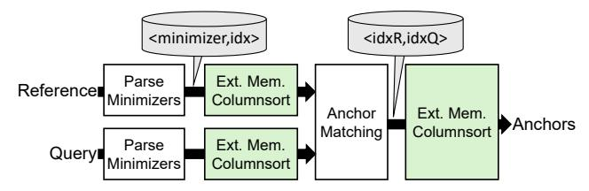
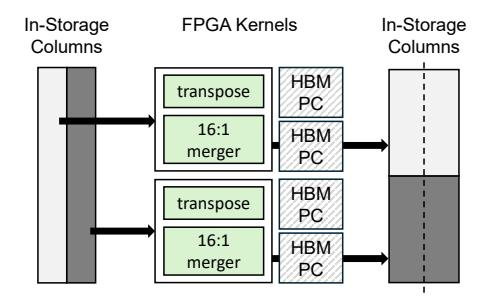

# IV. MEMORY-EFFICIENT SEEDING ACCELERATOR

The vast majority of Minimap2's memory overhead is used to construct and lookup a hash table of minimizers to discover anchors between the reference and query. Since hash table access based on minimizers is considered unpredictably random, conventional systems must keep the table memoryresident and suffer the expensive memory capacity overhead.

Lembas removes the memory-resident hash table requirement by sorting the list of hash table entries from both reference and query according to their minimizers. Once the list is sorted, discovering anchors becomes a straightforward streaming operation where matching keys are found from two sorted lists. After creating a list of anchors, the list is sorted once again to order it according to its location in the reference.

Fig. 4: The seeding step repeatedly uses a columnsort accelerator to remove random accesses into memory.

Figure 4 illustrates the seeding process implemented by Lembas. All boxes in the figure represent accelerators. We note that since minimizer parsing and anchor matching are quite simple, they share a bitfile with the more complex columnsort accelerator, resulting in a single bitfile for the seeding step.

First, the reference and query are streamed into the minimizer parse, which extracts minimizers and emits a stream of 〈minimizer, index〉 tuples. For alignment workloads, the query stream will consist of the entire read dataset. For referencebased alignment the reference stream would be the entire pre-assembled reference, while for all-to-all alignment, the reference stream would also be the entire read dataset. Since the resulting minimizer stream will likely be larger than the on-board memory capacity of the FPGA, they are streamed out of the FPGA over PCIe and stored in NVMe.

The minimizer stream, stored in NVMe, is then sorted according to the lexicographic order of the minimizers, using the external-memory columnsort accelerator. As we describe in Section IV-1, the sorting process involves multiple phases of data movement between the FPGA and NVMe over PCIe. Once the two streams are sorted and stored in NVMe, they are streamed into the anchor matching accelerator, which simply zips the two sorted lists to discover matches. The result is a new stream of anchors, which are tuples of 〈idxQ, idxR〉, or in other words, pairs of query and reference indices with matching minimizers. Due to its size, the anchor stream is streamed out of the FPGA and stored in NVMe. This stream is sorted again using the external-memory columnsort accelerator according to its idxR, which becomes the final output of the seeding step.

We note that more advanced algorithms use heuristic anchor filtering, which try to filter out unpromising anchors. Many approaches exist, including immediately checking whether each anchor is part of a larger exact match. We intentionally do not implement such heuristic optimizations for two reasons: First, we avoid algorithmic deviations from Minimap2 which may degrade its accuracy. Second, because they would require random access into the input datasets, which would again incur costly memory requirements. We demonstrate in Section VII that this choice results in amplified work for the later stages. However, Lembas still ultimately achieves superior performance, as well as superior cost efficiency due to reduced system cost. We will continue improving Lembas to incorporate and evaluate heuristic optimizations which do not incur high memory requirements or accuracy degradation.

*1) External-memory columnsort accelerator:* Because a CPU implementation of columnsort requires too many cores (200+) to achieve competitive seeding performance, Lembas overcomes the high computational overhead of sorting using an external-memory sorting accelerator. The sorting accelerator implements a novel external-memory variant of columnsort [29], [37]. Columnsort is a parallel sorting algorithm that globally sorts a grid of values by repeating the process of sorting individual columns independently and then shifting or transposing the grid. Columnsort is very efficiently parallelizable because each column does not need to communicate with other columns during sorting or transposition. In the interest of space, we guide readers to existing work on the algorithm and implementation [29], [37].

Fig. 5: The external-memory columnsort accelerator consists of multiple parallel kernels to saturate PCIe.

Lembas implements a novel, external-memory columnsort accelerator targeting modern FPGAs equipped with High Bandwidth Memory (HBM), using an array of independent sorting kernels. Our accelerator design differs from existing accelerator implementations of columnsort since our design must target datasets exceeding accelerator memory, and this difference motivates many changes in design decisions. This accelerator is illustrated in Figure 5 using two kernels to sort two columns. Thanks to the independently parallel nature of columnsort, each sorting kernel can take ownership of a pair of HBM *banks*, i.e., *pseudo-channels (PC)*, and focus on sorting one bank, using the other one as a scratchpad. Each 256 MB column is stored in NVMe storage, and moved back and forth to each accelerator by the software orchestrator for sorting and transposition. Each sorter implements a 16-to-1 merger, which merge-sorts a buffer by recursively merging 16 sorted sub-buffers into 1. Each merger is single-issue, meaning it invariably emits one element per cycle. In our case, each element is 16 bytes in size, consisting of a minimizer and its offset.

Unlike existing in-memory designs, our external-memory columnsort accelerator, can achieve optimal performance within system limitations with simple 16-to-1 single-issue mergers, on 256 MB columns, without requiring complex wide-issue mergers capable of emitting multiple elements per cycle [29]. The reasoning behind this decision is the following: A single-issue merger with 16-byte elements needs to make six sweeps to fully sort a 256 MB chunk. Each kernel running at 250 MHz processes data at 4 GB/s, resulting in 4/6 GB/s of bandwidth requirement over the PCIe per kernel. We were able to fit 16, but not 32, kernels in the U50 FPGA, and the 16 kernels can collectively saturate the ˜8 GB/s of duplex PCIe bandwidth on the U50 FPGA, which is the maximum performance we can get from this device. Faster, wider-issue 16-to-1 mergers cannot improve performance because the performance is already limited by PCIe bandwidth. On the other hand, 16 to-1 mergers was discovered from design-space exploration as the optimal design in terms of the bandwidth per chipspace. Larger fan-in mergers (e.g., 32-to-1) can potentially improve performance by reducing the number of sweeps over a column, but we can fit fewer number of them on chip due to the increased size. Smaller fan-in mergers may save chip space per merger, but require more passes over the dataset. Furthermore, because the U50 FPGA has only 32 HBM PCs, having more than 16 mergers means mergers must start sharing each HBM PC, requiring additional arbiter logic.

Since columnsort requires columnwise sorting to be done four times, the transposed grid must be transported back to the FPGA three more times before the whole grid is sorted. As a result, the 8 GB/s PCIe bandwidth translates to up to 2 GB/s of effective end-to-end sorting throughput.

Between the columnwise sorting phases, columnsort requires transposition and shifting of the grid, as illustrated in Figure 5. To achieve this, each kernel reshapes its sorted column into a transposed subgrid before emitting it to software. To reconstruct each transposed column into a contiguous format, the host-side software must perform some simple large-chunk (multi-KB) memcpy operations after receiving each chunk. A multi-core desktop CPU was more than capable of such a simple operation.

We note that columnsort places an algorithmic constraint on the size of the grid it can sort. Given a grid with r rows and c columns, r ≥ 2c 2 must hold. Since r is limited by the 256 MB bank size of the U50's HBM, this creates a limitation on how many columns Lembas can sort. Assuming 16-byte elements, Lembas can sort up to 512 GB of data. In the rare case the anchor list exceeds this limit, each list is sorted in 512 GB chunks, and then merged by software.

