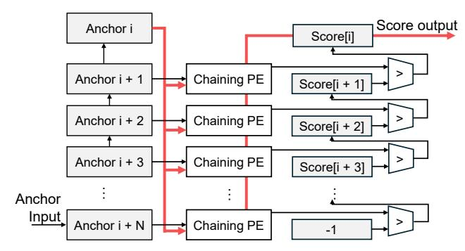
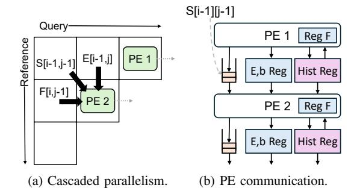
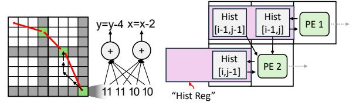
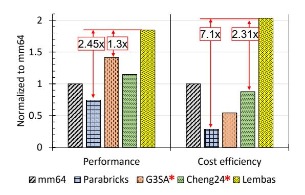
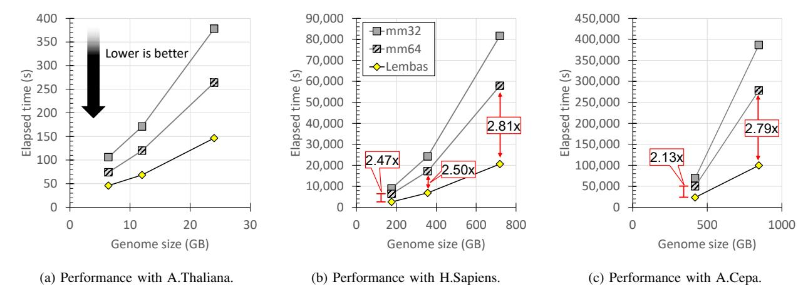
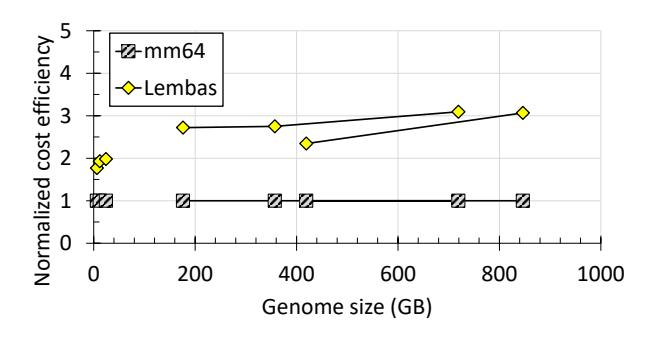
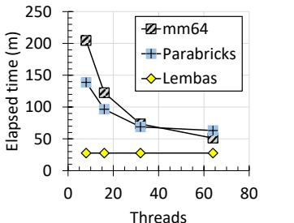
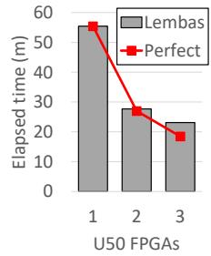

# V. ACCELERATED CHAINING

For the chaining stage, Lembas adopts an FPGA-friendly design inspired by Guo et al. [23], which reformulates the original 1D dynamic programming algorithm for enhanced parallelism. We do not claim novelty for this design, but briefly describe its operation for completeness. We direct the readers to the original publication for more details on the chaining accelerator design. As this design was sufficient to saturate the PCIe bandwidth within the U50's chip resource limitations, we clean-room re-implemented the idea as published.

The original, software chaining algorithm employs onedimensional dynamic programming, where each anchor is evaluated against up to N preceding anchors to compute its chaining score. This process identifies the optimal predecessor through a max reduction across all candidates, which can create a critical path in hardware implementations.

To mitigate this, Lembas adopts the reordering strategy introduced in [23], where instead of looking backward to compute the current score, each anchor propagates its score forward to update the next N anchors for incremental max reduction. This approach computes max reduction over N pipelined cycles, effectively breaks the dependency chain which was limited by the single wide max-reduction operation. The resulting fully pipelined FPGA implementation has an initiation interval of 1, maintaining high throughput across parallel processing elements. Figure 6 shows an overview of the architecture, illustrating how each anchor's score is forwarded to subsequent anchors.

Fig. 6: Chaining accelerator design.

### VI. EFFICIENT EXTENSION WITH TILED TRACEBACK

Lembas employs a novel extension accelerator which implements a hardware-accelerated banded Smith-Waterman-Gotoh (SWG) algorithm with an affine gap penalty. The extension accelerator introduces a fully pipelined score matrix calculation as well as FPGA-optimized backtracking via a novel tiled algorithm capable of high-performance backtracking despite the low clock speed of FPGAs.

### *A. Score matrix calculation*

Lembas implements a conventional cascaded parallel array of PEs to compute the score matrix, similar to other existing accelerators [8], [26], [48], [70]. Figure 7a shows the highlevel design of a kernel for score matrix calculation, consisting of a 1D systolic array of processing elements (PEs) where each PE computes a row of the dynamic programming (DP) matrix in a staggered fashion. Once each PE finishes computing a row, it moves to a new row.

Figure 7b illustrates the PE microarchitecture, capable of highly efficient pipelining via forwarding registers, as well as supporting tiled traceback. Because Lembas implements the affine gap penalty by default [42], each PE computes three values for each cell: S[i][j], E[i][j], and F[i][j], for score, gap penalty, and insertion penalty, respectively. These three values are computed using four inputs: S[i−1][j−1], E[i−1][j], F[i][j−1], and bj , which is the next character in the query. This data access pattern is also illustrated in Figure 7a. Since F is read from the left cell while each PE is moving right, this value is simply cached in each PE. E is generated by PE1 and read by PE2, one cycle later, and bj is used by PE1 is used also by PE2, one cycle later. These values move through a E,b register between the PEs. S is generated by PE1 and read by PE2 two cycles later due to the diagonal dependency, so this value moves through a two-element FIFO.

### *B. Tiled bit-parallel traceback*

A prominent novelty of Lembas's extension accelerator is in its tiled bit-parallel backtracking algorithm, which overcomes the low clock speed limitation of FPGAs. The novelty is that each tile boundary cell stores the complete intra-tile traceback history needed to jump to the next tile, allowing traceback to advance at tile granularity rather than one cell per cycle.

Fig. 7: Parallel PEs cooperate to compute the score matrix.

While the forward pass of extension (i.e., computing the score matrix) is readily parallelizable, resulting in many efficient FPGA implementations, the backward pass (i.e., traceback) is conventionally not well-suited for FPGAs [8], [48], [61]. This is because each traceback step depends on decisions made in the previous step, incurring a tight dependency. As a result, efficient traceback implementations benefit from high, multi-GHz clock speeds, making FPGA implementations inefficient due to their low clock speeds in the 100s of MHz. Some previous work on efficient backtracking attempted to overcome this limitation using 2-bit encodings for backtracking paths [8], or computed backtracking in block units for interblock parallelism [25], [61].

(a) Blocked bit-parallel backtracking in 4x4 blocks. (b) Communication between PEs.

Fig. 8: Tiled traceback and PE architecture.

Our design takes the approach of using tiles to increase the number of traceback steps taken per clock cycle. We divide the alignment matrix into large 8 × 8 tiles, and encode path information such that traceback route from any edge cell can be computed within a single cycle. Figure 8a illustrates our approach with 4×4 tiles. The best path to any edge cell of each tile (gray cells), starting from a cell immediately outside the current tile (a gray cell in an adjacent tile), is encoded in each edge cell in its entirety. A typical 2-bit encoding is used to encode x and y offsets [8]. Figure 8a shows an example encoding, 11111010, which encodes a four-step path to a cell in the next tile. Given this vector, the location of the next cell in the next tile can be computed simply by popcounting x and y bits in the encoding. This way, backtracking can be done at a much coarser granularity, in the units of 8 × 8 tiles per cycle (red arrows) instead of single cells (black arrows).

In the accelerator architecture, this approach is implemented using "history registers", illustrated in Figures 7b and 8b as Hist Reg. Each history register maintains the best history to a sliding window of two most recently visited cells, as illustrated in Figure 8b. When a PE computes a score for the current cell and determines another step of the path, one of the three input history registers is selected accordingly, and the newly determined path is appended to it.

We choose a tile size of 8×8 because the history register access could not meet timing with larger tiles. This tile size is a good fit with the 512-bit HBM interface, since each tile stores 32 × 15 = 480 bits. (Maximum path length for each edge tile is 16 for an 8×8 tile, where each step encoded using 2 bits. There are 15 edge cells in each tile) We note that our traceback accelerator actually prefetches four tiles for every tile loaded, to mitigate the impact of HBM access latency. We also note that larger tiles did not significantly increase the PE area overhead, due to the small footprint of the area registers compared to the rest of the PE.

## VII. EVALUATIONS

In this section, we demonstrate that among the state-of-theart systems evaluated, Lembas is both cheapest and consumes least power, but also the fastest, and most scalable with no optimizations for problem space reduction, which trades accuracy for performance. We first present the evaluated system configurations and the resulting performance comparisons, and then delve deeper into resource efficiency and stepwise ablation studies.

## *A. System Configurations*

We implemented a Lembas prototype using a desktopclass machine equipped with two mid-range Xilinx Alveo U50 FPGAs and four 1 TB NVMe SSDs used for storing intermediate data between pipeline stages. The original software Minimap2 [42] was evaluated using a 64-core AMD EPYC CPU with 128 GB of DRAM. We also evaluated NVIDIA's GPU-accelerated Minimap2 implementation ("Parabricks" [63]), running on a 32-core Xeon CPU with 128 GB memory, augmented with an NVIDIA A100 GPU (80 GB HBM). These three system configurations are summarized in Table I. We note that while our system has a CPU with a higher clock speed, it is the cheapest and oldest, desktopclass processor. Furthermore, the performance of Lembas is not significantly affected by CPU performance since the vast majority of work is done in the FPGA. We evaluate the impact of CPU performance for Lembas in Section VII-H.

We also compare against two published state-of-the-art accelerated systems, which are end-to-end Minimap2 compatible. G3SA [25] is a GPU-accelerated system that presents performance on a 128-core Threadripper and an NVIDIA A6000 GPU. Cheng24 [8] is an FPGA-accelerated system that presents performance on a 40-thread Xeon E5 and an XCKU115 FPGA.

We exclude published accelerators which only support a single step instead of end-to-end alignment, since the goal of Lembas is to provide end-to-end scalability and cost-efficiency improvements, as a drop-in replacement for Minimap2. We do present evaluations on extension accelerators in Section VII-I3 since all compared systems have a common goal of improving performance. We emphasize that our seeding accelerator's goal is reducing memory capacity requirements, and we do not claim novelty for the design of the chaining accelerator. We also exclude some published end-to-end systems, such as [52], if they are older and less efficient (only 76% over 8 cores) compared to Cheng24 or G3SA.

TABLE I: Evaluated system configurations.

| Name       | CPU             | Memory      | Accelerator   |
|------------|-----------------|-------------|---------------|
| Minimap2   | AMD EPYC 7742   | 384 GB DDR4 | -             |
|            | 128-thread      |             |               |
|            | 2.25 GHz, 2019  |             |               |
| Parabricks | Xeon Gold 6248R | 128 GB DDR4 | NVIDIA A100   |
|            | 48-thread       |             | 80 GB HBM     |
|            | 3 GHz, 2020     |             |               |
| Lembas     | i7-8700         | 32 GB DDR4  | 2x Xilinx U50 |
|            | 16-thread       | 4 M.2 SSD   | 8 GB HBM      |
|            | 3.2 GHz, 2017   |             |               |

All locally run systems (Lembas, Parabricks, mm64) were configured with a 20kbps band for banded Smith-Waterman. This is the default configuration for Minimap2, and is larger than the average length of the PacBio HG002 human genome.

### *B. Cost analysis*

Accurate cost analysis is critical for precise evaluation, due to the great heterogeneity of the compared systems. Table II presents our relative cost assessment of each system compared to Lembas, calculated using both the on-premise purchasing cost, as well as the hourly rate of AWS instances capable of hosting each system. We emphasize that Lembas is the cheapest system among the ones evaluated.

All system resource requirements were conservatively estimated to benefit the comparison systems instead of Lembas. The GPU instance used for cost assessment (for Parabricks, G 3SA) equips only 48 cores and an A10G GPU, although performance was measured using much more powerful A100 or A6000 GPUs. Minimap2 cost is assessed using a 64-core Graviton 2 instance, although performance was measured with a much faster AMD EPYC CPU, resulting in a relatively low AWS instance price (1.1×) compared to the purchasing price (2.5×). On the other hand, the cloud cost of Lembas was assessed using a machine with a very powerful VU47P FPGA (\$15,000+) and 256 GB of DRAM, although performance was measured with only 16 GB of DRAM and two Alveo U50 boards (\$3,000 ea.). We note that Cheng24 [8] can be hosted on the same FPGA instance as Lembas, but we use the purchasing cost to calculate the relative cost because the difference in DRAM and FPGA usage is an important distinguishing factor between the two systems. Even for Cheng24, we compute the purchasing cost considering a cheaper KCU105 board, although the publication lists a costlier board with a much larger XCKU115 chip and 16 GB of DRAM, since the specific board price was not available online.

TABLE II: Cost analysis of evaluated systems.

|               | Minimap2  | GPU         | Cheng24    | Lembas     |
|---------------|-----------|-------------|------------|------------|
| Purchase (\$) | 20,000    | 24,500      | 11,500     | 8,000      |
| AWS (\$/h)    | 2.176     | 5.62        | 1.98       | 1.98       |
| Instance      | c6g.metal | g5.12xlarge | f2.6xlarge | f2.5xlarge |
| Relative Cost | ˜1.1      | ˜3          | ˜1.44*     | 1          |

### *C. Evaluated Datasets*

We evaluate Lembas using three representative organisms with varying genome sizes and complexity: *Arabidopsis thaliana*, *Homo sapiens*, and *Allium cepa* (onion). These organisms span a wide spectrum of genome sizes from 135 Mbp to over 16 Gbp, allowing us to test scalability across small, medium, and large genomes. The synthetic read datasets were generated using PBSIM3 [65], a long-read simulator that produces realistic PacBio CLR-style reads from reference genomes. We use synthetic read dataset to evaluate each system on varying sequencing coverage, ranging from 15× to 100×, to assess scalability with more or less data. We use PBSIM3 to generate realistic read datasets based on realworld reference genomes: TAIR10 (A.Thaliana), HG16 (H. Sapiens), and DHCU066619 (A. Cepa). Table III summarizes the evaluated datasets, including genome sizes, coverage, and total dataset sizes.

TABLE III: Evaluated datasets.

| Organism    | Reference Size (bp) | Coverage     | Size (GB)   |
|-------------|------------------------|--------------|-------------|
| A. Thaliana | 119 Mbp                | 30x/50x/100x | 6.4/12/24   |
| H. Sapiens  | 3.1 Gbp                | 30x/50x/100x | 176/357/719 |
| A. Cepa     | 14.9 Gbp               | 15x/30x      | 419/ 846    |

## *D. Lembas FPGA Resource Utilization*

Table IV presents the FPGA resource utilization for each stage of Lembas on each of the Xilinx Alveo U50 devices.

TABLE IV: FPGA resource usage per step on Xilinx U50

| Step   | LUTs Used        | BRAM Used    |
|--------|------------------|--------------|
| Seed   | 361,624 (41.53%) | 517 (38.47%) |
| Chain  | 273,951 (31.46%) | 200 (14.88%) |
| Extend | 431,957 (49.61%) | 105 (7.81%)  |

The sorting accelerator for seeding instantiates 16 columnsort kernels, which collectively make use of all 32 HBM pseudo-channels on the U50 FPGA, while consuming less than half of LUTs and BRAM resources. We were unable to place and route 32 kernels, but this was not an issue since PCIe bandwidth was the primary bottleneck even with 16 kernels. Similarly, the chaining stage maintains a moderate footprint, benefiting from a compact kernel structure and an efficient score propagation design. It instantiates four kernels, each with a single PE, which can again saturate the available PCIe bandwidth. The extension accelerator instantiates 16 kernels, each equipped with 16 processing elements configured with 8x8 tiles. It utilizes less than half of the available LUTs and only a modest portion of BRAM, ensuring the published

Fig. 9: End-to-end performance evaluation with alignment to reference. Performance of G3SA and Cheng24 (marked with \*) are derived from respective publications. (Lower is better.)

performance can be maintained even with more complex logic, such as more complex gap penalty schemes.

Fig. 10: Reference-based human genome alignment performance and cost efficiency. Performance of G3SA and Cheng24 (marked with \*) are derived from respective publications. (normalized to 64-thread Minimap2, higher is better.)

#### E. End-to-end performance of reference-based alignment

We first present the performance evaluations of referencebased alignment, used for workloads including reference-based assembly and reference-guided de novo assembly.

1) Runtime and scalability analysis: Figures 9a, 9b, and 9c present the runtimes of all evaluated systems for reference-based alignment for all evaluated datasets. mm32 and mm64 represent the runtime of software Minimap2 with 32 and 64 threads, respectively.

The figures show that Lembas consistently achieves superior performance compared to all evaluated systems, despite its lower cost. On the 100x human genome, Lembas outperforms the next best system, mm64, by  $1.8\times$ . On the larger onion genomes, Lembas outperforms mm64 by  $27\times$ , and the Parabricks GPU-accelerated system by  $2.4\times$ .

The GPU-accelerated Parabricks system is often faster than mm32 but slower than mm64, except for larger genomes, such as the human 100x and the onion genome. This is consistent with the numbers in existing publications, where GPU-accelerated chaining systems achieved around 2× performance compared to 32-thread systems [12], [71].

We observe that both accelerated systems, Lembas and Parabricks, perform better on larger genomes such as the deeper versions of A.Thaliana and H.Sapiens, as well as on the larger genome of A.Cepa. First of all, such a trend emphasizes the scalability of accelerated systems and their importance for future genome workloads. In addition, it suggests that the relatively high performance is due to the increase in chaining overhead, since that is what the Parabricks system accelerates.

We note that the performance of the other state-of-the-art systems (G3SA and Cheng24) were taken from their respective publications, since the software artifacts were not available online for local evaluation. This is why their comparisons are only available for H.Sapiens with a relatively low coverage. The G3SA paper presents the end-to-end execution time of reference-based alignment of the HG002 human genome with 50x coverage. They also present their own evaluation results with Parabricks, which almost exactly match our results in Figure 9b, allowing accurate comparison between G3SA and Lembas using it as the common reference. Cheng24 presents relative performance compared to a 40-thread system, but there is some confusion because the cited processor, E5-2689 v4, only has 20 threads. We incorporated the performance using mm32 as the common reference, especially since our CPU is newer and more powerful. We also used the best-case scenario performance from the publication, where a synthetic dataset with uniform 16 kbp reads was used. In Figure 9 and 10, the marked G3SA and Cheng24 bars use publication-reported performance numbers, while cost efficiency is computed using the cost model in Table II; all other unmarked bars are locally measured in our evaluation environment.

Fig. 11: End-to-end performance evaluation with all-to-all alignment. (Lower is better.)

2) Cost-efficiency analysis: Figure 10 presents the relative performance of Lembas against state-of-the-art GPU-accelerated system G³SA [25] and FPGA-accelerated system Cheng24 [8], as well as their cost-efficiency calculated using the system costs estimated in Section VII-A. Comparison was done using the reference-based human genome alignment, since it was the only long-read configuration these publications reported. Lembas outperforms all compared systems, and achieves over 2× cost-efficiency improvements over the next best systems, mm64 and Cheng24.

#### F. End-to-end performance of all-to-all alignment

We present the performance evaluations of all-to-all alignment, used for de novo assembly. All performance, memory usage, and accuracy-related parameters were generated by the NextDenovo [27] de novo assembly tool in its default settings, to represent a typical workflow for de novo assembly. We are unable to present comparisons against accelerated systems including Parabricks, G3SA, and Cheng24, because they either did not publish all-to-all results (G3SA, Cheng24) or did not support it (Parabricks). We present stepwise performance breakdown in Section VII-I as proxy.

1) Runtime and scalability analysis: Figure 11 presents the performance of all-to-all alignment across all tested datasets, demonstrating that Lembas achieves superior performance and cost efficiency compared to the software solutions. Unfortunately, Parabricks or other accelerated system performance is not included in this chart. The Parabricks Minimap2 beta implementation does not support all-to-all alignment yet, and no published performance numbers exist for all-to-all alignment acceleration of long-read genomes, to our knowledge. All-to-all short read alignment acceleration has been demonstrated [1], [50], as well as long read alignment comparisons against a custom Darwin implementation [2], but no all-to-all long-read alignment compared against Minimap2 or other comparable baselines. We present comparisons against Minimap2 software as a proxy, and present step-wise perfor-

mance breakdown in Section VII-I to reason about accelerator performance.

Lembas also demonstrates good scalability in the all-to-all example, although not as pronounced as the onion genome in the reference-based alignment workload. As seen in Figure 11b and 11c, the performance gap between mm64 and Lembas does grow with deeper coverage. Furthermore, Lembas reduces the memory requirement of all-to-all alignment by over  $7\times$ , as we present with more detail in Section VII-G.

Fig. 12: Cost efficiency normalized to mm64.

2) Cost-efficiency analysis: As seen in Figure 12, Lembas consistently achieves about 3× higher cost-efficiency compared to mm64, on the larger genomes. This is higher than the cost efficiency improvements seen with the human genome for reference-based alignment, but lower than with the onion genome for reference-based alignment.

#### G. Memory efficiency analysis

A primary goal of Lembas is to reduce the cost overhead of large capacity memory. As described in Section III, Lembas removes the memory capacity overhead of the seeding step using the external memory columnsort accelerator. Figure 13 demonstrates the resulting memory efficiency of Lembas, which invariably consumes around 8 GB of system memory

even with very large datasets, unlike the software implementation, where memory consumption grows with larger data. To be representative of real-world workflow, we used default parameters for the software Minimap2 as generated by NextDenovo for each workload.

From Figure 13, we can see that Minimap2 is performing memory chunking to reduce memory usage, as memory usage is limited to roughly 60 GBs despite the growing genome sizes. We note that Minimap2 provides a runtime parameter for tuning its memory usage, and we noticed that reduced memory usage actually does not impact performance very much, but does impact the output quality. Because seeding is the primary memory bottleneck, Minimap2 constructs multiple hash tables for seeding when met with memory capacity limitations. The output quality difference happens because Minimap2 does not check for matches between different hash chunks during anchor computation. We emphasize that Lembas does not suffer from this quality degradation since it always uses the whole hash via the columnsorter. Because the level of acceptable accuracy is dependent on the workload and situation, we simply present this data under default configurations.

The reduction of memory capacity requirements has benefits beyond simply making machines cheaper today, because it can separate the scalability of genome alignment and assembly from memory capacity scaling. Since memory capacity per dollar may not scale as they used to [40], [67], separating scalability from DRAM capacity can benefit continued future scalability of the application.

#### H. Scalability analysis

Figure 14 illustrates the scalability of Lembas, either with more CPU threads or with more FPGAs, using reference-based alignment of the human genome (50x).

We note two observations from Figure 14a. First, it shows that the software scalability quickly saturates with more threads, where more than 32 threads do not contribute significantly to performance. This matches the observations made in existing work [13]. Second, the scalability of the GPUaccelerated Parabricks system appears to be worse than the

Fig. 13: Memory consumption of Minimap2.

reference, with more threads.

(a) Human genome (50x) alignment to (b) Lembas scalability with

Fig. 14: Lembas scalability analysis.

purely software system, because a single GPU quickly becomes the performance bottleneck. This is also consistent with existing work [23], [53], which showed that GPU chaining implementations using general-purpose warp processors are inefficient compared to reconfigurable FPGA acceleration.

We also present the multi-FPGA scalability analysis of Lembas in Figure 14b. The default configuration of Lembas is with two U50 FPGAs, which achieves the best performance compared to all compared systems as well as the lowest cost. However, thanks to the inherent task-level parallelism across kernels, Lembas can make very good use of a variable number of FPGAs and achieve near-linear scalability. The potential limitations to scalability come not from the FPGA, but from the CPU and NVMe storage. The CPU needs to perform bookkeeping functions such as moving data, accessing storage, and invoking kernels. Our 12-core host processor did not reach full utilization even with three FPGAs, suggesting that even more FPGAs can be supported on this low-cost server. On the other hand, the four NVMe devices on our prototype were almost fully saturated during the seeding and chaining steps with two FPGAs, and became the performance bottleneck for the three-FPGA system. But we do not believe this to be a fundamental limitation, because adding two more SSDs is a relatively minor overhead compared to the rest of the system.

