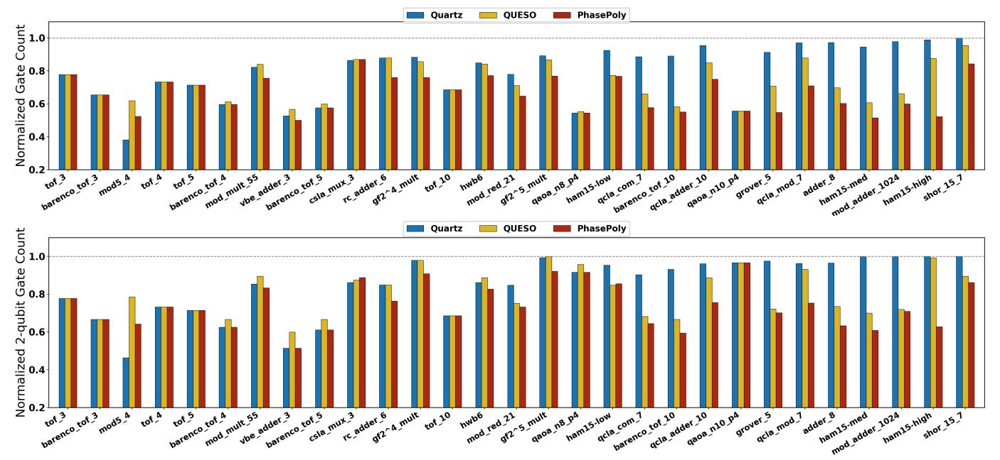

# *B. Q1: Comparison with Phase Polynomial Baselines*

We compare *PhasePoly* with three phase polynomial baselines, as summarized in Fig. [11.](#page-7-0) *Rotation Merging* combines only rotation gates with identical phase polynomials and leaves the CNOT network unchanged, which limits the overall optimization gains. We implement this pass using our *SSA-style rotation-merging* infrastructure. *Single-block Greedy Optimization* is reproduced in our infrastructure as an independent per-block optimization pass, where the phase-parity and output-parity networks are synthesized separately using greedy synthesis and Gaussian elimination, respectively, without cross-block optimization. This baseline reduces total gates by 26.93% and two-qubit gates by 8.14% on average. Gray-Synth [\[10\]](#page-13-9), built on T-par [\[9\]](#page-13-8), targets CNOT reduction; its reported results show an average CNOT reduction of 17.62%.

In contrast, *PhasePoly* co-optimizes the phase-parity network and the output-parity network and employs *crossblock IR and optimization*. It achieves up to 50% total-gate reduction and 48.57% CNOT reduction—34.70% and 26.83% on average—surpassing all baselines and improving upon Gray-Synth by 9.21% in CNOT reduction.

Q1 Summary: *PhasePoly* outperforms by jointly optimizing phase- and output-parity and exploiting cross-block opportunities missed by phase-only, single-block methods.

Fig. 12: Normalized total and two-qubit gate-count reductions across benchmark circuits, comparing *PhasePoly* against general circuit optimizers. All values are normalized to the unoptimized circuits (1.0), with lower bars indicating greater reduction.

