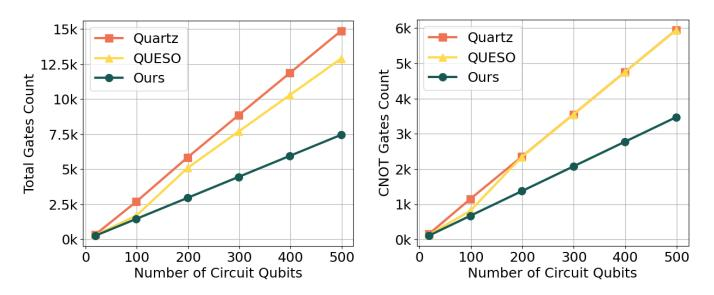
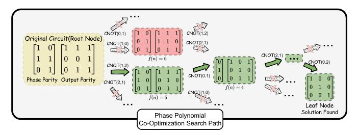

# *C. Overcoming the Scaling Challenges*

State-of-the-art quantum circuit optimizers largely rely on *equivalent subcircuit rewriting*, where small subcircuits are replaced using precomputed equivalence classes (ECCs). While effective for local transformations, these methods are fundamentally limited by the size of the rewrite rules: practical ECCs typically cover only small patterns (e.g., up to 3 qubits and depth 3–6), as constructing larger equivalence classes becomes computationally intractable. As a result, capturing long-range optimizations requires many local rewrites and becomes increasingly difficult as circuit size grows.

In contrast, our approach avoids this limitation by operating on a structured parity-matrix representation rather than fixedsize rewrite patterns. By manipulating this representation for both single- and cross-block optimization (see Section [III\)](#page-4-1), it scales naturally with circuit size and captures long-range transformations beyond local rewriting.

Fig. 5: Gate count comparison of different optimization frameworks on multi-controlled NOT (MCX) circuits.

We compare against subcircuit rewriting frameworks Quartz and QUESO on MCX circuits (Fig. [4,](#page-3-0) left). Rewriting methods are given a fixed 7200s budget per circuit, while our phase polynomial optimization uses at most 3600s for the largest instances. Within these settings, the performance of local subcircuit rewriting degrades steadily as the number of qubits grows from 19 to 100, with even sharper declines at larger scales (Fig. [5\)](#page-3-1). Since QUESO extends subcircuit rewriting by incorporating phase contributions, its performance is slightly weaker than phase polynomial optimization but consistently stronger than Quartz for circuits with fewer than 100 qubits. However, as circuit scale increases, the gap widens: QUESO's reduction rate deteriorates, while phase polynomial optimization continues to sustain a linear growth trend.

#### III. PHASE POLYNOMIAL CIRCUIT OPTIMIZATION

## A. Co-Optimization of Phase- and Output-parity Networks

The phase polynomial optimization consists of two components: the *phase-parity* network and the *output-parity* network. Prior work typically optimizes them separately. The output-parity network corresponds to the linear transformation g(x) in Eq. 1. This transformation can be represented as a binary matrix over GF(2), where each row encodes the parity appearing in the corresponding output qubit.

Each CNOT corresponds to an elementary row operation over GF(2): a CNOT(i,j) performs  $row_j \leftarrow row_j \oplus row_i$ . Thus, a CNOT circuit can be viewed as a sequence of matrix updates that, starting from the identity, produce the output-parity matrix describing g(x).

For example, in Fig. 6,  $G_1 \mapsto \mathrm{CNOT}(q_0, q_1)$  updates the row of  $q_1$  to  $q_0 \oplus q_1$ , represented as [1,1,0,0] in the second row of the matrix G1. Conversely, synthesizing a CNOT network for a given g(x) amounts to reducing the matrix back to the identity via elementary matrix multiplications, which can be performed using Gaussian elimination or related linear-algebra techniques [30], [31], which guarantees that the transformation can be realized in polynomial time.

Fig. 6: CNOT gates correspond to elementary row operations over  $\mathrm{GF}(2)$ . Synthesizing the CNOT network is equivalent to reducing this matrix to the identity via Gaussian elimination.

However, this representation cannot directly capture phase-parity networks with parity-controlled  $R_z$  rotations. Unlike the output-parity network, the phase-parity block is not a square transformation matrix: each column represents a parity term rather than an output mapping, and therefore it cannot be reduced to the identity using Gaussian elimination.

To jointly optimize the phase-parity and output-parity networks, we represent both in a unified column-based parity form. Each phase term corresponds to a parity vector (e.g.,  $(110)^T$  denotes  $q_0 \oplus q_1$ ). The output transformation g(x), typically represented as a square matrix (e.g., Fig. 6), can be transposed so that each output parity is also a column vector. Thus, both p(x) and g(x) are expressed as collections of parity vectors over the input qubits.

We therefore introduce a *coupled parity matrix* representation: [ phase-parity block | output-parity block ], to jointly represent phase terms and output parities. Under our convention, CNOT(i,j) applies  $row_i \leftarrow row_i \oplus row_j$  to both blocks simultaneously, coupling their optimizations. Though a physical CNOT updates the target qubit, our operation updates the phase-parity term instead of the quantum state itself, following prior works [10], [15].

Fig. 7 illustrates this representation for the circuit in Fig. 2. When a phase-parity column reaches Hamming weight 1,

its parity depends on a single qubit, so the corresponding  $R_z$  rotation can be emitted and the column removed. For example, after  $\mathrm{CNOT}(q_1,q_0)$ , the column  $(110)^T$  becomes  $(100)^T$ , meaning that the parity  $q_0 \oplus q_1$  has been propagated onto qubit 0. Repeating such row operations eliminates phase columns while updating the output-parity matrix. Once all phase columns are removed, the remaining output-parity matrix can be synthesized via Gaussian elimination.

$$\begin{bmatrix} 1 & 0 & 1 & 1 & 1 \\ 1 & 1 & 0 & 0 & 1 \\ 0 & 1 & 0 & 1 & 1 \end{bmatrix} \xrightarrow{\text{CNOT}(q_1, q_0)} \begin{bmatrix} 1 & 0 & 1 & 1 & 1 \\ 0 & 1 & 1 & 1 & 0 \\ 0 & 1 & 0 & 1 & 1 \end{bmatrix} \xrightarrow{\text{Insert } R_z} \begin{bmatrix} 0 & 1 & 1 & 1 \\ 1 & 1 & 1 & 0 \\ 1 & 0 & 1 & 1 \end{bmatrix}$$

Fig. 7: Coupled co-optimization representation. A CNOT simultaneously updates the phase-parity and output-parity block.

## B. Overall Phase Polynomial Co-Optimization Framework

This optimization task can be formulated as a **CNOT-minimization parity network synthesis problem** [10], where the optimization objective is to minimize the total gate count. CNOT network synthesis is NP-hard [10], [34] for both phase-parity and output-parity optimization, making it infeasible to guarantee optimal solutions in polynomial time. We therefore adopt a heuristic-based framework to optimize the sequence of CNOT and  $R_z$  operations.

We model the search space as a tree in which each node represents a circuit state and each edge corresponds to a CNOT operation (Fig. 8). A root-to-leaf path specifies a sequence of CNOTs. A valid leaf node is reached when the phase-parity matrix becomes empty, and the output-parity matrix reduces to the identity. The optimization objective is to minimize the number of CNOT gates, which corresponds to finding a minimum-cost path in this search tree.

1) Active Row Pair CNOT Selection: As described in Section III-A, a CNOT corresponds to an XOR between two rows of the parity matrix, referred to as a **row pair**. The operation is directional: a pair  $(row_i, row_j)$  represents a CNOT with control qubit i and target qubit j, updating the control row as  $row_i \oplus row_j$  while leaving the target row unchanged.

A row pair is considered valid if it reduces the Hamming weight of at least one column. Such pairs are called **active row pairs**. However, repeatedly applying the same row pair can cause livelock, preventing progress. To avoid this, we restrict the search using an **active column set**, defined as the subset of columns whose Hamming weights can be reduced. Row pairs are only considered if they help at least one column within the active column set (reducing at least one 1). After a CNOT operation, the active column set may be updated. At initialization, or after eliminating a column, the active column set includes all remaining columns.

- 2) The Priority Queue Implementation: To evaluate the state of each move after applying a CNOT from the active row pair set, we derive the following insights:
  - Phase-parity cost  $h_1(n)$ : the total Hamming weight (number of 1s) in the phase-parity matrix correlates with the number of CNOT gates required for phase terms.

Fig. 8: Search tree for Phase Polynomial Co-Optimization. The root denotes the original circuit, the leaf represents the optimized circuit, and edges represent CNOT operations. Node costs reflect heuristic evaluations of intermediate states.

- Output-parity cost h2(n): the estimated number of CNOTs required to transform the output-parity matrix into the identity using Gaussian elimination.
- Accumulated cost g(n): the number of CNOTs already applied along the path from the root to the current node.

The overall cost function is:

$$f(n) = g(n) + h_1(n) + h_2(n)$$
(3)

We adopt an A\* search with a priority queue ordered by f(n). When a state reaches an empty phase-parity matrix, the synthesis of the output-parity network is completed using Gaussian elimination. Otherwise, new successor states are generated by applying CNOTs from the active row pair set in an effort to empty the phase-parity matrix. An example is illustrated in Fig. [8.](#page-5-1)

When multiple states share the same cost, we apply a tiebreaking rule based on the lexicographic ordering of

$$[f(n), h_1(n), h_2(n), -g(n)].$$

This rule prioritizes states with lower estimated costs and, secondarily, those closer to completion.

Because the search space grows exponentially, unrestricted A\* search becomes impractical. We therefore use a spacebounded A\* search [\[35\]](#page-13-33), [\[36\]](#page-13-34), capping the priority queue size. When the limit is reached, lower-priority nodes are discarded to prune unpromising paths and control memory growth. We further employ a multiple-solution search controlled by a hyperparameter k. Each time a goal state is found, it is added to a solution set of size k. The search terminates when either the priority queue is empty or k solutions are obtained, after which the best one is returned.

